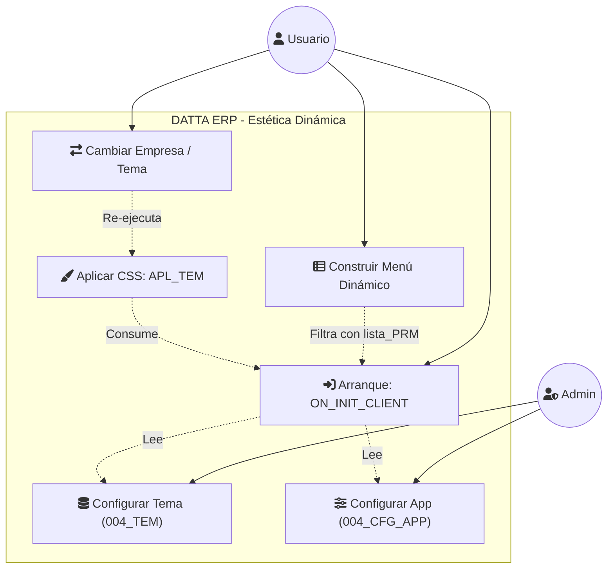
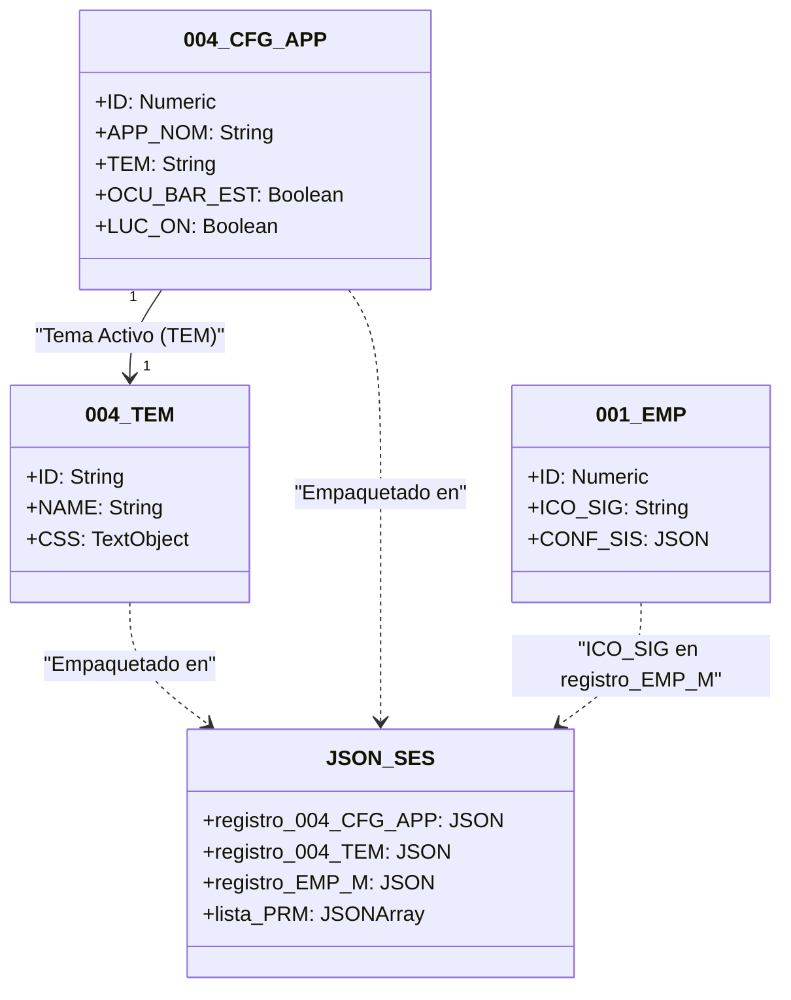
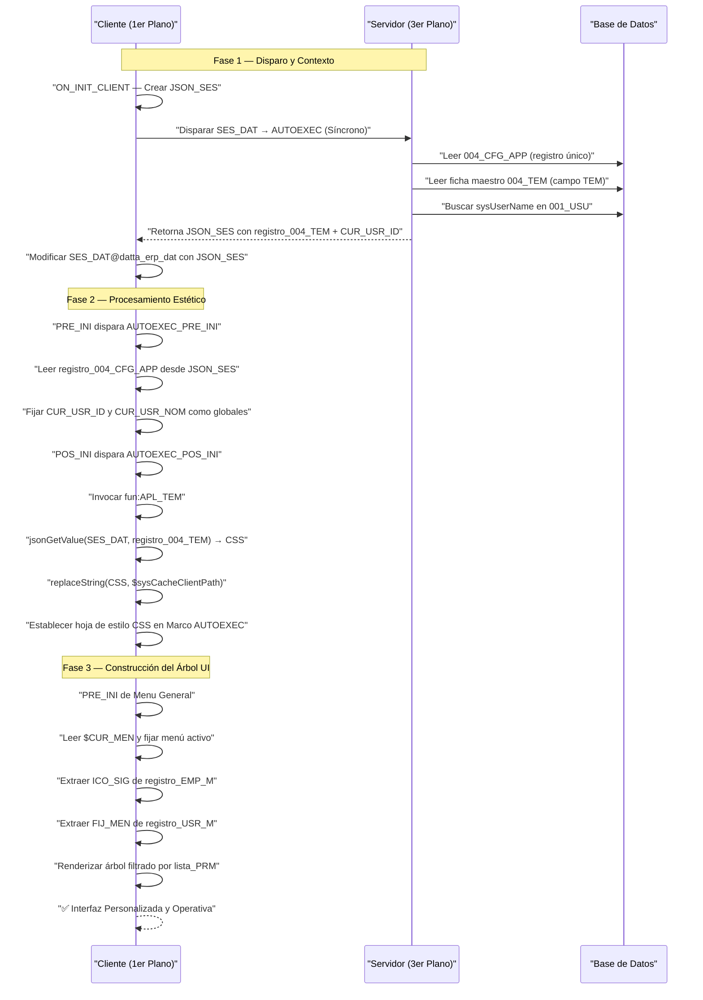
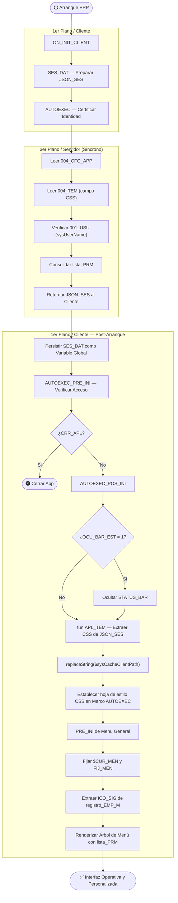

# Arquitectura de Estética Dinámica y Construcción de Interfaz

## 📘 Introducción de Concepto

El propósito estratégico de este flujo es garantizar una experiencia de usuario (UX) coherente, premium y personalizada desde el primer milisegundo del arranque de **DATTA ERP**. Este sistema permite que el software no solo sea funcional, sino que se adapte visualmente a la identidad corporativa de la empresa seleccionada mediante la inyección dinámica de hojas de estilo y la reconstrucción del árbol de navegación.

Al centralizar la estética en la base de datos, el ERP elimina la rigidez de las interfaces estáticas, permitiendo cambios de tema o estructura de menú sin necesidad de desplegar nuevas versiones del binario, asegurando así una **agilidad visual absoluta**.

---

## 🔬 Desglose por Fases (Cronología Lógica)

### Fase 1: Disparo y Contexto (1er Plano → 3er Plano)

El ciclo de vida de la interfaz se inicia en el **1er Plano del cliente** mediante el proceso `ON_INIT_CLIENT@datta_erp_app`, el cual actúa como el **disparador maestro de la sesión**.

**La Mecánica:**
- **Proceso disparador:** `ON_INIT_CLIENT@datta_erp_app` (1er Plano)
- **Proceso invocado:** `SES_DAT@datta_erp_app` → a su vez dispara `AUTOEXEC@datta_erp_app` en **3er Plano (Servidor, Síncrono)**
- **Tablas leídas en Servidor:** `004_CFG_APP@datta_erp_dat` y `004_TEM@datta_erp_dat` (vía enlace maestro `TEM`)
- **Objeto de intercambio:** `JSON_SES` — empaqueta el registro de configuración (`registro_004_CFG_APP`) y el registro de tema activo (`registro_004_TEM`)
- **Variables globales fijadas al retorno:** `SES_DAT@datta_erp_dat`, `CUR_USR_ID@datta_erp_dat`, `CUR_USR_NOM@datta_erp_dat`

**La Lógica:**
El servidor certifica la identidad del usuario (`sysUserName` vs `001_USU`) y recupera simultáneamente las preferencias visuales del sistema. Al retornar, el cliente ya posee en `JSON_SES` tanto la hoja de estilo CSS como las credenciales de seguridad consolidadas — un único viaje al servidor que carga dos responsabilidades críticas.

---

### Fase 2: Procesamiento y Lógica Estética (1er Plano)

Una vez que el cliente recupera el control, el flujo entra en la etapa de **ensamblaje estético** mediante el evento `POS_INI` del Marco `AUTOEXEC`, que instancia y dispara el proceso `AUTOEXEC_POS_INI@datta_erp_app`.

**La Mecánica:**
- **Evento disparador:** `POS_INI` del Marco `AUTOEXEC@datta_erp_app` (1er Plano)
- **Proceso:** `AUTOEXEC_POS_INI@datta_erp_app`
- **Función de estética invocada:** `fun:APL_TEM@datta_erp_app`
- **Fuente de datos:** `$SES_DAT@datta_erp_dat.dat` → extrae `registro_004_TEM` con `jsonGetValue`
- **Campo procesado:** `CSS` (Objeto Texto en `004_TEM`)
- **Función crítica:** `replaceString(CSS, "$sysCacheClientPath", sysCacheClientPath)` — resuelve rutas locales de recursos (iconos, fuentes)
- **Comando final:** `Interfaz: Establecer hoja de estilo CSS ( Marco AUTOEXEC@datta_erp_app, CSS )`
- **Acción adicional:** Si `OCU_BAR_EST = 1` en `registro_004_CFG_APP`, ejecuta `Interfaz: Ocultar ( Marco actual.STATUS_BAR )`

**La Lógica:**
La inyección de CSS sobre el `Marco AUTOEXEC` es el **momento del "pintado"**: el motor de renderizado de Velneo recibe el código de diseño y transforma la apariencia de todos los controles, formularios y grillas de forma instantánea. Al resolver dinámicamente `$sysCacheClientPath`, el sistema garantiza que las referencias a recursos locales sean portables entre máquinas.

---

### Fase 3: Persistencia y Construcción del Árbol UI (1er Plano)

La culminación del arranque se materializa en la construcción del árbol de navegación mediante el manejador de eventos `PRE_INI` del componente **Menu General**.

**La Mecánica:**
- **Evento disparador:** `PRE_INI` del Marco `Menu General@datta_erp_app` (1er Plano)
- **Variable global leída:** `$SES_DAT@menu_datta_erp_dat.dat` (mismo objeto `JSON_SES` persistido)
- **Puntero de menú:** `$CUR_MEN@menu_datta_erp_dat.dat` → fija `CUR_MEN` local con el menú activo
- **Dato de identidad corporativa:** `ICO_SIG` — extraído de `jsonGetValue(jsonGetValue($SES_DAT, "registro_EMP_M"), "ICO_SIG")`
- **Preferencia de menú del usuario:** `FIJ_MEN` — extraído de `jsonGetValue(JSON_USR_M, "FIJ_MEN")` donde `JSON_USR_M = jsonGetValue(JSON_SES, "registro_USR_M")`
- **Árbol de navegación filtrado por:** `lista_PRM` (Array de permisos `001_PRM` consolidados en `JSON_SES`)

**La Lógica:**
El árbol de navegación no se dibuja "para todos" — se dibuja **específicamente para este usuario, en esta empresa, con estos permisos**. El icono corporativo `ICO_SIG` y la preferencia de menú fijo/flotante `FIJ_MEN` personalizan incluso los micro-detalles visuales. El resultado es una interfaz completamente operativa donde cada elemento, desde los tooltips hasta las barras de estado, responde a la configuración técnica del núcleo del ERP.

---

## 🏁 Conclusión Estratégica

Este proceso de "pintado dinámico" aporta **estabilidad y escalabilidad excepcionales** a la arquitectura global de DATTA ERP, ya que desacopla completamente el diseño visual de la lógica de negocio. Al tratar la interfaz como un dato más que fluye desde el servidor al cliente, el sistema permite una personalización multi-tenant sin precedentes: diferentes organizaciones coexisten en la misma infraestructura manteniendo identidades visuales únicas, reduciendo drásticamente los costes de mantenimiento y mejorando la percepción de calidad del producto final.

---

## 📊 Diagramas UML

### Diagrama 1: Casos de Uso — Actores del Sistema Estético

---

### Diagrama 2: Clases — Modelo Relacional de Estética

---

### Diagrama 3: Secuencia — Intercambio Cliente/Servidor

---

### Diagrama 4: Actividad — Flujo Lógico Completo

---

*Documentación técnica generada por **Antigravity (Process Analyst + UML Architect)**.*
*Fuente de Verdad: Código fuente verificado en `DATTA ERP/DATTA_ERP_app/Marco/Arranque/`*
