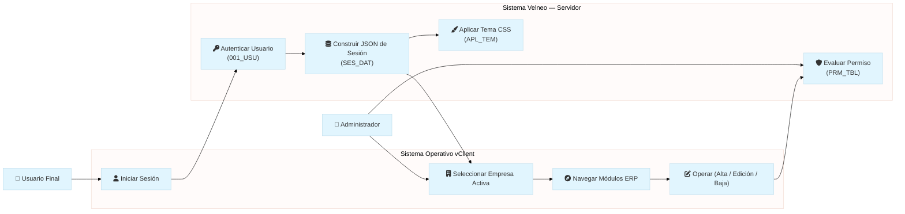
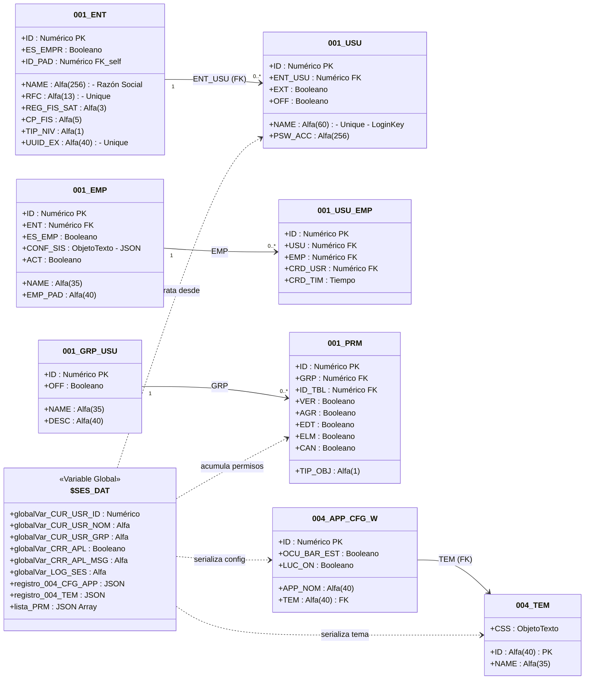
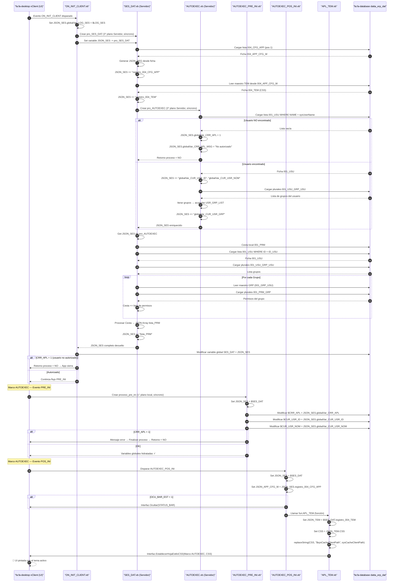
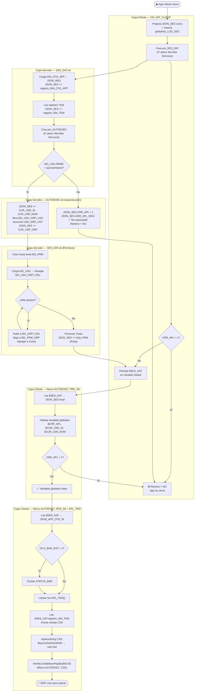
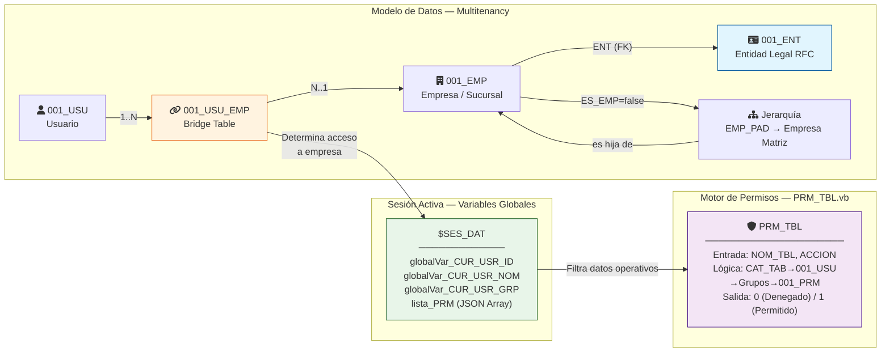

# 🏗️ Arquitectura del Sistema Multiempresa — DATTA ERP
> **Suite UML completa** | Generado por: `architect-uml-sat-velneo-sync` | Fuente: Ingeniería inversa de `DATTA_ERP_app` y `DATTA_ERP_dat`

---

## 📊 Análisis de Consistencia (Pre-Diagramación)

Entidades detectadas en el código fuente y su mapeo al modelo de datos:

| Componente de Código | Tabla / Variable | Rol en el Sistema |
|:---|:---|:---|
| `ON_INIT_CLIENT.vb` | — | Orquestador de arranque en el Cliente |
| `SES_DAT.vb` | `$SES_DAT@datta_erp_dat` | Builder del objeto JSON de sesión |
| `AUTOEXEC.vb` | `001_USU@datta_erp_dat` | Autenticador y lector de grupos |
| `AUTOEXEC_PRE_INI.vb` | `$CRR_APL`, `$CUR_USR_ID`, `$CUR_USR_NOM` | Hidratador de variables globales |
| `AUTOEXEC_POS_INI.vb` | `APL_TEM` (función) | Aplicador de tema CSS |
| `APL_TEM.vb` | `004_TEM@datta_erp_dat` | Inyector de hoja de estilo al Marco |
| `PRM_TBL.vb` | `001_PRM@datta_erp_dat` | Motor de validación RBAC en tiempo real |
| `PRE_INI.vb` (Marco) | — | Dispatcher del PRE_INI al 1° plano (local) |
| `POS_INI.vb` (Marco) | — | Dispatcher del POS_INI + oculta STATUS_BAR |

---

## 1️⃣ Diagrama de Casos de Uso

---

## 2️⃣ Diagrama de Clases — Anatomía del Modelo de Datos

---

## 3️⃣ Diagrama de Secuencia — Flujo Cronológico del Arranque

---

## 4️⃣ Diagrama de Actividad — Lógica Algorítmica del Arranque

---

## 5️⃣ Diagrama Multiempresa — Flujo de Acceso por Empresa

---

## 🧠 Notas de Arquitectura [IA]

### ✅ Fortalezas del Diseño

1. **Patrón JSON-as-Session-Bus:** El uso de `$SES_DAT` como un único objeto JSON serializado que transporta toda la información de sesión (usuario, config, permisos, tema) es elegante. Evita múltiples lecturas de base de datos en navegación y centraliza el estado.

2. **Separación de Planos (Cliente vs. Servidor):** `ON_INIT_CLIENT` corre en plano local y `SES_DAT`/`AUTOEXEC` en 3° plano servidor. Esto garantiza que la autenticación nunca se resuelva en el cliente, protegiendo la lógica de negocio.

3. **Cesta de Permisos Acumulativos:** La técnica de iterar todos los grupos del usuario y acumular permisos en una Cesta antes de serializar a JSON es un patrón RBAC robusto que soporta usuarios con múltiples roles sin conflictos.

4. **Soft Architecture para CSS:** Almacenar el CSS en `004_TEM.CSS` y aplicarlo en arranque mediante `APL_TEM` permite cambios de tema en caliente sin redeploy de la aplicación.

### ⚠️ Riesgos y Recomendaciones

| Riesgo | Impacto | Recomendación |
|:---|:---|:---|
| **`$SES_DAT` sin TTL explícito** | Si el JSON crece (muchos permisos), el rendimiento de `jsonGetValue` puede degradarse | Considerar indexación de permisos por clave compuesta `GRP_TIP_OBJ` dentro del JSON |
| **`001_USU_EMP` sin campo `EMP_ACTIVA`** | El usuario siempre debe seleccionar empresa al inicio. No hay "empresa por defecto" | Agregar campo `IS_DEFAULT` en `001_USU_EMP` para pre-seleccionar la empresa principal |
| **`PRM_TBL.vb` carga `001__USU_MTO`** | El proceso referencia una tabla `_MTO` que difiere de `001_USU`. Posible inconsistencia | Verificar si `001__USU_MTO` es un alias o tabla separada; alinear nomenclatura |
| **Permisos serialized en JSON vs. evaluados en tiempo real** | Lista `lista_PRM` se carga una sola vez en sesión. Cambios de permisos requieren re-login | Documentar este comportamiento; evaluar una función de recarga de sesión sin logout completo |

### 🔗 Alineación con `process-analyst`

| Variable en `process-analyst` | Mapeo en código fuente |
|:---|:---|
| `$G_EMP_ACTUAL` | Pendiente de implementación (recomendada en `001_EMP.md`) |
| `$G_SUC_ACTUAL` | Pendiente de implementación |
| `$SES_DAT` | Implementada en `ON_INIT_CLIENT.vb` → `$SES_DAT@datta_erp_dat` |
| `$CUR_USR_ID` | Implementada en `AUTOEXEC_PRE_INI.vb` |
| `$CUR_USR_NOM` | Implementada en `AUTOEXEC_PRE_INI.vb` |

> **⚡ Acción Pendiente:** Las variables `$G_EMP_ACTUAL` y `$G_SUC_ACTUAL` están documentadas en `001_EMP.md` como recomendación arquitectónica pero **no están implementadas** en ningún `.vb` analizado. Son el siguiente paso crítico para completar el flujo multiempresa operativo.
