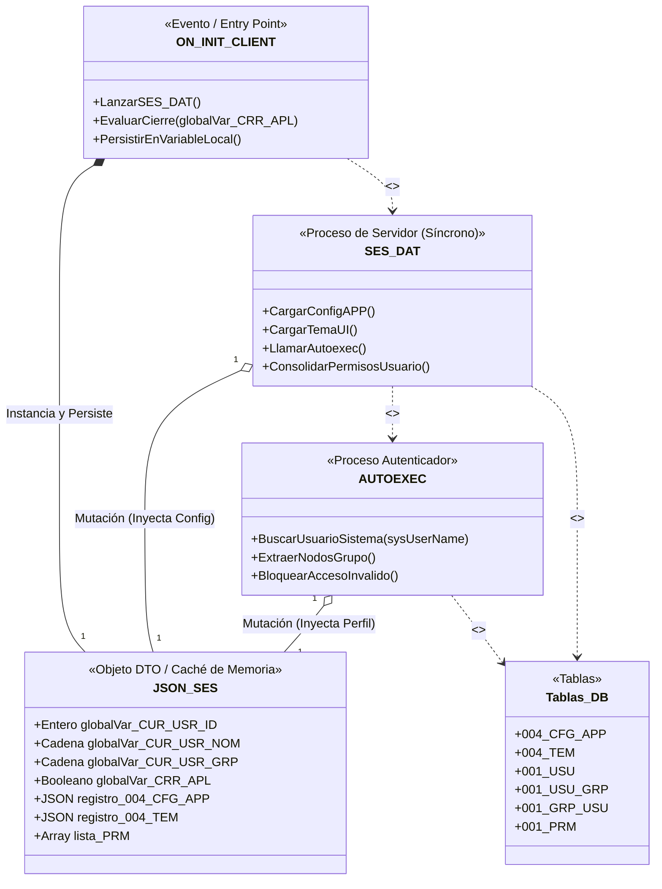
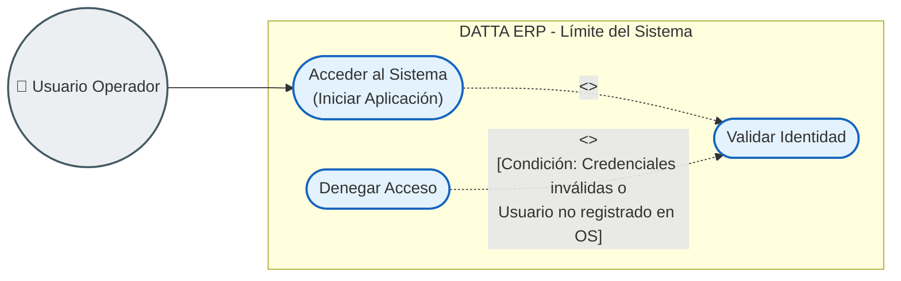
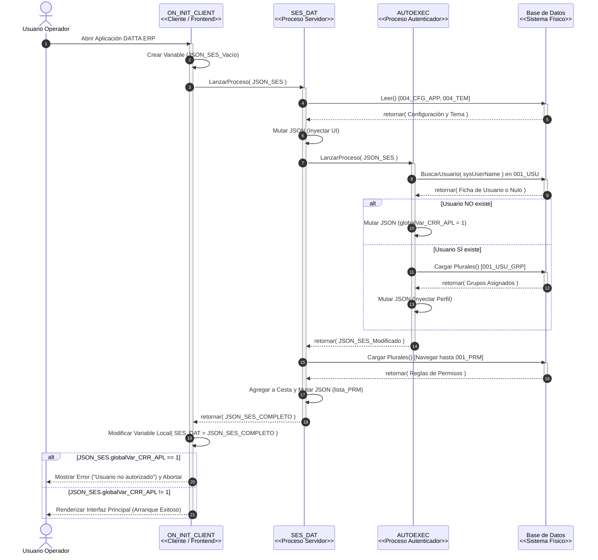
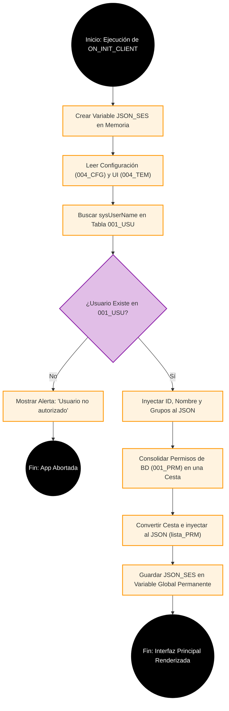

# Arquitectura UML: Proceso de Inicialización de Sesión Cuando no es primera vez(Arranque)

Este documento explica de forma clara y estructurada el proceso interno que ocurre en milisegundos cuando un usuario abre la aplicación DATTA ERP. Este flujo actúa como un **"Motor Ensamblador"** que blinda la seguridad, carga la personalización del sistema y construye la "memoria caché" (`JSON_SES`) para evitar consultar al servidor constantemente.

A diferencia del diagrama de clases de la base de datos, en este escenario modelamos la **Estructura Orientada a Objetos** del motor de arranque. En UML, los procesos de Velneo se abstraen como *Clases Controlador* y el JSON como una *Clase DTO (Data Transfer Object)*.

## Explicación Arquitectónica (Semántica UML)

1. **Creación y Propiedad (`*--`):** 
   El proceso principal `ON_INIT_CLIENT` es el "Dueño" de la variable local `JSON_SES`. Él la crea al inicio y, al final del flujo, la deposita en la Variable Global `SES_DAT` de la memoria RAM del ERP para que cualquier pantalla pueda leer los permisos sin ir a la base de datos.
   
2. **Mutación de Datos (`o--`):** 
   Los procesos de servidor `SES_DAT` y `AUTOEXEC` solo reciben la variable JSON prestada. Su único trabajo es buscar información en la base de datos, meter esa información dentro de la variable (añadiéndole campos como `lista_PRM`, `globalVar_CUR_USR_ID` y `globalVar_CRR_APL`) y devolverla.

3. **Dependencias de Lectura (`..>`):** 
   Ninguno de los procesos modifica la base de datos física (`Tablas_DB`), solo ejecutan secuencias de *Read* navegando por los enlaces plurales (desde el usuario `001_USU` hasta los permisos granulares `001_PRM`) para poder recolectar los privilegios en una Cesta.

---

## Diagrama de Casos de Uso: Acceso al Sistema

Bajo los estándares de arquitectura UML estricta, un Caso de Uso debe representar una **meta valiosa para un actor externo**, no los pasos técnicos o cronológicos de un proceso interno. Por lo tanto, el proceso técnico de "Arranque y armado del JSON" es un medio para un fin mayor: **Acceder al Sistema**.

### Arquitectura de Negocio vs. Procesos Técnicos

1. **El Actor Verdadero:** El único actor real en este escenario es el `Usuario`. El sistema no se "autoconsume" en un caso de uso. Elementos como el "Caja de Base de Datos" pertenecen a la capa de componentes.
2. **Uso estricto de `<<include>>`:** Para cumplir su meta de `Acceder al Sistema`, el comportamiento del caso de uso obliga a ejecutar mandatoriamente el proceso de `Validar Identidad` (que por debajo ejecutará `AUTOEXEC` y consolidará el JSON de sesión).
3. **Flujo de Excepción (`<<extend>>`):** El caso de uso `Denegar Acceso` (cerrar la app) es un flujo excepcional. Solo entra en acción interrumpiendo a `Validar Identidad` cuando se cumple la condición de falla.

*(Nota: La lógica técnica interna de cómo el sistema construye la sesión JSON y ejecuta los scripts se detalla a continuación).*

---

## Diagrama de Secuencia: Flujo de Inicialización

Aquí abandonamos la visión de negocio y entramos a la **visión técnica estricta**. El Diagrama de Secuencia muestra las "Líneas de Vida" de los componentes a lo largo del tiempo, detallando **qué se ejecuta primero, quién llama a quién (síncrono) y cómo viaja la memoria**.

### Arquitectura Técnica en el Tiempo
1. **Líneas de Vida (`activate/deactivate`):** `ON_INIT_CLIENT` se mantiene activo durante todo el proceso. Es el "Hilo Principal". Los procesos de servidor (`SES_DAT` y `AUTOEXEC`) solo se activan temporalmente para hacer su trabajo y mueren al devolver la respuesta.
2. **El Bloque ALT (La Seguridad):** Aquí modelamos el momento en que el servidor asigna el error (`globalVar_CRR_APL = 1`) en la capa de Autenticación, y cómo el Cliente intercepta ese veredicto al final para denegarle la pantalla al usuario.

---

## Diagrama de Actividad: Algoritmo Lógico

Mientras que el Diagrama de Secuencia muestra la línea de tiempo, el **Diagrama de Actividad** representa estrictamente el **algoritmo matemático (flujo lógico)**. 

Este diagrama implementa el patrón de arquitectura **Fail-Fast (Falla Rápido)**, asegurando que el sistema sea defensivo yorte de forma temprana si ocurre un fallo crítico de seguridad.

### Análisis del Algoritmo

1. **Optimización por Retorno Temprano (Fail-Fast):** El algoritmo mitiga el desperdicio de ciclos de CPU en el servidor deteniendo el flujo en el primer punto de falla. Si el usuario es inválido, el sistema aborta de inmediato, impidiendo que se ejecuten consultas relacionales complejas hacia las tablas de permisos.
2. **Eliminación de Evaluaciones Redundantes:** Al no unificar los caminos de usuarios válidos e inválidos, el flujo se mantiene puro. Esto elimina la necesidad de banderas de control secundarias o de un segundo rombo de validación antes del renderizado de la UI, reduciendo la complejidad ciclomática del software.
3. **Documentación como Arquitectura:** Documentar cómo está escrito un mal proceso es bitácora de código; documentar cómo el sistema resuelve el problema con la estructura lógica más eficiente es verdadera Arquitectura de Software.
