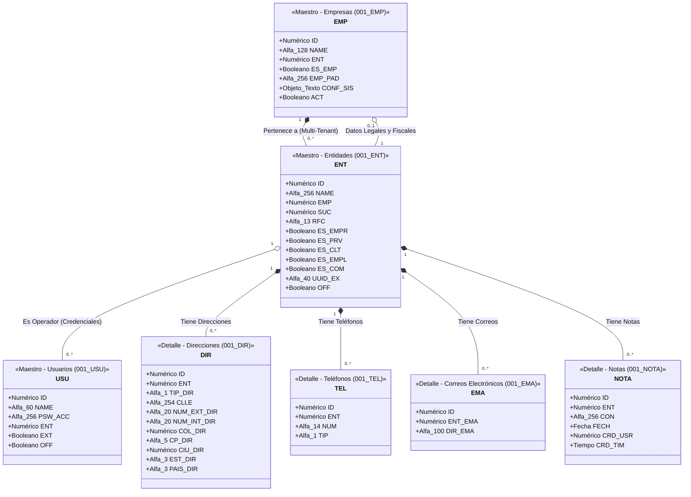

# Arquitectura UML: Módulo de Principales (Entidades y Relaciones)

A continuación se presenta el Diagrama de Clases modelado con la sintaxis de UML para representar el ecosistema de la tabla central `001_ENT` (Entidades) y su relación con Empresas, Direcciones, Teléfonos, Correos y Notas.

## Explicación Arquitectónica (Semántica UML)

1. **Relación entre Empresas (`001_EMP`) y Entidades (`001_ENT`)**
   * **Composición por Aislamiento (`*--`):** La clase `EMP` compone a muchísimas `ENT`. A través de la llave foránea `EMP` dentro de `001_ENT`, el sistema dictamina a qué empresa o "tenant" pertenece cada cliente, proveedor o empleado.
   * **Agregación Identitaria (`o--`):** Simultáneamente, la tabla `001_EMP` utiliza una relación de uno-a-uno vinculándose a `001_ENT` mediante el campo `ENT`. Esto le permite a la empresa "heredar" toda su información fiscal y legal (su propio RFC, Razón Social, etc.) desde la central maestra, evitando redundancia de campos en la base de datos.

2. **La Entidad (`001_ENT`) como Súper-Clase Central**
   * Funciona como el pivote maestro del diseño. Centraliza a todas las personas físicas o morales (cuyo elemento unificador es el `RFC`) y, mediante atributos de estado (`ES_EMPR`, `ES_CLT`, `ES_PRV`, `ES_EMPL`), determina el rol o "polimorfismo" de la entidad dentro de las operaciones del ERP.

3. **Satélites de Contacto y CRM (Composiciones Estrictas `*--`)**
   * En UML, utilizamos el rombo relleno (`*--`) para representar una relación de **Composición** (Padre-Hijo fuerte). Esto significa que las direcciones, correos, teléfonos y notas no tienen independencia existencial sin su Entidad dueña:
     * **Direcciones (`001_DIR`):** Relación 1 a *N*. Permite guardar la dirección fiscal, almacenes o lugares de entrega mediante el discriminador `TIP_DIR`.
     * **Teléfonos (`001_TEL`):** Relación 1 a *N*. Resuelve la limitación de campos fijos y permite una colección ilimitada de teléfonos móviles o fijos mediante `TIP`.
     * **Correos (`001_EMA`):** Relación 1 a *N*. Habilita vincular múltiples cuentas de correo al sujeto de negocios, enlazando directamente al ID maestro a través de `ENT_EMA`.
     * **Notas (`001_NOTA`):** Relación 1 a *N*. Colección de bitácoras de texto que soportan las actividades CRM, todas apuntando a la Entidad base a través de `ENT`.

4. **Gestión de Identidad y Acceso (`001_USU`)**
   * **Agregación (`o--`):** La tabla `001_USU` (Usuarios) centraliza las credenciales de acceso al ERP. Mantiene una relación de Agregación con `001_ENT` mediante el campo `ENT`. Esto vincula la cuenta de usuario con una persona física o actor comercial del sistema, otorgándole identidad y datos al operador del software.
