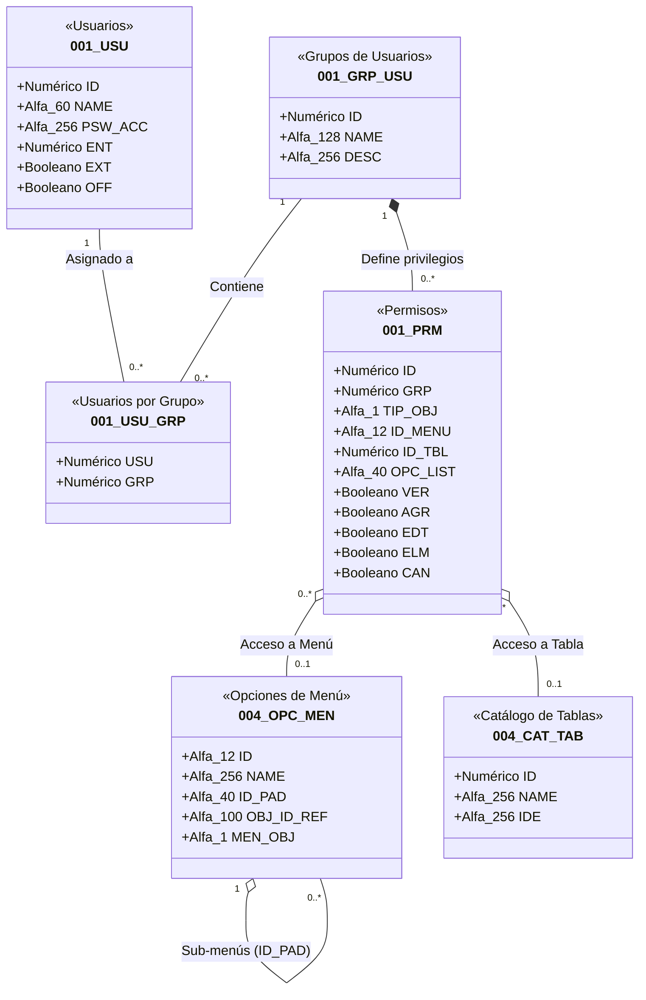
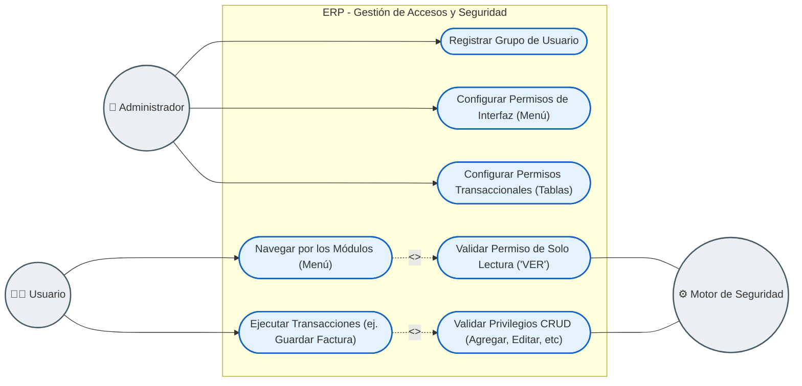
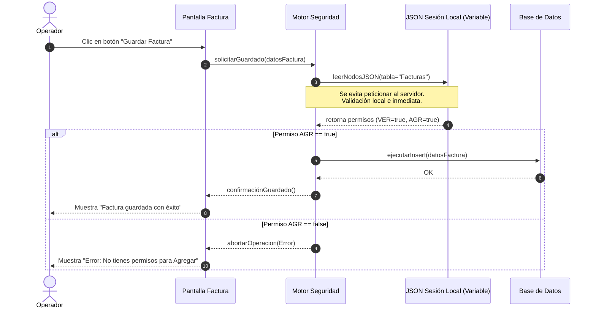
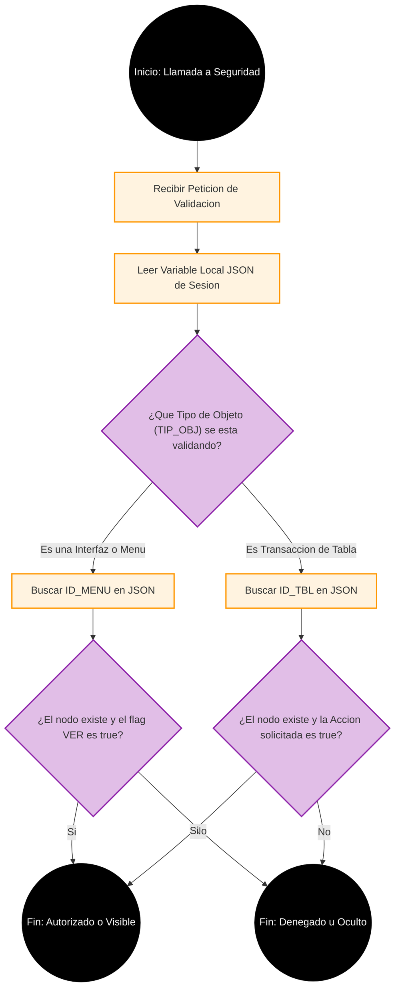

# Arquitectura UML: Módulo de Seguridad y Permisos (RBAC)

A continuación se presenta el Diagrama de Clases modelado con la sintaxis de UML para representar el ecosistema de seguridad basado en roles (Role-Based Access Control) del ERP. Este diagrama ilustra cómo los Usuarios (`001_USU`) se asocian a Grupos (`001_GRP_USU`), y cómo estos grupos administran Permisos granulares (`001_PRM`) sobre los Menús (`004_OPC_MEN`) y las Tablas de la base de datos (`004_CAT_TAB`).

## Explicación Arquitectónica (Semántica UML)

1. **Gestión de Identidad y Roles (`001_USU` y `001_GRP_USU`)**
   * El sistema no asigna permisos directamente a los usuarios, sino que utiliza un modelo **RBAC (Role-Based Access Control)**. 
   * Existe una relación de muchos-a-muchos resuelta mediante la tabla asociativa `001_USU_GRP`. Un Usuario puede pertenecer a varios Grupos (ej. "Ventas" y "Gerencia"), y un Grupo lógicamente contiene múltiples Usuarios.

2. **Administración de Permisos Granulares (`001_PRM`)**
   * **Composición (`*--`):** La tabla de Permisos (`001_PRM`) tiene una relación de composición fuerte con el Grupo (`001_GRP_USU`). Si un grupo se elimina, todos los permisos definidos para ese grupo desaparecen.
   * La tabla de permisos utiliza booleanos de control de datos granulares (`VER`, `AGR`, `EDT`, `ELM`, `CAN`) que configuran exactamente qué acciones (CRUD) tiene permitido realizar el grupo.

3. **Restricción y Visibilidad de la Interfaz (`004_OPC_MEN` y `004_CAT_TAB`)**
   * **Agregación (`o--`):** Cada regla de permiso apunta a un objeto del sistema que desea proteger. Estos objetos existen independientemente de que tengan o no un permiso asignado, por eso la relación es de agregación.
   * El atributo `TIP_OBJ` dentro de `001_PRM` funciona como un enrutador polimórfico:
     * Si el permiso es para un menú, utiliza la llave foránea `ID_MENU` vinculándose a `004_OPC_MEN`. Esto dictamina qué elementos de la navegación lateral o superior puede ver el usuario.
     * Si el permiso es restrictivo a nivel de base de datos o listas, utiliza la llave foránea `ID_TBL` vinculándose al diccionario de datos en `004_CAT_TAB`. Esto permite evitar que un rol modifique registros físicos independientemente de a qué pantalla haya logrado entrar.

4. **Patrón de Árbol Jerárquico en Menús (`004_OPC_MEN`)**
   * **Agregación Reflexiva (`o--` hacia sí misma):** La tabla de Opciones de Menú contiene un campo `ID_PAD` (Id Padre) que apunta a un registro dentro de la misma tabla. Esto permite la construcción dinámica de sub-menús de nivel infinito (ej. Contabilidad > Reportes > Mensuales).

## Diagrama de Casos de Uso: Operación y Configuración

Para complementar la estructura técnica, a continuación se presenta un **Diagrama de Casos de Uso** que ilustra la funcionalidad del sistema desde la perspectiva del negocio y las interacciones entre los diferentes actores.

### Explicación Funcional (Lógica de Negocio)

1. **Abstracción del Tecnicismo (El "Qué", no el "Cómo"):**
   En este diagrama los tecnicismos y llaves foráneas se abstraen en Casos de Uso comprensibles: **"Configurar Permisos de Interfaz"** y **"Configurar Permisos Transaccionales"**. Representan dos capas de configuración separadas pero complementarias dentro del flujo del sistema.

2. **La Separación del Menú vs. La Transacción:**
   La seguridad funciona bajo el principio de que la visibilidad no garantiza la operatividad. Esto se representa mediante las dependencias `<<include>>`:
   * Cuando el Operador intenta **Navegar por los Módulos**, el caso de uso incluye la obligación de **Validar el Permiso de 'VER'**.
   * Cuando el Operador intenta **Ejecutar una Transacción**, ocurre un escenario totalmente independiente que incluye **Validar Privilegios CRUD**. Si el usuario tiene acceso a la pantalla pero no tiene permiso de "Agregar" a nivel base de datos, el Motor de Seguridad bloquea la operación de guardado.

3. **Inclusión del Motor de Seguridad como "Actor Secundario":**
   En este modelo, el "Motor de Seguridad" es un actor automatizado del sistema. El Operador hace la petición (ver o guardar), pero es el Motor el que ejecuta internamente el Caso de Uso de "Validación", basándose estricta y automáticamente en las reglas que configuró el Administrador previamente.

## Diagrama de Secuencia: Operación Transaccional vs. Rendimiento

A continuación se modela el flujo lógico en el tiempo (*Sequence Diagram*) para una operación transaccional común (ej. Guardar una Factura). 

Una característica arquitectónica vital de este ERP es que **los permisos no se consultan a la base de datos en tiempo real por cada clic**. En su lugar, el sistema descarga todos los privilegios durante el proceso de arranque (Login) y los almacena en un **JSON en una variable de sesión local**. Esto garantiza validaciones instantáneas y evita sobrecargar el servidor de base de datos.

### Justificación Técnica
*   **Aislamiento de Carga:** Si el ERP tiene cientos de usuarios operando concurrentemente, consultar la tabla de permisos `001_PRM` antes de cada escritura crearía un cuello de botella masivo.
*   **Caché en Memoria:** Al aislar las reglas de negocio de la seguridad en el JSON local durante el arranque, el motor de seguridad actúa como un guardián de latencia cero.
*   *Nota:* El proceso detallado de cómo, cuándo y de dónde se extraen los datos para construir este JSON en memoria pertenece de forma exclusiva a la arquitectura del **Proceso de Inicialización de Sesión**, el cual se ejecuta una única vez durante el Login.

## Diagrama de Actividad: Algoritmo de Seguridad

A diferencia del proceso de arranque de sesión, este diagrama ilustra estricta y puramente **el algoritmo de toma de decisiones del Motor de Seguridad** cada vez que se requiere validar un permiso. 

Aquí se evidencia el comportamiento *polimórfico* del motor: la evaluación cambia lógicamente dependiendo de si lo que se está validando es un Menú (`004_OPC_MEN`) o una Acción Transaccional sobre datos (`004_CAT_TAB`).

### Explicación del Algoritmo
1. **Aislamiento de Dominio:** Este diagrama demuestra que la validación de seguridad es completamente independiente del resto del ERP. Su única responsabilidad es recibir un ID, leer un JSON y devolver un `Sí` o `No`.
2. **Rutas Lógicas (TIP_OBJ):** El nodo de decisión central (`C`) es el núcleo del motor. Dictamina si la validación debe comportarse como un filtro visual (para pintar u ocultar botones en la UI) o como un cerrojo transaccional (para prevenir un INSERT o UPDATE no autorizado en la base de datos).
