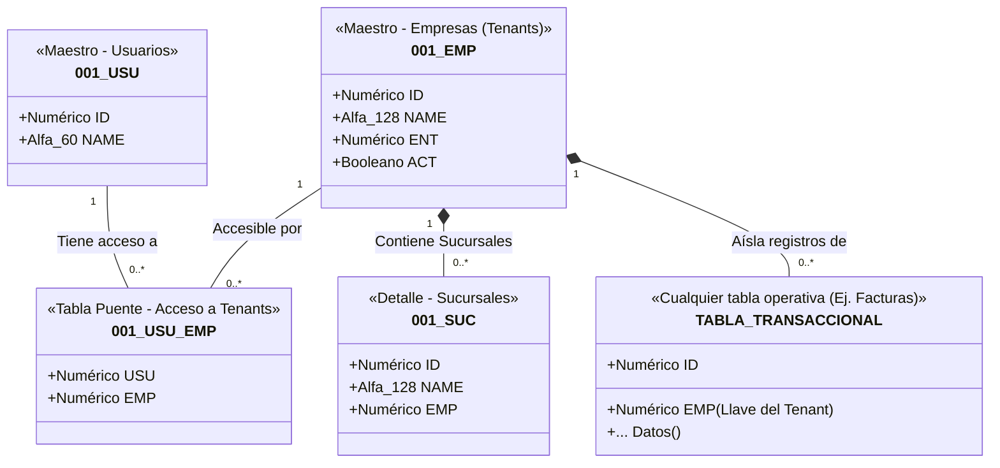
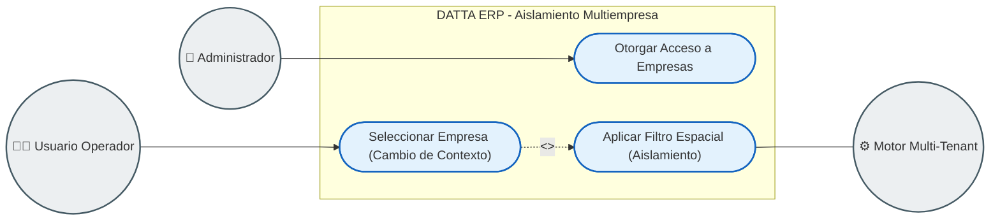
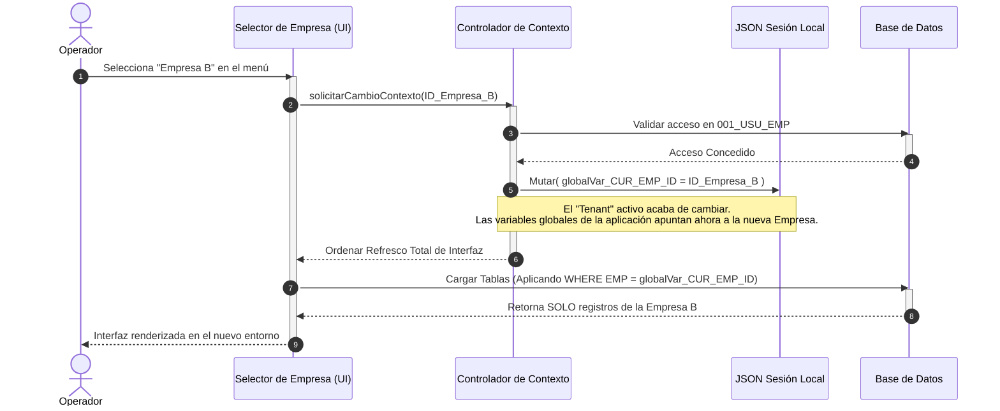

# Arquitectura UML: Módulo Multiempresa (Multi-Tenant)

Este documento detalla el diseño arquitectónico del motor **Multi-Tenant (Multiempresa)** dentro de DATTA ERP. A diferencia del control de permisos (que dicta *qué acciones* puede realizar un usuario), esta arquitectura dicta **el contexto y el aislamiento de los datos**.

El objetivo principal de este módulo es garantizar que una única instancia de base de datos pueda alojar de manera segura la información de múltiples entidades legales (Empresas), asegurando que los usuarios únicamente visualicen y operen sobre los datos de la empresa en la que están "conectados" en ese momento.

## Diagrama de Clases: Estructura de Datos Multi-Tenant

El siguiente diagrama ilustra cómo se ligan los Usuarios con las Empresas, y cómo este diseño impone un filtro físico a las tablas transaccionales.

### Explicación Arquitectónica (Semántica UML)

1. **Gestión de Acceso a Tenants (`001_USU_EMP`)**
   El acceso a una empresa es una relación de muchos-a-muchos. Un operador contable puede requerir acceso a 3 empresas distintas del corporativo, mientras que un vendedor solo a 1. Esta lógica de autorización se almacena de forma independiente a los permisos en la tabla puente `001_USU_EMP`.

2. **Aislamiento de Datos por Composición (`*-- TABLA_TRANSACCIONAL`)**
   En una arquitectura SaaS/Cloud verdadera, toda tabla transaccional o catálogo específico del negocio (Facturas, Clientes, Inventarios, Cuentas Bancarias) debe heredar obligatoriamente el ID de la Empresa (`EMP`). Esta relación de composición indica que el dato le pertenece exclusivamente a ese Tenant y, matemáticamente, no puede cruzarse con los datos de otra empresa.

3. **Sub-Partición Espacial (`001_SUC`)**
   Dentro del aislamiento maestro de la Empresa, existe un sub-nivel geográfico o lógico (`001_SUC`), permitiendo aislar la operación a nivel almacén o sucursal sin salir de la misma razón social.

---

## Diagrama de Casos de Uso: Gestión y Contexto

A nivel de negocio, operar un sistema Multi-Tenant requiere flujos de trabajo específicos para navegar entre las diferentes empresas sin tener que cerrar sesión.

### Lógica de Negocio Multi-Tenant

1. **La Meta del Operador:** El operador no "filtra bases de datos"; su única meta de negocio es **"Seleccionar Empresa"** en la interfaz para comenzar a trabajar.
2. **La Responsabilidad del Sistema (`<<include>>`):** Cada vez que el operador elige una empresa diferente, el Motor del ERP está obligado silenciosamente a ejecutar el caso de uso **"Aplicar Filtro Espacial"**. Esto es lo que expulsa los datos de la Empresa A de la memoria de la interfaz, e inyecta los datos de la Empresa B, asegurando la integridad visual.

---

## Diagrama de Secuencia: Cambio de Contexto (Switch Tenant)

El siguiente diagrama detalla cómo se ejecuta técnicamente un "Cambio de Empresa" en caliente (en tiempo de ejecución). Al igual que en la seguridad de los permisos, **la variable de sesión** (`JSON_SES`) juega un rol fundamental para dictar el "Punto de Vista" actual de toda la aplicación.

### Arquitectura Técnica en el Tiempo

1. **Validación Previa al Cambio:** El controlador de contexto (`CS`) siempre realiza una revalidación rápida (`001_USU_EMP`) antes de conceder el cambio, previniendo ataques de inyección de IDs o vulnerabilidades por sesiones de red.
2. **Mutación de la Persistencia Local:** Al sobrescribir la variable global `globalVar_CUR_EMP_ID` dentro del `JSON_SES`, se altera el núcleo del ERP. A partir de este nanosegundo, cualquier pantalla, reporte o proceso en segundo plano que se abra leerá esta variable y se comportará como si el ERP solo perteneciera a la "Empresa B".
3. **Aislamiento Implícito (El Filtro):** La interfaz (`UI`) asume un diseño defensivo. Al redibujarse, automáticamente adjunta el `globalVar_CUR_EMP_ID` a las condiciones de carga de plurales y listas, logrando el efecto Multi-Tenant de forma centralizada y sin necesidad de programar el filtro en cada botón individual de la aplicación.
