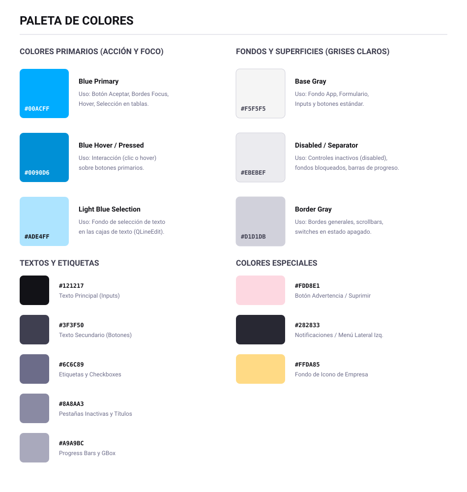
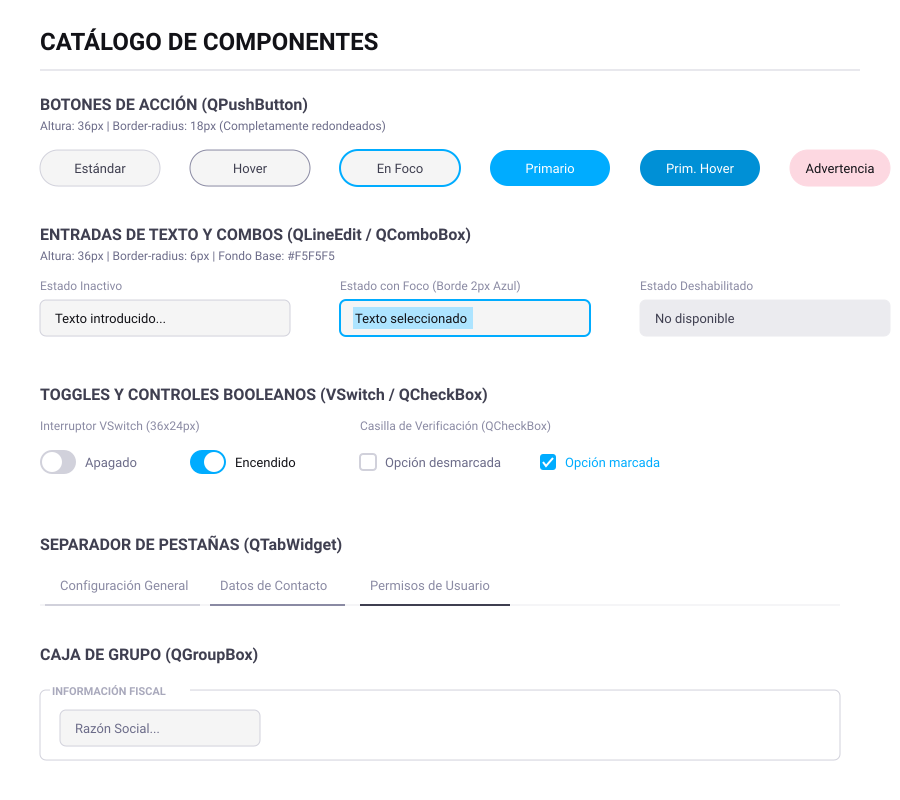

# 🎨 Sistema de Diseño (Design System)

Este documento es la **Guía de Estilos Maestra** del sistema. Refleja fiel y técnicamente la configuración definida en el archivo central de hojas de estilo `TEM_CLARO.css` (Qt/Velneo), garantizando la consistencia visual y de comportamiento en todos los módulos nativos.

---

## 1️⃣ Paleta de Colores (TEM_CLARO)

Los colores están definidos para mantener un contraste limpio, moderno y enfocado en la usabilidad de un ERP.

> **Ilustración de referencia:**
> 

### Colores de Acción e Interacción
- **Primario (`#00ACFF`):** Color de marca y foco. Utilizado en bordes al hacer foco, selección en árboles/listas y botones principales de acción (Aceptar).
- **Primario Activo/Hover (`#0090D6`):** Estado de presión y 'hover' profundo para los botones primarios.
- **Selección de Texto (`#ADE4FF`):** Color de fondo al seleccionar texto dentro de un `QLineEdit` o `QTextEdit`.

### Escala de Grises y Fondos
- **Fondo Base y Cajas (`#F5F5F5`):** Utilizado para casi todas las superficies planas: formularios, ventanas principales (`QMainWindow`), tablas (`QTableView`) y cajas de edición.
- **Superficies Deshabilitadas (`#EBEBEF`):** Fondo para controles bloqueados (`disabled`) y áreas inertes (separadores, barras de progreso).
- **Bordes Estándar (`#D1D1DB`):** Contornos de botones, combos y cajas de texto en estado inactivo.

### Tipografía y Elementos de Interfaz
- **Texto Principal (`#121217`):** Texto de alto contraste para inputs, combos y celdas de tabla.
- **Texto Secundario (`#3F3F50`):** Texto para botones estándar e ítems de grillas.
- **Etiquetas e Inactivos (`#6C6C89` y `#8A8AA3`):** Para textos de búsqueda, labels, títulos de paneles y pestañas no seleccionadas.
- **Advertencias (`#FDD8E1`):** Fondo rosa/rojo suave para los botones de suprimir o advertencia, conservando el texto oscuro.
- **Modo Inmersivo (`#282833`):** Utilizado en el Menú General (`MEN_APP`) y notificaciones del sistema (Toasts).

---

## 2️⃣ Catálogo de Componentes Estándar

> **Ilustración de referencia:**
> 

### Tipografía Base Global
Todo el sistema está estructurado sobre la fuente **`Roboto`**, con un tamaño base de **`13px`**. Excepciones:
- Títulos de grupo (`QGroupBox`): `11px` en negrita.
- Títulos de formulario (`QLabel#TXT_TIT`): `20px`.
- Área de Notificaciones: Texto a `13px` color `#F5F5F5`.

### Botones (`QPushButton` y `QToolButton`)
Los botones presentan un diseño tipo "Pill" (completamente redondeados).
- **Altura Standard:** `36px`.
- **Border Radius:** `18px` (la mitad de la altura, creando los bordes redondos).
- **Botón Estándar:** Fondo `#F5F5F5`, borde `#D1D1DB`, texto `#3F3F50`. En foco cambia el borde a `2px solid #00ACFF`.
- **Botón Aceptar (`#BTN_ACE`):** Fondo `#00ACFF`, texto `#FFFFFF`. Borde invisible, al presionarlo cambia a `#0090D6`.
- **Botón Advertencia (`#BTN_ADV`):** Fondo `#FDD8E1`.
- Los botones sin texto (solo iconos) manejan medidas de `36x36px` con iconos de `18px`.

### Controles de Entrada (Inputs, Combos, Spinners)
Cajas de texto (`QLineEdit`, `QTextEdit`), combos (`QComboBox`) y calendarios/fechas.
- **Altura Standard:** `36px`.
- **Border Radius:** `6px`.
- **Estados:**
  - *Inactivo:* Fondo `#F5F5F5`, borde de `1px` sólido en `#D1D1DB`.
  - *Hover:* El borde cambia a `#00ACFF`.
  - *Foco:* El grosor del borde se duplica a `2px solid #00ACFF` y ajusta su relleno interior.
  - *Deshabilitado:* Fondo pasa a `#EBEBEF`, borde desaparece o se vuelve del mismo color, texto `#3F3F50`.

### Toggles, Radios y Checkboxes
Se rediseñan completamente las marcas tradicionales mediante imágenes en caché, o CSS para el control personalizado.
- **Checkbox / Radio (`QCheckBox` / `QRadioButton`):** 
  - Altura reservada de `36px`.
  - Iconos SVG/PNG inyectados en la seudoclase `::indicator` (dimensión `16x16px`).
  - Color de texto `#6C6C89`, al recibir hover o foco el texto se ilumina a `#00ACFF`.
- **Interruptor (`VSwitch`):**
  - Dimensiones: `36px` de ancho por `24px` de alto.
  - *Off:* Fondo gris (`#D1D1DB`), botón (perilla) blanca (`#FFFFFF`).
  - *On:* Fondo azul primario (`#00ACFF`), perilla blanca (`#FFFFFF`).
  - Al ganar el foco (Focus On), se dibuja un halo azul claro sobre la perilla.

### Pestañas (`QTabWidget`)
- Separador sin bordes de caja exterior. La barra de tabs se recarga hacia el estilo "Underline".
- *Tab Inactiva:* Letra `#8A8AA3`, borde inferior sutil de `2px solid #D1D1DB`.
- *Tab Hover:* El borde inferior se oscurece a `#8A8AA3`.
- *Tab Activa (Selected):* El borde inferior se pinta de oscuro intenso `#3F3F50`, manteniendo la fuente neutra `#8A8AA3`.

---

*La documentación anterior refleja rigurosamente el código CSS fuente del tema. Si se introducen modificaciones en `TEM_CLARO.css`, este documento y los diagramas visuales adjuntos deberán actualizarse en sintonía.*
