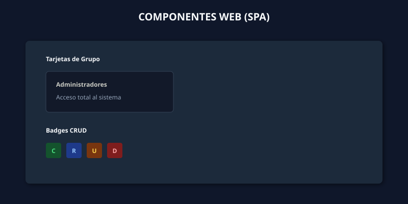

# 🎨 Sistema de Diseño (Design System)

Este documento es la **Guía de Estilos Maestra** del sistema. Sirve como referencia para desarrolladores y diseñadores sobre cómo deben verse y comportarse los componentes de la interfaz de usuario en los dos entornos principales:

1. **El Entorno Nativo (Qt/Velneo)**: Controlado por el archivo `TEM_CLARO.css`.
2. **El Entorno Web (SPA)**: Utilizado en el Panel Inteligente de Permisos y otros módulos web.

---

## 1️⃣ Paleta de Colores Global

El sistema utiliza colores definidos semánticamente para mantener la coherencia. A continuación se presentan las paletas maestras para ambos entornos:

> **Ilustración de referencia:**
> 

### Reglas de Uso de Color
- **Tema Claro:** El color primario es el **Azul (`#00ACFF`)**. Se utiliza exclusivamente para acciones principales (guardar, seleccionar). Los fondos descansan sobre grises neutros (`#F5F5F5`).
- **Tema Oscuro:** El acento principal es el **Índigo (`#6366f1`)**, y los fondos utilizan la paleta Slate de Tailwind (`#0f172a`, `#1b2537`) para reducir la fatiga visual.

---

## 2️⃣ Componentes del Tema Claro (Nativo Qt)

Estos componentes están definidos en el archivo maestro `TEM_CLARO.css` y se aplican automáticamente a todos los formularios y widgets nativos de Velneo.

> **Ilustración de referencia:**
> 

### Especificaciones Técnicas (TEM_CLARO.css)
- **Tipografía Base:** `Roboto, sans-serif` a `13px`.
- **Botones (`QPushButton`):** Altura estándar de `36px`, con un `border-radius` máximo de `18px` para hacerlos completamente redondeados (pills).
- **Entradas de Texto (`QLineEdit`):** Altura de `36px` con bordes ligeramente redondeados de `6px`. Cuando el usuario hace foco en ellos, el borde se ilumina en azul (`#00ACFF` a `2px` de grosor).

---

## 3️⃣ Componentes del Tema Oscuro (Módulo Web)

Estos componentes se construyen utilizando HTML/CSS dentro de los WebViews, específicamente diseñados para experiencias inmersivas como la gestión de permisos.

> **Ilustración de referencia:**
> 

### Especificaciones Técnicas (Web / SPA)
- **Tipografía Base:** Fuentes del sistema modernas (`'Segoe UI', system-ui, sans-serif`).
- **Badges CRUD:** Son elementos fundamentales de la UI. Utilizan una combinación de texto vibrante sobre un fondo muy oscuro del mismo matiz para alto contraste en modo oscuro.
  - **C (Crear):** Familia Verde (`#4ade80` sobre `#14532d`).
  - **R (Leer):** Familia Azul (`#93c5fd` sobre `#1e3a8a`).
  - **U (Editar):** Familia Ámbar (`#fcd34d` sobre `#78350f`).
  - **D (Eliminar):** Familia Roja (`#fca5a5` sobre `#7f1d1d`).
- **Tarjetas (Cards):** Utilizan sombras suaves (`drop-shadow`) y bordes muy sutiles (`1px solid #334155`) para crear profundidad sin necesidad de alto contraste.

---

*Nota: Esta guía es un documento vivo. Si se añaden nuevos componentes globales al CSS o al módulo Web, deben documentarse aquí y en sus SVGs respectivos.*
