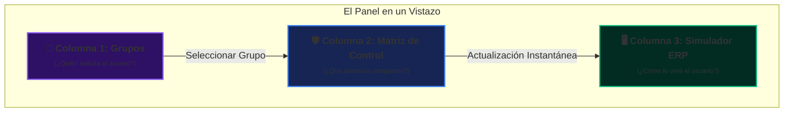
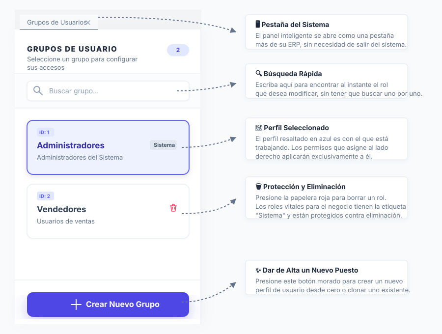
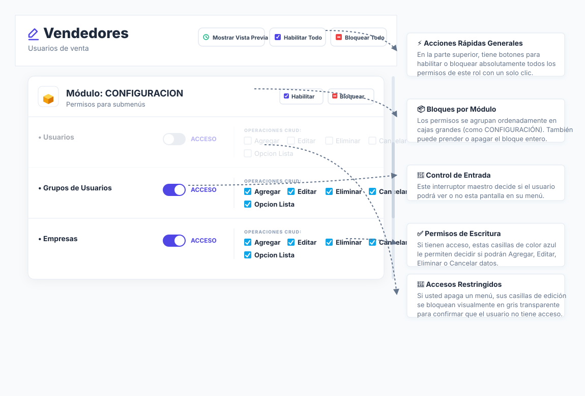
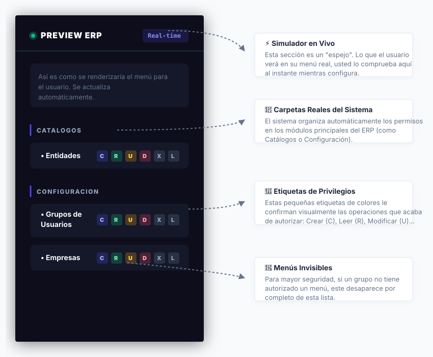
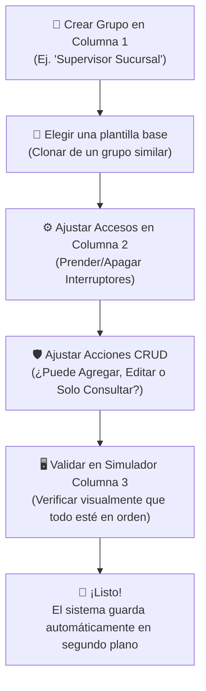

# Manual de Usuario: Panel de Seguridad y Control de Accesos (SPA)

Bienvenido a la guía funcional de la **Pantalla Inteligente de Permisos**. Este manual está diseñado para ser comprendido por cualquier persona de la organización, desde un administrador del sistema hasta el personal administrativo o gerencial, sin necesidad de tener conocimientos de programación o base de datos.

---

## 🔑 La Analogía de la Seguridad: El Llavero del ERP

Para entender cómo funciona el sistema de seguridad de nuestro ERP, imagina un gran edificio corporativo:

1. **Los Grupos de Usuario (Los Departamentos):**
   En lugar de darle llaves de forma individual a cada empleado que entra a la empresa, creamos "Departamentos" o "Grupos" (por ejemplo: _Caja_, _Ventas_, _Contabilidad_, _Gerencia_). Cuando llega un empleado nuevo, simplemente lo asignamos a su departamento y automáticamente recibe todas las llaves de ese rol.
2. **Las Opciones de Menú (Las Puertas del Edificio):**
   Son todas las salas y oficinas a las que se puede entrar en el sistema (por ejemplo: la oficina de _Facturación_, la sala de _Reportes_, etc.).
3. **Los Permisos CRUD (Las Acciones Permitidas dentro de cada Sala):**
   Una cosa es que te dejemos entrar a la oficina de _Facturación_ (Acceso de Solo Lectura), y otra muy diferente es lo que se te permite hacer allí adentro:
   - **Agregar:** ¿Puedes crear una factura nueva?
   - **Editar:** ¿Puedes modificar los datos de una factura existente?
   - **Eliminar:** ¿Puedes borrar un registro del sistema?
   - **Cancelar:** ¿Puedes anular una operación o documento oficial?

---

## 🖥️ Estructura del Panel: 3 Columnas de Control

La pantalla se divide en tres secciones visuales que trabajan juntas de forma inmediata y en tiempo real:

### 👥 Columna 1: Galería de Grupos de Usuarios

Ubicada al extremo izquierdo de la pantalla. Su objetivo es listar y gestionar las clasificaciones de usuarios en la empresa.

- **Barra de Búsqueda:** Permite buscar grupos rápidamente por nombre (ej. escribe "Ventas" y se filtrará la lista).
- **Crear Nuevo Grupo:** Un botón destacado que abre un formulario sencillo para registrar un nuevo grupo de acceso. Al crearlo, puedes elegir una "Plantilla Base" para no empezar desde cero (por ejemplo, copiar la configuración de un grupo existente o crear uno en blanco).
- **Eliminar Grupo:** Al pasar el cursor sobre un grupo (que no sea del sistema), aparecerá un icono de bote de basura para eliminarlo, solicitando una confirmación segura antes de realizar la acción.

---

### 🛡️ Columna 2: El Tablero de Control de Permisos

Es el centro de operaciones. Muestra una lista organizada de los módulos de la aplicación y sus submenús.

- **El Interruptor de "Acceso":** Cada renglón tiene un interruptor de encendido/apagado. Si lo apagas, el usuario **no podrá ver esa sección del menú** en su pantalla de inicio.
- **Casillas CRUD (Acciones):** Si enciendes el interruptor de "Acceso", se habilitarán las casillas de acciones a la derecha. Aquí puedes marcar qué operaciones tiene permitidas realizar el grupo de usuario sobre esa pantalla específica.
- **Regla Inteligente de Seguridad:** Si el interruptor principal de "Acceso" está **apagado**, todas las casillas CRUD se bloquearán y desactivarán automáticamente. ¡No puedes realizar acciones en una habitación a la que ni siquiera tienes permitido entrar!
- **Botones Masivos de Módulo:** Cada módulo principal tiene botones rápidos para **Habilitar** o **Bloquear** todas sus opciones con un solo clic, ahorrándote tiempo.
- **Botones Globales:** En la parte superior existen controles para "Habilitar Todo" o "Bloquear Todo" a nivel general del grupo de usuario.

---

### 🖥️ Columna 3: El Simulador del Menú (Vista Previa)

Esta columna representa la gran innovación del panel. Te permite **"ver con los ojos del usuario"** en tiempo real.

- Mientras marcas o desmarcas casillas en la Columna 2, la Columna 3 simula exactamente cómo se estructurará el menú del usuario cuando inicie sesión.
- Si le das acceso a un módulo, este aparecerá inmediatamente en el simulador. Si se lo quitas, desaparecerá con una transición suave.
- **Letras de Autorización (Badges):** Junto a cada opción de menú visible, aparecerán círculos de colores con letras que indican las acciones permitidas:
  - C **(Crear):** El usuario puede registrar datos nuevos.
  - R **(Consultar):** El usuario puede entrar y ver la información.
  - U **(Editar):** El usuario puede modificar registros.
  - D **(Eliminar):** El usuario puede borrar información física del sistema.

---

## 🔄 El Flujo de Trabajo del Administrador (Paso a Paso)

Cuando necesitas dar de alta y configurar los accesos para un área nueva de tu empresa (por ejemplo, "Supervisor de Sucursal"), el flujo de trabajo es sumamente intuitivo:

---

## 🧠 Características Inteligentes del Sistema (Bajo el Capó)

Aunque la pantalla es sumamente simple de usar, por detrás cuenta con tecnologías diseñadas para que la experiencia de uso sea excelente:

### 1. Sistema de Auto-Guardado Inteligente (Sin Botón Guardar)

- **¿Cómo funciona?** No existe un botón de "Guardar Cambios" al que le tengas que dar clic a cada momento. Cada casilla o interruptor que mueves se registra en una cola de cambios temporal.
- **El Temporizador de Inactividad (Debounce):** Para no saturar el sistema con solicitudes cada vez que das un clic rápido, la pantalla espera **1.2 segundos** después de tu último clic para empaquetar y guardar todos los cambios pendientes de forma masiva en una sola transacción ultra-rápida.
- **Notificación de Confirmación (Toast):** Al guardarse los cambios, verás una sutil notificación emergente en la parte inferior de la pantalla diciendo _"Cambio Guardado"_ o _"Guardando cambios..."_, asegurándote de que tu información está a salvo.

### 2. Limpieza de Basura en Base de Datos (Limpieza Inversa)

- **¿Qué es?** En sistemas tradicionales, se guarda un renglón de permisos por cada pantalla existente, incluso si el usuario no tiene permitido hacer nada allí, saturando la base de datos de registros vacíos e inútiles.
- **Nuestra Solución:** Si a un grupo le apagas el switch de "Acceso" a una pantalla (y todos sus permisos CRUD quedan desactivados), el sistema automáticamente **borra físicamente esa regla** de la base de datos. Si no hay permisos, no hay por qué guardar basura. Esto mantiene la base de datos limpia, ágil y con un rendimiento excelente.

### 3. Sincronización Automática de Menús Padre

- Si marcas el switch de "Acceso" en un submenú (por ejemplo, _Facturación Mensual_), el sistema entiende que necesitas poder navegar a ese módulo y, por lo tanto, **enciende automáticamente el interruptor del Módulo Principal** al que pertenece (por ejemplo, _Módulo de Ventas_).
- De igual forma, si apagas el último submenú activo de un módulo, el sistema apagará el Módulo Principal automáticamente para evitar que el usuario tenga un botón vacío en su menú.

---

## 🎨 Galería de Ilustraciones de la Interfaz

Para comprender mejor de forma visual el funcionamiento de cada elemento de este panel interactivo, consulta las siguientes ilustraciones vectoriales adjuntas:

- **[Columna 1: Grupos de Usuarios](file:///c:/Users/LuisKC/Proyectos/vERP%20Y%20DATTA_ERP/ds-qs/data/1.%20Principales/Manuales/002_ui_col1_grupos.svg):** Diseño de la columna izquierda con búsqueda y lista de roles.
- **[Columna 2: Matriz de Control](file:///c:/Users/LuisKC/Proyectos/vERP%20Y%20DATTA_ERP/ds-qs/data/1.%20Principales/Manuales/002_ui_col2_permisos.svg):** Tablero central con switches y permisos CRUD exactos.
- **[Columna 3: Simulador ERP](file:///c:/Users/LuisKC/Proyectos/vERP%20Y%20DATTA_ERP/ds-qs/data/1.%20Principales/Manuales/002_ui_col3_preview.svg):** Vista en vivo (Dark Mode) de cómo el usuario final verá el menú.
- **[Diagrama del Flujo del Negocio](file:///c:/Users/LuisKC/Proyectos/vERP%20Y%20DATTA_ERP/ds-qs/data/1.%20Principales/Manuales/002_flujo_negocio.svg):** Mapa conceptual simple del ciclo de administración de accesos.
