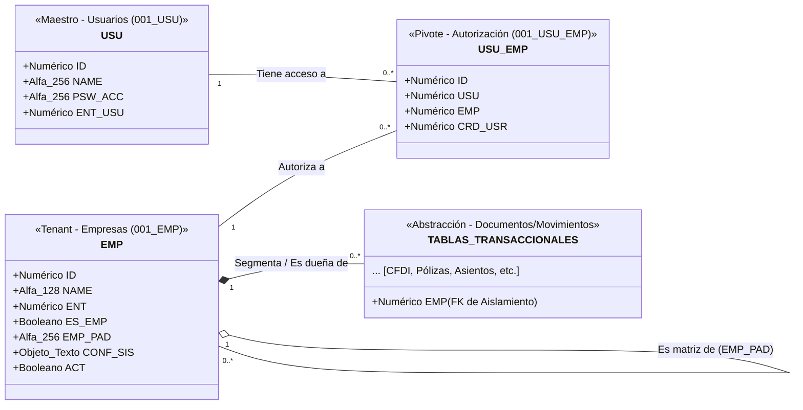
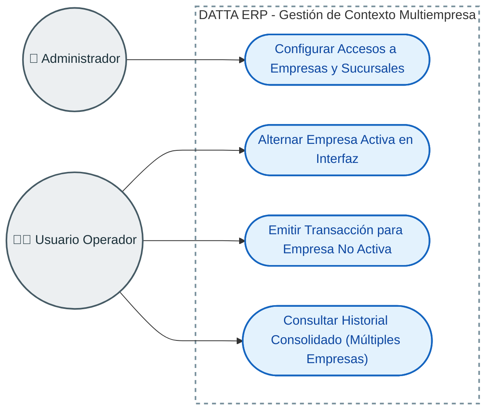
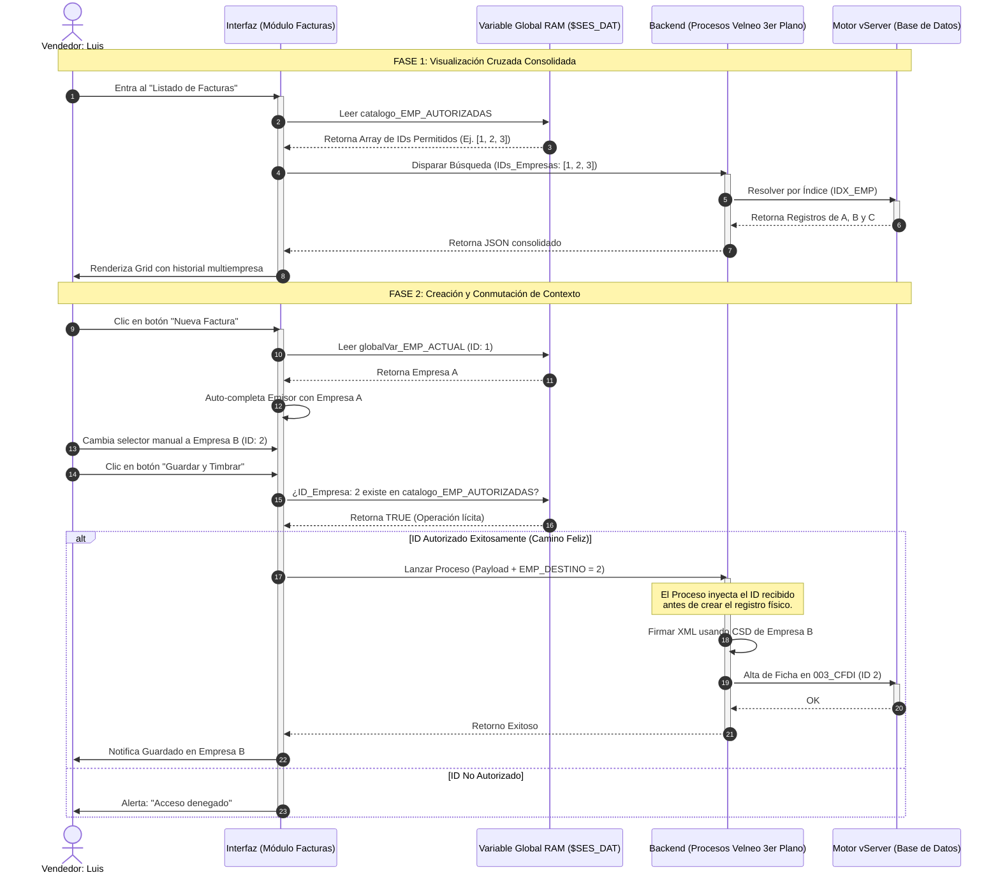
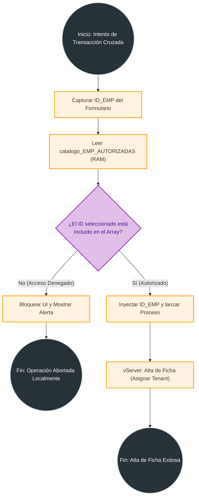

# Arquitectura UML: Módulo Multiempresa (Multi-Tenant)

Este documento detalla el diseño arquitectónico del motor **Multi-Tenant (Multiempresa)** dentro de DATTA ERP. A diferencia del control de permisos, esta arquitectura dicta el contexto y el aislamiento absoluto de los datos en un entorno compartido.

El objetivo es garantizar que una única instancia de base de datos aloje de manera segura la información de múltiples entidades legales, asegurando que los usuarios operen exclusivamente sobre los datos autorizados en tiempo real.

## Explicación Arquitectónica (Semántica UML)

1. **Gestión de Acceso a Tenants (`001_USU_EMP`)**
   El acceso a una empresa es una relación de muchos-a-muchos. Esta lógica de autorización se almacena de forma independiente a los permisos en la tabla puente `001_USU_EMP`, permitiendo que un mismo usuario pueda tener "puntos de vista" distintos sobre diferentes razones sociales.

2. **Aislamiento de Datos por Composición (`*--`)**
   Toda tabla operativa (Facturas, Inventarios, Pólizas) hereda obligatoriamente el ID de la Empresa (`EMP`). En UML, esta composición indica que el dato no tiene existencia fuera de su Tenant, garantizando que el sistema segregue físicamente los registros mediante filtros de índice.

3. **Jerarquía Multi-Nivel (`EMP_PAD`)**
   La relación reflexiva (`o-- hacia sí misma`) permite modelar estructuras de Holdings o Consorcios, donde una Empresa Matriz puede contener múltiples empresas hijas o sucursales, manteniendo la integridad de la herencia de datos legales.

---

## Diagrama de Casos de Uso: Gestión y Contexto

A nivel de negocio, operar un sistema Multi-Tenant requiere flujos de trabajo específicos para navegar entre empresas y consolidar información sin cerrar la sesión activa.

### Lógica de Negocio Multi-Tenant

- **Abstracción del Contexto:** El sistema permite que el operador tenga una "Empresa por Defecto" pero mantenga la capacidad de realizar transacciones cruzadas para otras empresas autorizadas sin cambiar su sesión global.
- **Seguridad de Capa Local:** La visibilidad de las empresas autorizadas se descarga una sola vez al inicio en el array `catalogo_EMP_AUTORIZADAS`, eliminando consultas redundantes al servidor durante la navegación.

---

## Diagrama de Secuencia: Operación Transaccional Multiempresa

Este diagrama modela el flujo técnico para una operación cruzada, demostrando cómo el sistema valida la seguridad en RAM antes de impactar la base de datos.

### Arquitectura Técnica en el Tiempo

1. **Visión Omnipresente:** El ERP permite cargar plurales de múltiples empresas simultáneamente mediante el paso de arrays al backend, optimizando el rendimiento mediante el uso de índices de base de datos.
2. **Validación Fail-Fast en RAM:** La seguridad perimetral se ejecuta en la UI comparando el destino contra el catálogo autorizado en memoria local, eliminando latencia y denegando manipulaciones antes de llegar al servidor.

---

## Diagrama de Actividad: Algoritmo de Transacción Defensiva

El diagrama de actividad representa el **algoritmo matemático** que sigue la interfaz para blindar la integridad del Tenant durante una operación de escritura.

### Análisis del Algoritmo

1. **Validación en Capa de Cliente:** Ahorra latencia de red y ciclos de CPU en el servidor al denegar intentos de inyección de datos desde la interfaz de usuario.
2. **Desacoplamiento de Contexto:** Permite que un usuario emita documentos para cualquier empresa autorizada sin necesidad de forzar un cambio de sesión global, aumentando la productividad operativa.
3. **Persistencia Multi-Tenant:** La instrucción final garantiza que el puntero maestro de la base de datos se asigne correctamente, manteniendo el aislamiento absoluto de los registros.
