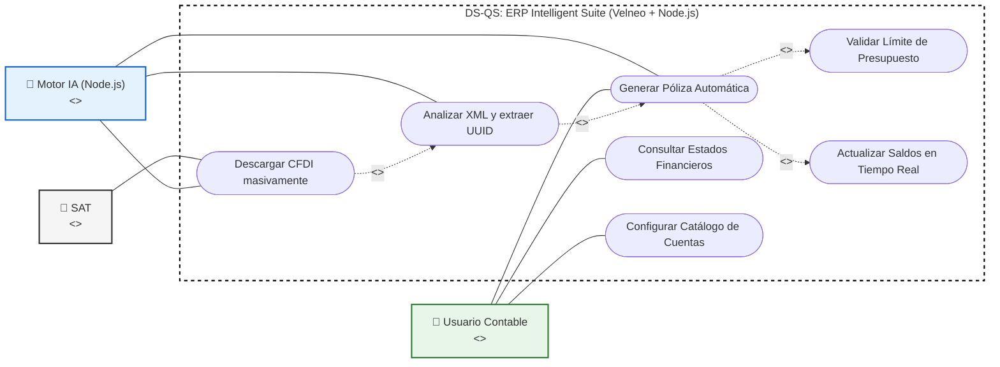
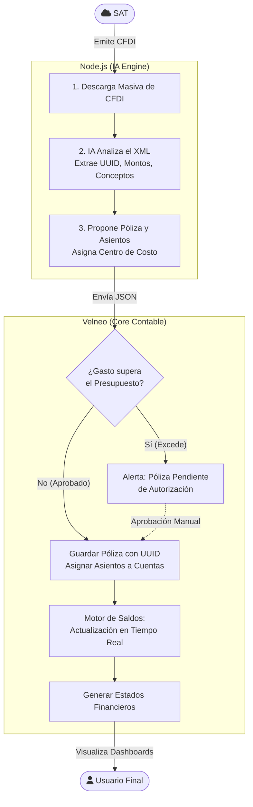
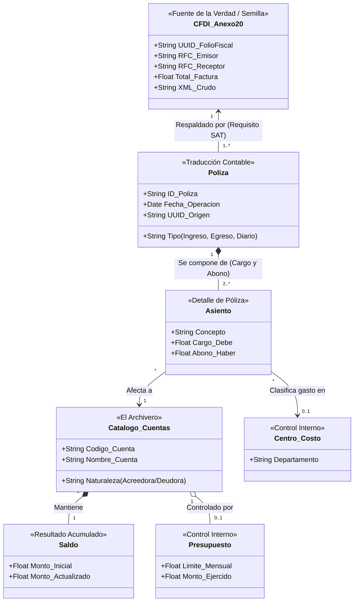

## DIAGRAMA DE FLUJO CONTABILIDAD DATTA ERP 

```mermaid
flowchart LR
    %% Definición de Actores
    SAT["🏢 SAT\n<<Actor Externo>>"]
    IA["🤖 Motor IA (Node.js)\n<<Actor de Sistema>>"]
    USUARIO["👤 Usuario Contable\n<<Actor Humano>>"]

    %% Límite del Sistema (System Boundary)
    subgraph DSQS ["DS-QS: ERP Intelligent Suite (Velneo + Node.js)"]
        direction TB
        UC1(["Descargar CFDI masivamente"])
        UC2(["Analizar XML y extraer UUID"])
        UC3(["Generar Póliza Automática"])
        UC4(["Validar Límite de Presupuesto"])
        UC5(["Actualizar Saldos en Tiempo Real"])
        UC6(["Consultar Estados Financieros"])
        UC7(["Configurar Catálogo de Cuentas"])
    end

    %% Asociaciones Principales (Actores interactuando con Casos de Uso)
    SAT --- UC1
    IA --- UC1
    IA --- UC2
    IA --- UC3
    
    USUARIO --- UC6
    USUARIO --- UC7
    USUARIO --- UC3

    %% Relaciones UML de Dependencia (Includes)
    UC1 -. "<<include>>\n" .-> UC2
    UC2 -. "<<include>>\n" .-> UC3
    UC3 -. "<<include>>\n" .-> UC4
    UC3 -. "<<include>>\n" .-> UC5
    
    %% Estilos para respetar la estética UML
    style SAT fill:#f5f5f5,stroke:#333,stroke-width:2px
    style IA fill:#e3f2fd,stroke:#1565c0,stroke-width:2px
    style USUARIO fill:#e8f5e9,stroke:#2e7d32,stroke-width:2px
    style DSQS fill:#ffffff,stroke:#000000,stroke-width:2px,stroke-dasharray: 5 5
```

# DIAGRAMA DE CASO DE ACTIVIDADES CONTABILIDAD DATTA ERP

```mermaid
flowchart TD
    %% Actores/Sistemas
    SAT([fa:fa-cloud SAT])
    USUARIO([fa:fa-user Usuario Final])

    subgraph "Node.js (IA Engine)"
        A[1. Descarga Masiva de CFDI]
        B[2. IA Analiza el XML\nExtrae UUID, Montos, Conceptos]
        C[3. Propone Póliza y Asientos\nAsigna Centro de Costo]
    end

    subgraph "Velneo (Core Contable)"
        D{¿Gasto supera\nel Presupuesto?}
        E[Alerta: Póliza Pendiente\nde Autorización]
        F[Guardar Póliza con UUID\nAsignar Asientos a Cuentas]
        G[Motor de Saldos:\nActualización en Tiempo Real]
        H[Generar Estados Financieros]
    end

    %% Flujo
    SAT -->|Emite CFDI| A
    A --> B
    B --> C
    C -->|Envía JSON| D
    D -- "Sí (Excede)" --> E
    D -- "No (Aprobado)" --> F
    F --> G
    G --> H
    H -->|Visualiza Dashboards| USUARIO
    E -.->|Aprobación Manual| F
```

## DIAGARAMA DE CLASES:CONTABILIDAD DATTA ERP

```mermaid
classDiagram
    direction TB

    class CFDI_Anexo20 {
        <<Fuente de la Verdad / Semilla>>
        +String UUID_FolioFiscal
        +String RFC_Emisor
        +String RFC_Receptor
        +Float Total_Factura
        +String XML_Crudo
    }

    class Poliza {
        <<Traducción Contable>>
        +String ID_Poliza
        +Date Fecha_Operacion
        +String Tipo (Ingreso, Egreso, Diario)
        +String UUID_Origen
    }

    class Asiento {
        <<Detalle de Póliza>>
        +String Concepto
        +Float Cargo_Debe
        +Float Abono_Haber
    }

    class Catalogo_Cuentas {
        <<El Archivero>>
        +String Codigo_Cuenta
        +String Nombre_Cuenta
        +String Naturaleza (Acreedora/Deudora)
    }

    class Saldo {
        <<Resultado Acumulado>>
        +Float Monto_Inicial
        +Float Monto_Actualizado
    }

    class Presupuesto {
        <<Control Interno>>
        +Float Limite_Mensual
        +Float Monto_Ejercido
    }
    
    class Centro_Costo {
        <<Control Interno>>
        +String Departamento
    }

    %% Relaciones (Lectura técnica)
    CFDI_Anexo20 "1" <-- "1..*" Poliza : Respaldado por (Requisito SAT)
    Poliza "1" *-- "2..*" Asiento : Se compone de (Cargo y Abono)
    Asiento "*" --> "1" Catalogo_Cuentas : Afecta a
    Asiento "*" --> "0..1" Centro_Costo : Clasifica gasto en
    Catalogo_Cuentas "1" *-- "1" Saldo : Mantiene
    Catalogo_Cuentas "1" o-- "0..1" Presupuesto : Controlado por
```