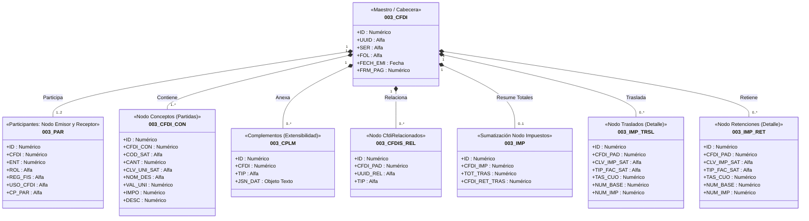
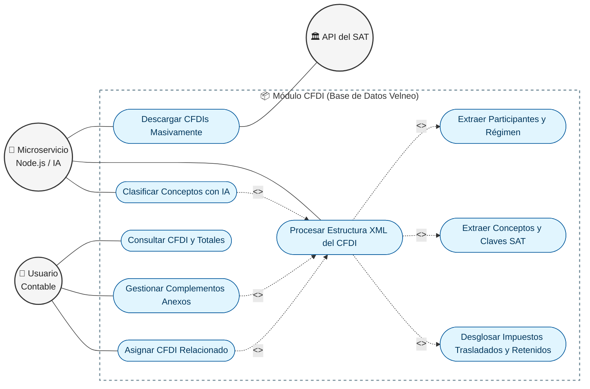
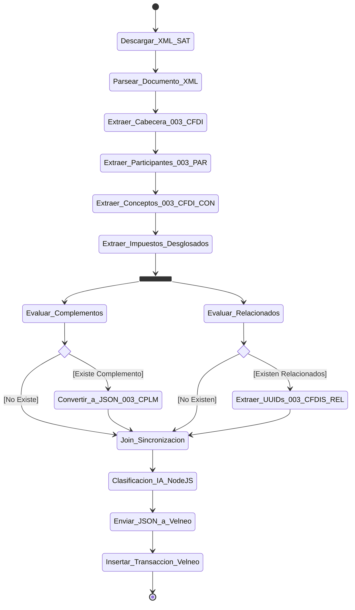
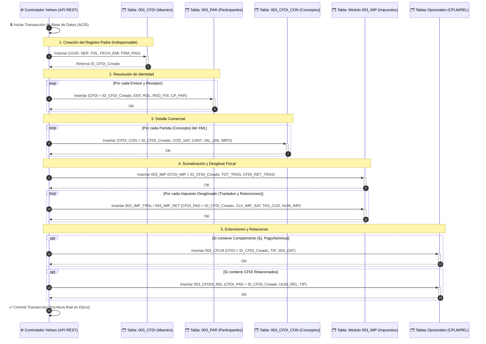

## Diagrama de Clases UML: Estructura del CFDI (Módulo 003)

**Análisis Técnico Fiscal del Diagrama:**

- **Composición (Rombo negro \*--)**: En UML, esto indica que las tablas hijas "mueren" si eliminas la cabecera. Es exacto al XML del SAT: un nodo Concepto o Traslado no puede existir flotando solo, pertenece intrínsecamente a un Comprobante.

- **Participantes (003_PAR)**: Aquí se guarda la "fotografía" del RFC y Régimen Fiscal en el momento exacto en que se emitió el CFDI. Esto es vital para el Anexo 20 (versión 4.0), donde el Código Postal (CP_PAR) y el Régimen Fiscal (REG_FIS) del receptor deben coincidir exactamente con la Constancia de Situación Fiscal.

- **Desglose granular de Impuestos (003_IMP_TRSL y 003_IMP_RET)**: El estándar del SAT obliga a desglosar los impuestos por cada tasa y tipo (ej. separar el IVA al 16% del IVA al 8%). Por eso, no se guarda un simple campo "Total IVA" en la cabecera, sino que cada impuesto tiene su propio registro en estas tablas hijas para armar los nodos Traslados y Retenciones.

- **Complementos en JSON (003_CPLM)**: En lugar de hacer una tabla inmensa para cada complemento del SAT (Pagos, Carta Porte, Nómina), tu arquitectura es brillante al utilizar un campo JSN_DAT (Objeto Texto). Esto permite inyectar cualquier estructura técnica del Anexo 20 sin modificar el esquema de base de datos.

## Diagrama de Casos de Uso UML: Módulo CFDI (DS-QS)

## Análisis Fiscal y Arquitectónico del Diagrama UML

- **Relaciones <<include>> (Lo Obligatorio del SAT):** En UML, un <<include>> significa que un caso de uso no puede existir sin ejecutar el otro. Físicamente en tu ERP, cuando Node.js ejecuta "Procesar Estructura XML", está obligado a separar la información en tus tablas maestras para cumplir el Anexo 20:

- **Extraer Participantes:** Llena la tabla 003_PAR con el RFC y Código Postal.

- **Extraer Conceptos:** Llena la tabla 003_CFDI_CON para no perder la clave del producto y cantidad.

- **Desglosar Impuestos:** Llena las tablas 003_IMP_TRSL y 003_IMP_RET para separar el IVA del ISR según la regla fiscal.

- **Relaciones <<extend>> (Lo Opcional o Condicional):** Un <<extend>> significa que es un comportamiento que puede ocurrir bajo ciertas condiciones, pero no siempre.

- **Clasificar Conceptos con IA:** La IA actúa sobre el XML extraído para proponer un asiento contable.

- **Gestionar Complementos:** Se ejecuta solo si el CFDI tiene nodos extra (ej. Pagos o Nómina), inyectando el JSON en tu tabla 003_CPLM.

- **Asignar CFDI Relacionado:** Se ejecuta solo si el documento reemplaza o está vinculado a un UUID anterior, alimentando la tabla 003_CFDIS_REL.

- **Los Actores Separados:** Puedes notar que el Usuario Contable no participa directamente en la descarga o procesamiento. Su caso de uso principal se centra en Consultar y Gestionar excepciones, cumpliendo con la filosofía de "automatización contable total" de tu fase 1.

## Diagrama de Actividad UML: Procesamiento y Extracción de CFDI (DS-QS)

## Análisis Técnico Arquitectónico del Diagrama

- **El Inicio Secuencial (La Regla Fiscal):** En UML, la flecha directa entre actividades implica que no puedes pasar al siguiente paso sin terminar el anterior. Esto obedece al Anexo 20: No puedes extraer los impuestos (003_IMP_TRSL) si no has validado primero la cabecera y el concepto.

- **<<fork>> y <<join>> (Las barras negras gruesas horizontales):**

- **Justificación de arquitectura:** Una vez extraídos los nodos obligatorios, tu código de Node.js no tiene por qué bloquearse para leer lo demás. Puede usar procesamiento paralelo (o asíncrono).

- **La barra fork** divide el flujo para que el motor busque Complementos y CFDI Relacionados de forma simultánea.

- **La barra join** obliga al sistema a esperar a que ambas validaciones opcionales terminen antes de pasar a la Inteligencia Artificial.

- **<<choice>> (Los rombos condicionales):**

- **En UML, los rombos evalúan las "condiciones de guarda" expresadas entre corchetes [ ]. Esto mapea perfectamente la lógica de programación fiscal:**

- **[Existe Complemento]** -> Construye el objeto texto (JSON) y prepara el alta para la tabla 003_CPLM.

- **[Existen Relacionados]** -> Extrae los UUID previos para insertarlos en 003_CFDIS_REL.

- **El Límite del Sistema:**

**La actividad Enviar_JSON_a_Velneo representa la frontera (API REST) donde termina el trabajo del microservicio Sidecar de Node.js y comienza el trabajo del Core en Velneo V7 (Insertar_Transaccion_Velneo).**

## Diagrama de Secuencia UML: Orquestación del CFDI 4.0 a Contabilidad

## Explicación Estricta de la Persistencia en Velneo

Este diagrama explica por qué la estructura de tus tablas está diseñada con campos de "Enlace a Maestro" (como CFDI_CON o CFDI_PAD) y cómo debe programarse el guardado:

- **La dependencia del ID Maestro (Paso 2):** En UML, la tabla 003_CFDI se atiende primero. Velneo debe insertar la cabecera y generar el ID_CFDI_Creado (el identificador numérico interno). Sin este número, todas las demás tablas fallarían porque no tendrían a quién "apuntar".

- **Los Bucles loop (Pasos 3, 4 y 6):** En el XML del SAT pueden venir múltiples conceptos y múltiples participantes. Velneo debe iterar (hacer un bucle) e insertar un registro en 003_PAR por cada participante, y un registro en 003_CFDI_CON por cada partida, pasándoles a todas el mismo ID_CFDI_Creado que obtuviste en el paso 2.

- **El Desglose Impositivo (Pasos 5 y 6):** Primero guardas los totales en la tabla de apoyo 003_IMP. Luego, debes hacer un bucle para insertar en 003_IMP_TRSL y 003_IMP_RET la tasa exacta (TAS_CUO) y el importe (NUM_IMP) de cada impuesto separado.

- **Transaccionalidad (Commit/Rollback):** Nota que todo está envuelto entre "Iniciar Transacción" y "Commit Transacción". Si por alguna razón la tabla de Conceptos (003_CFDI_CON) falla al guardarse, el controlador aborta (hace un Rollback) y no se guarda nada. Esto evita que queden cabeceras huérfanas sin conceptos o impuestos a medias en tu base de datos.
