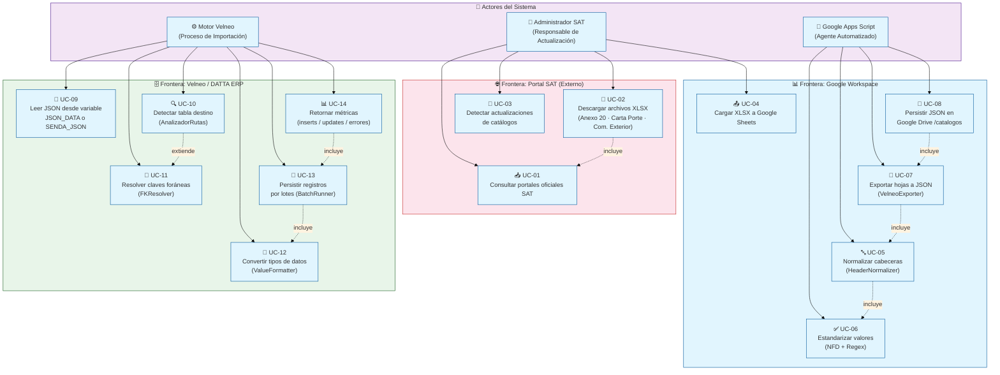

# 📋 Diagrama de Casos de Uso — Módulo Catálogos SAT

> **Tipo:** Use Case Diagram
> **Estándar:** UML 2.5 / C4 Context
> **Objetivo:** Modelar las fronteras del sistema y los actores involucrados en el pipeline ETL de catálogos SAT.

---

## Diagrama

---

## 📌 Descripción de Casos de Uso

| ID | Caso de Uso | Actor | Descripción |
|----|-------------|-------|-------------|
| UC-01 | Consultar portales oficiales SAT | Administrador | Accede a las URLs oficiales para verificar si hay versiones nuevas de catálogos |
| UC-02 | Descargar archivos XLSX | Administrador | Descarga manualmente los archivos de los tres anexos |
| UC-03 | Detectar actualizaciones | Administrador | Compara fechas/versiones de los catálogos descargados vs. los vigentes en BD |
| UC-04 | Cargar XLSX a Google Sheets | Administrador | Importa el XLSX como hoja dentro del Spreadsheet de trabajo |
| UC-05 | Normalizar cabeceras | Apps Script | `HeaderNormalizer` aplica NFD + regex a las cabeceras de cada hoja |
| UC-06 | Estandarizar valores | Apps Script | Limpia diacríticos, convierte a mayúsculas, estandariza fechas de vigencia |
| UC-07 | Exportar hojas a JSON | Apps Script | `VelneoExporter` itera hojas y construye arrays de objetos JSON |
| UC-08 | Persistir JSON en Drive | Apps Script | `DriveService` guarda `{hoja}.json` en la carpeta `catalogos` de Drive |
| UC-09 | Leer JSON | Velneo Motor | Lee contenido desde variable `JSON_DATA` o archivo `SENDA_JSON` |
| UC-10 | Detectar tabla destino | Velneo Motor | `AnalizadorRutas` identifica la tabla Velneo usando la `pistaJSON` |
| UC-11 | Resolver claves foráneas | Velneo Motor | `FKResolver` resuelve IDs de MUN/LOC para la tabla A20_CP |
| UC-12 | Convertir tipos | Velneo Motor | `ValueFormatter` transforma string/fecha/boolean a tipos Velneo |
| UC-13 | Persistir por lotes | Velneo Motor | `BatchRunner` procesa lotes de 1 000 registros con transacción |
| UC-14 | Retornar métricas | Velneo Motor | Devuelve resumen `OK\|Éxito: N registros` en variable `RETORNO` |

---

## 🔗 Relaciones Notables

- **Incluye (`<<include>>`):** UC-07 siempre ejecuta UC-05 (la exportación depende de la normalización previa).
- **Extiende (`<<extend>>`):** UC-11 sólo se activa cuando la tabla destino es `A20_CP` (códigos postales con FK a municipio y localidad).
- **Frontera crítica:** El límite entre Google Workspace y Velneo se materializa en el archivo `.json` en Google Drive — es el único contrato de interfaz entre ambos sistemas.
