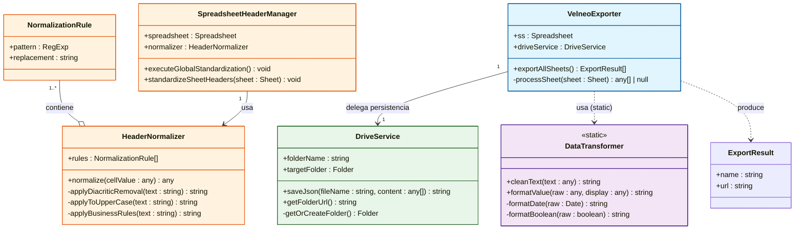
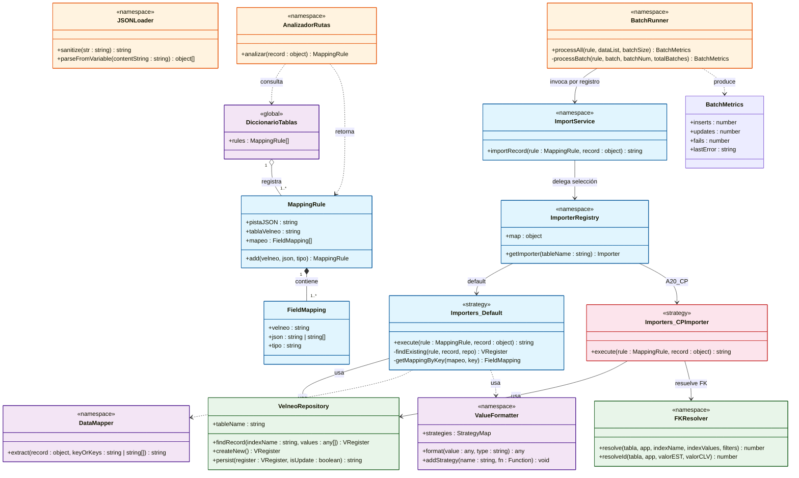

# 🏛️ Diagrama de Clases — Motor de Importación SAT-Velneo

> **Tipo:** Class Diagram
> **Estándar:** UML 2.5
> **Objetivo:** Mapear la anatomía del motor de importación, reflejando clases, atributos, métodos, relaciones y multiplicidad extraídos directamente del código fuente.

---

## Diagrama Principal — Capa Google Apps Script (AppScript)

---

## Diagrama Principal — Capa Velneo (Motor de Importación)

---

## 📌 Inventario de Tablas Destino

### Anexo 20 — `catalogos_sat_dat/A20_*`

| Pista JSON | Tabla Velneo | Campos clave |
|-----------|--------------|-------------|
| `C_ADUANA` | `A20_ADU` | ID, NAME, FEC_INI_VIG, FEC_FIN_VIG |
| `C_CLAVEUNIDAD` | `A20_CLV_UNI` | ID, NAME, DESC, NOTA |
| `C_CODIGOPOSTAL` | `A20_CP` | ID, EST, MUN(FK), LOC(FK) |
| `C_COLONIA` | `A20_COL` | CLV, NAME, CP |
| `C_ESTADO` | `A20_EST` | ID, NAME, PAIS |
| `C_EXPORTACION` | `A20_EXP` | ID, NAME |
| `C_FORMAPAGO` | `A20_FOR_PAG` | ID, NAME, BANC, NUM_OPE |
| `C_IMPUESTO` | `A20_IMP` | ID, NAME, IMP_RET(bool), IMP_TRA(bool), LOC_FED |
| `C_LOCALIDAD` | `A20_LOC` | CLV, NAME, EST |
| `C_MESES` | `A20_MESES` | ID, NAME |
| `C_METODOPAGO` | `A20_MET_PAG` | ID, NAME |
| `C_MONEDA` | `A20_MON` | ID, NAME, DEC |
| `C_MUNICIPIO` | `A20_MUN` | CLV, NAME, EST |
| `C_NUMPEDIMIENTOADUANA` | `A20_NUM_PED_ADU` | ADU, PAT, EJER, CANT |
| `C_OBJETOIMP` | `A20_OBJ_IMP` | ID, NAME |
| `C_PAIS` | `A20_PAIS` | ID, NAME |
| `C_PATENTEADUANAL` | `A20_PAT_ADU` | ID |
| `C_PERIODICIDAD` | `A20_PER` | ID, NAME |
| `C_CLAVEPRODSERV` | `A20_PRO_SER` | ID, NAME, INC_IVA, INC_IEPS, COMP, PLB_SML |
| `C_REGIMENFISCAL` | `A20_REG_FIS` | ID, NAME, PER_FIS(bool), PER_MOR(bool) |
| `C_TIPODECOMPROBANTE` | `A20_TIP_COMP` | ID, NAME |
| `C_TIPOFACTOR` | `A20_TIP_FAC` | ID |
| `C_TIPORELACION` | `A20_TIP_REL` | ID, NAME |
| `C_USOCFDI` | `A20_USO_CFDI` | ID, NAME, PER_FIS(bool), PER_MOR(bool), REG_FIS_RECP |
| `C_TASAOCUOTA` | `A20_TAS_O_CUO` | ID, NAME, VAL_MIN, VAL_MAX, IMP, FAC, RET(bool), TRA(bool) |

### Carta Porte — `catalogos_sat_dat/CP_*`

| Pista JSON | Tabla Velneo | Campos especiales |
|-----------|--------------|------------------|
| `C_ESTACIONES` | `CP_EST` | TRAN, PAIS, IATA, LIN_FER |
| `C_CLAVEUNIDADPESO` | `CP_CLV_UNI_PESO` | SIMB, BAND |
| `C_CVETRANSPORTE` | `CP_CLV_TRAN` | — |
| `C_MATERIALPELIGROSO` | `CP_MAT_PEL` | CLS |
| `C_REGIMENADUANERO` | `CP_REG_ADU` | IMP(bool), EXP(bool) |
| `C_TRANSPORTEESTACION` | `CP_REL_TRA_TIP_EST` | EST, TRAN |
| `C_TIPOEMBALAJE` | `CP_TIP_EMB` | — |
| `C_TIPOESTACION` | `CP_TIP_EST` | — |
| `C_SECTORCOFEPRIS` | `CP_SEC_COF` | — |
| `C_FORMAFARMACEUTICA` | `CP_FOR_FAR` | — |
| `C_CONDICIONESESPECIALES` | `CP_CON_ESP` | — |
| `C_TIPOMATERIA` | `CP_TIP_MAT` | — |
| `C_DOCUMENTOADUANERO` | `CP_DOC_ADU` | — |
| `C_PARTETRANSPORTE` | `CP_PAR_TRAN` | — |
| `C_FIGURATRANSPORTE` | `CP_FIG_TRA` | — |
| `C_CONFIGAUTOTRANSPORTE` | `CP_CON_AUT` | NUM_EJES, NUM_LLANTAS, REM |
| `C_SUBTIPOREM` | `CP_SUB_TIP_REM` | — |
| `C_REGISTROISTMO` | `CP_REG_ISTMO` | — |
| `C_CONFIGMARITIMA` | `CP_CON_MAR` | — |
| `C_CLAVETIPOCARGA` | `CP_TIP_CAR` | — |
| `C_CONTENEDORMARITIMO` | `CP_CONT_MAR` | — |
| `C_NUMAUTORIZACIONNAVIERO` | `CP_NUM_AUT_NAV` | NUM_AUT_NAV |
| `C_CONTENEDOR` | `CP_CONT` | TIP_CONT |
| `C_TIPODETRAFICO` | `CP_TIP_TRA` | — |
| `C_TIPODESERVICIO` | `CP_TIP_SER` | — |
| `C_TIPOCARRO` | `CP_TIP_CARRO` | — |
| `C_TIPOPERMISO` | `CP_TIP_PER` | CLV, TRAN |
| `C_CODIGOTRANSPORTEAEREO` | `CP_COD_TRA_AER` | DES_OACI |
| `C_DERECHODEPASO` | `CP_DER_PAS` | ENTRE, HASTA, OTOR(bool), RECI(bool), CONC |
