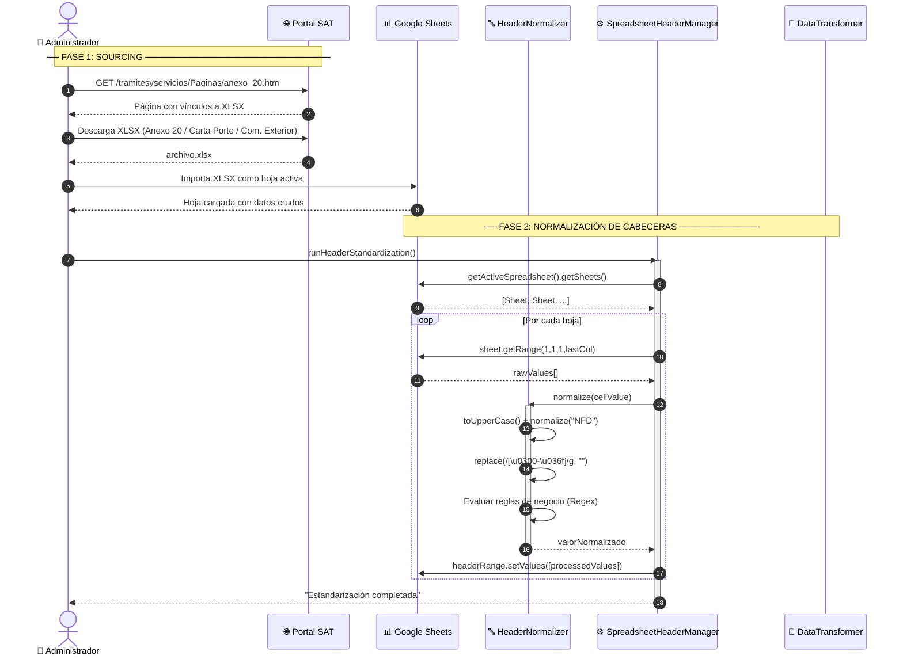
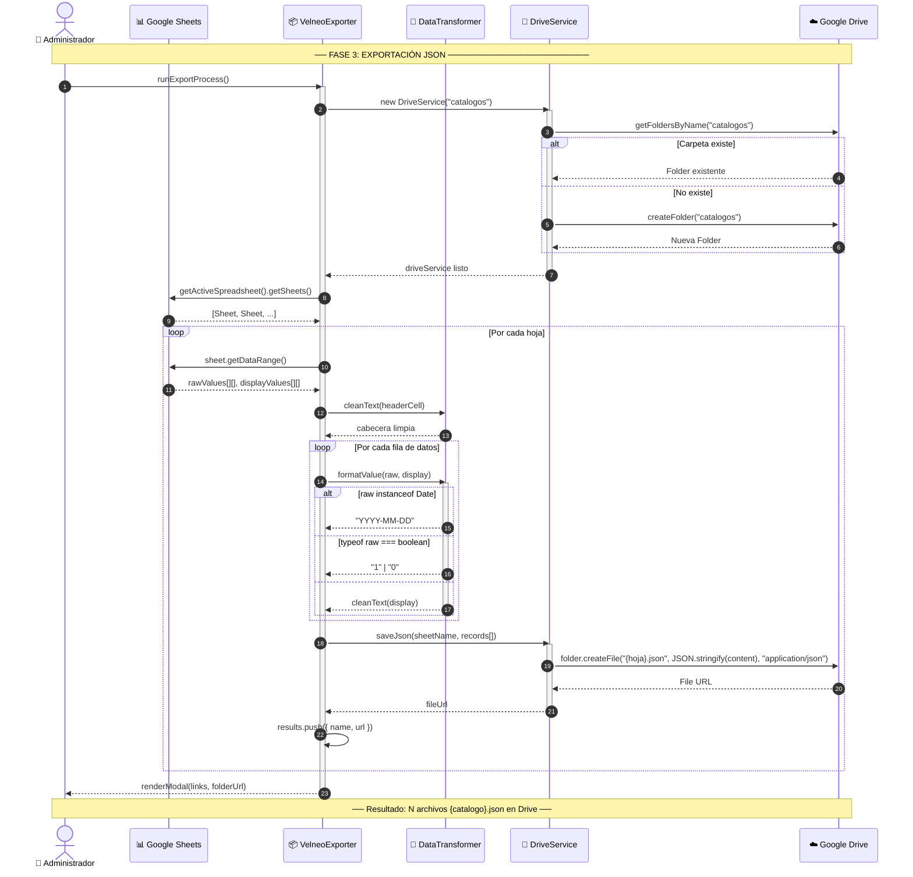
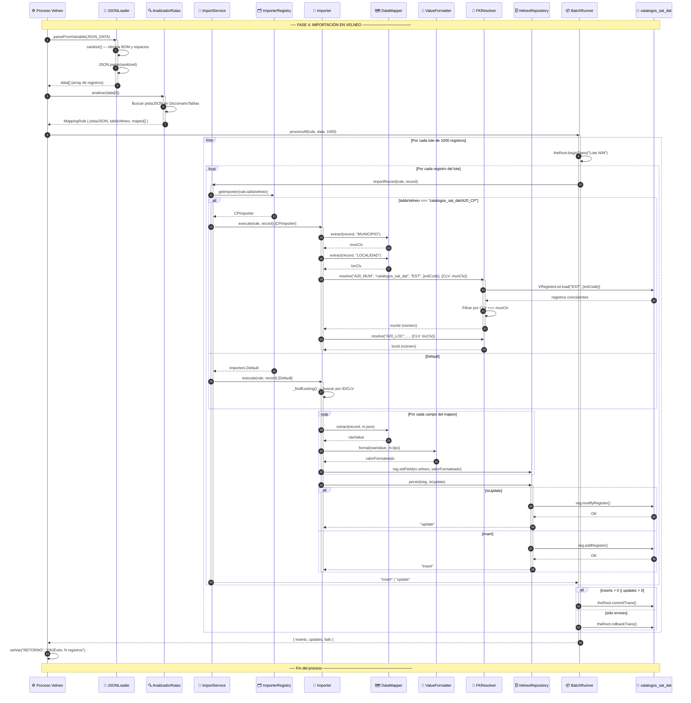

# ⏱️ Diagrama de Secuencia — Pipeline ETL SAT → Velneo

> **Tipo:** Sequence Diagram
> **Estándar:** UML 2.5
> **Objetivo:** Visualizar el flujo cronológico completo de datos desde los portales oficiales del SAT hasta la persistencia final en la base de datos DATTA ERP.

---

## Fase 1 — Sourcing y Normalización (Google Workspace)

---

## Fase 2 — Serialización y Almacenamiento en Drive

---

## Fase 3 — Importación en Velneo

---

## 📌 Notas de Arquitectura

| Aspecto | Observación |
|---------|------------|
| **Contrato de interfaz** | El archivo `.json` en Google Drive es el único punto de acoplamiento entre Workspace y Velneo. Un cambio en el esquema de cabeceras del XLSX rompe la cadena completa. |
| **Fallback de lectura** | El motor intenta primero `JSON_DATA` (variable en memoria); si está vacía, recurre a `SENDA_JSON` (ruta de archivo físico). Esto permite ejecución tanto vía API como manual. |
| **Transaccionalidad parcial** | Por diseño, se hace `commitTrans()` aunque existan fallos parciales dentro del lote. Los errores se acumulan en `metrics.fails` pero no bloquean los registros correctos. |
| **Detección de tabla** | `AnalizadorRutas` usa la primera clave JSON del primer registro como "pista". Si un JSON vacío o malformado llega al motor, lanza `Error` inmediato. |
