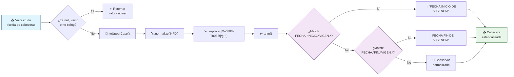

# 🔄 Diagrama de Actividad — Algoritmo de Normalización y Carga

> **Tipo:** Activity Diagram (Flowchart)
> **Estándar:** UML 2.5 / Mermaid.js
> **Objetivo:** Detallar la lógica algorítmica completa del pipeline ETL con decisiones, bucles y manejo de errores.

---

## Flujo Global del Pipeline ETL

```mermaid
flowchart TD
    START([🚀 Inicio del Proceso]) --> CHECK_UPDATE

    subgraph SOURCING["🌐 Capa Sourcing — Portal SAT"]
        CHECK_UPDATE{"¿Hay nueva versión\ndel catálogo SAT?"}
        DOWNLOAD["📥 Descargar XLSX\ndel portal oficial"]
        NO_ACTION["✅ Sin cambios\n(Catálogo vigente)"]
    end

    CHECK_UPDATE -- Sí --> DOWNLOAD
    CHECK_UPDATE -- No --> NO_ACTION
    NO_ACTION --> END_NO_ACTION([⏹️ Fin — Sin actualización])
    DOWNLOAD --> LOAD_SHEETS

    subgraph SHEETS["📊 Capa Ingesta — Google Sheets"]
        LOAD_SHEETS["📤 Importar XLSX\ncomo hoja en Spreadsheet"]
        VALIDATE_DATA{"¿La hoja contiene\ndatos (≥ 2 filas)?"}
        SKIP_SHEET["⚠️ Hoja vacía\n(se omite)"]
    end

    LOAD_SHEETS --> VALIDATE_DATA
    VALIDATE_DATA -- No --> SKIP_SHEET
    SKIP_SHEET --> END_EMPTY([⏹️ Fin — Sin datos])
    VALIDATE_DATA -- Sí --> NORM_HEADERS

    subgraph NORMALIZATION["🔤 Capa Lógica — HeaderNormalizer (AppScript)"]
        NORM_HEADERS["⚙️ Obtener cabeceras\nde fila 1"]
        TO_UPPER["🔡 toUpperCase()"]
        NFD["🔤 normalize('NFD')"]
        REMOVE_DIACRITICS["✂️ Eliminar diacríticos\n/[\u0300-\u036f]/g → ''"]
        TRIM["✂️ trim()"]
        CHECK_RULES{"¿Coincide con\nalguna RegEx de negocio?"}
        APPLY_RULE["✅ Aplicar replacement\nestandarizado"]
        KEEP_NORMALIZED["📝 Conservar valor\nnormalizado"]
        WRITE_HEADERS["💾 setValues(cabeceras\nnormalizadas)"]
    end

    NORM_HEADERS --> TO_UPPER --> NFD --> REMOVE_DIACRITICS --> TRIM --> CHECK_RULES
    CHECK_RULES -- Sí --> APPLY_RULE --> WRITE_HEADERS
    CHECK_RULES -- No --> KEEP_NORMALIZED --> WRITE_HEADERS
    WRITE_HEADERS --> PROCESS_ROWS

    subgraph SERIALIZATION["📦 Capa Lógica — DataTransformer + VelneoExporter (AppScript)"]
        PROCESS_ROWS["🔄 Iterar filas de datos\n(fila 2 en adelante)"]
        CHECK_ROW{"¿Fila tiene\ndatos (hasData)?"}
        BUILD_RECORD["📋 Construir objeto record{}"]
        CHECK_TYPE{"¿Tipo de valor?"}
        FORMAT_DATE["📅 Date → YYYY-MM-DD\n(ISO slice 0,10)"]
        FORMAT_BOOL["🔘 Boolean → '1' | '0'"]
        FORMAT_TEXT["📝 cleanText(display)\nnormalize('NFC')"]
        PUSH_RECORD["➕ records.push(record)"]
        CHECK_RECORDS{"¿records.length > 0?"}
        SAVE_JSON["💾 DriveService.saveJson()\n{hoja}.json en /catalogos"]
        SKIP_EMPTY_SHEET["⏭️ Hoja omitida\n(sin registros)"]
    end

    PROCESS_ROWS --> CHECK_ROW
    CHECK_ROW -- No --> PROCESS_ROWS
    CHECK_ROW -- Sí --> BUILD_RECORD
    BUILD_RECORD --> CHECK_TYPE
    CHECK_TYPE -- Date --> FORMAT_DATE --> PUSH_RECORD
    CHECK_TYPE -- Boolean --> FORMAT_BOOL --> PUSH_RECORD
    CHECK_TYPE -- String/Otro --> FORMAT_TEXT --> PUSH_RECORD
    PUSH_RECORD --> PROCESS_ROWS
    PROCESS_ROWS --> CHECK_RECORDS
    CHECK_RECORDS -- No --> SKIP_EMPTY_SHEET
    CHECK_RECORDS -- Sí --> SAVE_JSON --> IMPORT_START

    subgraph VELNEO_IMPORT["🗄️ Capa Persistencia — Motor Velneo"]
        IMPORT_START["🚀 Iniciar motor_importacion.js"]
        READ_JSON{"¿JSON_DATA\ntiene contenido?"}
        READ_FILE["📂 Leer desde SENDA_JSON\n(archivo físico)"]
        PARSE_JSON["🔍 JSONLoader.parseFromVariable()"]
        SANITIZE["🧹 Eliminar BOM (\uFEFF)\ny espacios extremos"]
        CHECK_PARSE{"¿JSON válido?"}
        PARSE_FALLBACK["⚠️ Fallback: eval()"]
        PARSE_ERROR["❌ Error: JSON inválido\nRETORNO = ERROR|..."]
        ANALYZE_RULE["🔍 AnalizadorRutas.analizar(data[0])\n→ Detectar pistaJSON"]
        FOUND_RULE{"¿Se encontró\nMappingRule?"}
        RULE_ERROR["❌ Error: Tabla no encontrada\nRETORNO = ERROR|..."]
        BATCH_LOOP["🔄 BatchRunner.processAll()\nlotes de 1000 registros"]
    end

    IMPORT_START --> READ_JSON
    READ_JSON -- Sí --> SANITIZE
    READ_JSON -- No --> READ_FILE --> SANITIZE
    SANITIZE --> PARSE_JSON
    PARSE_JSON --> CHECK_PARSE
    CHECK_PARSE -- Error --> PARSE_FALLBACK
    PARSE_FALLBACK --> CHECK_PARSE
    CHECK_PARSE -- Error Final --> PARSE_ERROR --> END_ERROR([❌ Fin — Error])
    CHECK_PARSE -- OK --> ANALYZE_RULE
    ANALYZE_RULE --> FOUND_RULE
    FOUND_RULE -- No --> RULE_ERROR --> END_ERROR
    FOUND_RULE -- Sí --> BATCH_LOOP

    subgraph BATCH["⚙️ Procesamiento por Lotes"]
        BEGIN_TRANS["🔒 beginTrans('Lote N/M')"]
        RECORD_LOOP["🔄 Procesar registro"]
        GET_IMPORTER{"¿Tabla es\nA20_CP?"}
        CP_IMPORTER["🔗 CPImporter:\nResolución FK MUN + LOC"]
        DEFAULT_IMPORTER["📋 Default:\nMapeo directo"]
        FIND_EXISTING{"¿Registro existe\npor ID/CLV?"}
        DO_UPDATE["🔄 modifyRegister()\n→ UPDATE"]
        DO_INSERT["➕ addRegister()\n→ INSERT"]
        RECORD_OK["✅ metrics.inserts++\no metrics.updates++"]
        RECORD_FAIL["⚠️ metrics.fails++\n(error capturado)"]
        CHECK_BATCH_RESULT{"¿inserts > 0\no updates > 0?"}
        COMMIT["✅ commitTrans()"]
        ROLLBACK["↩️ rollbackTrans()"]
        MORE_BATCHES{"¿Más lotes?"}
    end

    BATCH_LOOP --> BEGIN_TRANS --> RECORD_LOOP
    RECORD_LOOP --> GET_IMPORTER
    GET_IMPORTER -- Sí --> CP_IMPORTER --> FIND_EXISTING
    GET_IMPORTER -- No --> DEFAULT_IMPORTER --> FIND_EXISTING
    FIND_EXISTING -- Existe --> DO_UPDATE --> RECORD_OK --> RECORD_LOOP
    FIND_EXISTING -- Nuevo --> DO_INSERT --> RECORD_OK --> RECORD_LOOP
    RECORD_LOOP -- Error --> RECORD_FAIL --> RECORD_LOOP
    RECORD_LOOP -- Lote completo --> CHECK_BATCH_RESULT
    CHECK_BATCH_RESULT -- Sí --> COMMIT --> MORE_BATCHES
    CHECK_BATCH_RESULT -- No --> ROLLBACK --> MORE_BATCHES
    MORE_BATCHES -- Sí --> BEGIN_TRANS
    MORE_BATCHES -- No --> RETURN_RESULT

    subgraph RESULT["📊 Resultado Final"]
        RETURN_RESULT["📤 setVar('RETORNO',\n'OK|Éxito: N reg\n(Nuevos: X, Act: Y)')"]
        REPORT_ERRORS["⚠️ Agregar '| Errores: Z'\nsi fails > 0"]
    end

    RETURN_RESULT --> REPORT_ERRORS --> END_OK([✅ Fin — Importación completada])

    style SOURCING fill:#fce4ec,stroke:#c62828,color:#333
    style SHEETS fill:#e1f5fe,stroke:#01579b,color:#333
    style NORMALIZATION fill:#fff3e0,stroke:#e65100,color:#333
    style SERIALIZATION fill:#fff3e0,stroke:#e65100,color:#333
    style VELNEO_IMPORT fill:#e8f5e9,stroke:#1b5e20,color:#333
    style BATCH fill:#f3e5f5,stroke:#4a148c,color:#333
    style RESULT fill:#e8f5e9,stroke:#1b5e20,color:#333
```



---

## 🔍 Detalle: Algoritmo HeaderNormalizer



---

## 🔍 Detalle: Algoritmo FKResolver (A20_CP)

```mermaid
flowchart TD
    START_FK["🔗 CPImporter.execute()"] --> EXTRACT_EST
    EXTRACT_EST["📋 Extraer ESTADO, MUNICIPIO, LOCALIDAD"] --> RESOLVE_MUN

    RESOLVE_MUN["FKResolver.resolve('A20_MUN', 'catalogos_sat_dat', 'EST', [estCode], {CLV: munClv})"] --> LOAD_INDEX
    LOAD_INDEX["VRegisterList.load('EST', [estCode])"] --> FOUND_MUN{"¿Carga exitosa?"}
    FOUND_MUN -- No --> MUN_NULL["munId = null"]
    FOUND_MUN -- Sí --> FILTER_MUN["Iterar registros\nFiltrar: fieldToString('CLV') === munClv"]
    FILTER_MUN --> MUN_MATCH{"¿Match?"}
    MUN_MATCH -- Sí --> MUN_ID["munId = reg.fieldToDouble('ID')"]
    MUN_MATCH -- No (todos) --> MUN_NULL
    MUN_NULL --> CHECK_MUN_NULL{"¿munClv !== null\ny munId === null?"}
    CHECK_MUN_NULL -- Sí --> THROW_MUN["❌ throw Error\n'MUN no encontrado'"]
    CHECK_MUN_NULL -- No --> RESOLVE_LOC

    MUN_ID --> RESOLVE_LOC
    RESOLVE_LOC["FKResolver.resolve('A20_LOC', ...)"] --> LOC_RESULT{"¿locId?"}
    LOC_RESULT -- null + locClv → "❌ Error LOC"
    LOC_RESULT -- OK --> SET_FIELDS

    SET_FIELDS["reg.setField('MUN', munId)\nreg.setField('LOC', locId)"] --> PERSIST["VelneoRepository.persist()"]

    style THROW_MUN fill:#fce4ec,stroke:#c62828
    style RESOLVE_MUN fill:#f3e5f5,stroke:#4a148c
    style RESOLVE_LOC fill:#f3e5f5,stroke:#4a148c
    style SET_FIELDS fill:#e8f5e9,stroke:#1b5e20
```

---

## 📌 Notas de Arquitectura

> **[IA] Cuello de botella potencial:** La función `FKResolver.resolve()` realiza una carga completa del índice `EST` y un filtrado lineal en memoria. Para catálogos con miles de municipios agrupados por estado, esto puede generar múltiples llamadas costosas a la API de Velneo. Se recomienda implementar un caché en memoria (`Map`) durante el batch para evitar consultas repetidas con el mismo par `(estCode, munClv)`.

> **[IA] Riesgo de desincronización:** Si el SAT actualiza el esquema de columnas de un XLSX (renombrando o reordenando cabeceras), el `HeaderNormalizer` sólo cubre dos casos de negocio explícitos (fechas de vigencia). Cualquier columna nueva o renombrada pasará al JSON con el nombre crudo normalizado, lo que puede romper silenciosamente el mapeo en `DiccionarioTablas`.

> **[IA] Escalabilidad:** El patrón Strategy (`Importers.Default` / `Importers.CPImporter`) y el Registry (`ImporterRegistry`) permiten agregar nuevos importadores especializados (e.g., para Comercio Exterior) sin modificar el motor central. Es la única ruta correcta para extender el sistema.
