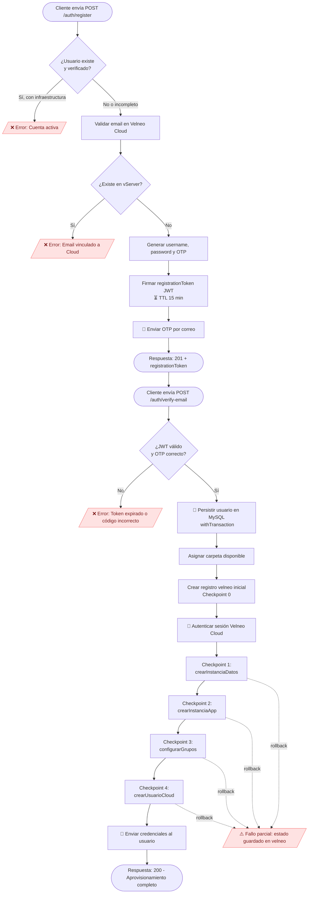
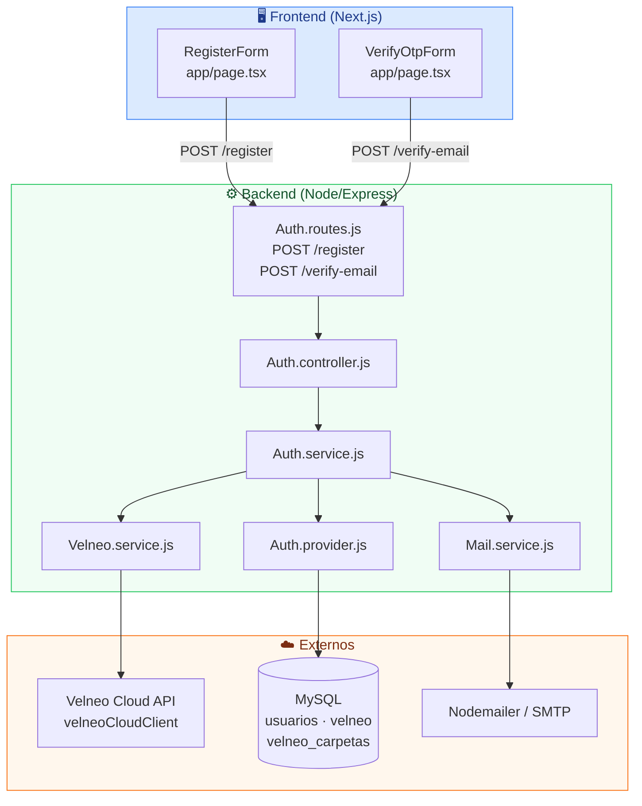
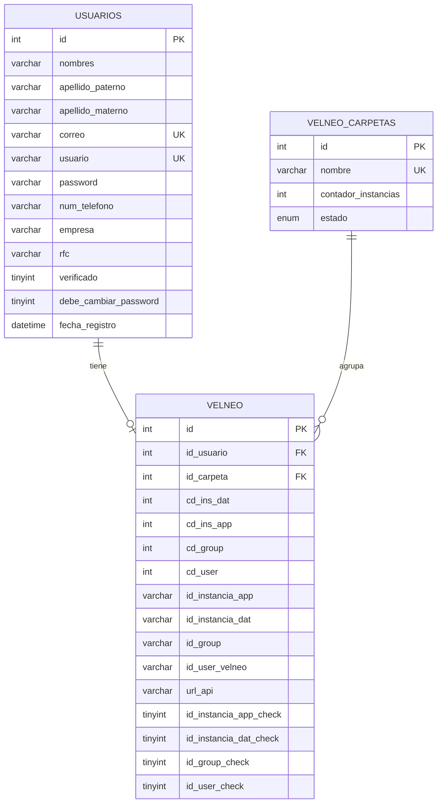
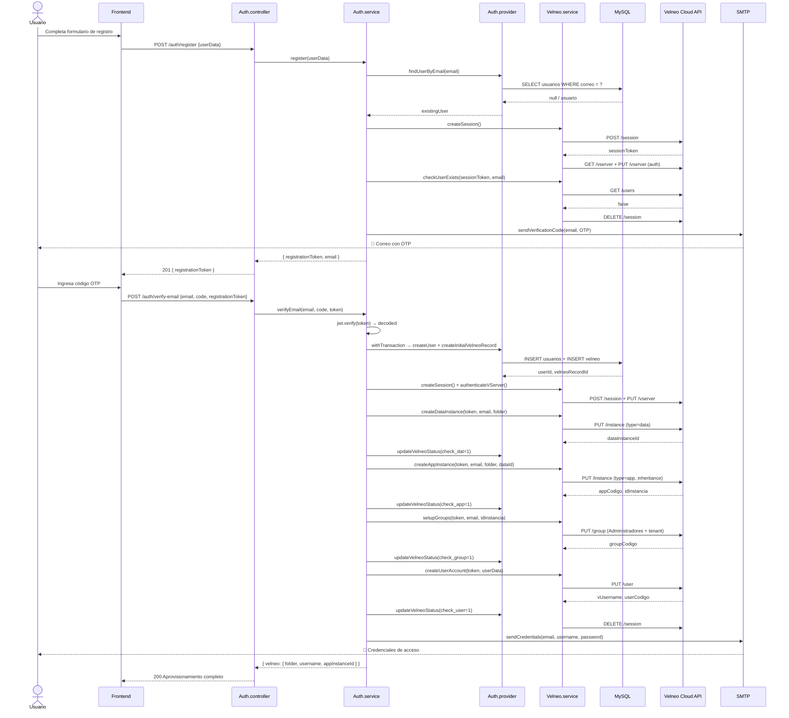

# 📋 Módulo: Registro y Aprovisionamiento de Instancias Velneo

> **Responsabilidad:** Orquesta el ciclo de vida completo de un nuevo suscriptor SaaS — desde la validación de identidad (stateless con OTP) hasta el aprovisionamiento automatizado de instancias de datos, aplicación, grupos de seguridad y cuenta de usuario en Velneo Cloud.
>
> **Fuera de scope:** Gestión de sesiones activas, renovación de tokens, administración de carpetas en el servidor Velneo (debe ser manual).

---

## 📁 Archivos Clave

| Capa | Archivo | Responsabilidad |
|---|---|---|
| Ruta | `Backend/src/modules/Auth/routes/Auth.routes.js` | Define los endpoints HTTP públicos del flujo |
| Controlador | `Backend/src/modules/Auth/controllers/Auth.controller.js` | Valida entradas y mapea respuestas HTTP |
| Servicio | `Backend/src/modules/Auth/services/Auth.service.js` | Orquestador principal de la lógica de negocio |
| Proveedor | `Backend/src/modules/Auth/providers/Auth.provider.js` | Acceso y persistencia en MySQL (usuarios, velneo, carpetas) |
| Infraestructura | `Backend/src/modules/Velneo/services/Velneo.service.js` | Integración con el API REST de Velneo Cloud |

---

## 1. Flujo Principal



---

## 2. Arquitectura de Capas



---

## 3. Esquema de Base de Datos



---

## 4. Contrato de API

### `POST /backend/auth/register`

Inicia el flujo de registro. **No persiste al usuario.** Solo valida y envía el OTP.

| Campo | Tipo | Requerido | Descripción |
|---|---|---|---|
| `firstName` | `string` | ✅ | Nombre(s) del usuario |
| `lastNameP` | `string` | ✅ | Apellido paterno |
| `lastNameM` | `string` | ❌ | Apellido materno |
| `email` | `string` | ✅ | Correo institucional (único) |
| `phone` | `string` | ❌ | Teléfono de contacto |
| `company` | `string` | ❌ | Empresa |
| `rfc` | `string` | ❌ | RFC del cliente |

**Respuesta exitosa `201`:**
```json
{
  "success": true,
  "message": "Código de verificación enviado al correo",
  "data": {
    "email": "usuario@empresa.com",
    "registrationToken": "<JWT>",
    "verificationRequired": true
  }
}
```

**Errores controlados `400`:**
```json
{ "success": false, "message": "Este correo ya tiene una cuenta activa y configurada." }
{ "success": false, "message": "El correo ya está vinculado a una cuenta en Velneo Cloud." }
```

---

### `POST /backend/auth/verify-email`

Valida el OTP, persiste al usuario y aprovisiona toda la infraestructura Cloud.

| Campo | Tipo | Requerido | Descripción |
|---|---|---|---|
| `email` | `string` | ✅ | Correo a verificar |
| `code` | `string` | ✅ | OTP de 6 dígitos recibido por correo |
| `registrationToken` | `string` | ✅ | JWT devuelto en el paso anterior |

**Respuesta exitosa `200`:**
```json
{
  "success": true,
  "message": "Correo verificado e infraestructura aprovisionada",
  "data": {
    "email": "usuario@empresa.com",
    "velneo": {
      "success": true,
      "folder": "clientes01",
      "username": "juan.perez123",
      "appInstanceId": 42,
      "dataInstanceId": "INS_DAT_001"
    }
  }
}
```

**Errores controlados `400`:**
```json
{ "success": false, "message": "El tiempo para verificar ha expirado. Regístrate de nuevo." }
{ "success": false, "message": "El código de verificación es incorrecto" }
```

---

## 5. Diagrama de Secuencia — Aprovisionamiento Cloud



---

## 6. Mecanismo de Checkpoints (Idempotencia)

El flujo de aprovisionamiento utiliza un sistema de **Checkpoints** que permite reanudar un proceso fallido sin duplicar recursos en Velneo Cloud.

| Checkpoint | Campo en `velneo` | Verifica |
|---|---|---|
| `0` | Registro inicial creado | `id_usuario` presente |
| `1` | Instancia de Datos | `id_instancia_dat_check = 1` |
| `2` | Instancia de Aplicación | `id_instancia_app_check = 1` |
| `3` | Grupo de Seguridad | `id_group_check = 1` |
| `4` | Usuario Cloud | `id_user_check = 1` |

> ⚠️ **Anti-patrón detectado:** Si el proceso falla en el Checkpoint 2 o posterior, la sesión Velneo Cloud sigue activa hasta el bloque `finally`. En un volumen alto de registros concurrentes, esto puede agotar el número de sesiones simultáneas permitidas por la API. Se recomienda evaluar un mecanismo de cola (BullMQ) para serializar el aprovisionamiento.

---

## 7. Lógica de Asignación de Carpetas

Las instancias de Velneo se organizan en **carpetas físicas** del servidor. El sistema aplica la siguiente lógica:

1. Consulta `velneo_carpetas` en MySQL buscando una con `estado = 'disponible'`.
2. Si no existe en DB, consulta la API de Velneo Cloud filtrando carpetas con prefijo `VELNEO_BASE_FOLDER_NAME`.
3. Una carpeta se marca como `'llena'` al alcanzar **10 instancias** (`MAX_INSTANCES_PER_FOLDER`).
4. Las carpetas **nunca se crean automáticamente** — deben ser provisionadas manualmente en el servidor.

> ⚠️ **Punto de fallo manual:** Si todas las carpetas están llenas y no existe una nueva creada en el servidor, el proceso lanza una excepción no recuperable.

---

## 8. Seguridad

| Control | Implementación |
|---|---|
| Verificación de identidad | OTP de 6 dígitos con TTL de 15 min (JWT firmado con `JWT_SECRET`) |
| Contraseña en tránsito | Generada automáticamente, hasheada con `bcrypt` (10 salt rounds) antes de persistir en MySQL |
| Contraseña en Cloud | Se transmite en texto plano al API de Velneo Cloud — **tráfico debe ser HTTPS** |
| Doble validación | El email se verifica tanto en MySQL local como en el vServer de Velneo Cloud antes de proceder |
| Credenciales de Cloud | Se leen exclusivamente de variables de entorno (`.env`) — nunca hardcodeadas |

---

## 9. Variables de Entorno Requeridas

| Variable | Uso |
|---|---|
| `JWT_SECRET` | Firma y verificación de tokens de registro y sesión |
| `VELNEO_CLOUD_EMAIL` | Cuenta administradora para crear sesiones en el API de Velneo |
| `VELNEO_VSERVER_USER` | Usuario del vServer para el handshake de autenticación |
| `VELNEO_VSERVER_PASSWORD` | Contraseña del vServer |
| `VELNEO_BASE_FOLDER_NAME` | Prefijo de las carpetas de clientes (ej. `cloud`) |
| `VELNEO_SOLUTION` | Identificador de la solución Velneo desplegada |
| `VELNEO_DATA_PROJECT` | Proyecto de datos a instanciar |
| `VELNEO_APP_PROJECT` | Proyecto de aplicación a instanciar |
| `VELNEO_APP_VCD` | Identificador VCD para la herencia de la instancia de app |

---

## 📊 Resumen del Módulo

| Métrica | Valor |
|---|---|
| Endpoints documentados | 2 (`/register`, `/verify-email`) |
| Entidades en el ER | 3 (`usuarios`, `velneo`, `velneo_carpetas`) |
| Pasos en el flujo principal | 12 |
| Servicios externos | 2 (Velneo Cloud API, SMTP) |
| Checkpoints de idempotencia | 4 |
| TTL del token de registro | 15 minutos |
