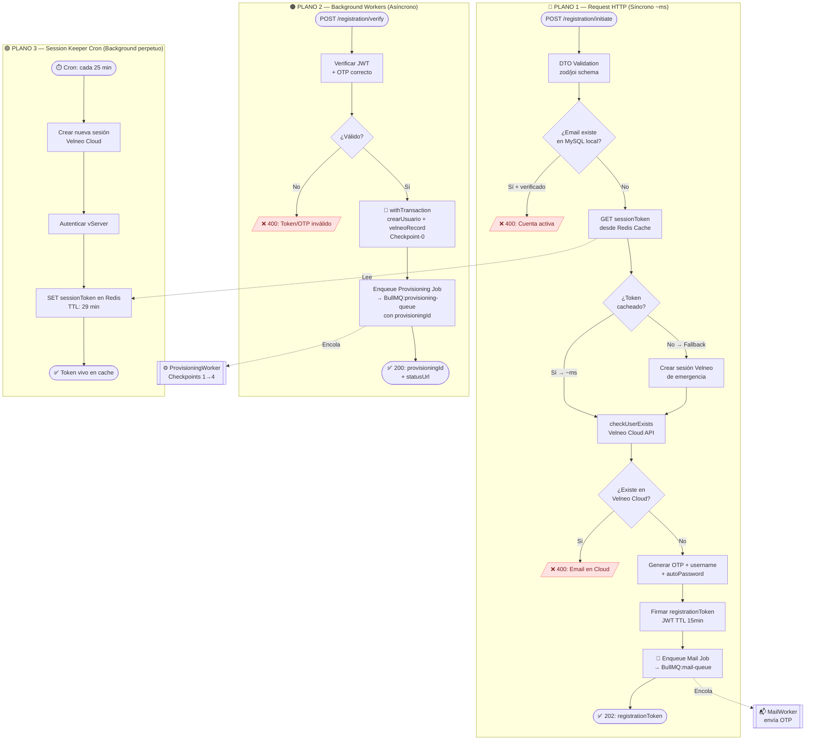
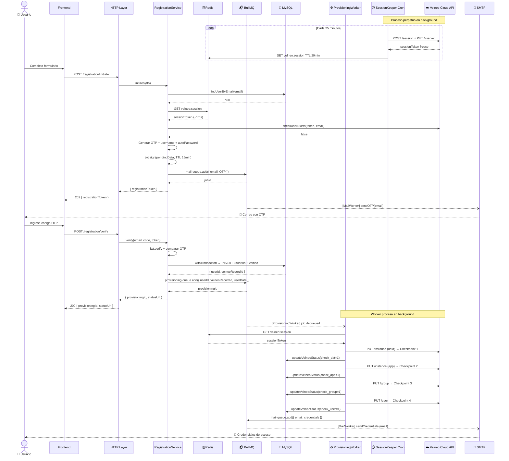
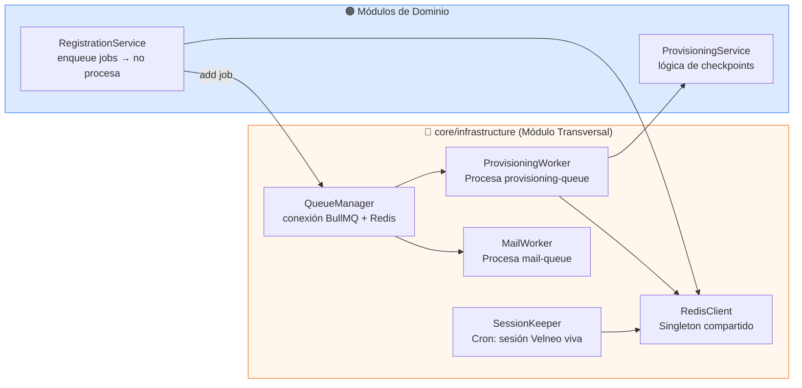

# FASE 2 — Flujo Principal UML
> Módulo: **Registro de Instancias Velneo + Usuario**
> Arquitectura: Híbrida con 3 Planos de Ejecución — Redis + BullMQ + SessionKeeper Cron

---

## Arquitectura: 3 Planos de Ejecución

---

## Diagrama de Secuencia — Flujo Completo Multi-Actor

---

## Módulo Transversal: `core/infrastructure/` — Workers Aislados

---

## Decisiones de Diseño Clave

| Decisión | Elección | Razón |
|---|---|---|
| Cola de trabajos | **BullMQ** (sobre Redis) | Mismo Redis para session cache + queue; menos infra |
| Retry automático | BullMQ `attempts: 3, backoff: exponential` | Recupera checkpoints fallidos sin intervención manual |
| Session Keeper | **Cron cada 25 min** (TTL Redis: 29 min) | Margen de seguridad sin dejar el token expirar |
| Fallback de sesión | Crear sesión de emergencia si Redis falla | El `/initiate` nunca cae por ausencia del cron |
| Workers | **Procesos aislados** en `core/workers/` | No bloquean el event loop del servidor HTTP |

> 🔴 **Punto crítico:** Si Redis cae, el cron pierde el token cacheado y el fallback entra en juego creando sesiones directas a Velneo Cloud. Redis debe monitorearse como servicio crítico.
