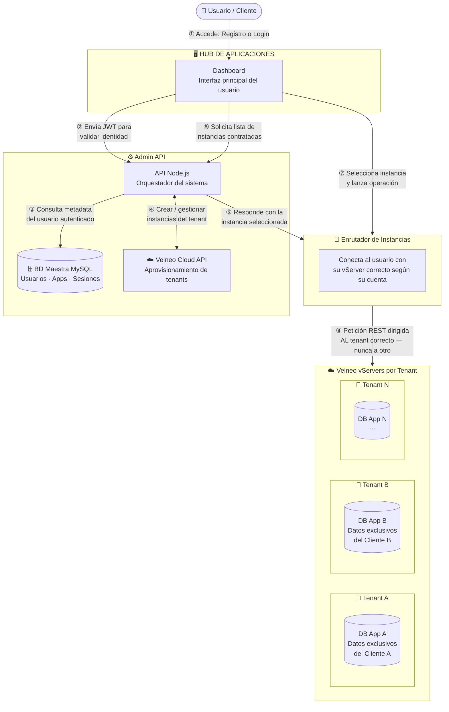
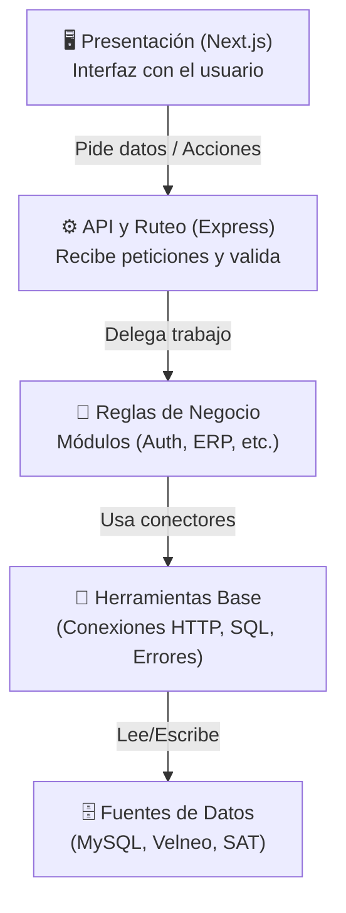
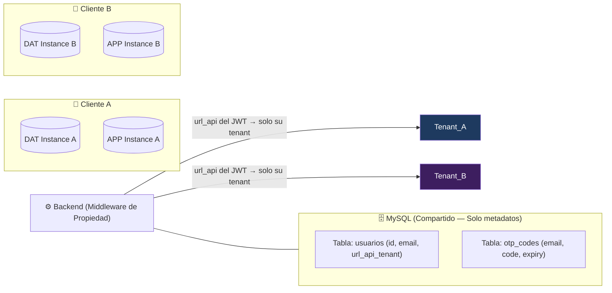
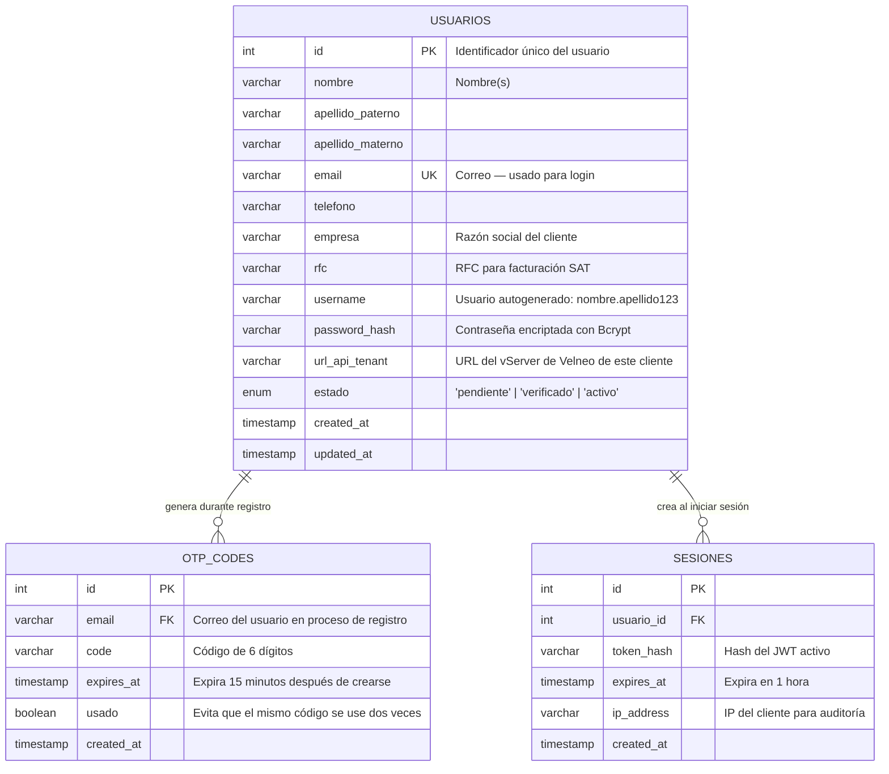

# 🏗️ Planificación del Proyecto: Datta-Erp

Este documento detalla la arquitectura, el stack tecnológico y la estrategia de implementación para el ecosistema **Datta-Erp**, un sistema de gestión empresarial (ERP) moderno construido con una arquitectura híbrida que aprovecha la velocidad de Node.js/Next.js y la robustez de Velneo Cloud.

---

## 🗺️ Vista General: Cómo Funciona el Sistema de Principio a Fin

> **¿Cómo leer este diagrama?**
> Sigue los números del `1` al `8`. Cada número es un "mensaje" que viaja de un bloque a otro.
> Los bloques con fondo de color son **zonas separadas** del sistema que tienen una responsabilidad distinta.
>
> *Piénsalo como un aeropuerto:*
> - El **Hub (Dashboard)** es la sala de espera donde el pasajero (usuario) interactúa.
> - El **Plano de Control** es la torre de control que valida tickets y dirige el tráfico.
> - El **Inyector** es la puerta de embarque que conecta al pasajero con su avión específico.
> - Los **vServers** son los aviones: cada cliente tiene el suyo, y nunca se mezclan.



### Qué pasa en cada paso

| Paso | ¿Qué ocurre? | ¿Quién lo hace? |
| :---: | :--- | :--- |
| **①** | El usuario entra al Dashboard con su correo y contraseña (o se registra por primera vez) | Frontend (Next.js) |
| **②** | El Dashboard envía el token JWT al servidor para verificar que la sesión es legítima | Backend (Express) |
| **③** | El servidor consulta en la BD Maestra los datos del usuario y sus aplicaciones contratadas | MySQL (BD local) |
| **④** | Si es un registro nuevo, el Plano de Control crea las instancias del cliente en Velneo Cloud | Velneo Cloud API |
| **⑤** | El Dashboard pide al servidor la lista de instancias ERP disponibles para ese usuario | Backend → MySQL |
| **⑥** | El servidor responde con la instancia a usar y el Inyector se prepara para la conexión | Inyector Dinámico |
| **⑦** | El usuario selecciona su empresa/módulo y el Dashboard lanza la operación al Inyector | Frontend → Inyector |
| **⑧** | El Inyector dirige la petición al vServer **exacto** del cliente — aislado del resto | Velneo vServer |

> 🔒 **Garantía de aislamiento:** Un usuario del Tenant A **nunca puede ver ni modificar** datos del Tenant B. El Inyector valida el JWT en cada petición antes de conectar.

---

## 📖 Glosario: Las Palabras Clave Explicadas Sin Tecnicismos

> *Si un cliente no entiende cómo se guardan sus datos, la arquitectura no es lo suficientemente transparente.*

Antes de entrar en detalles técnicos, aquí están los conceptos que aparecen en todo este documento, explicados como si se los contaras a alguien que nunca ha programado.

| Término técnico | ¿Qué significa en realidad? |
| :--- | :--- |
| **Multi-tenant** | *El edificio de apartamentos:* el sistema es el edificio, cada empresa cliente es un inquilino con su propia puerta y llave. Comparten el edificio pero nadie puede entrar al apartamento del vecino. |
| **Velneo Cloud** | Una plataforma empresarial española especializada en ERP. Funciona como el "motor de contabilidad y operaciones" del sistema. Cada cliente tiene su propia instancia (su propio motor) completamente aislada. |
| **vServer / Instancia** | El "apartamento" de cada cliente en Velneo Cloud. Contiene toda su base de datos, configuraciones y lógica de negocio. Crear una instancia es como asignarle un apartamento nuevo a un inquilino. |
| **Inyector Dinámico** | El "portero inteligente" del edificio. Cuando un usuario autenticado hace una operación, el Inyector lee su credencial (JWT) y lo dirige al apartamento correcto — nunca al del vecino. Es el middleware que enruta cada petición al vServer del tenant que corresponde. |
| **JWT (Token)** | Una "pulsera de evento": cuando el usuario inicia sesión, el sistema le entrega una pulsera digital firmada. En cada petición, el sistema lee esa pulsera para saber quién es y a qué tiene acceso, sin preguntar la contraseña de nuevo. Expira en 1 hora. |
| **BD Maestra (MySQL)** | La "recepción del edificio": guarda el directorio de todos los inquilinos (usuarios, sus correos, y la URL de su instancia Velneo). No guarda datos contables ni empresariales, solo metadatos de gestión. |
| **OTP (Código de verificación)** | Un código de 6 dígitos que el sistema envía al correo del usuario para confirmar que la dirección es real. Funciona como el código SMS de un banco: expira en 15 minutos y solo se puede usar una vez. |
| **Aprovisionamiento** | El proceso automático de "preparar el apartamento": crear la carpeta del tenant, sus instancias de datos y aplicación en Velneo, el grupo de seguridad y el usuario. Se ejecuta una sola vez cuando un nuevo cliente se registra. |
| **Pool de Conexiones** | En lugar de abrir y cerrar una puerta a la base de datos en cada petición (lento), se mantienen 10 puertas abiertas y listas. Cuando llega una petición, toma una puerta disponible, la usa y la devuelve al grupo. |
| **Middleware** | Un "guardia de seguridad" que revisa cada petición antes de que llegue al destino. Por ejemplo: verifica que el token sea válido, que el usuario no esté haciendo demasiadas peticiones, o que los datos tengan el formato correcto. |

---

## 🧠 FASE 1: Stack Tecnológico Verificado

### 1. Visión General
**Datta-Erp** es un sistema ERP SaaS multi-tenant que combina la velocidad de Node.js/Next.js con la robustez de Velneo Cloud. Cada cliente empresarial opera en su propio entorno aislado de datos. El sistema resuelve un problema clave para empresas mexicanas: **tener un ERP profesional conectado al SAT, con sus datos completamente separados de otros clientes, sin comprar infraestructura propia.**

### 2. Stack Real (auditado del código)

| Componente | Tecnología | Estado |
| :--- | :--- | :--- |
| **Backend** | Node.js (Express 5.x) + ES Modules | ✅ Activo |
| **Frontend** | Next.js 16 + React 19 + TypeScript | ✅ Activo |
| **Estilos** | Tailwind CSS 4 | ✅ Activo |
| **BD Principal** | Velneo Cloud (instancias DAT/APP por tenant) | ✅ Activo |
| **BD Local** | MySQL (`mysql2/promise`, Pool de 10 cx) | ✅ Activo |
| **Tiempo Real** | Socket.io *(configurado, pendiente de módulo)* | ⏳ Pendiente |
| **Gestor de paquetes** | pnpm (workspace monorepo) | ✅ Activo |

### 3. Librerías Verificadas en el Código

#### Backend (`/backend`)
| Librería | ¿Para qué la usamos aquí? |
| :--- | :--- |
| `express 5.x` | Servidor HTTP principal |
| `mysql2/promise` | Pool de conexiones async a MySQL |
| `axios` | Cliente HTTP para Velneo Cloud y SAT |
| `https` (Node built-in) | Agente HTTPS con Keep-Alive para Velneo |
| `dotenv` | Carga de variables de entorno |
| `cors`, `cookie-parser` | Seguridad de peticiones y cookies |
| `morgan` | Logging de peticiones (solo en desarrollo) |
| `helmet` | Seguridad de headers HTTP |
| `express-rate-limit` | Límite de intentos (100 req/15 min) |

#### Frontend (`/frontend`)
| Librería | ¿Para qué la usamos aquí? |
| :--- | :--- |
| `next 16` + `react 19` | Framework UI con App Router |
| `typescript 5` + `tailwindcss 4` | Tipado y estilos |
| `lucide-react` | Iconos (Rocket, Shield, BarChart3, etc.) |

> ⚠️ **Detección de cambio:** Las librerías `jsonwebtoken`, `bcrypt`, `nodemailer`, `zod`, `@tanstack/react-query`, `react-hook-form` y `jspdf` están en el Blueprint de diseño pero **aún no están instaladas en `package.json`**. Se instalarán cuando se construyan los módulos correspondientes.

---

## 📊 FASE 2: Arquitectura Real del Proyecto

### 1. Diagrama de Capas Lógicas

> *Este diagrama muestra cómo se divide el trabajo en el código de forma conceptual, sin listar cada archivo.*



### 2. Estructura de Carpetas Real

#### 📂 Backend (`/backend`)
```text
backend/
├── app.js              ✅ Orquestador (CORS, Helmet, Morgan, Rutas)
├── routes.js           ✅ Router principal (vacío — esperando módulos)
├── server.js           ✅ Punto de entrada HTTP
├── package.json        ✅ Express 5 + pnpm
├── src/
│   ├── config/
│   │   ├── database.js       ✅ Pool MySQL (10 conexiones, async/await)
│   │   └── httpClients.js    ✅ Axios Factory (Velneo Cloud + SAT)
│   ├── core/
│   │   ├── database/
│   │   │   ├── baseHttp.provider.js   ✅ Clase base para HTTP
│   │   │   ├── baseSql.provider.js    ✅ Clase base para MySQL
│   │   │   └── transactionSql.js     ✅ Soporte de transacciones SQL
│   │   ├── errors/
│   │   │   ├── AppError.js           ✅ Error base del sistema
│   │   │   ├── DatabaseError.js      ✅ Errores de BD
│   │   │   ├── NotFoundError.js      ✅ Recurso no encontrado
│   │   │   └── ValidationError.js   ✅ Datos inválidos
│   │   └── socket/                  ⏳ Socket.io (pendiente)
│   ├── middlewares/
│   │   ├── index.js                 ✅ Exportador central
│   │   ├── error.middleware.js      ✅ Manejo global de errores
│   │   ├── rateLimit.middleware.js  ✅ 100 req / 15 min
│   │   └── security.middleware.js  ✅ Helmet
│   ├── modules/                     ⏳ VACÍO — Próximo a desarrollar
│   └── services/
│       ├── Velneo.service.js        ✅ Ciclo de vida tenant en Velneo Cloud
│       └── Mail.service.js         ✅ Motor de correos
```

#### 📂 Frontend (`/frontend`)
```text
frontend/
├── app/
│   ├── layout.tsx       ✅ Layout raíz con fuentes y metadatos
│   ├── page.tsx         ✅ Landing Page — Hero + Features + Modal
│   └── login/
│       └── page.tsx     ✅ Página de Login
├── components/          ⏳ VACÍO — Componentes UI por crear
├── modules/             ⏳ VACÍO — Módulos de dominio por crear
├── hooks/               ⏳ VACÍO
├── providers/           ⏳ VACÍO — Auth, Query, Theme providers
└── types/               ⏳ VACÍO
```

---

## 🔐 FASE 3: Seguridad y Aislamiento de Datos

### Aislamiento Multi-tenant (Cómo protegemos los datos de cada cliente)

> *Imagina que cada cliente es un inquilino: tiene su propio candado (instancia Velneo), y el portero del edificio (el middleware del backend) solo le abre la puerta de su apartamento, nunca del vecino.*



### Capas de Seguridad Implementadas

| Capa | Implementación | Archivo |
| :--- | :--- | :--- |
| **Headers HTTP** | Helmet middleware | `security.middleware.js` |
| **Rate Limiting** | 100 req / 15 min / IP | `rateLimit.middleware.js` |
| **CORS Dinámico** | Solo orígenes en `CLIENT_URL` | `app.js` |
| **Errores Controlados** | Jerarquía `AppError` → 4 tipos | `core/errors/` |
| **Pool de BD** | `waitForConnections: true`, 10 cx máx | `config/database.js` |
| **HTTPS Resiliente** | Keep-Alive + timeout 30s + retry | `config/httpClients.js` |

### Resiliencia de Velneo Cloud

> *Si el servidor de Velneo Cloud no responde, el interceptor de Axios registra el error y el sistema devuelve una respuesta controlada. Se implementan 3 reintentos implícitos vía el agente HTTPS Keep-Alive antes de fallar.*

---

## 🚦 Estado por Módulo (Checklist Real)

| Módulo | Backend | Frontend | Documentación |
| :--- | :---: | :---: | :---: |
| **Infraestructura Base** | ✅ Listo | ✅ Listo | ✅ Este Blueprint |
| **Módulo Auth / Registro** | ⏳ Pendiente | ⏳ Pendiente | ✅ `Registro_Plan.md` |
| **Dashboard ERP** | ⏳ Pendiente | ⏳ Pendiente | — |
| **Catálogos SAT** | ⏳ Pendiente | ⏳ Pendiente | — |
| **Socket.io Tiempo Real** | ⏳ Pendiente | ⏳ Pendiente | — |

---

## ⚙️ Variables de Entorno Requeridas

> *Piensa en las variables de entorno como las "llaves maestras" del sistema: sin ellas, el servidor no sabe a qué base de datos conectarse, ni cómo hablar con Velneo, ni cómo enviar correos. Nunca se guardan en el código — viven en un archivo `.env` privado que cada desarrollador configura en su máquina.*

Para arrancar el proyecto por primera vez, copia el archivo `.env.example` del backend y rellena cada valor:

```bash
cp backend/.env.example backend/.env
```

### Variables del Backend

| Variable | Grupo | ¿Para qué sirve? | Ejemplo |
| :--- | :---: | :--- | :--- |
| `PORT` | Servidor | Puerto donde corre Express | `3000` |
| `NODE_ENV` | Servidor | Modo de ejecución (activa/desactiva logs) | `development` |
| `CLIENT_URL` | Seguridad | Dominio del frontend permitido por CORS | `http://localhost:3001` |
| `JWT_SECRET` | Seguridad | Clave secreta para firmar las "pulseras JWT" — debe ser larga y aleatoria | `mi_clave_super_secreta_2026` |
| `VELNEO_CLOUD` | Velneo | URL base de la API de administración de Velneo Cloud | `https://cloudapi.velneo.com/v1` |
| `VELNEO_CLOUD_EMAIL` | Velneo | Correo del administrador de la cuenta Velneo Cloud | `admin@empresa.com` |
| `VELNEO_CLOUD_APIKEY` | Velneo | API Key de autenticación con Velneo Cloud | `abc123...` |
| `VELNEO_VSERVER_USER` | Velneo | Usuario del vServer para autenticación avanzada | `vserver_admin` |
| `VELNEO_VSERVER_PASSWORD` | Velneo | Contraseña del vServer | `password_seguro` |
| `VELNEO_BASE_FOLDER_NAME` | Velneo | Prefijo de carpetas donde se crean los tenants | `cloud` |
| `VELNEO_SOLUTION` | Velneo | Nombre de la solución ERP en Velneo | `DATTA ERP` |
| `VELNEO_DATA_PROJECT` | Velneo | Nombre del proyecto de datos (`.vcd`) | `datta_erp_dat` |
| `VELNEO_APP_PROJECT` | Velneo | Nombre del proyecto de aplicación (`.vcd`) | `datta_erp_app` |
| `VELNEO_APP_VCD` | Velneo | Alias del esquema VCD para herencia de la app | `alias_esquema.vcd` |
| `DB_HOST` | MySQL | Servidor de la base de datos local | `localhost` |
| `DB_USER` | MySQL | Usuario de MySQL | `root` |
| `DB_PASSWORD` | MySQL | Contraseña de MySQL | `mi_password` |
| `DB_NAME` | MySQL | Nombre de la base de datos maestra | `DattaErp` |
| `DB_PORT` | MySQL | Puerto de MySQL | `3306` |
| `MAIL_HOST` | Correo | Servidor SMTP para envío de correos | `smtp.gmail.com` |
| `MAIL_PORT` | Correo | Puerto SMTP (587=TLS, 465=SSL) | `587` |
| `MAIL_USER` | Correo | Correo remitente del sistema | `noreply@empresa.com` |
| `MAIL_PASS` | Correo | Contraseña de aplicación del correo | `app_password` |
| `MAIL_FROM` | Correo | Nombre y dirección que ve el destinatario | `"Datta ERP <noreply@empresa.com>"` |
| `CATALOGO_SAT_API_URL` | SAT | URL de la API de catálogos fiscales del SAT | `https://c6.velneo.com:16992/catalogos_sat/` |

> ⚠️ **Regla de Oro:** Nunca subas el archivo `.env` real al repositorio. El `.gitignore` ya lo excluye. Si necesitas compartir una configuración de ejemplo, usa `.env.example` (sin valores reales).

---

## 🗄️ Modelo de Datos — La Recepción del Edificio (MySQL)

> *MySQL en este sistema no guarda facturas ni inventarios — eso le toca a Velneo. MySQL es la "recepción del edificio": sabe quién vive ahí (usuarios), qué apartamentos tienen contratados (tenants) y guarda los códigos de acceso temporales (OTP) para verificar identidades.*

### Diagrama de Tablas (ER)



### ¿Qué guarda cada tabla en palabras simples?

| Tabla | ¿Qué guarda? | Dato clave |
| :--- | :--- | :--- |
| `USUARIOS` | El directorio de todos los clientes y sus accesos | `url_api_tenant` → conecta al usuario con su vServer en Velneo |
| `OTP_CODES` | Los códigos temporales de verificación de correo | `expires_at` → el código muere en 15 minutos |
| `SESIONES` | Las sesiones activas (auditoría de quién está conectado) | `token_hash` → nunca se guarda el JWT completo, solo su huella |

---

## 🗺️ Mapa de Endpoints de la API

> *Un "endpoint" es como una ventanilla de banco: cada ventanilla tiene un número (la ruta) y atiende solo cierto tipo de trámites (GET para consultar, POST para crear, etc.).*

### Estado actual de las ventanillas

| Método | Ruta | ¿Qué hace? | Estado |
| :---: | :--- | :--- | :---: |
| `POST` | `/backend/api/auth/register/init` | Valida el correo, genera el OTP y lo envía al usuario | ⏳ Pendiente |
| `POST` | `/backend/api/auth/register/verify` | Verifica el OTP, crea el usuario y aprovisiona el tenant en Velneo | ⏳ Pendiente |
| `POST` | `/backend/api/auth/login` | Autentica al usuario y devuelve el JWT en una cookie segura | ⏳ Pendiente |
| `POST` | `/backend/api/auth/logout` | Invalida la sesión activa | ⏳ Pendiente |
| `GET` | `/backend/api/erp/instances` | Lista las instancias Velneo del usuario autenticado | ⏳ Pendiente |
| `POST` | `/backend/api/erp/proxy` | Reenvía peticiones REST al vServer del tenant correcto (Inyector) | ⏳ Pendiente |
| `GET` | `/backend/api/sat/catalogos/:tipo` | Consulta catálogos del SAT (unidades, claves de producto, etc.) | ⏳ Pendiente |

> 📌 **Convención de prefijos:** Todas las rutas usan `/backend` como prefijo global (definido en `app.js`). Esto permite distinguir el tráfico de API del tráfico de archivos estáticos en el servidor de producción.

---


## 🚀 Próximos Pasos (Roadmap por Sprints)

### Sprint 1 — Autenticación Completa *(Siguiente)*
- [ ] Instalar dependencias: `jsonwebtoken`, `bcrypt`, `zod`
- [ ] Crear `src/modules/auth/` con controllers, services, routes y schemas
- [ ] Implementar `POST /register/init` y `/register/verify`
- [ ] Implementar `POST /login` y `/logout` con JWT en cookie `HttpOnly`
- [ ] Crear `app/register/page.tsx` en el frontend (formulario + modal OTP)
- [ ] Configurar `providers/AuthContext` para gestión de sesión global

### Sprint 2 — Inyector y Dashboard Base
- [ ] Implementar el Inyector Dinámico como middleware de proxy a vServers
- [ ] Crear `GET /erp/instances` para listar aplicaciones del usuario
- [ ] Construir la página de Dashboard con selector de instancias
- [ ] Configurar `@tanstack/react-query` para caché de peticiones

### Sprint 3 — Módulos ERP
- [ ] Módulo de Catálogos SAT (consulta a `satClient`)
- [ ] Módulo de Facturación (conexión al vServer del tenant)
- [ ] Socket.io para notificaciones en tiempo real
- [ ] Generación de PDFs con `jspdf`

---

*Última actualización automática: Mayo 2026 — Auditado por Project Blueprint Skill — Proyecto: Datta ERP*
