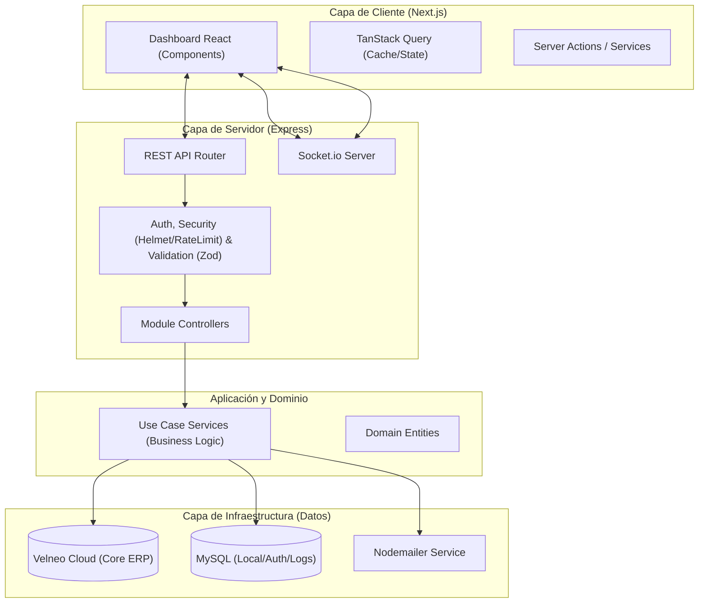
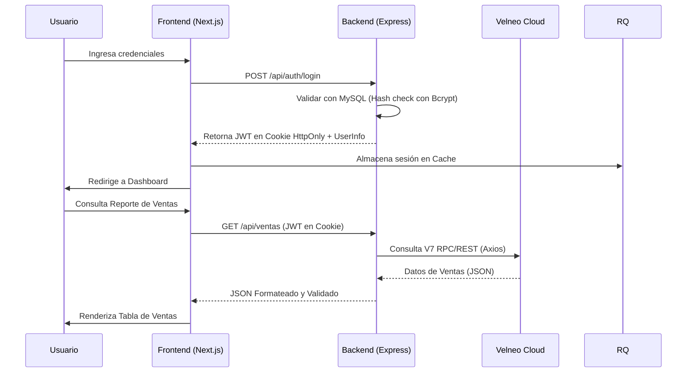

# 🏗️ Planificación del Proyecto: Datta-Erp

Este documento detalla la arquitectura, el stack tecnológico y la estrategia de implementación para el ecosistema **Datta-Erp**, un sistema de gestión empresarial (ERP) moderno construido con una arquitectura híbrida que aprovecha la velocidad de Node.js/Next.js y la robustez de Velneo Cloud.

---

## 🧠 FASE 1: Análisis de Stack y Objetivos

### 1. Visión General y Objetivo
**Datta-Erp** tiene como objetivo proporcionar una solución SaaS integral para la gestión empresarial, permitiendo la automatización de procesos operativos, financieros y administrativos. El sistema está diseñado para ser multi-tenant, escalable y con una experiencia de usuario premium.

### 2. Justificación del Stack Tecnológico

| Componente | Tecnología | Justificación |
| :--- | :--- | :--- |
| **Backend** | Node.js (Express) | Ideal para manejar múltiples conexiones concurrentes y facilitar la integración con servicios externos (SAT, Velneo, MySQL) mediante APIs REST y WebSockets. |
| **Frontend** | React (Next.js) | El uso de Next.js permite una carga optimizada, renderizado híbrido (SSR/CSR) y una estructura de enrutamiento basada en archivos eficiente para dashboards complejos. |
| **Base de Datos 1** | Velneo Cloud | Columna vertebral para la lógica de negocio empresarial pesada y persistencia de datos críticos de ERP, garantizando integridad y velocidad en transacciones complejas. |
| **Base de Datos 2** | MySQL | Utilizada para persistencia de datos relacionales locales, configuraciones de usuario y caché de datos de acceso rápido. |
| **Tiempo Real** | Socket.io | Implementación de notificaciones instantáneas y actualizaciones de estado sin recarga de página. |

### 3. Ecosistema de Librerías

#### Backend (Capa de Servicio)
- **`mysql2`**: Conector optimizado para la base de datos MySQL (uso de Pool).
- **`jsonwebtoken` & `bcrypt`**: Gestión de seguridad, autenticación basada en tokens (JWT) y encriptación de credenciales.
- **`nodemailer`**: Motor para el envío de correos electrónicos (notificaciones, facturas).
- **`express-rate-limit` & `helmet`**: Capas de seguridad para prevenir ataques de fuerza bruta y asegurar headers HTTP.
- **`morgan`**: Logging de peticiones para auditoría y debugging.
- **`zod`**: Validación de esquemas de datos estricta.

#### Frontend (Capa de Cliente)
- **`@tanstack/react-query`**: Gestión de estado asíncrono, caching de peticiones API y sincronización automática.
- **`react-hook-form`**: Manejo eficiente de formularios complejos con validación integrada.
- **`zod`**: Validación compartida de esquemas.
- **`jspdf` & `jspdf-autotable`**: Generación dinámica de reportes y documentos PDF en el lado del cliente.
- **`lucide-react`**: Set de iconos consistentes y ligeros.
- **`react-hot-toast`**: Sistema de notificaciones visuales (Toasts) no intrusivas.

---

## 📊 FASE 2: Documentación Modular (Arquitectura)

### 1. Diagrama de Arquitectura (Nivel 2 C4)



### 2. Flujo de Datos Principal (Autenticación e Ingesta)



---

## 🔐 Seguridad, Validación y Cumplimiento

### 🛡️ Capas de Seguridad

#### 1. Autenticación (JWT)
- **Token**: Se utilizará `jsonwebtoken` para emitir Access Tokens.
- **Expiración**: 1 hora para Access Tokens.
- **Almacenamiento**: Cookies con flags `Secure`, `SameSite=Strict` y `HttpOnly` (para evitar XSS).

#### 2. Protección de API (Backend)
- **Helmet**: Para asegurar headers HTTP contra vulnerabilidades comunes.
- **Express Rate Limit**: Máximo 100 peticiones por cada 15 minutos por IP para prevenir fuerza bruta.
- **CORS**: Configurado estrictamente para permitir solo el dominio del Frontend.

#### 3. Validación de Datos
- **Backend**: Uso de middlewares de validación con **Zod** antes de procesar cualquier `req.body`.
- **Frontend**: `React-Hook-Form` + **Zod** para validación inmediata en el cliente (campos obligatorios, formatos de RFC, correos).

### 🏗️ Multi-tenancy (Aislamiento de Datos)

El sistema garantiza que los datos de un cliente no sean visibles para otros mediante:

1. **Aislamiento en MySQL**: Cada registro en la tabla `velneo` está vinculado estrictamente a un `id_usuario`.
2. **Aislamiento en Velneo**: Cada cliente tiene sus propias **instancias DAT y APP**, eliminando el riesgo de fugas de datos a nivel de base de datos.
3. **Middleware de Propiedad**: En el backend, cada petición a `/api/erp/*` verifica que la `url_api` que se intenta consumir pertenece efectivamente al usuario autenticado en el JWT.

---

## 📜 Estándares de Código y Calidad

### Backend (Node/Express)
- Uso de **ES Modules** para una sintaxis moderna y limpia.
- Uso de `morgan` para registro de auditoría de todas las peticiones de escritura.
- Manejo centralizado de errores mediante un middleware global.
- Encriptación de contraseñas con `bcrypt` (salting rounds: 10).

### Frontend (Next.js)
- Tipado estricto con **TypeScript**.
- Uso de `TanStack Query` para evitar peticiones redundantes y manejar estados de carga/error globalmente.
- Separación de componentes presentacionales (Atoms/Molecules) y contenedores lógicos.

---

## 📁 Estructura de Carpetas Propuesta

La organización sigue un estándar de **Feature-Based Architecture** bajo principios de Clean Architecture:

### 📂 Backend (`src/`)
```text
├── config/             # Variables de entorno y configuraciones de BD
├── core/               # Lógica transversal (Errors, Security, Utils)
│   ├── database/       # Providers base (baseSql.provider.js, etc)
│   ├── socket/         # Configuración global de Socket.io
│   └── errors/         # Clases de error personalizadas
├── middlewares/        # Helmet, Validation, Auth, ErrorHandler
└── modules/            # Dominios funcionales (Feature-based)
    └── [Modulo]/
        ├── controllers/ # Adaptadores de entrada (Express)
        ├── services/    # Casos de uso de aplicación (Business Logic)
        ├── providers/   # Implementaciones de infra (MySQL/Velneo/Axios)
        ├── routes/      # Definición de endpoints
        └── schemas/     # Validaciones Zod (Shared or local)
```

### 📂 Frontend (`app/` & `modules/`)
```text
├── app/                # Rutas, layouts y páginas (Next.js App Router)
├── components/         # Componentes UI reutilizables (forms, layout, ui)
├── hooks/              # Lógica de estado y hooks globales
├── modules/            # Lógica específica por dominio
│   └── [Modulo]/
│       ├── components/ # Componentes exclusivos del módulo
│       ├── services/   # Llamadas a la API y lógica de datos (Axios/TanStack)
│       ├── hooks/      # Hooks específicos del módulo
│       └── types/      # Interfaces de TypeScript del dominio
├── providers/          # Context Providers (Auth, QueryClient, Theme)
└── types/              # Tipos globales de la aplicación
```

---

## 🚦 Checklist de Lanzamiento
- [ ] Configurar variables de entorno (`.env`) seguras en producción.
- [ ] Implementar certificados SSL (HTTPS).
- [ ] Realizar pruebas de carga en la API de Velneo.
- [ ] Verificar que el OTP expira correctamente después de 10 minutos.
- [ ] Auditoría de headers de seguridad con herramientas externas.

---

## 🚀 Próximos Pasos
1. Definir los contratos de API para los módulos iniciales (Auth, Dashboard).
2. Configurar el middleware de conexión base con Velneo Cloud usando Axios.
3. Establecer el sistema de permisos multi-tenant y middleware de propiedad.
4. Implementar el patrón **Repository** para desacoplar la lógica de los proveedores de datos.
