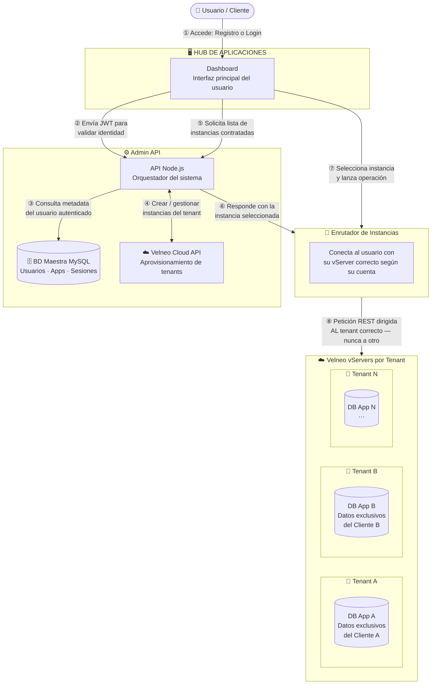
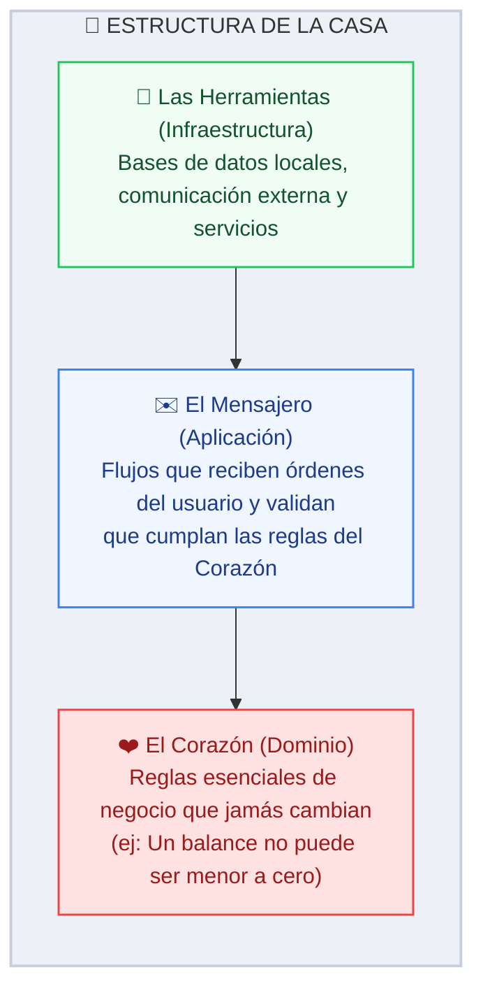
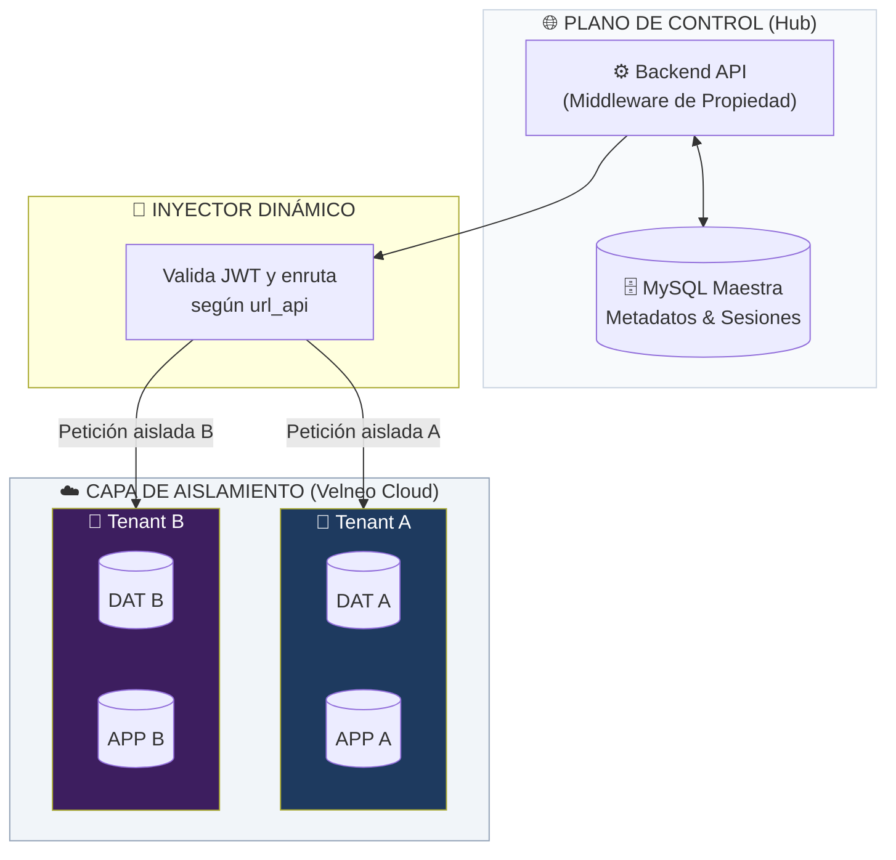
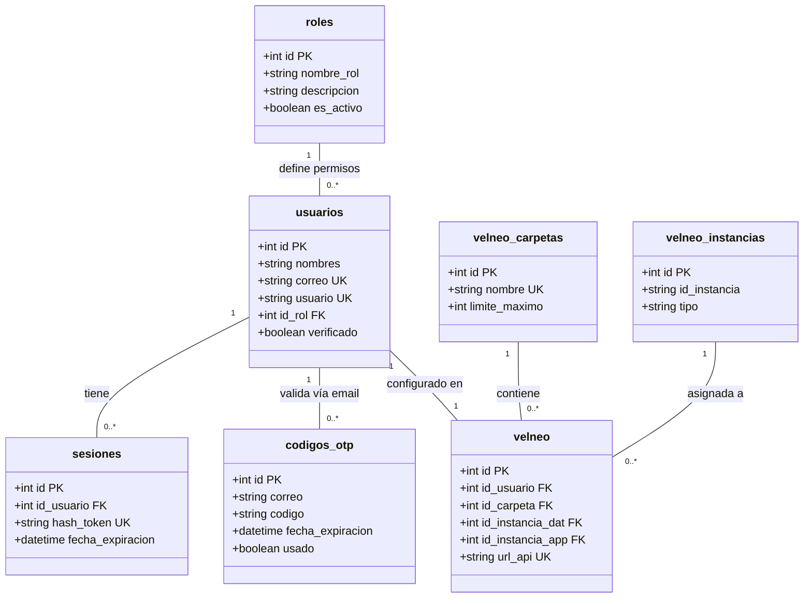

# 🏗️ Planificación del Proyecto: Datta-Erp

Este documento detalla la arquitectura, el stack tecnológico y la estrategia de implementación para el ecosistema **Datta-Erp**, un sistema de gestión empresarial (ERP) moderno construido con una arquitectura híbrida que aprovecha la velocidad de Node.js/Next.js y la robustez de Velneo Cloud.

---

## 🗺️ Vista General: Cómo Funciona el Sistema de Principio a Fin

> **¿Cómo leer este diagrama?**
> Sigue los números del `1` al `8`. Cada número es un "mensaje" que viaja de un bloque a otro.
> Los bloques con fondo de color son **zonas separadas** del sistema que tienen una responsabilidad distinta.
>
> *Piénsalo como un edificio de apartamentos:*
> - **El Código es el edificio entero** (la infraestructura que todos comparten), pero cada cliente tiene su propia "llave" y su propio "apartamento" (su base de datos aislada) donde ningún otro vecino puede asomarse ni entrar.



### Qué pasa en cada paso

| Paso | ¿Qué ocurre? | ¿Quién lo hace? |
| :---: | :--- | :--- |
| **①** | El usuario entra al Dashboard con su correo y contraseña (o se registra por primera vez) | Frontend (Next.js) |
| **②** | El Dashboard envía el token JWT al servidor para verificar que la sesión es legítima | Backend (Express) |
| **③** | El servidor consulta en la BD Maestra los datos del usuario y sus aplicaciones contratadas | MySQL (BD local) |
| **④** | Si es un registro nuevo, el Plano de Control crea las instancias del cliente en Velneo Cloud | Velneo Cloud API |
| **⑤** | El Dashboard pide al servidor la lista de instancias ERP disponibles para ese usuario | Backend → MySQL |
| **⑥** | El servidor responde con la instancia a usar y el Inyector se prepara para la conexión | Inyector Dinámico |
| **⑦** | El usuario selecciona su empresa/módulo y el Dashboard lanza la operación al Inyector | Frontend → Inyector |
| **⑧** | El Inyector dirige la petición al vServer **exacto** del cliente — aislado del resto | Velneo vServer |

> 🔒 **Garantía de aislamiento:** Un usuario del Tenant A **nunca puede ver ni modificar** datos del Tenant B. El Inyector valida el JWT en cada petición antes de conectar.

---

## 📖 Glosario: Las Palabras Clave Explicadas Sin Tecnicismos

> **"Si un cliente o inversor no comprende cómo se protegen y almacenan sus datos, la arquitectura ha fallado en su transparencia. El sistema debe ser tan robusto en su código como cristalino en su explicación".**

Antes de entrar en detalles técnicos, aquí están los conceptos que aparecen en todo este documento, explicados de forma conceptual:

| Concepto de Negocio | ¿Qué significa en realidad? | Valor de Negocio |
| :--- | :--- | :--- |
| **Aislamiento Multi-tenant** | *El edificio de apartamentos:* el sistema es el edificio compartido, pero cada cliente opera en su propio apartamento cerrado bajo llave. | Privacidad física absoluta de la información de tu negocio. |
| **Almacén de Datos Externo** | Plataforma en la nube donde reside el motor de base de datos y la lógica del ERP. | Estabilidad y cumplimiento fiscal integrado con el SAT. |
| **Instancia Dedicada** | El "apartamento" asignado en la nube. Contiene exclusivamente los registros y configuraciones de una sucursal del cliente. | Ningún vecino puede acceder a tus registros o degradar tu rendimiento. |
| **Portero Inteligente** | El componente de seguridad que lee tu credencial y te dirige instantáneamente a tu apartamento asignado. | Garantiza que las operaciones se enruten únicamente a tu base de datos. |
| **Pulsera de Acceso** | Una credencial digital de seguridad emitida tras iniciar sesión. El sistema la lee en cada petición para validar tu identidad. | Evita tener que reintroducir contraseñas y protege cada petición. |
| **Recepción (Base Maestra)** | El registro central del edificio. Almacena la lista de inquilinos y las direcciones de sus apartamentos. | Organiza los accesos de forma rápida sin almacenar datos comerciales. |
| **Código de Verificación** | Código temporal de 6 dígitos enviado por mensajería digital para validar la propiedad del correo. | Evita la creación de cuentas falsas o accesos no autorizados. |
| **Aprovisionamiento** | El proceso automatizado que prepara tu apartamento y te entrega las llaves. | Despliegue inmediato de infraestructura en minutos sin intervención manual. |
| **Canal de Puertas Abiertas** | Mantiene conexiones de bases de datos listas para ser usadas instantáneamente. | Acelera la velocidad de carga de la aplicación de forma drástica. |
| **Filtro de Seguridad** | Guardia de seguridad digital que valida permisos, formatos y límites de velocidad antes de dar acceso. | Protege al sistema contra fraudes, ataques y saturación. |

---

## 🧠 FASE 1: Stack Tecnológico Verificado

### 1. Visión General
**Datta-Erp** es un sistema ERP SaaS multi-tenant que combina la velocidad de Node.js/Next.js con la robustez de Velneo Cloud. Cada cliente empresarial opera en su propio entorno aislado de datos. El sistema resuelve un problema clave para empresas mexicanas: **tener un ERP profesional conectado al SAT, con sus datos completamente separados de otros clientes, sin comprar infraestructura propia.**

### 2. Stack Real (auditado del código)

| Componente | Tecnología | Estado |
| :--- | :--- | :--- |
| **Backend** | Node.js (Express 5.x) + ES Modules | ✅ Activo |
| **Frontend** | Next.js 16 + React 19 + TypeScript | ✅ Activo |
| **Estilos** | Tailwind CSS 4 | ✅ Activo |
| **BD Principal** | Velneo Cloud (instancias DAT/APP por tenant) | ✅ Activo |
| **BD Local** | MySQL (`mysql2/promise`, Pool de 10 cx) | ✅ Activo |
| **Tiempo Real** | Socket.io *(configurado, pendiente de módulo)* | ⏳ Pendiente |
| **Gestor de paquetes** | pnpm (workspace monorepo) | ✅ Activo |

---

## 📊 FASE 2: Arquitectura Real del Proyecto

## 📊 FASE 2: Arquitectura Real del Proyecto

### 1. Mapa de la Casa (Capas de Diseño Limpio)

> *Este mapa describe cómo se organiza el código del sistema, separando las reglas de negocio de los detalles tecnológicos:*



### 2. Estructura de Carpetas Real

#### 📂 Backend (`/backend`)
```text
backend/
├── .gitignore          ✅ Ignora variables de entorno (.env) y dependencias locales
├── app.js              ✅ Orquestador (CORS, Helmet, Morgan, Rutas)
├── routes.js           ✅ Router principal (Enruta /autenticacion)
├── server.js           ✅ Punto de entrada HTTP
├── package.json        ✅ Express 5 + pnpm (bcryptjs, nodemailer, zod instalados)
├── src/
│   ├── config/
│   │   ├── database.js       ✅ Pool MySQL (10 conexiones, async/await)
│   │   └── httpClients.js    ✅ Axios Factory (Velneo Cloud + SAT)
│   ├── core/
│   │   ├── database/
│   │   │   ├── baseHttp.provider.js   ✅ Clase base para HTTP
│   │   │   ├── baseSql.provider.js    ✅ Clase base para MySQL
│   │   │   └── transactionSql.js     ✅ Soporte de transacciones SQL
│   │   ├── errors/
│   │   │   ├── AppError.js           ✅ Error base del sistema
│   │   │   ├── DatabaseError.js      ✅ Errores de BD
│   │   │   ├── NotFoundError.js      ✅ Recurso no encontrado
│   │   │   └── ValidationError.js   ✅ Datos inválidos
│   │   └── socket/                  ⏳ Socket.io (pendiente)
│   ├── middlewares/
│   │   ├── index.js                 ✅ Exportador central
│   │   ├── error.middleware.js      ✅ Manejo global de errores
│   │   ├── rateLimit.middleware.js  ✅ 100 req / 15 min
│   │   └── security.middleware.js  ✅ Helmet
│   ├── modules/
│   │   └── auth/                    ✅ Módulo de Autenticación (Registro, Login, Recuperación)
│   │       ├── auth.controller.js
│   │       ├── auth.repository.js
│   │       ├── auth.routes.js
│   │       ├── auth.schema.js
│   │       └── auth.service.js
│   └── services/
│       ├── Velneo.service.js        ✅ Ciclo de vida tenant en Velneo Cloud
│       └── correo.service.js       ✅ Motor de correos (Nodemailer SMTP)
```

#### 📂 Frontend (`/frontend`)
```text
frontend/
├── app/
│   ├── globals.css      ✅ Estilos y tokens de diseño
│   ├── layout.tsx       ✅ Layout raíz con fuentes, QueryProvider y Toaster
│   ├── page.tsx         ✅ Landing Page (Logotipo corporativo corregido y comentada)
│   ├── login/
│   │   └── page.tsx     ✅ Página de Login modular (Inicio, OTP, recuperación y cambio forzado)
│   └── registro/
│       └── page.tsx     ✅ Página de Registro (código OTP y loader integrado, TS-safe)
├── components/          ⏳ VACÍO — Componentes UI por crear
├── modules/             
│   ├── login/           ✅ Lógica de login y hooks reactivos tipados
│   │   └── login.hooks.ts
│   └── registro/        ✅ Validación de registro (Zod)
│       └── registro.schema.ts
├── hooks/               ⏳ VACÍO
├── providers/
│   └── QueryProvider.tsx ✅ Proveedor de TanStack React Query Client
└── types/               
    └── js-cookie.d.ts   ✅ Declaración ambiental local para js-cookie
```

---

## 🔐 FASE 3: Seguridad y Aislamiento de Datos

### Aislamiento Multi-tenant (Cómo protegemos los datos de cada cliente)

> *Imagina que cada cliente es un inquilino: tiene su propio candado (instancia Velneo), y el portero del edificio (el middleware del backend) solo le abre la puerta de su apartamento, nunca del vecino.*



### Capas de Seguridad Implementadas

| Capa de Seguridad | Propósito y Valor de Negocio | Archivo de Control |
| :--- | :--- | :--- |
| **Escudo de Privacidad** | Bloquea ataques en el navegador del usuario inyectando cabeceras de seguridad. | `security.middleware.js` |
| **Límite de Velocidad** | Limita las llamadas al servidor (máx. 100 peticiones cada 15 minutos) para evitar abusos o saturaciones. | `rateLimit.middleware.js` |
| **Filtro de Origen** | Asegura que solo las llamadas desde el portal oficial de la aplicación sean aceptadas. | `app.js` |
| **Control de Errores** | Mapea y responde ante cualquier eventualidad sin revelar detalles técnicos internos del servidor. | `core/errors/` |
| **Conexiones Activas** | Mantiene un canal de puertas abiertas de bases de datos listas para su uso rápido. | `config/database.js` |
| **Canal Blindado Externo** | Asegura conexiones estables con agentes externos mediante reintentos automáticos. | `config/httpClients.js` |

### Resiliencia del Almacén de Datos Externo

> *"Si el almacén de datos externo no responde al primer intento, el sistema activará un protocolo de reintentos automáticos (máximo 3 veces) espaciados en milisegundos para salvar la operación antes de emitir una alerta, protegiendo la experiencia del usuario".*

---

## 🚦 Estado por Módulo (Checklist Real)

| Módulo | Backend | Frontend | Documentación |
| :--- | :---: | :---: | :---: |
| **Infraestructura Base** | ✅ Listo | ✅ Listo | ✅ Este Blueprint |
| **Módulo Auth / Registro** | ✅ Listo | ✅ Listo | ✅ `Registro_Plan.md` |
| **Módulo Auth / Acceso y Recuperación** | ⏳ En Ejecución | ✅ Listo | ✅ `Login_Plan.md` |
| **Dashboard ERP** | ⏳ Pendiente | ⏳ Pendiente | — |
| **Catálogos SAT** | ⏳ Pendiente | ⏳ Pendiente | — |
| **Socket.io Tiempo Real** | ⏳ Pendiente | ⏳ Pendiente | — |

---

## ⚙️ Variables de Entorno Requeridas

> *Piensa en las variables de entorno como las "llaves maestras" del sistema: sin ellas, el servidor no sabe a qué base de datos conectarse, ni cómo hablar con Velneo, ni cómo enviar correos. Nunca se guardan en el código — viven en un archivo `.env` privado que cada desarrollador configura en su máquina.*

Para arrancar el proyecto por primera vez, copia el archivo `.env.example` del backend y rellena cada valor:

```bash
cp backend/.env.example backend/.env
```

### Variables del Backend

| Variable | Grupo | ¿Para qué sirve? | Ejemplo |
| :--- | :---: | :--- | :--- |
| `PORT` | Servidor | Puerto donde corre Express | `3000` |
| `NODE_ENV` | Servidor | Modo de ejecución (activa/desactiva logs) | `development` |
| `CLIENT_URL` | Seguridad | Dominio del frontend permitido por CORS | `http://localhost:3001` |
| `JWT_SECRET` | Seguridad | Clave secreta para firmar las "pulseras JWT" — debe ser larga y aleatoria | `mi_clave_super_secreta_2026` |
| `VELNEO_CLOUD` | Velneo | URL base de la API de administración de Velneo Cloud | `https://cloudapi.velneo.com/v1` |
| `VELNEO_CLOUD_EMAIL` | Velneo | Correo del administrador de la cuenta Velneo Cloud | `admin@empresa.com` |
| `VELNEO_CLOUD_APIKEY` | Velneo | API Key de autenticación con Velneo Cloud | `abc123...` |
| `VELNEO_VSERVER_USER` | Velneo | Usuario del vServer para autenticación avanzada | `vserver_admin` |
| `VELNEO_VSERVER_PASSWORD` | Velneo | Contraseña del vServer | `password_seguro` |
| `VELNEO_BASE_FOLDER_NAME` | Velneo | Prefijo de carpetas donde se crean los tenants | `cloud` |
| `VELNEO_SOLUTION` | Velneo | Nombre de la solución ERP en Velneo | `DATTA ERP` |
| `VELNEO_DATA_PROJECT` | Velneo | Nombre del proyecto de datos (`.vcd`) | `datta_erp_dat` |
| `VELNEO_APP_PROJECT` | Velneo | Nombre del proyecto de aplicación (`.vcd`) | `datta_erp_app` |
| `VELNEO_APP_VCD` | Velneo | Alias del esquema VCD para herencia de la app | `alias_esquema.vcd` |
| `DB_HOST` | MySQL | Servidor de la base de datos local | `localhost` |
| `DB_USER` | MySQL | Usuario de MySQL | `root` |
| `DB_PASSWORD` | MySQL | Contraseña de MySQL | `mi_password` |
| `DB_NAME` | MySQL | Nombre de la base de datos maestra | `DattaErp` |
| `DB_PORT` | MySQL | Puerto de MySQL | `3306` |
| `MAIL_HOST` | Correo | Servidor SMTP para envío de correos | `smtp.gmail.com` |
| `MAIL_PORT` | Correo | Puerto SMTP (587=TLS, 465=SSL) | `587` |
| `MAIL_USER` | Correo | Correo remitente del sistema | `noreply@empresa.com` |
| `MAIL_PASS` | Correo | Contraseña de aplicación del correo | `app_password` |
| `MAIL_FROM` | Correo | Nombre y dirección que ve el destinatario | `"Datta ERP <noreply@empresa.com>"` |
| `CATALOGO_SAT_API_URL` | SAT | URL de la API de catálogos fiscales del SAT | `https://c6.velneo.com:16992/catalogos_sat/` |

> ⚠️ **Regla de Oro:** Nunca subas el archivo `.env` real al repositorio. El `.gitignore` ya lo excluye. Si necesitas compartir una configuración de ejemplo, usa `.env.example` (sin valores reales).

---

## 🗄️ Modelo de Datos — La Recepción del Edificio (MySQL)

> *MySQL en este sistema no guarda facturas ni inventarios — eso le toca a Velneo. MySQL es la "recepción del edificio": sabe quién vive ahí (usuarios), qué apartamentos tienen contratados (tenants) y guarda los códigos de acceso temporales (OTP) para verificar identidades.*

### Diagrama de Clases (Tablas MySQL)



### ¿Qué guarda cada tabla en palabras simples?

| Tabla | ¿Qué guarda? | Dato clave |
| :--- | :--- | :--- |
| `USUARIOS` | Directorio de clientes y sus credenciales de acceso. | `id` → Ancla del sistema |
| `ROLES` | Definición de niveles de permisos (Admin, Cliente). | `nombre_rol` |
| `CODIGOS_OTP` | Tokens temporales para registro y recuperación. | `usado` → Seguridad |
| `SESIONES` | Auditoría de JWTs activos para permitir logout global. | `hash_token` |
| `VELNEO` | El "Mapa de Conexión" de cada cliente. | `url_api` → Endpoint único |
| `V_CARPETAS` | Organización física en Velneo Cloud. | `limite_maximo` |
| `V_INSTANCIAS` | Inventario de instancias DAT/APP desplegadas. | `id_instancia` |

### 📚 Diccionario de Datos Detallado (MySQL)

#### 1. Tabla: `usuarios`
Contiene el directorio principal de accesos y perfiles del sistema ERP.
*   **`id`** (`INT UNSIGNED AUTO_INCREMENT`): Identificador único del usuario (PK).
*   **`nombres`** (`VARCHAR(100)`): Nombre(s) del usuario.
*   **`apellido_paterno`** (`VARCHAR(100)`): Primer apellido.
*   **`apellido_materno`** (`VARCHAR(100)`): Segundo apellido.
*   **`empresa`** (`VARCHAR(100)`): Razón social o nombre comercial del cliente.
*   **`rfc`** (`VARCHAR(13)`): Registro Federal de Contribuyentes (México).
*   **`correo`** (`VARCHAR(100)`): Dirección de email de acceso principal (UK).
*   **`telefono`** (`VARCHAR(20)`): Número de contacto o teléfono móvil.
*   **`usuario`** (`VARCHAR(50)`): Identificador único generado por sistema (UK).
*   **`contraseña`** (`VARCHAR(255)`): Contraseña encriptada en hash Bcrypt.
*   **`id_rol`** (`INT UNSIGNED`): Rol asignado (FK ➡️ `roles`).
*   **`verificado`** (`TINYINT(1)`): Indica si la cuenta completó la verificación OTP (0 = No, 1 = Sí).
*   **`actualizar_contraseña`** (`TINYINT(1)`): Indica si se debe forzar el cambio de clave en el próximo login (1 = Sí).
*   **`fecha_creacion`** (`TIMESTAMP`): Fecha y hora de alta del registro.
*   **`fecha_actualizacion`** (`TIMESTAMP`): Última actualización del registro.

#### 2. Tabla: `roles`
Define los niveles de permisos y capacidades dentro del ecosistema ERP.
*   **`id`** (`INT UNSIGNED AUTO_INCREMENT`): Identificador del rol (PK).
*   **`nombre_rol`** (`VARCHAR(50)`): Nombre del rol (UK) (ej: `'admin'`, `'cliente'`, `'usuario'`).
*   **`descripcion`** (`VARCHAR(255)`): Detalle de facultades del rol.
*   **`es_activo`** (`TINYINT(1)`): Indica si el rol está habilitado (1 = Sí).

#### 3. Tabla: `codigos_otp`
Almacena códigos temporales de verificación para registro, login 2FA y recuperación de contraseñas. Referencia extendida en [otp_servicio.md](../../servicios/otp_servicio.md).
*   **`id`** (`INT UNSIGNED AUTO_INCREMENT`): Identificador único (PK).
*   **`correo`** (`VARCHAR(100)`): Correo del destinatario (sin FK para permitir flujos pre-registro).
*   **`codigo`** (`VARCHAR(6)`): Código numérico autogenerado de 6 dígitos.
*   **`tipo`** (`ENUM('registro','reset_contrasena','2fa')`): Propósito de verificación.
*   **`fecha_expiracion`** (`DATETIME`): Tiempo límite de validez (15 minutos).
*   **`usado`** (`TINYINT(1)`): Bandera de estado (0 = Disponible, 1 = Consumido).
*   **`fecha_creacion`** (`TIMESTAMP`): Fecha de creación física (usada para control de cooldown de 3 minutos).

#### 4. Tabla: `sesiones`
Audita e invalida de forma persistente los tokens JWT activos.
*   **`id`** (`INT UNSIGNED AUTO_INCREMENT`): ID único (PK).
*   **`id_usuario`** (`INT UNSIGNED`): Usuario propietario de la sesión (FK ➡️ `usuarios`).
*   **`hash_token`** (`VARCHAR(255)`): SHA-256 de la firma del JWT para validación rápida (UK).
*   **`fecha_expiracion`** (`DATETIME`): Expiración del token (normalmente 1 hora).
*   **`direccion_ip`** (`VARCHAR(45)`): Dirección IP de origen del login.
*   **`agente_usuario`** (`VARCHAR(512)`): User-Agent del dispositivo cliente.
*   **`fecha_creacion`** (`TIMESTAMP`): Inicio de la sesión.

#### 5. Tabla: `velneo`
Mapea la configuración técnica y endpoint remoto API de cada tenant.
*   **`id`** (`INT UNSIGNED AUTO_INCREMENT`): ID de mapeo (PK).
*   **`id_usuario`** (`INT UNSIGNED`): Dueño del tenant (FK ➡️ `usuarios`).
*   **`id_carpeta`** (`INT UNSIGNED`): Carpeta contenedora física (FK ➡️ `velneo_carpetas`).
*   **`id_instancia_dat`** (`INT UNSIGNED`): Instancia de base de datos asignada (FK ➡️ `velneo_instancias`).
*   **`id_instancia_app`** (`INT UNSIGNED`): Instancia de lógica/app asignada (FK ➡️ `velneo_instancias`).
*   **`id_group`** (`VARCHAR(100)`): Grupo de seguridad del cliente en el vServer.
*   **`id_user_velneo`** (`VARCHAR(100)`): Usuario del vServer técnico para peticiones API.
*   **`url_api`** (`VARCHAR(255)`): Endpoint absoluto para las llamadas REST de este tenant (UK).
*   **`id_group_check`** (`TINYINT(1)`): Flag de aprovisionamiento del grupo (0 = No, 1 = Sí).
*   **`id_user_check`** (`TINYINT(1)`): Flag de aprovisionamiento del usuario (0 = No, 1 = Sí).
*   **`fecha_creacion`** (`TIMESTAMP`): Fecha de aprovisionamiento.

#### 6. Tabla: `velneo_instancias`
Listado maestro de los vServers e instancias de datos/lógica aprovisionados en Velneo Cloud.
*   **`id`** (`INT UNSIGNED AUTO_INCREMENT`): ID de instancia (PK).
*   **`id_instancia`** (`VARCHAR(100)`): ID único retornado por Velneo API (ej: `'MTY_DAT'`).
*   **`nombre`** (`VARCHAR(100)`): Nombre visual (ej: `'Monterrey Base'`).
*   **`tipo`** (`ENUM('dat','app')`): Tipo de instancia.
*   **`fecha_creacion`** (`TIMESTAMP`): Alta física.

---

## 🚀 Próximos Pasos (Roadmap por Sprints)

### Sprint 1 — Autenticación: Registro de Usuarios *(Listo)*
- [x] Instalar dependencias base (`bcryptjs`, `nodemailer`, `zod`, `@tanstack/react-query`, `react-hook-form`, `react-hot-toast`, `js-cookie`)
- [x] Crear `src/modules/auth/` con controllers, services, routes y schemas en backend
- [x] Implementar endpoints `POST /autenticacion/registro/inicial` y `POST /autenticacion/registro/verificar`
- [x] Crear `app/registro/page.tsx` en el frontend con formulario premium, OTP y loading
- [x] Configurar `providers/QueryProvider.tsx` para TanStack React Query

### Sprint 1.5 — Autenticación: Acceso y Recuperación *(En Ejecución / 90% Completado)*
- [x] Crear página de Login en `app/login/page.tsx` conectada a react-hook-form
- [x] Crear formulario de cambio obligatorio de contraseña (integrado modularmente en el mismo panel de Login)
- [x] Implementar endpoints de inicio y actualización en backend (`/iniciar-sesion` y `/cambiar-contrasena`)
- [ ] Implementar endpoint `POST /autenticacion/logout` con JWT en cookie `HttpOnly`
- [ ] Implementar flujo de Recuperación de contraseña por Teléfono enmascarado y OTP en backend
- [ ] Configurar `providers/AuthContext` para gestión de sesión global

### Sprint 2 — Inyector y Dashboard Base
- [ ] Implementar el Inyector Dinámico como middleware de proxy a vServers
- [ ] Crear `GET /erp/instances` para listar aplicaciones del usuario
- [ ] Construir la página de Dashboard con selector de instancias
- [ ] Configurar `@tanstack/react-query` para caché de peticiones

### Sprint 3 — Módulos ERP
- [ ] Módulo de Catálogos SAT (consulta a `satClient`)
- [ ] Módulo de Facturación (conexión al vServer del tenant)
- [ ] Socket.io para notificaciones en tiempo real
- [ ] Generación de PDFs con `jspdf`

---

*Última actualización automática: Mayo 2026 — Auditado por Project Blueprint Skill — Proyecto: Datta ERP*
*Nota de Trazabilidad: **Se ha optimizado el paso de verificación para que el motor busque más rápido en los contenedores de datos individuales.***
