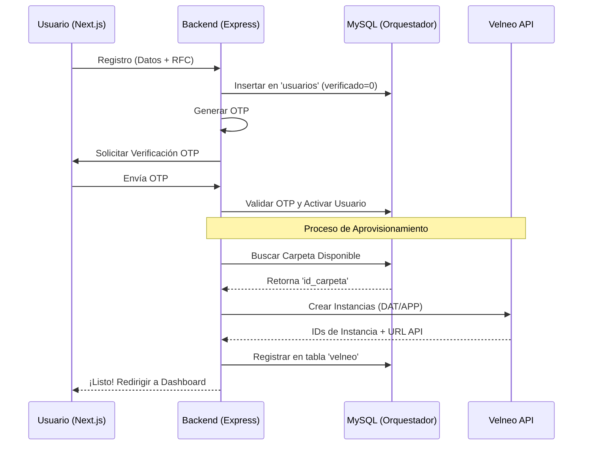
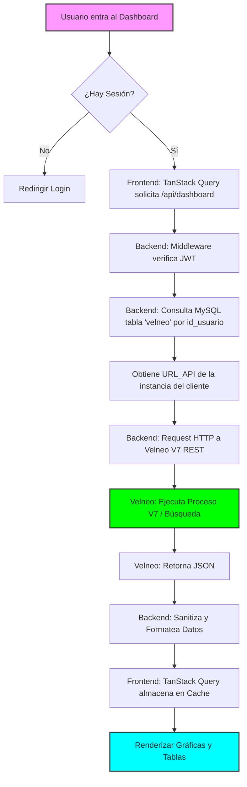

# 🔄 Flujos de Procesos y Lógica de Integración

Este documento visualiza los procesos críticos de **Datta-Erp**, desde el registro de un nuevo cliente hasta el consumo de datos del ERP.

## 1. Flujo de Registro y Activación (Onboarding)

Este diagrama detalla cómo un nuevo usuario obtiene acceso a su instancia de Velneo Cloud.

## 2. Flujo de Consulta de Datos ERP (Dashboard)

Cómo el Frontend consume información del core de Velneo a través de la capa intermedia de Node.js.

## 3. Manejo de Errores y Rollback (Resiliencia)

Estrategia para evitar estados inconsistentes durante el aprovisionamiento.

| Escenario de Falla | Acción de Mitigación | Estado Final |
| :--- | :--- | :--- |
| Error al crear instancia en Velneo | Eliminar registro parcial en MySQL (`usuarios`) y notificar error. | Limpio |
| Fallo en envío de correo OTP | Reintentar envío (máx 3) o permitir reenvío manual desde UI. | Pendiente de Verificación |
| Velneo API Offline | Backend retorna `503 Service Unavailable` con mensaje amigable. | Reintentable |

---

## 🎨 Estilos de Interfaz (UX/UI Strategy)
- **Dashboard**: Uso de `Lucide-React` para iconografía minimalista.
- **Feedback**: `React-Hot-Toast` para confirmaciones de guardado y errores de API.
- **Persistencia**: `js-cookie` para tokens de corta duración y seguridad `HttpOnly` en producción.
