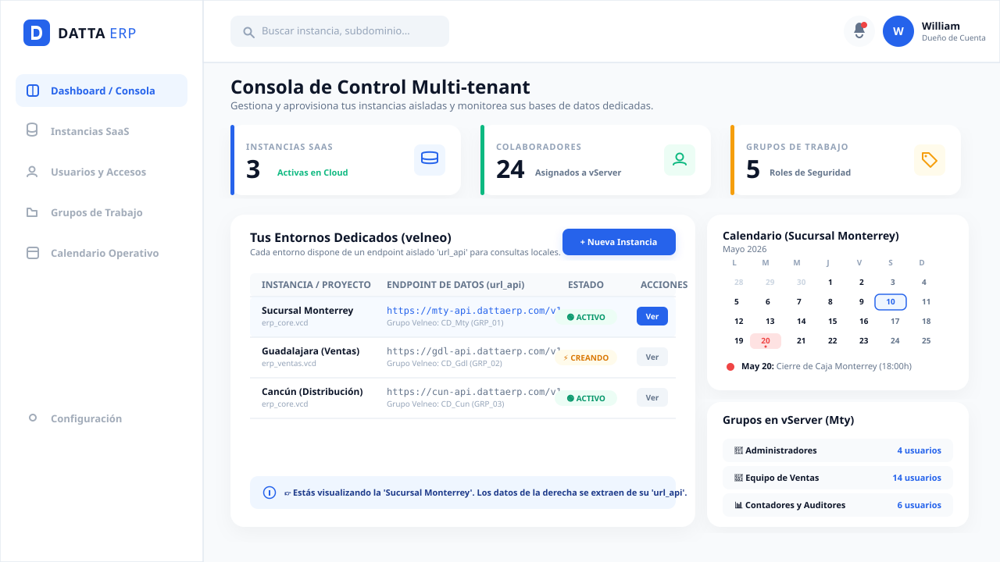
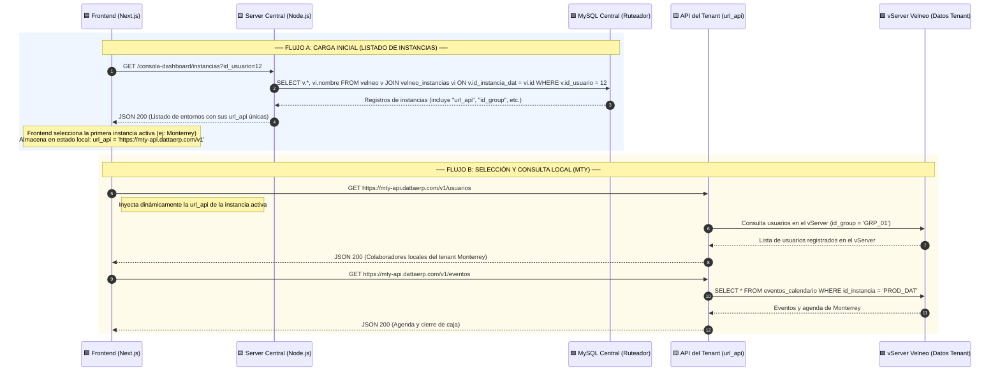
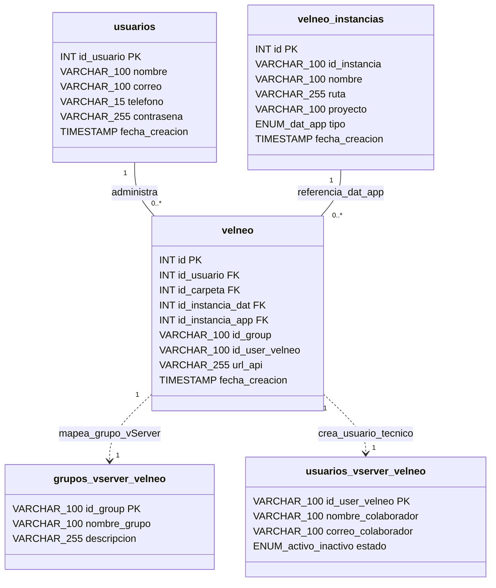

# 🏗️ Plan de Diseño Técnico: Consola de Control e Instancias SaaS (Multi-tenant)

Este documento detalla la planificación arquitectónica, los flujos de comunicación, la resiliencia operativa y la matriz de seguridad del módulo **Consola de Control de Instancias** de Datta ERP. 

Este módulo permite a los administradores principales autogestionar su infraestructura dedicada en Velneo Cloud, conmutar dinámicamente sus bases de datos asociadas mediante la inyección del endpoint `url_api` y coordinar colaboradores y agendas de forma aislada.

---

## 📄 Información General
- **Módulo:** Consola de Control de Instancias (`consola_dashboard`)
- **Ecosistema:** Datta ERP SaaS
- **Última Actualización:** Mayo 2026
- **Diseño Visual:** Modo Claro (Light Mode) integrado con Navbar y Sidebar corporativo.

---

## 1. 🧩 El Corazón del Módulo (Explicación de Negocio)

El Dashboard de Control es el **centro de operaciones** para el cliente (rol `cliente`). En lugar de requerir asistencia técnica manual de soporte, este módulo le permite:
1.  **Visualizar su Infraestructura:** Conocer qué sucursales u oficinas virtuales (instancias de Velneo) tiene aprovisionadas en la nube.
2.  **Ruteo Dinámico de Datos (Aislamiento Puro):** Al seleccionar una instancia del listado, el frontend extrae su endpoint único `url_api`. De forma inmediata, el sistema redirige todas las llamadas de negocio (ver empleados locales, organizar roles en vServer y programar agenda) hacia ese endpoint remoto aislado de Velneo Cloud, garantizando un rendimiento óptimo y aislamiento físico total.
3.  **Aprovisionamiento Automatizado:** Iniciar la creación de una nueva sucursal SaaS rellenando un breve formulario.

---

## 2. 🗄️ Estructura de Base de Datos (MySQL ➡️ Velneo Cloud)

Para lograr este aislamiento, la base de datos se divide en dos capas:

### Capa A: Ruteador y Metadata Central (MySQL)
Consolida el inventario de entornos contratados por el usuario y los endpoints a los que se debe conectar:

*   **Tabla `velneo` (Tabla Maestra de Conexión):** Asocia cada usuario administrador con sus respectivas instancias de datos y aplicación, e inyecta la variable clave `url_api` (ej: `https://mty-api.dattaerp.com/v1`) para dirigir las peticiones REST.
*   **Tabla `velneo_instancias` (Servidores Velneo):** Inventario maestro de servidores dedicados de datos (`'dat'`) o de aplicación (`'app'`) creados en la nube.

> 📘 Las descripciones de campos, restricciones y llaves foráneas detalladas para las tablas `velneo` y `velneo_instancias` se encuentran en el [Blueprint de Arquitectura](../../architecture/blueprint.md#5-tabla-velneo).

---

### Capa B: Datos del Tenant Específico (Consultados dinámicamente vía `url_api`)
Al seleccionar la instancia en el Dashboard, toda la lógica de negocio de la derecha consume directamente el endpoint `url_api` del cliente:
*   **Grupos y Roles del vServer (`GET {url_api}/grupos`):** Organigrama de seguridad local de esa base de datos (ej: *Administración*, *Ventas*, *Soporte*).
*   **Usuarios de la Instancia (`GET {url_api}/usuarios`):** Empleados que tienen credenciales y acceso exclusivo a este subentorno.
*   **Calendario de la Instancia (`GET {url_api}/eventos`):** Agenda de juntas, recordatorios y tareas operativas exclusivas de esa sucursal.

---

## 3. 🎨 El "Figma" Visual (Estructura de Interfaz)

El módulo utiliza un diseño en Modo Claro integrado al Navbar superior y el Sidebar lateral de Datta ERP.



### 🧭 Guía de la Experiencia del Usuario (UX):
1.  **🚀 Carga Inicial (Ruta por Defecto):**
    *   Al ingresar al Dashboard, el sistema consulta en MySQL (`GET /consola-dashboard/instancias`) las sucursales vinculadas al usuario.
    *   Por defecto, se preselecciona la **primera instancia activa** encontrada (ej: *Sucursal Monterrey*) y se ilumina su fila en color azul transparente en la tabla.
2.  **🔀 Conmutación Dinámica de Instancia (La Magia Multi-tenant):**
    *   Al hacer clic en el botón **"Ver"** de otra instancia (ej: *Cancún (Distribución)*), la fila se ilumina y el frontend actualiza dinámicamente el estado global con su `url_api` (`https://cun-api.dattaerp.com/v1`).
    *   Inmediatamente, el **Calendario** y los **Grupos en vServer** de la derecha parpadean con una sutil animación de *loading skeleton* y se vuelven a renderizar consumiendo las APIs aisladas de esa sucursal.
3.  **➕ Aprovisionamiento de Nueva Instancia:**
    *   Al presionar el botón **"+ Nueva Instancia"**, se despliega un formulario modal que solicita: *Nombre Alias*, *Subdominio* y *Base de Datos Base (VCD)*.
    *   Al enviar, se crea la fila en MySQL con estado `'creando'` (mostrando la animación de rayo naranja `⚡ CREANDO` en la tabla) e inicia el micro-servicio que levanta el vServer de forma asíncrona.
4.  **📅 Interacción con el Calendario:**
    *   Al pasar el cursor sobre los días destacados en el calendario, se despliega un *tooltip* flotante con el título y la hora del evento registrado en Velneo para esa sucursal.

---

## 4. 🔄 El Mapa del Viaje (Diagramas UML)

### A. Diagrama de Secuencia UML (Ruteo Dinámico)



### B. Diagrama de Clases y Relaciones UML



---

## 5. 🛡️ El Plan de Emergencia (Resiliencia y Errores)

### 🔴 Manejo de Errores y UX
1.  **Fallo de Conectividad con la `url_api` (Servidor del Tenant caído):**
    *   *Mensaje de Alerta en UI:* *"⚠️ No pudimos conectar con la base de datos de esta sucursal. Comprueba que el servidor esté activo o reintenta la conexión."*
    *   *UX:* Se despliega un botón **"Reintentar Conexión"** para actualizar el query de forma aislada.
2.  **Subdominio Duplicado al Crear Instancia:**
    *   *Mensaje de Alerta en UI:* *"El subdominio ya se encuentra registrado. Por favor, elige un nombre único."*
    *   *UX:* El backend captura la colisión del índice único y retorna un código HTTP 409 Conflict.
3.  **Límite de Licencias Excedido en Velneo Cloud:**
    *   *Mensaje de Alerta en UI:* *"Has alcanzado el límite de colaboradores activos contratados para esta sucursal."*

### 🛡️ Transacciones SQL Seguras
La inserción y vinculación de instancias físicas con la configuración del cliente en MySQL se ejecuta obligatoriamente bajo una **Transacción SQL**:

```sql
START TRANSACTION;
-- 1. Insertamos las instancias física DAT y APP
INSERT INTO velneo_instancias (id_instancia, nombre, tipo, fecha_creacion)
VALUES ('MTY_DAT', 'Monterrey Datos', 'dat', NOW()),
       ('MTY_APP', 'Monterrey Lógica', 'app', NOW());
-- 2. Creamos la configuración maestra vinculando la url_api
INSERT INTO velneo (id_usuario, id_instancia_dat, id_instancia_app, id_group, id_user_velneo, url_api, id_group_check, id_user_check, fecha_creacion)
VALUES (12, LAST_INSERT_ID() - 1, LAST_INSERT_ID(), 'GRP_MTY', 'USR_MTY', 'https://mty-api.dattaerp.com/v1', 0, 0, NOW());
COMMIT;
```

---

## 6. 🔐 Seguridad y Control (Matriz de Permisos RBAC)

La validación de permisos se ejecuta en el backend mediante el descifrado del JWT de sesión, limitando la visualización técnica del endpoint `url_api` al rol del colaborador:

| Endpoint | Método | Capacidad Operativa | `admin` | `cliente` | `usuario` | `soporte` |
| :--- | :---: | :--- | :---: | :---: | :---: | :---: |
| `/consola-dashboard/instancias` | `GET` | Listar entornos de su cuenta | 🟩 Sí | 🟩 Sí | ❌ No | 🟩 Sí |
| `/consola-dashboard/instancias/crear` | `POST` | Aprovisionar nuevo subdominio | 🟩 Sí | 🟩 Sí | ❌ No | ❌ No |
| `/consola-dashboard/instancias/resync` | `POST` | Forzar reintento de creación | 🟩 Sí | 🟩 Sí | ❌ No | 🟩 Sí |
| `{url_api}/usuarios` | `GET` | Ver colaboradores de la sucursal | 🟩 Sí | 🟩 Sí | 🟩 Sí | ❌ No |
| `{url_api}/usuarios/crear` | `POST` | Dar de alta empleado en vServer | ❌ No | 🟩 Sí | ❌ No | ❌ No |
| `{url_api}/grupos` | `GET` | Ver grupos en vServer | 🟩 Sí | 🟩 Sí | 🟩 Sí | ❌ No |
| `{url_api}/eventos` | `GET` | Ver calendario de la sucursal | 🟩 Sí | 🟩 Sí | 🟩 Sí | ❌ No |

---

## 🛠️ FASE 6 — Lista de Implementación (Checklist)

A continuación se presenta la lista detallada de tareas para llevar a cabo el desarrollo de este módulo:

### 🟨 Capa Backend (Node.js/Express)
- [ ] Configurar las rutas del ruteador central en `backend/src/modules/consola_dashboard/consola_dashboard.routes.js`.
- [ ] Implementar los endpoints de consulta de MySQL y creación de registros en `consola_dashboard.controller.js`.
- [ ] Desarrollar consultas transaccionales con control de `START TRANSACTION` / `ROLLBACK` en `consola_dashboard.repository.js`.
- [ ] Construir el inyector de proxy dinámico que lee `url_api` y reenvía las peticiones a Velneo Cloud de forma segura.

### 🟦 Capa Frontend (Next.js/React)
- [ ] Diseñar el panel completo del Dashboard en `frontend/app/consola_dashboard/page.tsx` reutilizando el Navbar superior e incorporando el Sidebar lateral.
- [ ] Programar el selector de instancia activa que inyecta en el estado global el endpoint `url_api` seleccionado.
- [ ] Desarrollar la tabla responsiva de instancias con badges dinámicos (`🟢 ACTIVO`, `⚡ CREANDO`).
- [ ] Crear el componente de Calendario Mensual interactivo (`components/CalendarioInstancia.tsx`) que consume `{url_api}/eventos`.
- [ ] Crear la barra lateral de grupos y roles que consume `{url_api}/grupos`.
- [ ] Diseñar el modal interactivo de creación de nueva sucursal con validaciones vía `react-hook-form`.

---

*Diseño y Planificación Técnica SaaS aprobados — Datta ERP — Mayo 2026*
