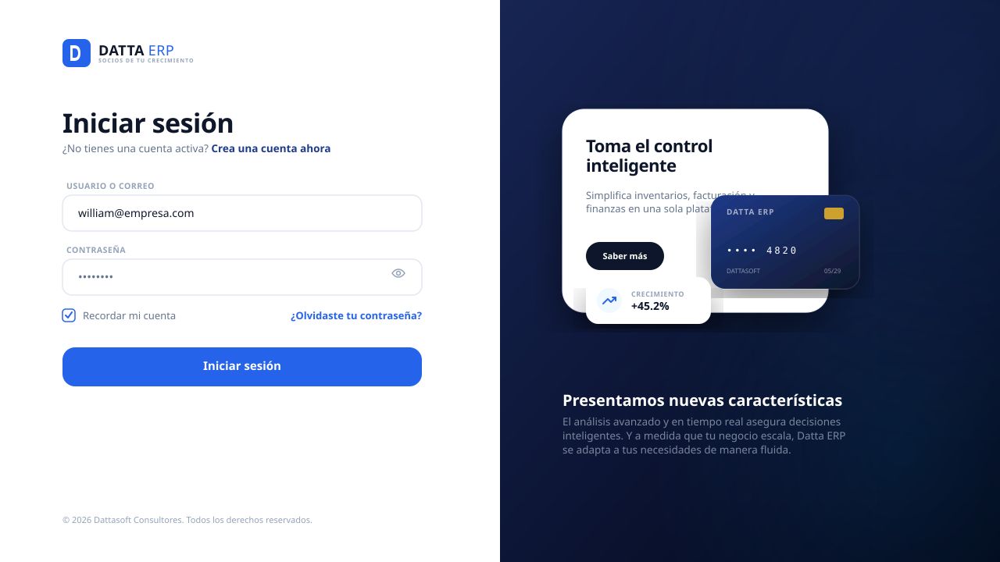
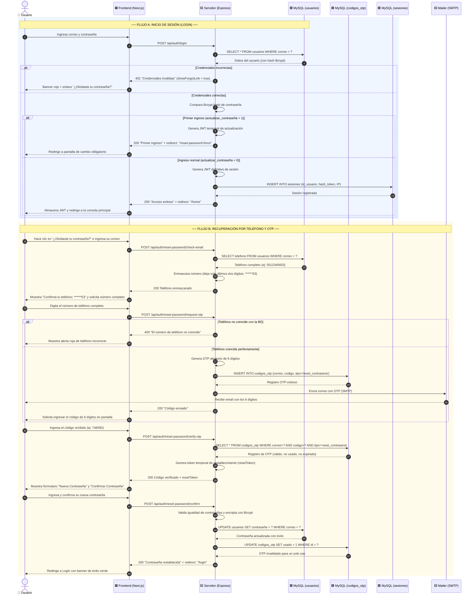
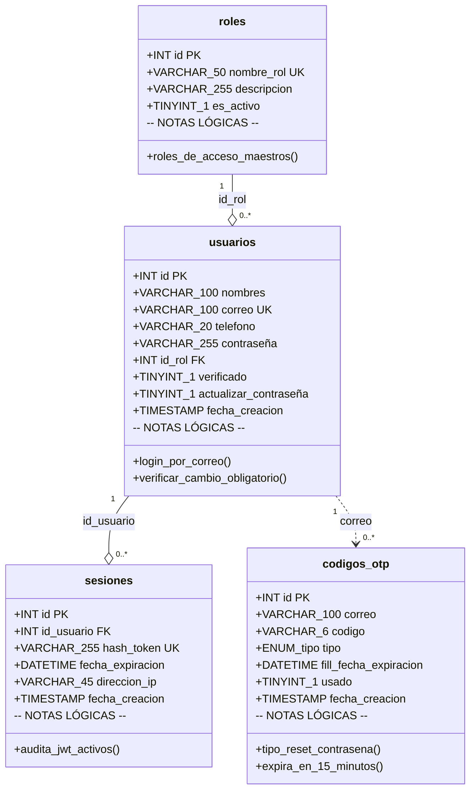

# 📋 Módulo de Acceso, Recuperación y Cambio de Contraseña — Datta ERP
> **Ruta:** `ds-qs/web/modules/login/Login_Plan.md`
> **Última actualización:** Mayo 2026
> **Arquitecto:** Antigravity — SaaS Module Planner Skill (Skill Activa)
> **Estado:** 🏗️ Planificación Técnica Aprobada — Listo para Desarrollo

---

## 📑 Índice

- [FASE 1 — El Corazón del Módulo (Lógica de Negocio y API)](#fase-1--el-corazón-del-módulo-lógica-de-negocio-y-api)
- [FASE 2 — Maqueta Visual (UX y Figma)](#fase-2--maqueta-visual-ux-y-figma)
- [FASE 3 — Diagramas UML (Flujos y Clases)](#fase-3--diagramas-uml-flujos-y-clases)
- [FASE 4 — Gestión de Errores y Transacciones](#fase-4--gestión-de-errores-y-transacciones)
- [FASE 5 — Seguridad y Matriz RBAC](#fase-5--seguridad-y-matriz-rbac)
- [FASE 6 — Lista de Implementación (Checklist)](#fase-6--lista-de-implementación-checklist)

---

# FASE 1 — El Corazón del Módulo (Lógica de Negocio y API)

## 🧩 ¿Qué problema resuelve este módulo?

El módulo de acceso y recuperación de contraseñas administra de forma robusta la puerta de entrada a **Datta ERP**. Regula la validación de identidad básica mediante contraseña segura y soluciona la problemática de cuentas nuevas que inician sesión con credenciales temporales generadas automáticamente, forzando la creación de claves definitivas personalizadas. 

Asimismo, gestiona la restauración autónoma de contraseñas olvidadas de forma segura mediante un **doble factor de propiedad telefónica enmascarada** y validación OTP directa a su correo electrónico.

---

## 🗄️ Tablas de la Base de Datos (MySQL)

Las tablas involucradas en el módulo residen en la base de datos maestra MySQL y son las siguientes:

### 1. `usuarios`
Contiene la ficha técnica del usuario y sus banderas de estado.
* **`correo` (VARCHAR):** Identificador exclusivo de inicio de sesión.
* **`contraseña` (VARCHAR):** Hash encriptado con Bcrypt (12 rondas de costo).
* **`telefono` (VARCHAR):** Número telefónico completo utilizado para la comprobación de propiedad física.
* **`actualizar_contraseña` (TINYINT):**
  * `1` = Clave genérica (fuerza redirección al formulario de cambio obligatorio al ingresar).
  * `0` = Clave definitiva (acceso normal).
* **`verificado` (TINYINT):** `1` = Cuenta autorizada para el login. `0` = Cuenta en sala de espera.

### 2. `codigos_otp`
Registra los OTPs generados para la restauración de claves.
* **`tipo` (ENUM):** Para este flujo se creará bajo el tipo `'reset_contrasena'`.
* **`usado` (TINYINT):** Evita la reutilización de códigos obsoletos una vez finalizada la confirmación de restauración.

### 3. `sesiones`
Audita las sesiones JWT abiertas.
* **`hash_token` (VARCHAR):** SHA-256 de la firma JWT.
* **`fecha_expiracion` (DATETIME):** Límite temporal de validez de la sesión activa.

---

## 🔄 Contrato de Comunicación (API de Control)

---

### Endpoint A: Inicio de Sesión (`POST /api/auth/login`)
Valida credenciales básicas.

#### 📥 Request
```json
{
  "correo": "william@empresa.com",
  "contraseña": "MiContraseñaGen123!"
}
```

#### 📤 Respuestas posibles
* **Acceso Estándar:**
  ```json
  {
    "status": 200,
    "token": "JWT_TOKEN...",
    "actualizar_contraseña": 0,
    "redirect": "/home"
  }
  ```
* **Acceso Primer Ingreso:**
  ```json
  {
    "status": 200,
    "token": "JWT_TEMPORAL...",
    "actualizar_contraseña": 1,
    "redirect": "/reset-password-force"
  }
  ```
* **Credenciales Incorrectas:**
  ```json
  {
    "status": 401,
    "error": "Las credenciales ingresadas son incorrectas.",
    "showForgotLink": true
  }
  ```

---

### Endpoint B: Comprobar Correo (`POST /api/auth/reset-password/check-email`)
Busca el correo para recuperar la contraseña y retorna el teléfono ocultando la mayor parte de sus dígitos.

#### 📥 Request
```json
{
  "correo": "william@empresa.com"
}
```

#### 📤 Respuesta
```json
{
  "status": 200,
  "telefonoEnmascarado": "******53"
}
```

---

### Endpoint C: Solicitud de OTP (`POST /api/auth/reset-password/request-otp`)
Compara el teléfono completo con el de la BD. Si coincide, envía un OTP de tipo `'reset_contrasena'`.

#### 📥 Request
```json
{
  "correo": "william@empresa.com",
  "telefono": "5512345653"
}
```

#### 📤 Respuesta OK
```json
{
  "status": 200,
  "message": "Código OTP enviado a tu correo registrado."
}
```

---

### Endpoint D: Validación de OTP (`POST /api/auth/reset-password/verify-otp`)
Valida el código de 6 dígitos ingresado por el usuario.

#### 📥 Request
```json
{
  "correo": "william@empresa.com",
  "codigo": "748392"
}
```

#### 📤 Respuesta OK
```json
{
  "status": 200,
  "message": "Código verificado con éxito.",
  "resetToken": "TEMP_RESET_SIGNATURE_TOKEN..."
}
```

---

### Endpoint E: Cambio de Contraseña de Recuperación (`POST /api/auth/reset-password/confirm`)
Establece la contraseña nueva definitiva en MySQL.

#### 📥 Request
```json
{
  "correo": "william@empresa.com",
  "resetToken": "TEMP_RESET_SIGNATURE_TOKEN...",
  "nuevaContraseña": "ClaveSeguraFinal1!",
  "confirmarContraseña": "ClaveSeguraFinal1!"
}
```

#### 📤 Respuesta OK
```json
{
  "status": 200,
  "message": "Contraseña restablecida con éxito.",
  "redirect": "/login"
}
```

---

### Endpoint F: Cambio Obligatorio de Primer Ingreso (`POST /api/auth/reset-password/force`)
*Ruta protegida bajo JWT.* Permite actualizar la clave inicial.

#### 📥 Request
```json
{
  "nuevaContraseña": "MiPasswordSeguro123!",
  "confirmarContraseña": "MiPasswordSeguro123!"
}
```

#### 📤 Respuesta OK
```json
{
  "status": 200,
  "message": "Contraseña definitiva guardada. ¡Bienvenido!",
  "redirect": "/home"
}
```

---

# FASE 2 — Maqueta Visual (UX y Figma)

> La interfaz ha sido diseñada bajo directrices SaaS premium responsivas, integrada en un panel modular sin ventanas emergentes intrusivas.



---

## ➿ Guía de Experiencia del Usuario (Flujos UX)

1. **Flujo de Acceso Regular:** El usuario inicia sesión en la tarjeta de login. Si sus credenciales coinciden y `actualizar_contraseña = 0`, el sistema lo redirige instantáneamente a su dashboard (**`/home`**). Si hay un fallo de clave, se congela la interfaz y se le muestra una alerta roja con el enlace de recuperación.
2. **Flujo de Primer Ingreso Obligatorio:** Si la contraseña genérica inicial es correcta, la API retorna el flag `actualizar_contraseña = 1`. El frontend Next.js intercepta este estado y desvía la navegación a la interfaz **Actualiza tu Contraseña** (`/reset-password-force`). Esta pantalla cuenta con validación visual nativa en color verde que rastrea la fuerza criptográfica de su clave en tiempo real. Al enviar, la BD desactiva el flag y le da acceso a `/home`.
3. **Flujo de Recuperación Modular:** El usuario pulsa en "¿Olvidaste tu contraseña?". El sistema le pide su correo y retorna su número enmascarado (`******53`). Al ingresar el teléfono completo idéntico al guardado, el servidor genera un OTP de 6 dígitos a su correo. El usuario introduce el código, se valida en línea e introduce su nueva clave. Al confirmar, el flujo transiciona con éxito a la pantalla de Login con un banner de éxito verde.

---

# FASE 3 — Diagramas UML (Flujos y Clases)

---

## 🔀 Diagrama de Secuencia UML (Acceso y Recuperación)



---

## 🗂️ Diagrama de Clases y Relaciones MySQL (UML Class Diagram)



---

# FASE 4 — Gestión de Errores y Transacciones

## 🔴 Catálogo de Errores y Excepciones

| # | Escenario de Error | HTTP | Mensaje al Usuario | Razón y Acción Técnica |
| :--: | :--- | :---: | :--- | :--- |
| 1 | Correo o clave errónea en Login | `401` | *“Las credenciales ingresadas son incorrectas.”* | Comprobación fallida. Se oculta qué campo falló por privacidad. |
| 2 | Cuenta sin verificar | `403` | *“Tu cuenta está pendiente de verificación...”* | `usuarios.verificado = 0`. Redirige a verificación inicial. |
| 3 | Correo inexistente al recuperar | `404` | *“No se encontró ninguna cuenta asociada a este correo electrónico.”* | La consulta de correo devolvió vacío. |
| 4 | Teléfono incorrecto | `400` | *“El número telefónico no coincide con el registrado en el sistema.”* | El número completo no es idéntico a la BD. |
| 5 | OTP incorrecto o expirado | `400` | *“El código OTP es incorrecto o ha expirado.”* | Búsqueda nula en `codigos_otp` o `fecha_expiracion < NOW()`. |
| 6 | Robustez de contraseña insuficiente | `422` | *“La contraseña debe tener mínimo 8 caracteres, 1 número y 1 símbolo especial.”* | Rechazo por expresión regular en schema Zod. |

---

## 🔄 Resiliencia Transaccional MySQL

Para asegurar la integridad, la confirmación de la contraseña recuperada ejecuta en una única transacción de base de datos:

1. **`START TRANSACTION`**
2. **`UPDATE usuarios`** $\rightarrow$ Reemplaza el hash de contraseña en `usuarios`.
3. **`UPDATE codigos_otp`** $\rightarrow$ Asigna `usado = 1` en `codigos_otp` para inhabilitarlo de forma permanente.
4. **`COMMIT`**

> [!IMPORTANT]
> Si cualquiera de los dos queries falla, se invoca un **`ROLLBACK`** completo, restaurando el OTP a estado activo e impidiendo que el usuario se quede con su contraseña genérica rota o código inutilizado.

---

# FASE 5 — Seguridad y Matriz RBAC

## 🔐 Matriz de Permisos del Módulo

El backend restringe el consumo de endpoints conforme al alcance (*scope*) y estatus del token de sesión:

| Endpoint | Método | Autenticación Requerida | Rol Permitido | Alcance del Token |
| :--- | :---: | :---: | :--- | :--- |
| `/api/auth/login` | `POST` | ❌ No (Público) | Cualquiera | Sin restricción |
| `/api/auth/reset-password/check-email` | `POST` | ❌ No (Público) | Cualquiera | Sin restricción |
| `/api/auth/reset-password/request-otp` | `POST` | ❌ No (Público) | Cualquiera | Sin restricción |
| `/api/auth/reset-password/verify-otp` | `POST` | ❌ No (Público) | Cualquiera | Sin restricción |
| `/api/auth/reset-password/confirm` | `POST` | ❌ No (Público) | Cualquiera | `reset_token` firmado por backend |
| `/api/auth/reset-password/force` | `POST` | 🟩 Sí (Transitorio) | Rol Genérico | `scope: "password_update_only"` |
| `/api/auth/logout` | `POST` | 🟩 Sí (Normal) | `admin`, `cliente`, `soporte` | `scope: "full_access"` |

---

# FASE 6 — Lista de Implementación (Checklist)

A continuación se presenta la lista detallada de tareas ordenadas por capa para dar inicio al desarrollo:

### 🟨 Capa Backend (Node.js/Express)
- [ ] Configurar las rutas en `/src/modules/auth/auth.routes.js`.
- [ ] Definir schemas de validación Zod (`auth.schema.js`) para Login, Teléfono y Nuevas Claves.
- [ ] Implementar consultas y métodos transaccionales en `auth.repository.js`:
  - `obtenerUltimoOtp` (comprobaciones de cooldown).
  - `actualizarContraseñaTransaccional` (con control de `COMMIT`/`ROLLBACK`).
- [ ] Diseñar middleware de validación de alcance de JWT (`scope: "password_update_only"`).
- [ ] Programar lógica del controlador `auth.controller.js` mapeando respuestas y HTTP Status.
- [ ] Registrar la sesión en la tabla `sesiones` e implementar el endpoint de `logout` con invalidación física.

### 🟦 Capa Frontend (Next.js/React)
- [ ] Crear la página de Login en `app/login/page.tsx` conectando el formulario con `react-hook-form`.
- [ ] Diseñar el desvío automático de rutas si `actualizar_contraseña = 1`.
- [ ] Crear el formulario de cambio obligatorio de contraseña en `app/reset-password-force/page.tsx`.
- [ ] Programar barra gráfica reactiva de robustez criptográfica para claves nuevas.
- [ ] Construir la interfaz por pasos de recuperación en `app/login/components/RecuperarContraseña.tsx`:
  - Entrada de correo.
  - Validación de número telefónico mostrando `******53` dinámico.
  - Formulario e input para los 6 dígitos del OTP.
  - Entrada de contraseña nueva y confirmación de la misma.
- [ ] Integrar alertas interactivas utilizando `react-hot-toast` para notificaciones rápidas de éxito/error.

---

*Diseño y Planificación Técnica SaaS aprobados — Datta ERP — Mayo 2026*
