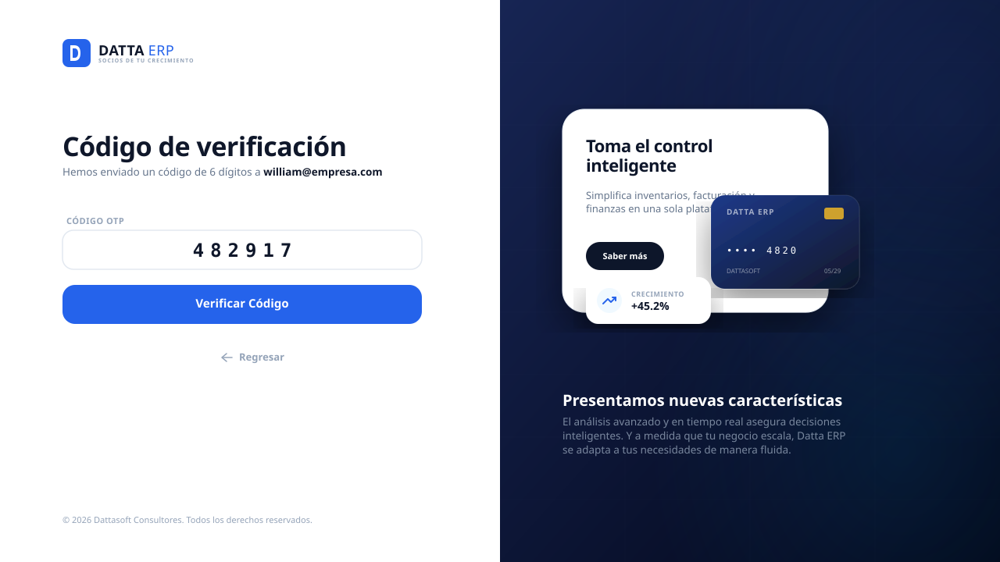
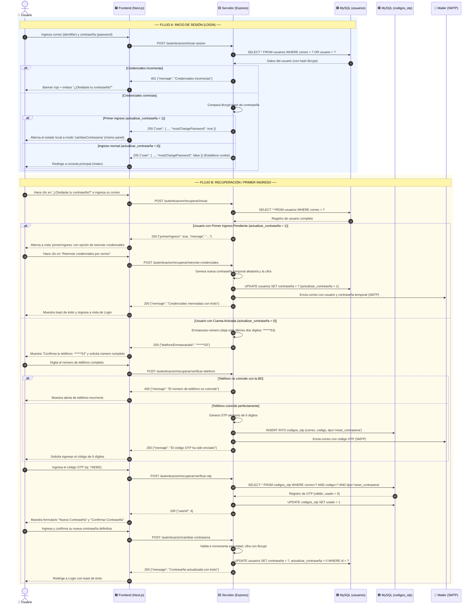
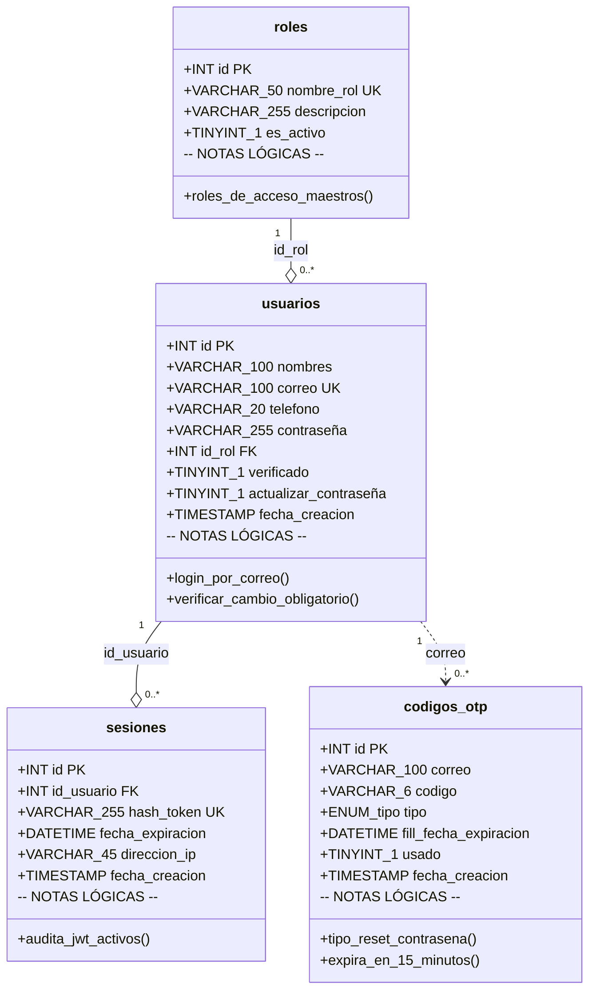

# 📋 Módulo de Acceso, Recuperación y Cambio de Contraseña — Datta ERP
> **Ruta:** `ds-qs/web/modules/login/Login_Plan.md`
> **Última actualización:** Mayo 2026
> **Arquitecto:** Antigravity — SaaS Module Planner Skill (Skill Activa)
> **Estado:** 🚀 100% Implementado y Validado

---

## 📑 Índice

- [FASE 1 — El Corazón del Módulo (Lógica de Negocio y API)](#fase-1--el-corazón-del-módulo-lógica-de-negocio-y-api)
- [FASE 2 — Maqueta Visual (UX y Figma)](#fase-2--maqueta-visual-ux-y-figma)
- [FASE 3 — Diagramas UML (Flujos y Clases)](#fase-3--diagramas-uml-flujos-y-clases)
- [FASE 4 — Gestión de Errores y Transacciones](#fase-4--gestión-de-errores-y-transacciones)
- [FASE 5 — Seguridad y Matriz RBAC](#fase-5--seguridad-y-matriz-rbac)
- [FASE 6 — Lista de Implementación (Checklist)](#fase-6--lista-de-implementación-checklist)

---

# FASE 1 — El Corazón del Módulo (Lógica de Negocio y API)

## 🧩 ¿Qué problema resuelve este módulo?

El módulo de acceso y recuperación de contraseñas administra de forma robusta la puerta de entrada a **Datta ERP**. Regula la validación de identidad básica mediante contraseña segura y soluciona la problemática de cuentas nuevas que inician sesión con credenciales temporales generadas automáticamente, forzando la creación de claves definitivas personalizadas. 

Asimismo, gestiona la restauración autónoma de contraseñas olvidadas de forma segura mediante un **doble factor de propiedad telefónica enmascarada** y validación OTP directa a su correo electrónico.

---

## 🗄️ Tablas de la Base de Datos (MySQL)

Las tablas involucradas en el módulo residen en la base de datos maestra MySQL y son las siguientes:

### 1. `usuarios`
Contiene la ficha técnica del usuario y sus banderas de estado.
* **`correo` (VARCHAR):** Identificador exclusivo de inicio de sesión.
* **`contraseña` (VARCHAR):** Hash encriptado con Bcrypt (12 rondas de costo).
* **`telefono` (VARCHAR):** Número telefónico completo utilizado para la comprobación de propiedad física.
* **`actualizar_contraseña` (TINYINT):**
  * `1` = Clave genérica (fuerza redirección al formulario de cambio obligatorio al ingresar).
  * `0` = Clave definitiva (acceso normal).
* **`verificado` (TINYINT):** `1` = Cuenta autorizada para el login. `0` = Cuenta en sala de espera.

### 2. `codigos_otp`
Registra los OTPs generados para la restauración de claves.
* **`tipo` (ENUM):** Para este flujo se creará bajo el tipo `'reset_contrasena'`.
* **`usado` (TINYINT):** Evita la reutilización de códigos obsoletos una vez finalizada la confirmación de restauración.

### 3. `sesiones`
Audita las sesiones JWT abiertas.
* **`hash_token` (VARCHAR):** SHA-256 de la firma JWT.
* **`fecha_expiracion` (DATETIME):** Límite temporal de validez de la sesión activa.

---

## 🔄 Contrato de Comunicación (API de Control - Producción)

---

### Endpoint A: Inicio de Sesión (`POST /autenticacion/iniciar-sesion`)
Valida las credenciales de acceso y retorna metadatos con el estado de cambio obligatorio.

#### 📥 Request
```json
{
  "identifier": "william@empresa.com",
  "password": "MiContraseñaGen123!"
}
```

#### 📤 Respuestas posibles
* **Acceso Estándar:**
  ```json
  {
    "data": {
      "user": {
        "id": 4,
        "nombres": "William",
        "apellido_paterno": "Perez",
        "correo": "william@empresa.com",
        "mustChangePassword": false
      }
    },
    "message": "Inicio de sesión exitoso"
  }
  ```
* **Acceso Primer Ingreso:**
  ```json
  {
    "data": {
      "user": {
        "id": 4,
        "nombres": "William",
        "apellido_paterno": "Perez",
        "correo": "william@empresa.com",
        "mustChangePassword": true
      }
    },
    "message": "Inicio de sesión exitoso"
  }
  ```
  *(El frontend Next.js detecta `mustChangePassword: true` y alterna el modo de vista local a `cambiarContrasena` sin redireccionar)*
* **Credenciales Incorrectas (401):**
  ```json
  {
    "mensaje": "Credenciales incorrectas"
  }
  ```

---

### Endpoint B: Iniciar Recuperación (`POST /autenticacion/recuperar/iniciar`)
Valida la existencia del correo electrónico. Si la cuenta es nueva (primer ingreso), bifurca el flujo bloqueando la recuperación tradicional por teléfono y OTP.

#### 📥 Request
```json
{
  "correo": "william@empresa.com"
}
```

#### 📤 Respuestas posibles
* **Usuario con Cuenta Activada:**
  ```json
  {
    "mensaje": "Correo electrónico validado con éxito.",
    "telefonoEnmascarado": "******53"
  }
  ```
* **Usuario con Primer Ingreso Pendiente:**
  ```json
  {
    "primerIngreso": true,
    "mensaje": "Se envió un correo con tus credenciales cuando te registraste por primera vez. Si no las tienes, podemos reenviártelas."
  }
  ```

---

### Endpoint C: Reenviar Credenciales Iniciales (`POST /autenticacion/recuperar/reenviar-credenciales`)
Genera una nueva contraseña temporal cifrada, mantiene el estatus de cambio obligatorio (`actualizar_contraseña = 1`) y reenvía el correo con credenciales iniciales.

#### 📥 Request
```json
{
  "correo": "william@empresa.com"
}
```

#### 📤 Respuesta OK
```json
{
  "mensaje": "Credenciales reenviadas con éxito. Por favor revisa tu correo electrónico."
}
```

---

### Endpoint D: Confirmar Teléfono y Enviar OTP (`POST /autenticacion/recuperar/verificar-telefono`)
Compara el teléfono ingresado con el registrado. Si coincide, genera y envía un OTP de 6 dígitos al correo electrónico del usuario.

#### 📥 Request
```json
{
  "correo": "william@empresa.com",
  "telefono": "5512345653"
}
```

#### 📤 Respuesta OK
```json
{
  "mensaje": "El código OTP ha sido enviado a tu correo electrónico."
}
```

---

### Endpoint E: Validar OTP de Recuperación (`POST /autenticacion/recuperar/verificar-otp`)
Comprueba la validez y expiración del código OTP y retorna el ID de usuario temporal para autorizar el cambio definitivo.

#### 📥 Request
```json
{
  "correo": "william@empresa.com",
  "codigo": "748392"
}
```

#### 📤 Respuesta OK
```json
{
  "mensaje": "Código OTP verificado con éxito.",
  "userId": 4
}
```

---

### Endpoint F: Confirmar Nueva Contraseña (`POST /autenticacion/cambiar-contrasena`)
Registra la contraseña definitiva cifrada en la base de datos y desactiva la bandera de actualización forzada (`actualizar_contraseña = 0`).

#### 📥 Request
```json
{
  "userId": 4,
  "newPassword": "MiPasswordSeguro123!"
}
```

#### 📤 Respuesta OK
```json
{
  "message": "Contraseña actualizada con éxito"
}
```

---

# FASE 2 — Maquetas Visuales y UX (Figma)

> La interfaz ha sido diseñada bajo directrices SaaS premium responsivas. Emplea un sistema de renderizado modular que transiciona entre estados dinámicamente sobre la misma tarjeta base (`page.tsx`), sin redirecciones forzosas de navegador.

### 0. Pantalla Principal: Inicio de Sesión Regular


### 1. Panel: Solicitar Correo


### 2. Panel: Verificar Teléfono (Doble Factor)


### 3. Panel: Ingresar Código OTP


### 4. Panel: Cambio / Restablecimiento de Contraseña
*Utilizado unificadamente para Primer Acceso o Recuperación Olvidada.*


---

## ➿ Guía de Experiencia del Usuario (Flujos UX)

1. **Flujo de Acceso Regular:** El usuario inicia sesión en la tarjeta de login. Si sus credenciales coinciden y `mustChangePassword` (de la base de datos `actualizar_contraseña`) es `false`, el sistema lo redirige instantáneamente a su dashboard (**`/index`**). Si hay un fallo de clave, se congela la interfaz y se le muestra una alerta roja con el enlace de recuperación.
2. **Flujo de Primer Ingreso Obligatorio:** Si la contraseña genérica inicial es correcta, la API retorna el flag `mustChangePassword: true`. El frontend Next.js intercepta este estado y **transiciona de forma dinámica dentro del mismo panel de Login** (cambiando al modo `cambiarContrasena` local), evitando redireccionamientos físicos del navegador. Esta pantalla de cambio obligatorio cuenta con validación en tiempo real de robustez de contraseña. Al enviar y actualizar, el flag en la BD se desactiva y el usuario inicia sesión de forma automática hacia `/index`.
3. **Flujo de Recuperación Modular:** El usuario pulsa en "¿Olvidaste tu contraseña?". El sistema le pide su correo. Si el usuario ya ha ingresado previamente (`actualizar_contraseña = 0`), la API valida el correo y retorna su número enmascarado (`******53`). Al ingresar el teléfono completo idéntico al guardado, el servidor genera un OTP de 6 dígitos a su correo. El usuario introduce el código, se valida en línea e introduce su nueva clave. Al confirmar, el flujo transiciona con éxito a la pantalla de Login con un banner de éxito verde.
4. **Flujo de Primer Ingreso en Recuperación:** Si el usuario solicita recuperar su contraseña pero aún no ha realizado su primer ingreso (`actualizar_contraseña = 1`), el sistema bloquea el flujo tradicional de restablecimiento. Transiciona de forma modular al panel de **"Primer ingreso"**, informando al usuario que se enviaron sus credenciales iniciales al registrarse. Si no cuenta con ellas, se habilita el botón de **"Reenviar credenciales por correo"**, el cual genera una nueva clave temporal encriptada en la base de datos y le envía un nuevo correo electrónico de bienvenida automatizado.

---

# FASE 3 — Diagramas UML (Flujos y Clases)

---

## 🔀 Diagrama de Secuencia UML (Acceso y Recuperación)



---

## 🗂️ Diagrama de Clases y Relaciones MySQL (UML Class Diagram)



---

# FASE 4 — Gestión de Errores y Transacciones

## 🔴 Catálogo de Errores y Excepciones

| # | Escenario de Error | HTTP | Mensaje al Usuario | Razón y Acción Técnica |
| :--: | :--- | :---: | :--- | :--- |
| 1 | Correo o clave errónea en Login | `401` | *“Las credenciales ingresadas son incorrectas.”* | Comprobación fallida. Se oculta qué campo falló por privacidad. |
| 2 | Cuenta sin verificar | `403` | *“Tu cuenta está pendiente de verificación...”* | `usuarios.verificado = 0`. Redirige a verificación inicial. |
| 3 | Correo inexistente al recuperar | `404` | *“No se encontró ninguna cuenta asociada a este correo electrónico.”* | La consulta de correo devolvió vacío. |
| 4 | Teléfono incorrecto | `400` | *“El número telefónico no coincide con el registrado en el sistema.”* | El número completo no es idéntico a la BD. |
| 5 | OTP incorrecto o expirado | `400` | *“El código OTP es incorrecto o ha expirado.”* | Búsqueda nula en `codigos_otp` o `fecha_expiracion < NOW()`. |
| 6 | Robustez de contraseña insuficiente | `422` | *“La contraseña debe tener mínimo 8 caracteres, 1 número y 1 símbolo especial.”* | Rechazo por expresión regular en schema Zod. |

---

## 🔄 Resiliencia Transaccional MySQL

Para asegurar la integridad, la confirmación de la contraseña recuperada ejecuta en una única transacción de base de datos:

1. **`START TRANSACTION`**
2. **`UPDATE usuarios`** $\rightarrow$ Reemplaza el hash de contraseña en `usuarios`.
3. **`UPDATE codigos_otp`** $\rightarrow$ Asigna `usado = 1` en `codigos_otp` para inhabilitarlo de forma permanente.
4. **`COMMIT`**

> [!IMPORTANT]
> Si cualquiera de los dos queries falla, se invoca un **`ROLLBACK`** completo, restaurando el OTP a estado activo e impidiendo que el usuario se quede con su contraseña genérica rota o código inutilizado.

---

# FASE 5 — Seguridad y Matriz RBAC

## 🔐 Matriz de Permisos del Módulo

El backend restringe el consumo de endpoints conforme al alcance (*scope*) y estatus de las rutas públicas y protegidas de autenticación:

| Endpoint | Método | Autenticación Requerida | Rol Permitido | Alcance / Nota |
| :--- | :---: | :---: | :--- | :--- |
| `/autenticacion/iniciar-sesion` | `POST` | ❌ No (Público) | Cualquiera | Validación de credenciales |
| `/autenticacion/recuperar/iniciar` | `POST` | ❌ No (Público) | Cualquiera | Valida correo y bifurca primer ingreso |
| `/autenticacion/recuperar/reenviar-credenciales` | `POST` | ❌ No (Público) | Cualquiera | Reenvía credenciales para primer ingreso |
| `/autenticacion/recuperar/verificar-telefono` | `POST` | ❌ No (Público) | Cualquiera | Verifica teléfono y envía OTP |
| `/autenticacion/recuperar/verificar-otp` | `POST` | ❌ No (Público) | Cualquiera | Valida OTP de 6 dígitos |
| `/autenticacion/cambiar-contrasena` | `POST` | ❌ No (Público) | Cualquiera / Autenticado | Asienta contraseña definitiva |

---

# FASE 6 — Lista de Implementación (Checklist)

A continuación se presenta la lista detallada de tareas ordenadas por capa para dar inicio al desarrollo:

### 🟨 Capa Backend (Node.js/Express)
- [x] Configurar las rutas de autenticación en `/src/modules/auth/auth.routes.js`.
- [x] Definir schemas de validación Zod (`auth.schema.js`) para Registro, Login, Teléfono y Nuevas Claves.
- [x] Implementar consultas y métodos transaccionales en `auth.repository.js` y `auth.service.js` (incluyendo control de OTP, expiraciones y cooldown).
- [x] Programar lógica del controlador `auth.controller.js` mapeando respuestas limpias con estatus HTTP adecuados.
- [x] Implementar regla de negocio de primer ingreso y endpoint de reenvío automático de credenciales.

### 🟦 Capa Frontend (Next.js/React)
- [x] Crear la página de Login en `app/login/page.tsx` conectando el formulario con `react-hook-form`.
- [x] Diseñar la alternancia de estados locales (`modoVista`) en el mismo componente de Login para flujo modular.
- [x] Crear e integrar el formulario de cambio obligatorio de contraseña dentro de `app/login/page.tsx` sin usar enrutamientos adicionales.
- [x] Implementar la función de "Recordar mi cuenta" persistiendo el identificador en `localStorage` al iniciar sesión con éxito.
- [x] Programar validaciones robustas y dinámicas de robustez criptográfica para claves nuevas integradas en el esquema Zod.
- [x] Construir la interfaz modular por pasos de recuperación integrada directamente en `app/login/page.tsx`:
  - [x] Paso 1: Entrada y validación de correo electrónico.
  - [x] Paso 2: Validación de número telefónico mostrando enmascarado dinámico `******53`.
  - [x] Paso 3: Entrada y verificación de código OTP de 6 dígitos.
  - [x] Paso 4: Formulario de contraseña nueva con confirmación.
  - [x] Paso 5: Vista de Primer Ingreso con botón para solicitar reenvío de credenciales iniciales.
- [x] Integrar alertas interactivas utilizando `react-hot-toast` para notificaciones rápidas de éxito/error.
- [x] Crear archivos de soporte estructural: `modules/login/login.schema.ts` y `modules/login/login.hooks.ts`.

---

*Diseño y Planificación Técnica SaaS aprobados — Datta ERP — Mayo 2026*
