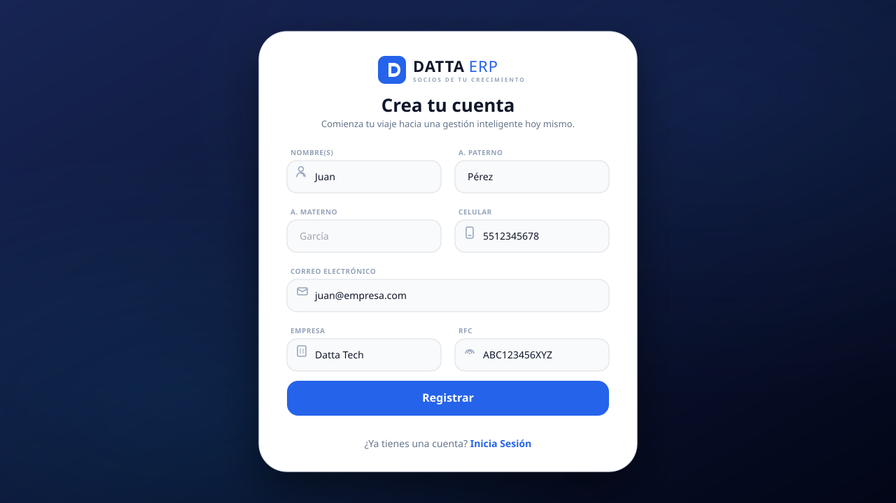
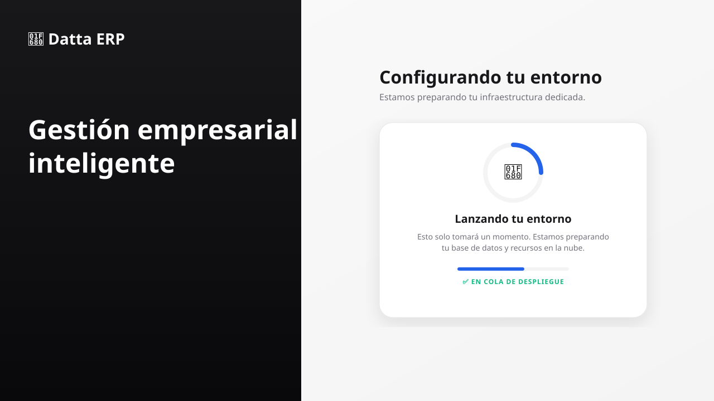
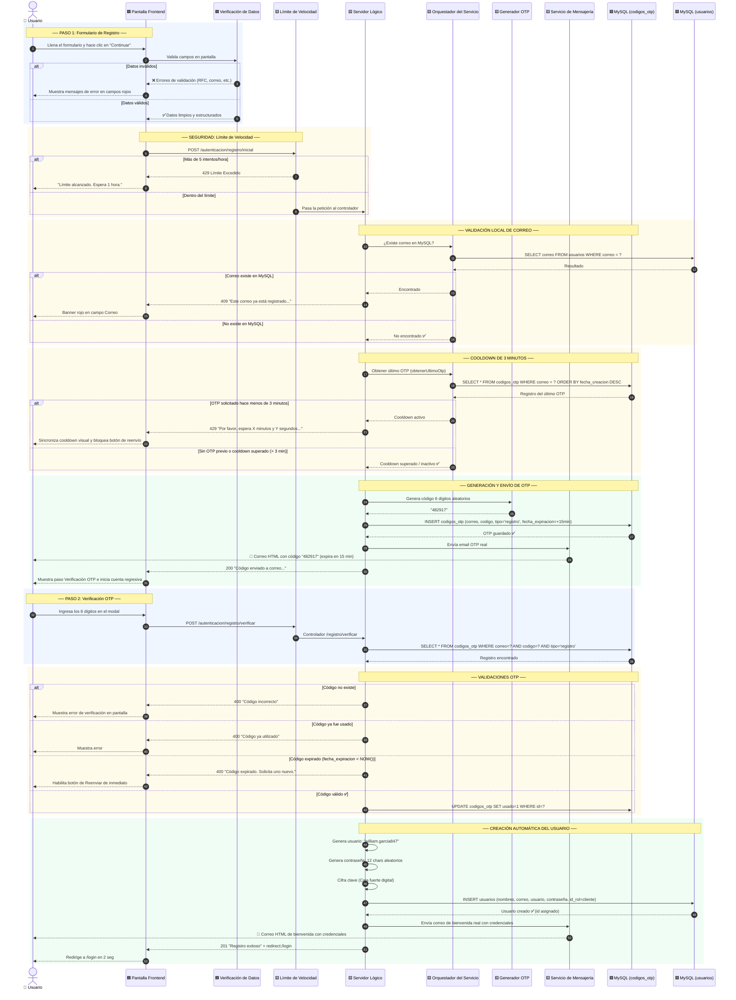
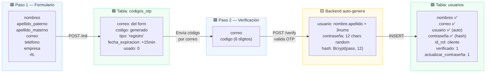
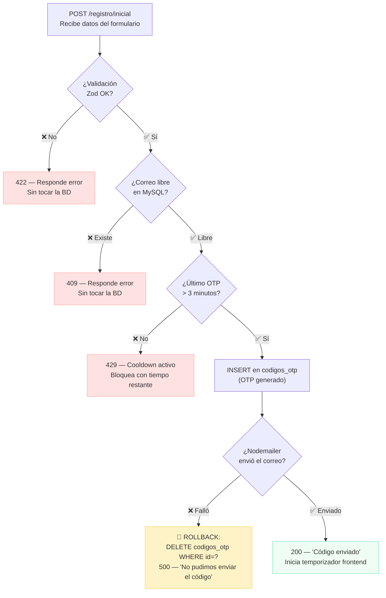
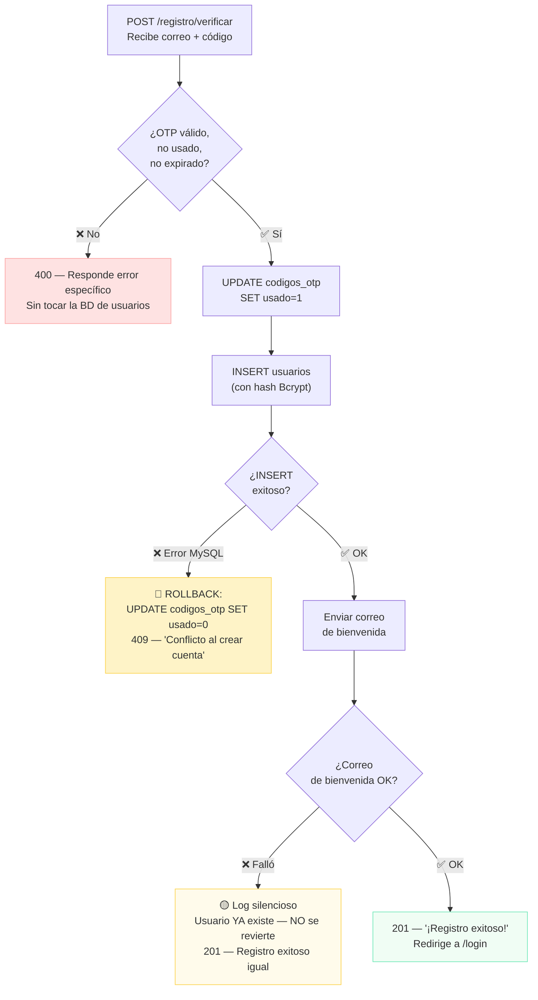

# 📋 Módulo de Registro de Usuarios — Datta ERP
> **Ruta:** `ds-qs/web/modules/registro/Registro_Plan.md`
> **Última actualización:** Mayo 2026
> **Arquitecto:** Antigravity — SaaS Module Planner Skill
> **Estado:** 🚀 100% Implementado y Validado

---

## 📑 Índice

- [FASE 1 — El Corazón del Módulo](#fase-1--el-corazón-del-módulo)
- [FASE 2 — Maqueta Visual (SVG)](#fase-2--el-figma-visual-maqueta-svg)
- [FASE 3 — Diagramas UML y Tablas](#fase-3--el-mapa-del-viaje-diagramas-uml)
- [FASE 4 — Gestión de Errores](#fase-4--el-plan-de-emergencia)
- [FASE 5 — Seguridad y Control](#fase-5--seguridad-y-control)
- [FASE 6 — Memoria Técnica Integral](#fase-6--memoria-técnica-integral)

---

# FASE 1 — El Corazón del Módulo

## 🧩 ¿Qué problema resuelve este módulo?

> *Imagina que Datta ERP es un edificio de oficinas exclusivo. El módulo de registro es la **recepcionista y el proceso de acreditación de visitantes**: valida que la persona no esté ya registrada, verifica que su correo es real enviándole un código secreto, y una vez confirmado, le crea automáticamente una tarjeta de acceso con usuario y contraseña — todo sin que el nuevo inquilino tenga que inventarse nada.*

El flujo se divide en **tres fases visuales (2 secuenciales de acción)**:

| Paso | Qué pasa en el mundo real | Endpoint |
| :--: | :--- | :--- |
| **1** | El usuario llena un formulario con sus datos y el sistema verifica de forma local en la base de datos MySQL que no exista el correo | `POST /autenticacion/registro/inicial` |
| **2** | El usuario recibe un código de 6 dígitos en su correo y lo confirma en línea dentro de la misma tarjeta con temporizador de cooldown visible | `POST /autenticacion/registro/verificar` |
| **3** | Aprovisionamiento: Pantalla de carga mientras se prepara la infraestructura y se configuran recursos. | *(interno, disparado al verificar)* |
| **Auto** | El sistema crea el usuario, genera sus credenciales y envía la bienvenida | *(backend)* |

---

## 🗄️ Tablas de la Base de Datos (MySQL)

> Las tablas involucradas en el registro son parte de la **BD Maestra MySQL** — la "recepción del edificio" que guarda el directorio de usuarios de manera centralizada. Ya no se realiza ninguna validación externa ni consulta en Velneo Cloud API para este flujo de correo.

### Tablas que participan en este módulo

#### 1. `usuarios` — Directorio Principal de Accesos
Este flujo inserta un nuevo registro de usuario una vez verificado su correo. Los campos recopilados del formulario frontend y persistidos en base de datos son:
* **Datos básicos del cliente:** `nombres`, `apellido_paterno`, `apellido_materno`, `empresa`, `rfc`, `correo`, y `telefono`.
* **Datos auto-generados por backend:** `usuario` (ej. `william.garcia847`), `contraseña` (hash Bcrypt temporal) e `id_rol` (asigna por defecto el rol de `cliente`).
* **Flags de estado de registro:** `verificado` (cambia de `0` a `1` al confirmar OTP) y `actualizar_contraseña` (setea en `1` para forzar cambio en primer inicio de sesión).

> 📘 El diccionario de datos detallado con tipos, índices y restricciones completas de la tabla `usuarios` se encuentra definido en el [Blueprint de Arquitectura](../../architecture/blueprint.md#1-tabla-usuarios).

---

#### 2. `codigos_otp` — Registro de Verificaciones
Almacena temporalmente los códigos de verificación de 6 dígitos vinculados a cada correo, regulando el cooldown de 3 minutos y la expiración rígida de 15 minutos.

> 📘 La definición técnica del esquema y ciclo de vida de la tabla `codigos_otp` se encuentra centralizada en la [Documentación del Servicio de Correo y OTP](../../servicios/correo_servicio.md#9-estructura-de-datos-tabla-codigos_otp).

---

#### 3. `roles` — Niveles de Permiso
Catálogo de perfiles. En este módulo se consulta la tabla para validar y asignar de forma segura el rol de `cliente` (el nivel de privilegios por defecto) sin delegar esta decisión al cliente frontend.

> 📘 El esquema detallado de la tabla `roles` está disponible en el [Blueprint de Arquitectura](../../architecture/blueprint.md#2-tabla-roles).

---

## 🔄 Contrato de Comunicación (API)

---

### Endpoint 1: `POST /autenticacion/registro/inicial`
**¿Qué hace?** → Valida el formulario, verifica que el correo no exista en MySQL, comprueba si no está bajo el límite de cooldown de 3 minutos, y envía el código OTP mediante Nodemailer SMTP real.

#### 📥 Request (lo que envía el formulario)

```json
{
  "nombres": "William",
  "apellido_paterno": "García",
  "apellido_materno": "López",
  "correo": "william@empresa.com",
  "telefono": "5512345678",
  "empresa": "Empresa SA de CV",
  "rfc": "GALW850101ABC"
}
```

#### 📤 Respuestas posibles

| Situación | HTTP | Respuesta |
| :--- | :---: | :--- |
| ✅ OTP enviado correctamente | `200` | `{ "message": "Código enviado a william@empresa.com" }` |
| ❌ Correo ya existe en MySQL | `409` | `{ "error": "Este correo ya está registrado en el sistema. ¿Olvidaste tu contraseña?" }` |
| ❌ Cooldown activo (< 3 min) | `429` | `{ "error": "Por favor, espera X minutos y Y segundos antes de solicitar otro código." }` |
| ❌ Datos inválidos (Zod) | `422` | `{ "error": "El RFC debe tener entre 12 y 13 caracteres." }` |
| ❌ Límite IP alcanzado | `429` | `{ "error": "Demasiados intentos. Espera 1 hora e intenta de nuevo." }` |

---

### Endpoint 2: `POST /autenticacion/registro/verificar`
**¿Qué hace?** → Valida el OTP, crea el usuario de manera transaccional, genera sus credenciales y envía el correo de bienvenida.

#### 📥 Request (lo que envía el modal OTP)

```json
{
  "correo": "william@empresa.com",
  "codigo": "482917"
}
```

> 🔔 **Nota:** El frontend guarda temporalmente los datos del formulario (Step 1) en memoria o localStorage para usarlos en este paso sin pedirlos de nuevo.

#### 📤 Respuestas posibles

| Situación | HTTP | Respuesta |
| :--- | :---: | :--- |
| ✅ Registro completo | `201` | `{ "message": "¡Registro exitoso! Revisa tu correo con tus credenciales.", "redirect": "/login" }` |
| ❌ Código incorrecto | `400` | `{ "error": "El código ingresado es incorrecto." }` |
| ❌ Código expirado | `400` | `{ "error": "El código ha expirado. Solicita uno nuevo." }` |
| ❌ Código ya usado | `400` | `{ "error": "Este código ya fue utilizado." }` |
| ❌ Demasiados intentos IP | `429` | `{ "error": "Límite de intentos alcanzado. Espera 1 hora." }` |

---

### 🔧 Lógica interna del Endpoint 2 (al verificar el OTP)

Cuando el código es válido, el backend ejecuta automáticamente y en orden:

1. ✅ Marca el OTP como `usado = 1` en `codigos_otp`
2. 🧠 Genera el `usuario`: `william.garcia` + 3 dígitos aleatorios → `william.garcia847`
3. 🔑 Genera contraseña de 12 caracteres aleatorios (letras + números + símbolos)
4. 🔒 Encripta la contraseña con **Bcryptjs** (factor de costo: 12 rondas)
5. 💾 Inserta el nuevo registro en `usuarios` asignando el rol predeterminado de cliente.
6. 📧 Envía correo de bienvenida con usuario y contraseña usando `correo.service.js` (Plantilla HTML real)
7. 🔀 Devuelve al frontend la señal para redirigir al `/login`

---

## 🛡️ Reglas de Seguridad Aplicadas

| Política | ¿Cómo funciona? | Librería |
| :--- | :--- | :--- |
| **Rate Limiting (IP)** | Máximo 5 intentos por hora por IP en `/registro/inicial` y `/registro/verificar` | `express-rate-limit` |
| **3-Minute OTP Cooldown** | Evita la generación masiva de OTP para una cuenta. MySQL audita la última fecha de creación (`fecha_creacion`). Si transcurren menos de 180 segundos, rechaza con HTTP 429 indicando el tiempo exacto restante. | MySQL + Backend logic |
| **Validación de datos** | Zod valida cada campo en frontend y re-valida en backend | `zod` |
| **Contraseña encriptada** | Bcrypt con 12 rondas transforma la contraseña en un hash irrecuperable | `bcryptjs` |
| **OTP de un solo uso** | El campo `usado` en `codigos_otp` impide reutilización | MySQL |
| **OTP con expiración** | 15 minutos de validez máxima antes de rechazo | MySQL `DATETIME` |
| **Unicidad estricta local** | Se consulta la BD de manera transaccional e indexada para garantizar un solo correo registrado | MySQL `UNIQUE KEY` |
| **TypeScript Compilación Segura** | Uso de encadenamiento opcional `?.` en desreferenciaciones dinámicas de errores Zod para prevenir cuelgues ante alertas de red | Frontend React `app/registro/page.tsx` |

---

## 📦 Dependencias Instaladas

> Estas librerías ya fueron instaladas, compiladas y configuradas en el entorno local (Node v24 y pnpm). Para garantizar la compatibilidad TypeScript en entornos híbridos sin descargas externas redundantes, se inyectó una declaración ambiental de tipos local para `js-cookie` bajo el directorio de tipos raíz.

```bash
# Backend
pnpm add zod bcryptjs nodemailer express-rate-limit mysql2

# Frontend
pnpm add @tanstack/react-query react-hook-form lucide-react js-cookie react-hot-toast
```

---

# FASE 2 — El "Figma" Visual (Maqueta SVG)

> La maqueta muestra los **tres estados del módulo** integrados directamente en el panel principal (sin modales externos). Diseño **Light Mode**, estilo dashboard SaaS moderno con gradientes.

### Paso 1 — Formulario de Registro


### Paso 2 — Verificación OTP


### Paso 3 — Aprovisionamiento


---

## ➿ Guía de Experiencia (UX) — Qué pasa al interactuar

### Estado 1: Formulario de Registro

| Acción del usuario | ¿Qué ocurre en pantalla? | ¿Qué ocurre en el servidor? |
| :--- | :--- | :--- |
| Escribe en el campo **Correo** | El borde se vuelve azul (campo activo). Al salir, Zod valida el formato y se muestra el error si es inválido. | Nada aún — la validación de formato es local (frontend). |
| Hace clic en **Registrar** | Zod valida todos los campos. Si hay errores, los campos inválidos se marcan en rojo con un mensaje. Si todo está bien, aparece un spinner sobre el botón. | `POST /autenticacion/registro/inicial` → verifica que el correo no exista en MySQL, comprueba que no tenga un cooldown activo → genera OTP → envía correo. |
| El servidor responde OK | El formulario se oculta y aparece la vista **Verifica tu correo** en el mismo panel. El temporizador del cooldown de 3 minutos empieza a correr. | OTP guardado en `codigos_otp` con `fecha_expiracion` y `fecha_creacion`. |
| El servidor responde error `409` | Aparece un banner rojo debajo del campo Correo: *"Este correo ya está registrado en el sistema. ¿Olvidaste tu contraseña?"* | Ningún OTP fue generado. |
| El servidor responde error `429` (IP) | El botón se deshabilita y muestra: *"Demasiados intentos. Espera 1 hora e intenta de nuevo."* | Rate limit de `express-rate-limit` activo. |

### Estado 2: Verificación OTP (En línea)

| Acción del usuario | ¿Qué ocurre en pantalla? | ¿Qué ocurre en el servidor? |
| :--- | :--- | :--- |
| Escribe en los inputs | Ingresa el código OTP. El botón de Confirmación de Registro se habilita. | Nada aún. |
| Cooldown en marcha | El botón **Reenviar código** se muestra deshabilitado con un indicador pulsante azul (`animate-pulse`) y una cuenta regresiva dinámica (ej: `Reenviar código en 2:45`). | Si el usuario intenta burlar el frontend e invoca el endpoint `/registro/inicial` antes de tiempo, el backend responde HTTP 429 con el mensaje de espera detallado. |
| Fin del cooldown | Al llegar a `0:00`, el temporizador desaparece y el botón se habilita mostrando: `¿No recibiste el código? Reenviar`. | Listo para aceptar una nueva solicitud legítima de generación de OTP. |
| Sincronización automática | Si el usuario recarga la página a mitad del flujo o falla la petición del OTP, al reenviar antes de tiempo la respuesta `429` del backend es parseada mediante expresiones regulares para restaurar el temporizador del frontend. | Verifica el timestamp real de creación en la base de datos. |
| Hace clic en **Confirmar Registro** | La tarjeta cambia a Estado 3 (Aprovisionamiento) con un cohete y un spinner indicando que se está configurando el entorno. | `POST /autenticacion/registro/verificar` → valida OTP en `codigos_otp` → si correcto: crea usuario, genera credenciales, envía bienvenida. |
| Verificación exitosa | Se muestra el banner *"¡Registro exitoso! Revisa tu correo con tus credenciales."* y redirige a `/login`. | `codigos_otp.usado = 1`. Nuevo registro en `usuarios` con `verificado = 1`. Correo de bienvenida disparado. |
| Código incorrecto/expirado | Mensajes de validación de error en color rojo en la parte inferior del input. | Backend rechaza el código por fecha o coincidencia. |

---

# FASE 3 — El Mapa del Viaje (Diagramas UML)

---

## 🔀 Diagrama de Secuencia — Flujo completo de registro

> *Lee este diagrama de arriba a abajo siguiendo las flechas. Cada línea es un "mensaje" que viaja entre el navegador del usuario, el servidor y la base de datos.*
> - 🟦 **Azul** = Pantalla / Frontend
> - 🟨 **Ámbar** = Servidor / Lógica de negocio
> - 🟩 **Verde** = Base de datos / Tablas



---

## 🗂️ Diagrama de Clases y Tablas — Relaciones de la BD

> *Este diagrama muestra cómo están conectadas las tablas de MySQL para este módulo. Piénsalo como un mapa que dice: "esta tabla depende de esta otra, y así es como se relacionan".*


### ¿Cómo se leen las relaciones?

| Relación | ¿Qué significa en palabras simples? |
| :--- | :--- |
| `roles` → `usuarios` | Cada usuario tiene **un** rol (ej: `cliente`). Un rol puede asignarse a **muchos** usuarios. |
| `usuarios` → `sesiones` | Cada usuario puede tener **muchas** sesiones activas (dispositivos distintos). *No aplica aún en este módulo.* |
| `usuarios` ↔ `codigos_otp` | La relación es por **correo** (no por FK), porque el OTP se genera antes de que el usuario exista en la tabla. |

---

### Flujo de columnas durante el registro



---

# FASE 4 — El Plan de Emergencia (Gestión de Errores y Resiliencia)

> *¿Qué pasa si algo falla? Este plan define cómo el sistema se protege solo, qué le dice al usuario y cómo evita dejar datos a medias en la base de datos.*

---

## 🔴 Catálogo de Errores — ¿Qué puede salir mal?

### Endpoint 1: `POST /autenticacion/registro/inicial`

| # | Escenario de error | HTTP | Mensaje al usuario | ¿Qué hace el sistema internamente? | Clase de error |
| :--: | :--- | :---: | :--- | :--- | :--- |
| 1 | Campo inválido (ej: RFC con más de 13 chars, correo sin `@`) | `422` | *"El RFC debe tener entre 12 y 13 caracteres."* | Zod corta el flujo antes de tocar la BD. | `ValidationError` |
| 2 | Correo ya registrado en MySQL | `409` | *"Este correo ya está registrado en el sistema. ¿Olvidaste tu contraseña?"* | SELECT en `usuarios` devuelve resultado → detiene ejecución de inmediato. Sin escrituras. | `AppError` |
| 3 | Cooldown activo de 3 minutos | `429` | *"Por favor, espera X minutos y Y segundos antes de solicitar otro código."* | El backend obtiene el último OTP creado para ese email. Si la diferencia es menor a 180s, aborta la operación arrojando HTTP 429 con el temporizador restante dinámico. | `AppError` (Cooldown) |
| 4 | Fallo al enviar el correo OTP (Nodemailer SMTP) | `500` | *"No pudimos enviar el código de verificación. Intenta de nuevo."* | 🔴 **Rollback:** El OTP insertado se **elimina físicamente** de `codigos_otp` para evitar desincronizaciones en la BD. | `AppError` + DELETE OTP |
| 5 | Error de conexión a MySQL | `503` | *"Servicio no disponible temporalmente."* | El pool de conexiones lanza excepción. `DatabaseError` capturado por el middleware global. | `DatabaseError` |
| 6 | Más de 5 intentos en 1 hora por IP | `429` | *"Demasiados intentos. Espera 1 hora e intenta de nuevo."* | `express-rate-limit` bloquea por IP antes de llegar al controller. | Middleware |

---

### Endpoint 2: `POST /autenticacion/registro/verificar`

| # | Escenario de error | HTTP | Mensaje al usuario | ¿Qué hace el sistema internamente? | Clase de error |
| :--: | :--- | :---: | :--- | :--- | :--- |
| 7 | Código de 6 dígitos incorrecto | `400` | *"El código ingresado es incorrecto."* | SELECT no encuentra coincidencia. Sin escrituras en `usuarios`. | `ValidationError` |
| 8 | Código ya fue utilizado | `400` | *"Este código ya fue utilizado."* | `usado = 1` detectado en SELECT. Sin escrituras. | `ValidationError` |
| 9 | Código expirado | `400` | *"El código ha expirado. Solicita uno nuevo."* | Comparación en SELECT determina que superó 15 min. Sin escrituras. | `ValidationError` |
| 10 | Fallo al insertar el usuario (MySQL) | `409` | *"Ocurrió un conflicto al crear tu cuenta. Contacta soporte."* | 🔴 **Rollback:** El OTP NO se marca como usado (`usado = 0`). El usuario mantiene su derecho a reintentar. | `DatabaseError` |
| 11 | Fallo al enviar correo de bienvenida | `201` ⚠️ | *(Ninguno — registro exitoso)* | 🟡 El usuario ya existe en BD. El error del correo de bienvenida se registra en los logs del servidor de forma silenciosa para envío manual posterior. | Log interno |

---

## 🔄 Estrategia de Rollback — ¿Cómo protegemos la BD?

### Paso 1: `/registro/inicial` (Envío de OTP)



### Paso 2: `/registro/verificar` (Creación de Usuario)



---

# FASE 5 — Seguridad y Control (¿Quién ve qué?)

### Reglas de aislamiento aplicadas en el registro

| Regla | ¿Cómo se implementa? | ¿Dónde vive en el código? |
| :--- | :--- | :--- |
| **Correo único global** | `UNIQUE KEY idx_correo_unico (correo)` en MySQL impide duplicados entre todos los tenants | `bd.sql` → tabla `usuarios` |
| **Usuario único global** | `UNIQUE KEY idx_usuario_unico (usuario)` — el nombre de usuario generado es irrepetible | `bd.sql` → tabla `usuarios` |
| **Sin acceso cruzado en el registro** | El controller de autenticación solo realiza escrituras transaccionales sobre sus tablas locales y nunca lee dominios externos. | `src/modules/auth/` |
| **Protección contra ataques de spam** | Cooldown estricto de 3 minutos por correo, bloqueando la API en el backend incluso ante reenvíos manuales por Postman/cURL. | `auth.service.js` |
| **OTP sin FK al usuario** | El código OTP existe antes de que el usuario exista en `usuarios`, aislando la lógica de validación previa. | `codigos_otp.correo` |

---

## 🔐 Capas de Seguridad — De la Petición al Dato

> *Antes de que cualquier dato llegue a la base de datos, pasa por 5 capas de revisión. Piénsalo como el control de seguridad y portería de un edificio de apartamentos.*

```mermaid
flowchart LR
    REQ["📡 Petición<br/>del usuario"] --> H

    subgraph L1["Capa 1 🟨 — Escudo de Privacidad + CORS"]
        H["Cabeceras seguras<br/>Solo origen oficial<br/>permitido"]
    end

    subgraph L2["Capa 2 🟨 — Límite de Velocidad + Cooldown"]
        RL["Límite de peticiones<br/>+ Cooldown de 3 min<br/>por correo"]
    end

    subgraph L3["Capa 3 🟦 — Validación Local"]
        Z["Validación en pantalla<br/>antes de enviar<br/>la petición"]
    end

    subgraph L4["Capa 4 🟨 — Verificación Inteligente en Servidor"]
        ZB["Re-validación lógica<br/>en el servidor<br/>(cero confianza en cliente)"]
    end

    subgraph L5["Capa 5 🟩 — Encriptación + MySQL"]
        B["Cifrado de contraseña<br/>en caja fuerte digital<br/>antes del INSERT"]
    end

    H --> RL
    RL --> Z
    Z --> ZB
    ZB --> B
    B --> DB[("🟩 MySQL<br/>Dato seguro")]

    style L1 fill:#FFFBEB,stroke:#FCD34D
    style L2 fill:#FFFBEB,stroke:#FCD34D
    style L3 fill:#EFF6FF,stroke:#93C5FD
    style L4 fill:#FFFBEB,stroke:#FCD34D
    style L5 fill:#F0FDF4,stroke:#6EE7B7
```



---

# FASE 6 — Memoria Técnica Integral

---

## 📌 Ficha del Módulo

| Campo | Valor |
| :--- | :--- |
| **Nombre** | Módulo de Registro de Usuarios |
| **Proyecto** | Datta ERP — SaaS Multi-tenant |
| **Sprint** | Sprint 1 — Autenticación (Registro) |
| **Estado** | 🚀 100% Implementado y Validado |
| **Endpoints** | `POST /autenticacion/registro/inicial` · `POST /autenticacion/registro/verificar` |
| **Tablas afectadas** | `usuarios` · `codigos_otp` · `roles` |
| **Dependencias Clave** | `zod` · `bcryptjs` · `nodemailer` · `express-rate-limit` (backend) · `react-hook-form` · `@tanstack/react-query` (frontend) |
| **Documentado por** | Antigravity — SaaS Module Planner Skill |
| **Última actualización** | Mayo 2026 |

---

## 🔌 Referencia Rápida de API

| Endpoint | Método | Auth | Rate Limit & Cooldown | Éxito | Error principal |
| :--- | :---: | :---: | :---: | :---: | :--- |
| `/autenticacion/registro/inicial` | `POST` | ❌ Público | 5/hora por IP + Cooldown 3 min | `200` | `409` correo dup · `429` Cooldown activo · `422` Zod |
| `/autenticacion/registro/verificar` | `POST` | ❌ Público | 5/hora por IP | `201` | `400` OTP inv/exp/usado · `409` INSERT dup |

---

## 🗄️ Tablas MySQL Involucradas

| Tabla | Operación | Momento | Campo clave |
| :--- | :---: | :--- | :--- |
| `roles` | `SELECT` | Al verificar OTP | `nombre_rol = 'cliente'` |
| `usuarios` | `SELECT` (check) + `INSERT` | Check en `/init` · Insert en `/verify` | `correo` UK · `usuario` UK |
| `codigos_otp` | `INSERT` + `UPDATE` + `DELETE` | Insert en `/init` · Update en `/verify` · Delete si Nodemailer falla | `usado` · `fecha_expiracion` |

---

## 🛡️ Seguridad — Checklist

- [x] Helmet headers en todas las rutas (`security.middleware.js`)
- [x] CORS restringido a `CLIENT_URL` (`app.js`)
- [x] Rate limit específico: **3 req/hora por IP** en `/register/*`
- [x] Validación Zod en **frontend** (UX) y **backend** (seguridad real)
- [x] `id_rol` asignado desde servidor — nunca desde el cliente
- [x] OTP de **un solo uso** (`usado = 1` al verificar)
- [x] OTP con **expiración de 15 minutos** (`fecha_expiracion`)
- [x] Cooldown estricto de **3 minutos** respaldado en base de datos (`codigos_otp`)
- [x] Correo verificado únicamente de manera local en **MySQL** antes de crear OTP
- [x] Contraseña generada con **12 caracteres aleatorios**
- [x] Hash con **Bcrypt factor 12** antes del INSERT
- [x] Credenciales enviadas **solo por correo TLS** — nunca en respuesta HTTP
- [x] `actualizar_contraseña = 1` fuerza cambio en primer login

---

## 📂 Estructura de Archivos Existente (Sprint 1)

```text
backend/src/
├── app.js                  → Configura Express, middlewares de seguridad, CORS, rate limits
├── routes.js               → Enrutador global de la API (/auth)
├── config/
│   └── database.js         → Pool de conexiones MySQL2 con soporte para promesas
├── middlewares/
│   ├── index.js            → Empaqueta middlewares
│   ├── rateLimit.middleware.js → Rate limit global y específico
│   └── security.middleware.js  → Helmet configuration
├── services/
│   └── correo.service.js   → Envío de correos reales (OTP y bienvenida)
└── modules/auth/
    ├── auth.routes.js      → Rutas POST /registro/inicial y /registro/verificar (bajo prefijo /autenticacion)
    ├── auth.controller.js  → Controlador que mapea payloads y maneja errores
    ├── auth.service.js     → Lógica de negocio (cooldown 3min, Bcrypt, hash, nodemailer)
    ├── auth.schema.js      → Esquemas de validación Zod
    └── auth.repository.js  → DAL para consultas SQL en MySQL (obtenerUltimoOtp, etc. con fecha_creacion)

frontend/
├── app/
│   ├── globals.css         → Diseño estético y tokens TailwindCSS
│   ├── layout.tsx          → Layout global con QueryProvider y Toaster
│   ├── login/
│   │   └── page.tsx        → Formulario de Login e inicio de sesión
│   └── registro/
│   │   └── page.tsx        → Formulario de Registro con flujo OTP y temporizador
├── modules/
│   └── registro/
│       └── registro.schema.ts → Validación Zod y documentación JSDoc premium
├── providers/
│   └── QueryProvider.tsx   → Configura TanStack React Query Client y JSDoc
└── types/
    └── js-cookie.d.ts      → Declaración de tipo local estricto para Cookies
```

---

## 📋 Checklist de Implementación Finalizado (Sprint 1)

### Backend
- [x] Instalar dependencias (`zod`, `bcryptjs`, `nodemailer`, `express-rate-limit`, `mysql2`)
- [x] Crear `auth.schema.js` con esquemas Zod
- [x] Crear `auth.repository.js` con consultas transaccionales (`obtenerUltimoOtp`, etc.)
- [x] Crear `auth.service.js` con lógica OTP, Bcrypt y regla de 3 minutos de Cooldown
- [x] Crear `auth.controller.js` con manejo robusto de excepciones y HTTP Status
- [x] Crear `auth.routes.js` asociando el rate limiter de 3 intentos/hora e IPs
- [x] Conectar enrutador principal en `routes.js`
- [x] Configurar `correo.service.js` y variables en el archivo `.env` de producción

### Frontend
- [x] Instalar dependencias (`@tanstack/react-query`, `react-hook-form`, `lucide-react`, `js-cookie`, `react-hot-toast`)
- [x] Crear e integrar `QueryProvider` y `Toaster` en `layout.tsx`
- [x] Diseñar el split layout y responsive de `app/registro/page.tsx`
- [x] Configurar e integrar `useForm` con validación dinámica nativa
- [x] Desarrollar estado visual multietapa (`registro`, `verificacion`, `procesando`)
- [x] Implementar contador regresivo en tiempo real para el cooldown de 180s
- [x] Configurar parseo dinámico de HTTP 429 con expresiones regulares para resincronización de timer
- [x] Crear micro-animaciones premium en el botón de reenvío con pulsing dot azul
- [x] Crear archivo ambiental de tipos estricto `frontend/types/js-cookie.d.ts`
- [x] Resolver fallos de compilador TS usando encadenamiento opcional `?.` en desreferenciaciones de mensajes de error de Zod
- [x] Inyectar JSDoc premium estructurado en el validador de esquemas `registro.schema.ts` y en `QueryProvider.tsx`

---

*Actualización automática: Mayo 2026 — Documentado con SaaS Module Planner Skill — Proyecto: Datta ERP*
