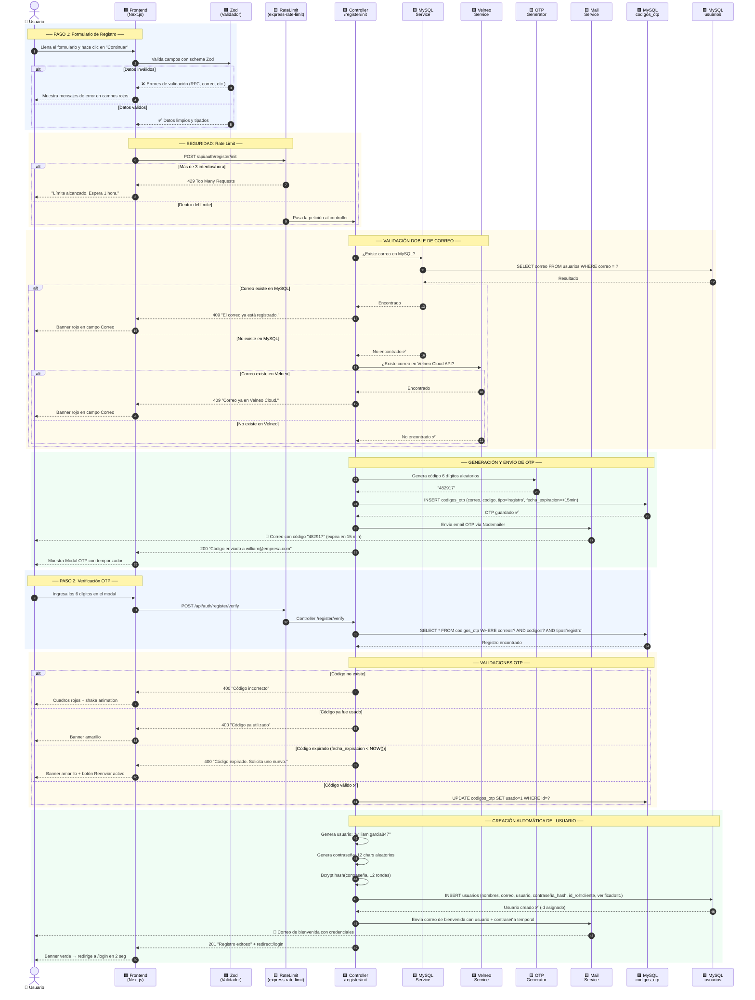
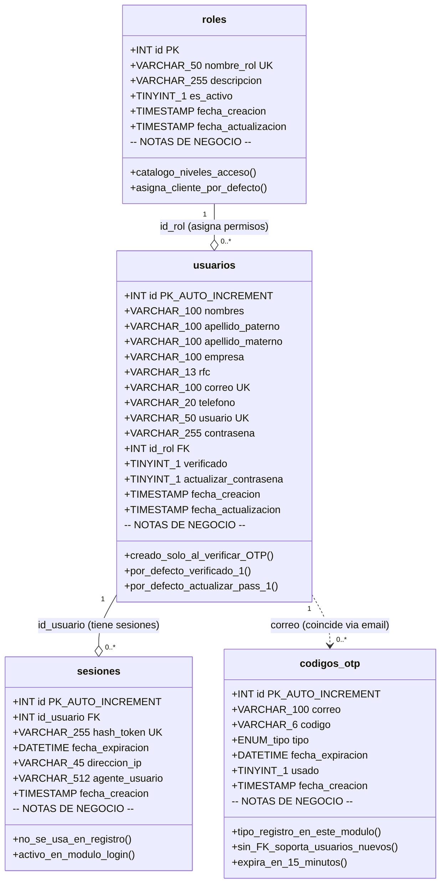
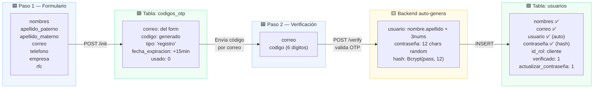
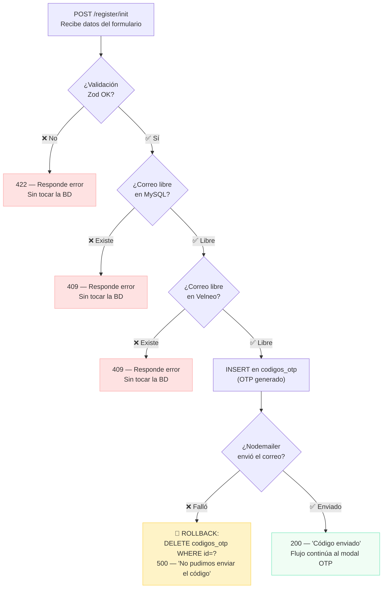
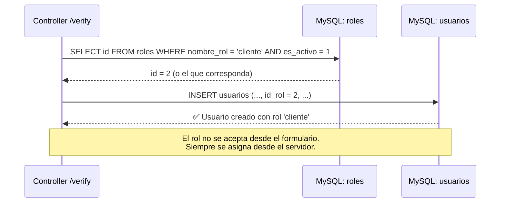
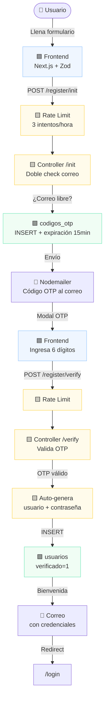

# 📋 Módulo de Registro de Usuarios — Datta ERP
> **Ruta:** `ds-qs/web/modulos/registro/Registro_Plan.md`
> **Última actualización:** Mayo 2026
> **Arquitecto:** Antigravity — SaaS Module Planner Skill

---

## 📑 Índice

- [FASE 1 — El Corazón del Módulo](#fase-1--el-corazón-del-módulo)
- [FASE 2 — Maqueta Visual (SVG)](#fase-2--el-figma-visual-maqueta-svg)
- [FASE 3 — Diagramas UML y Tablas](#fase-3--el-mapa-del-viaje-diagramas-uml)
- [FASE 4 — Gestión de Errores](#fase-4--el-plan-de-emergencia)
- [FASE 5 — Seguridad y Control](#fase-5--seguridad-y-control)
- [FASE 6 — Memoria Técnica Integral](#fase-6--memoria-técnica-integral)

---

# FASE 1 — El Corazón del Módulo

## 🧩 ¿Qué problema resuelve este módulo?

> *Imagina que Datta ERP es un edificio de oficinas exclusivo. El módulo de registro es la **recepcionista y el proceso de acreditación de visitantes**: valida que la persona no esté ya registrada, verifica que su correo es real enviándole un código secreto, y una vez confirmado, le crea automáticamente una tarjeta de acceso con usuario y contraseña — todo sin que el nuevo inquilino tenga que inventarse nada.*

El flujo se divide en **tres fases visuales (2 secuenciales de acción)**:

| Paso | Qué pasa en el mundo real | Endpoint |
| :--: | :--- | :--- |
| **1** | El usuario llena un formulario con sus datos y el sistema verifica que no existe en ningún lado | `POST /api/auth/register/init` |
| **2** | El usuario recibe un código de 6 dígitos en su correo y lo confirma en línea dentro de la misma tarjeta | `POST /api/auth/register/verify` |
| **3** | Aprovisionamiento: Pantalla de carga mientras se prepara la infraestructura y se configuran recursos. | *(interno, disparado al verificar)* |
| **Auto** | El sistema crea el usuario, genera sus credenciales y envía la bienvenida | *(backend)* |

---

## 🗄️ Tablas de la Base de Datos (MySQL)

> Las tablas involucradas en el registro son parte de la **BD Maestra MySQL** — la "recepción del edificio" que guarda el directorio de usuarios pero no sus datos contables (eso le toca a Velneo Cloud).

### Tablas que participan en este módulo

#### 1. `usuarios` — El Directorio Principal

*Piensa en esta tabla como la **ficha de empleado** del sistema. Cada fila es una persona con acceso al ERP.*

| Campo | Tipo | ¿Qué guarda? | Nota clave |
| :--- | :--- | :--- | :--- |
| `id` | `INT UNSIGNED AUTO_INCREMENT` | Número de identificación único e irrepetible | PK — se asigna automáticamente |
| `nombres` | `VARCHAR(100)` | El o los nombres del usuario | Obligatorio, viene del formulario |
| `apellido_paterno` | `VARCHAR(100)` | Primer apellido | Obligatorio |
| `apellido_materno` | `VARCHAR(100)` | Segundo apellido | Obligatorio |
| `empresa` | `VARCHAR(100)` | Razón social o nombre del negocio | Opcional |
| `rfc` | `VARCHAR(13)` | Clave fiscal (RFC mexicano) | Opcional, máx. 13 chars |
| `correo` | `VARCHAR(100)` | Email de acceso (único en todo el sistema) | `UNIQUE` — es el login |
| `telefono` | `VARCHAR(20)` | Número de contacto | Opcional |
| `usuario` | `VARCHAR(50)` | Nombre de usuario generado auto (`nombre.apellido+3_num`) | `UNIQUE` — generado por el backend |
| `contraseña` | `VARCHAR(255)` | **Hash Bcrypt** de la contraseña de 12 caracteres | Nunca se guarda en texto plano |
| `id_rol` | `INT UNSIGNED` | Nivel de acceso (Admin, Cliente...) | FK → tabla `roles` |
| `verificado` | `TINYINT(1)` | `0` = pendiente, `1` = correo confirmado | Cambia a `1` al verificar OTP |
| `actualizar_contraseña` | `TINYINT(1)` | `1` = debe cambiar su pass al primer login | Siempre `1` en el registro inicial |
| `fecha_creacion` | `TIMESTAMP` | Cuándo se creó el registro | Auto |
| `fecha_actualizacion` | `TIMESTAMP` | Última modificación del perfil | Auto, actualiza en cada cambio |

> 🔒 **Regla de seguridad:** El campo `verificado` comienza en `0`. El usuario queda "en sala de espera" hasta que confirme su OTP. Si no confirma en 15 minutos, el registro **no se crea** (el OTP expira, no hay usuario fantasma).

---

#### 2. `codigos_otp` — El Sobre con el Código Secreto

*Esta tabla es como el **buzón de códigos de verificación**. Cada vez que alguien pide registrarse, el sistema guarda aquí el código que le mandó por correo, junto con una fecha de vencimiento.*

| Campo | Tipo | ¿Qué guarda? | Nota clave |
| :--- | :--- | :--- | :--- |
| `id` | `INT UNSIGNED AUTO_INCREMENT` | ID del registro OTP | PK |
| `correo` | `VARCHAR(100)` | El email al que se envió el código | No es FK — soporta OTPs antes de que el usuario exista |
| `codigo` | `VARCHAR(6)` | Los 6 dígitos secretos (ej: `482917`) | Generado aleatoriamente |
| `tipo` | `ENUM('registro','reset_contrasena','2fa')` | Para qué sirve este código | Para este módulo: `'registro'` |
| `fecha_expiracion` | `DATETIME` | Fecha y hora límite de validez | **15 minutos** desde la creación |
| `usado` | `TINYINT(1)` | `1` = ya fue validado, no se puede usar de nuevo | Protege contra ataques de reutilización |
| `fecha_creacion` | `TIMESTAMP` | Cuándo se generó el OTP | Auto |

> 🔑 **¿Por qué `correo` no tiene FK a `usuarios`?** Porque el OTP se genera *antes* de crear el usuario. El sistema primero valida el correo, y solo si el código es correcto crea el registro en `usuarios`. Así nunca hay usuarios "a medias".

---

#### 3. `roles` — El Nivel de Acceso

*Esta tabla es el **catálogo de pases de acceso**. Para el registro, todo nuevo usuario recibe automáticamente el rol de `cliente` (el nivel más básico).*

| Campo | ¿Qué guarda? |
| :--- | :--- |
| `id` | ID del rol (ej: `1` = admin, `2` = cliente) |
| `nombre_rol` | Nombre legible (ej: `"cliente"`) |
| `descripcion` | Qué puede hacer ese rol |
| `es_activo` | Si el rol está disponible para asignarse |

> 📌 En el registro automático: `id_rol` se asigna como `cliente` por defecto.

---

## 🔄 Contrato de Comunicación (API)

> *Piensa en el API como el "mostrador de recepción": el frontend llena un formulario (request) y el backend responde con un resultado (response). Aquí están los dos mostradores del módulo de registro.*

---

### Endpoint 1: `POST /api/auth/register/init`
**¿Qué hace?** → Valida el formulario, verifica que el correo no exista y envía el código OTP.

#### 📥 Request (lo que envía el formulario)

```json
{
  "nombres": "William",
  "apellido_paterno": "García",
  "apellido_materno": "López",
  "correo": "william@empresa.com",
  "telefono": "5512345678",
  "empresa": "Empresa SA de CV",
  "rfc": "GALW850101ABC"
}
```

#### 📤 Respuestas posibles

| Situación | HTTP | Respuesta |
| :--- | :---: | :--- |
| ✅ OTP enviado correctamente | `200` | `{ "message": "Código enviado a william@empresa.com" }` |
| ❌ Correo ya existe en MySQL | `409` | `{ "error": "Este correo ya está registrado en el sistema." }` |
| ❌ Correo ya existe en Velneo | `409` | `{ "error": "Este correo ya tiene una cuenta en Velneo Cloud." }` |
| ❌ Datos inválidos (Zod) | `422` | `{ "error": "El RFC debe tener entre 12 y 13 caracteres." }` |
| ❌ Demasiados intentos | `429` | `{ "error": "Límite de intentos alcanzado. Espera 1 hora." }` |

---

### Endpoint 2: `POST /api/auth/register/verify`
**¿Qué hace?** → Valida el OTP, crea el usuario, genera sus credenciales y envía el correo de bienvenida.

#### 📥 Request (lo que envía el modal OTP)

```json
{
  "correo": "william@empresa.com",
  "codigo": "482917"
}
```

> 🔔 **Nota:** El frontend guarda temporalmente los datos del formulario (Step 1) en memoria o localStorage para usarlos en este paso sin pedirlos de nuevo.

#### 📤 Respuestas posibles

| Situación | HTTP | Respuesta |
| :--- | :---: | :--- |
| ✅ Registro completo | `201` | `{ "message": "¡Registro exitoso! Revisa tu correo con tus credenciales.", "redirect": "/login" }` |
| ❌ Código incorrecto | `400` | `{ "error": "El código ingresado es incorrecto." }` |
| ❌ Código expirado | `400` | `{ "error": "El código ha expirado. Solicita uno nuevo." }` |
| ❌ Código ya usado | `400` | `{ "error": "Este código ya fue utilizado." }` |
| ❌ Demasiados intentos | `429` | `{ "error": "Límite de intentos alcanzado. Espera 1 hora." }` |

---

### 🔧 Lógica interna del Endpoint 2 (al verificar el OTP)

Cuando el código es válido, el backend ejecuta automáticamente y en orden:

1. ✅ Marca el OTP como `usado = 1` en `codigos_otp`
2. 🧠 Genera el `usuario`: `william.garcia` + 3 dígitos aleatorios → `william.garcia847`
3. 🔑 Genera contraseña de 12 caracteres aleatorios (letras + números + símbolos)
4. 🔒 Encripta la contraseña con **Bcrypt** (factor de costo: 12 rondas)
5. 💾 Inserta el nuevo registro en `usuarios` con `verificado = 1`
6. 📧 Envía correo de bienvenida con usuario y contraseña en texto legible
7. 🔀 Devuelve al frontend la señal para redirigir al `/login`

---

## 🛡️ Reglas de Seguridad Aplicadas

| Política | ¿Cómo funciona? | Librería |
| :--- | :--- | :--- |
| **Rate Limiting** | Máximo 3 intentos por hora por IP en `/register/init` y `/register/verify` | `express-rate-limit` |
| **Validación de datos** | Zod valida cada campo antes de que el backend procese nada | `zod` |
| **Contraseña nunca en texto plano** | Bcrypt con 12 rondas transforma la contraseña en un hash irrecuperable | `bcrypt` |
| **OTP de un solo uso** | El campo `usado` en `codigos_otp` impide que un código se valide dos veces | MySQL |
| **OTP con expiración** | 15 minutos de validez; después, el sistema lo rechaza aunque sea correcto | MySQL `DATETIME` |
| **Doble verificación de correo** | Se consulta tanto la BD local (MySQL) como Velneo Cloud para evitar duplicados entre sistemas | `axios` → Velneo API |

---

## 📦 Dependencias a Instalar

> Estas librerías están planificadas en el Blueprint pero **aún no instaladas**. Se instalan al iniciar el Sprint 1.

```bash
# Backend
pnpm add zod bcrypt nodemailer express-rate-limit

# Frontend
pnpm add zod react-hook-form @hookform/resolvers
```

---

# FASE 2 — El "Figma" Visual (Maqueta SVG)

> La maqueta muestra los **tres estados del módulo** integrados directamente en el panel principal (sin modales externos). Diseño **Light Mode**, estilo dashboard SaaS moderno con gradientes.

### Paso 1 — Formulario de Registro


### Paso 2 — Verificación OTP


### Paso 3 — Aprovisionamiento


---

## 🧭 Guía de Experiencia (UX) — Qué pasa al interactuar

### Estado 1: Formulario de Registro

| Acción del usuario | ¿Qué ocurre en pantalla? | ¿Qué ocurre en el servidor? |
| :--- | :--- | :--- |
| Escribe en el campo **Correo** | El borde se vuelve azul (campo activo). Al salir, Zod valida el formato y aparece `✓` verde si es válido. | Nada aún — la validación de formato es local (frontend). |
| Hace clic en **Registrar** | Zod valida todos los campos. Si hay errores, los campos inválidos se marcan en rojo con un mensaje. Si todo está bien, aparece un spinner sobre el botón. | `POST /api/auth/register/init` → verifica que el correo no exista en MySQL ni en Velneo Cloud → genera OTP → envía correo. |
| El servidor responde OK | El formulario se oculta y aparece la vista **Verifica tu correo** en el mismo panel. El temporizador de 15 min empieza a correr. | OTP guardado en `codigos_otp` con `fecha_expiracion`. |
| El servidor responde error `409` | Aparece un banner rojo debajo del campo Correo: *"Este correo ya está registrado."* El botón vuelve a estar activo. | Ningún OTP fue generado. |
| El servidor responde error `429` | El botón se deshabilita y muestra: *"Límite alcanzado. Intenta en 1 hora."* | Rate limit de `express-rate-limit` activo. |

### Estado 2: Verificación OTP (En línea)

| Acción del usuario | ¿Qué ocurre en pantalla? | ¿Qué ocurre en el servidor? |
| :--- | :--- | :--- |
| Escribe en los **6 cuadros** | El cursor avanza automáticamente al siguiente cuadro. Al llenar los 6, el botón "Verificar" se activa (azul). | Nada aún — solo entrada local. |
| Hace clic en **Confirmar Registro** | La tarjeta cambia a Estado 3 (Aprovisionamiento) con un cohete y un spinner indicando que se está configurando el entorno. | `POST /api/auth/register/verify` → valida OTP en `codigos_otp` → si correcto: crea usuario, genera credenciales, envía bienvenida. |
| Verificación exitosa | Se muestra el banner *"¡Registro completado!"* y redirige a `/login`. | `codigos_otp.usado = 1`. Nuevo registro en `usuarios` con `verificado = 1`. Correo de bienvenida disparado. |
| Código incorrecto | Los cuadros se sacuden (animación shake) y se vuelven rojos. Contador de intentos visible (ej: *"Intento 2 de 3"*). | OTP no marcado. Rate limit cuenta el intento. |
| Código expirado | Banner amarillo: *"Tu código expiró. Solicita uno nuevo."* Botón "Reenviar" se activa en verde. | Backend rechaza el OTP por `fecha_expiracion`. |
| Clic en **Reenviar** | El temporizador se reinicia a 15:00. | Nuevo OTP generado y guardado. El anterior queda inválido (nuevo registro en `codigos_otp`). |

---

# FASE 3 — El Mapa del Viaje (Diagramas UML)

---

## 🔀 Diagrama de Secuencia — Flujo completo de registro

> *Lee este diagrama de arriba a abajo siguiendo las flechas. Cada línea es un "mensaje" que viaja entre el navegador del usuario, el servidor y la base de datos.*
> - 🟦 **Azul** = Pantalla / Frontend
> - 🟨 **Ámbar** = Servidor / Lógica de negocio
> - 🟩 **Verde** = Base de datos / Tablas



---

## 🗂️ Diagrama de Clases y Tablas — Relaciones de la BD

> *Este diagrama muestra cómo están conectadas las tablas de MySQL para este módulo. Piénsalo como un mapa que dice: "esta tabla depende de esta otra, y así es como se relacionan".*



### ¿Cómo se leen las relaciones?

| Relación | ¿Qué significa en palabras simples? |
| :--- | :--- |
| `roles` → `usuarios` | Cada usuario tiene **un** rol (ej: `cliente`). Un rol puede asignarse a **muchos** usuarios. |
| `usuarios` → `sesiones` | Cada usuario puede tener **muchas** sesiones activas (dispositivos distintos). *No aplica aún en este módulo.* |
| `usuarios` ↔ `codigos_otp` | La relación es por **correo** (no por FK), porque el OTP se genera antes de que el usuario exista en la tabla. |

---

### Flujo de columnas durante el registro



---

# FASE 4 — El Plan de Emergencia (Gestión de Errores y Resiliencia)

> *¿Qué pasa si algo falla? Este plan define cómo el sistema se protege solo, qué le dice al usuario y cómo evita dejar datos a medias en la base de datos.*

---

## 🔴 Catálogo de Errores — ¿Qué puede salir mal?

### Endpoint 1: `POST /api/auth/register/init`

| # | Escenario de error | HTTP | Mensaje al usuario | ¿Qué hace el sistema internamente? | Clase de error |
| :--: | :--- | :---: | :--- | :--- | :--- |
| 1 | Campo inválido (ej: RFC con más de 13 chars, correo sin `@`) | `422` | *"El RFC debe tener entre 12 y 13 caracteres."* | Zod corta el flujo antes de tocar la BD. No hay operación en MySQL. | `ValidationError` |
| 2 | Correo ya registrado en MySQL | `409` | *"Este correo ya tiene una cuenta. ¿Olvidaste tu contraseña?"* | SELECT devuelve resultado → respuesta inmediata. Sin escrituras. | `AppError` |
| 3 | Correo ya en Velneo Cloud | `409` | *"Este correo ya existe en el sistema central."* | La llamada axios al API de Velneo devuelve el usuario → respuesta inmediata. | `AppError` |
| 4 | Velneo Cloud no responde (timeout) | `503` | *"El sistema está tardando más de lo esperado. Intenta en unos minutos."* | axios lanza timeout tras 30 s. El interceptor captura y devuelve `503`. Sin escrituras. | `AppError` |
| 5 | Fallo al enviar el correo OTP (Nodemailer) | `500` | *"No pudimos enviar el código. Intenta de nuevo."* | 🔴 **Rollback:** El OTP insertado en `codigos_otp` se **elimina** antes de responder. El usuario nunca sabe que se insertó. | `AppError` + DELETE OTP |
| 6 | Error de conexión a MySQL | `503` | *"Servicio no disponible temporalmente."* | El pool de conexiones lanza excepción. `DatabaseError` capturado por el middleware global. | `DatabaseError` |
| 7 | Más de 3 intentos en 1 hora | `429` | *"Demasiados intentos. Espera 1 hora e intenta de nuevo."* | `express-rate-limit` bloquea por IP antes de llegar al controller. | Middleware |

---

### Endpoint 2: `POST /api/auth/register/verify`

| # | Escenario de error | HTTP | Mensaje al usuario | ¿Qué hace el sistema internamente? | Clase de error |
| :--: | :--- | :---: | :--- | :--- | :--- |
| 8 | Código de 6 dígitos incorrecto | `400` | *"El código ingresado no es válido."* | SELECT no encuentra el registro. Sin escrituras. | `ValidationError` |
| 9 | Código ya fue utilizado | `400` | *"Este código ya fue usado. Solicita uno nuevo."* | `usado = 1` detectado en SELECT. Sin escrituras. | `ValidationError` |
| 10 | Código expirado (`fecha_expiracion < NOW()`) | `400` | *"Tu código expiró. Haz clic en Reenviar para obtener uno nuevo."* | Comparación de fechas en el SELECT. Sin escrituras. | `ValidationError` |
| 11 | Fallo al insertar el usuario (MySQL duplicado) | `409` | *"Ocurrió un conflicto al crear tu cuenta. Contacta soporte."* | 🔴 El OTP NO se marca como usado. El usuario puede reintentar. | `DatabaseError` |
| 12 | Fallo al enviar correo de bienvenida | `200` ⚠️ | *(No se muestra error — el registro ya es exitoso)* | 🟡 El usuario YA existe en BD. El correo de bienvenida falla silenciosamente y se registra en log. El usuario puede recuperar credenciales por otro medio. | Log interno |
| 13 | Más de 3 intentos de verificación | `429` | *"Demasiados intentos. Espera 1 hora."* | `express-rate-limit` bloquea por IP. | Middleware |

> ⚠️ **Nota sobre el error #12:** El correo de bienvenida **no es crítico** — el usuario ya existe y está verificado. Un fallo aquí no revierte el registro. Se registra el error en logs para reenvío manual o reintento automático futuro.

---

## 🔄 Estrategia de Rollback — ¿Cómo protegemos la BD?

> *Rollback = "cancelación segura". Si algo sale mal a mitad del proceso, el sistema deshace los cambios para que no queden datos a medias.*

### Paso 1: `/register/init` (Envío de OTP)



### Paso 2: `/register/verify` (Creación de Usuario)


---

## 🛡️ Jerarquía de Errores del Sistema (clases existentes)

> Estas clases ya existen en `backend/src/core/errors/` — solo hay que usarlas en el módulo de registro.

| Clase | Cuándo usarla en registro | HTTP que devuelve |
| :--- | :--- | :---: |
| `ValidationError` | Datos inválidos de Zod, código OTP incorrecto/expirado/usado | `422` / `400` |
| `AppError` | Correo duplicado, Velneo no disponible | `409` / `503` |
| `DatabaseError` | Fallo de conexión MySQL, INSERT fallido | `503` / `500` |
| `NotFoundError` | *(No aplica directamente en registro)* | `404` |

---

## 💬 Principio de Mensajes al Usuario

| Regla | ✅ Correcto | ❌ Incorrecto |
| :--- | :--- | :--- |
| **Sin jerga técnica** | *"No pudimos enviar el código. Intenta de nuevo."* | *"SMTP connection refused on port 587"* |
| **Siempre accionable** | *"Tu código expiró. Haz clic en Reenviar."* | *"Error 400: OTP expired"* |
| **Sin revelar estructura interna** | *"Este correo ya tiene una cuenta."* | *"Duplicate entry en tabla usuarios"* |
| **Específico en errores de validación** | *"El RFC debe tener entre 12 y 13 caracteres."* | *"Datos inválidos"* |

---

# FASE 5 — Seguridad y Control (¿Quién ve qué?)

> *Este módulo es la "puerta de entrada" del sistema. Aquí se definen las reglas sobre quién puede registrarse, cómo nos aseguramos de que los datos de una empresa nunca se mezclen con los de otra, y qué puede hacer cada tipo de usuario una vez dentro.*

---

### Reglas de aislamiento aplicadas en el registro

| Regla | ¿Cómo se implementa? | ¿Dónde vive en el código? |
| :--- | :--- | :--- |
| **Correo único global** | `UNIQUE KEY idx_correo_unico (correo)` en MySQL impide duplicados entre todos los tenants | `bd.sql` → tabla `usuarios` |
| **Usuario único global** | `UNIQUE KEY idx_usuario_unico (usuario)` — el nombre de usuario generado es irrepetible | `bd.sql` → tabla `usuarios` |
| **Sin acceso cruzado en el registro** | El controller solo escribe en `usuarios` y `codigos_otp` — nunca consulta datos de otros tenants | `src/modules/auth/` |
| **Doble verificación de correo** | Se consulta tanto MySQL como Velneo Cloud para garantizar unicidad en **ambos sistemas** antes de crear | `Velneo.service.js` + MySQL query |
| **OTP sin FK al usuario** | El código OTP existe antes de que el usuario exista — no hay riesgo de "contaminar" datos de otro tenant | `codigos_otp.correo` = VARCHAR sin FK |

---

## 🔐 Capas de Seguridad — De la Petición al Dato

> *Antes de que cualquier dato llegue a la base de datos, pasa por 5 capas de revisión. Piénsalo como el control de seguridad de un aeropuerto.*

```mermaid
flowchart LR
    REQ["📡 Petición<br/>del usuario"] --> H

    subgraph L1["Capa 1 🟨 — Helmet + CORS"]
        H["Headers HTTP seguros<br/>Solo origen CLIENT_URL<br/>permitido"]
    end

    subgraph L2["Capa 2 🟨 — Rate Limit"]
        RL["3 intentos/hora<br/>por IP<br/>en /register/*"]
    end

    subgraph L3["Capa 3 🟦 — Zod (Frontend)"]
        Z["Validación local<br/>antes de enviar<br/>la petición"]
    end

    subgraph L4["Capa 4 🟨 — Zod (Backend)"]
        ZB["Re-validación<br/>en el servidor<br/>(no confiar en cliente)"]
    end

    subgraph L5["Capa 5 🟩 — Bcrypt + MySQL"]
        B["Contraseña hasheada<br/>12 rondas<br/>Antes del INSERT"]
    end

    %% Conexiones directas entre los nodos internos para mantener el flujo lineal
    H --> RL
    RL --> Z
    Z --> ZB
    ZB --> B
    B --> DB[("🟩 MySQL<br/>Dato seguro")]

    %% Estilos de los contenedores
    style L1 fill:#FFFBEB,stroke:#FCD34D
    style L2 fill:#FFFBEB,stroke:#FCD34D
    style L3 fill:#EFF6FF,stroke:#93C5FD
    style L4 fill:#FFFBEB,stroke:#FCD34D
    style L5 fill:#F0FDF4,stroke:#6EE7B7
```



---

## 👥 Permisos por Rol — ¿Quién puede hacer qué?

> *Al registrarse, todo usuario recibe automáticamente el rol `cliente`. Este es el nivel más básico — puede ver sus propios datos pero no puede modificar configuraciones del sistema ni ver datos de otros usuarios.*

### Matriz de Permisos en el Módulo de Registro

| Acción | `cliente` (nuevo) | `admin` | Sin sesión |
| :--- | :---: | :---: | :---: |
| Acceder al formulario de registro | ✅ | ✅ | ✅ |
| Enviar `POST /register/init` | ✅ | ✅ | ✅ |
| Verificar OTP `POST /register/verify` | ✅ | ✅ | ✅ |
| Ver credenciales de **otro** usuario | ❌ | ✅ | ❌ |
| Reenviar OTP a otro correo | ❌ | ✅ | ❌ |
| Consultar tabla `usuarios` completa | ❌ | ✅ | ❌ |
| Cambiar rol de un usuario | ❌ | ✅ | ❌ |

### ¿Cómo se asigna el rol en el registro?



> 🔒 **Regla crítica de seguridad:** El `id_rol` **nunca viene del formulario del usuario**. Siempre se obtiene del servidor consultando la tabla `roles`. Esto evita que un usuario malintencionado se registre como `admin` manipulando la petición.

---

## 🔑 Seguridad de Credenciales Generadas

> *Las credenciales (usuario + contraseña) son generadas automáticamente por el sistema — el usuario nunca las elige en el registro. Esto garantiza que cumplen con los estándares de seguridad desde el primer día.*

| Elemento | Regla | Ejemplo |
| :--- | :--- | :--- |
| **Nombre de usuario** | `nombre.apellido_paterno` + 3 dígitos aleatorios | `william.garcia847` |
| **Contraseña temporal** | 12 caracteres: mayúsculas + minúsculas + números + símbolos | `aX9#mKp2@Lq7` |
| **Hash almacenado** | Bcrypt con factor de costo 12 (≈ 400ms por hash) | `$2b$12$...` |
| **`actualizar_contraseña`** | Siempre `1` en el registro — fuerza cambio en primer login | *(manejado en módulo de Login)* |
| **Transmisión de credenciales** | Solo vía correo cifrado (TLS/SSL en Nodemailer) — nunca en la respuesta HTTP | `MAIL_PORT=587` (TLS) |

### ¿Por qué Bcrypt con 12 rondas?

| Factor de costo | Tiempo de hash | Nivel de seguridad |
| :---: | :---: | :--- |
| 10 | ~100 ms | Mínimo aceptable |
| **12** ✅ | **~400 ms** | **Recomendado para producción** |
| 14 | ~1.5 s | Impacto en UX en registros masivos |

> A 12 rondas, un atacante que obtenga la BD necesitaría **miles de años** para romper todos los hashes por fuerza bruta con hardware moderno.

---

## 🚦 Resumen de Políticas de Seguridad Aplicadas

| Política | Implementación | Estado en este módulo |
| :--- | :--- | :---: |
| Headers HTTP seguros | Helmet middleware (`security.middleware.js`) | ✅ Ya existe |
| Rate Limiting específico | `express-rate-limit`: 3 req/hora en `/register/*` | 🔧 Nuevo config |
| CORS de origen único | Solo `CLIENT_URL` permitido (`app.js`) | ✅ Ya existe |
| Validación doble (cliente + servidor) | Zod en frontend + Zod en backend controller | 🔧 Nuevo |
| Hash de contraseña | Bcrypt factor 12 antes del INSERT | 🔧 Nuevo |
| Rol no editable desde cliente | `id_rol` siempre desde servidor | 🔧 Nuevo |
| OTP de un solo uso | Campo `usado` en `codigos_otp` | 🔧 Nuevo |
| OTP con expiración | `fecha_expiracion` validado en SELECT | 🔧 Nuevo |
| Doble verificación de correo | MySQL + Velneo Cloud API | 🔧 Nuevo |
| Credenciales por correo cifrado | Nodemailer con TLS (puerto 587) | ✅ `Mail.service.js` existe |

---

# FASE 6 — Memoria Técnica Integral

> **Resumen ejecutivo unificado del Módulo de Registro de Usuarios.**
> Este documento está listo para guardar en el repositorio de conocimiento del proyecto.
> Consolida las 5 fases anteriores en una referencia rápida y completa.

---

## 📌 Ficha del Módulo

| Campo | Valor |
| :--- | :--- |
| **Nombre** | Módulo de Registro de Usuarios |
| **Proyecto** | Datta ERP — SaaS Multi-tenant |
| **Sprint** | Sprint 1 — Autenticación |
| **Estado** | 📋 Planificado — Listo para implementar |
| **Endpoints** | `POST /api/auth/register/init` · `POST /api/auth/register/verify` |
| **Tablas afectadas** | `usuarios` · `codigos_otp` · `roles` |
| **Nuevas dependencias** | `zod` · `bcrypt` · `nodemailer` · `express-rate-limit` (backend) · `zod` · `react-hook-form` (frontend) |
| **Documentado por** | Antigravity — SaaS Module Planner Skill |
| **Última actualización** | Mayo 2026 |

---

## 🗺️ Arquitectura del Flujo (Vista Rápida)



---

## 🔌 Referencia Rápida de API

| Endpoint | Método | Auth | Rate Limit | Éxito | Error principal |
| :--- | :---: | :---: | :---: | :---: | :--- |
| `/api/auth/register/init` | `POST` | ❌ Público | 3/hora | `200` | `409` correo dup · `422` Zod · `503` Velneo |
| `/api/auth/register/verify` | `POST` | ❌ Público | 3/hora | `201` | `400` OTP inv/exp/usado · `409` INSERT dup |

### Payloads

```json
// POST /register/init
{
  "nombres": "William",
  "apellido_paterno": "García",
  "apellido_materno": "López",
  "correo": "william@empresa.com",
  "telefono": "5512345678",
  "empresa": "Empresa SA de CV",
  "rfc": "GALW850101ABC"
}

// POST /register/verify
{
  "correo": "william@empresa.com",
  "codigo": "482917"
}
```

---

## 🗄️ Tablas MySQL Involucradas

| Tabla | Operación | Momento | Campo clave |
| :--- | :---: | :--- | :--- |
| `roles` | `SELECT` | Al verificar OTP | `nombre_rol = 'cliente'` |
| `usuarios` | `SELECT` (check) + `INSERT` | Check en `/init` · Insert en `/verify` | `correo` UK · `usuario` UK |
| `codigos_otp` | `INSERT` + `UPDATE` + `DELETE`* | Insert en `/init` · Update en `/verify` · Delete si Nodemailer falla | `usado` · `fecha_expiracion` |

> `*` DELETE solo ocurre en rollback por fallo de Nodemailer en `/init`.

---

## 🛡️ Seguridad — Checklist

- [x] Helmet headers en todas las rutas (`security.middleware.js`)
- [x] CORS restringido a `CLIENT_URL` (`app.js`)
- [x] Rate limit específico: **3 req/hora por IP** en `/register/*`
- [x] Validación Zod en **frontend** (UX) y **backend** (seguridad real)
- [x] `id_rol` asignado desde servidor — nunca desde el cliente
- [x] OTP de **un solo uso** (`usado = 1` al verificar)
- [x] OTP con **expiración de 15 minutos** (`fecha_expiracion`)
- [x] Correo verificado en **MySQL + Velneo Cloud** antes de crear OTP
- [x] Contraseña generada con **12 caracteres aleatorios**
- [x] Hash con **Bcrypt factor 12** antes del INSERT
- [x] Credenciales enviadas **solo por correo TLS** — nunca en respuesta HTTP
- [x] `actualizar_contraseña = 1` fuerza cambio en primer login

---

## 🔄 Rollbacks Definidos

| Escenario | Rollback |
| :--- | :--- |
| Nodemailer falla al enviar OTP | `DELETE codigos_otp WHERE id = ?` |
| INSERT `usuarios` falla tras marcar OTP | `UPDATE codigos_otp SET usado = 0 WHERE id = ?` |
| Fallo de correo de bienvenida | **Sin rollback** — usuario ya existe, se loguea el error |

---

## 📂 Estructura de Archivos a Crear (Sprint 1)

```text
backend/src/modules/auth/
├── auth.routes.js          → Define POST /register/init y /register/verify
├── auth.controller.js      → Orquesta la lógica de ambos endpoints
├── auth.service.js         → Lógica de negocio: OTP, Bcrypt, generación usuario
├── auth.schema.js          → Schemas Zod para validación de payloads
└── auth.repository.js      → Queries MySQL: SELECT usuarios, INSERT codigos_otp, etc.

frontend/app/register/
├── page.tsx                → Página principal con formulario (Step 1)
└── components/
    ├── RegisterForm.tsx    → Formulario con react-hook-form + Zod
    └── OtpModal.tsx        → Modal de 6 dígitos con temporizador
```

---

## 📋 Checklist de Implementación (Sprint 1)

### Backend
- [ ] Instalar: `pnpm add zod bcrypt nodemailer`
- [ ] Crear `src/modules/auth/auth.schema.js` con schema Zod del formulario
- [ ] Crear `src/modules/auth/auth.repository.js` con queries MySQL
- [ ] Crear `src/modules/auth/auth.service.js` con lógica OTP + Bcrypt
- [ ] Crear `src/modules/auth/auth.controller.js` con ambos endpoints
- [ ] Crear `src/modules/auth/auth.routes.js` y conectar a `routes.js`
- [ ] Configurar rate limit específico para `/register/*` (3 req/hora)
- [ ] Agregar variables al `.env`: `MAIL_HOST`, `MAIL_PORT`, `MAIL_USER`, `MAIL_PASS`
- [ ] Configurar `Mail.service.js` para OTP y correo de bienvenida

### Frontend
- [ ] Instalar: `pnpm add zod react-hook-form @hookform/resolvers`
- [ ] Crear `app/register/page.tsx` con layout split (panel izquierdo + formulario)
- [ ] Crear `RegisterForm.tsx` con validación Zod en tiempo real
- [ ] Crear `OtpModal.tsx` con 6 inputs, temporizador y botón Reenviar
- [ ] Manejar estados: loading, error, éxito con redirect a `/login`

---

*Actualización automática: Mayo 2026 — Documentado con SaaS Module Planner Skill — Proyecto: Datta ERP*
