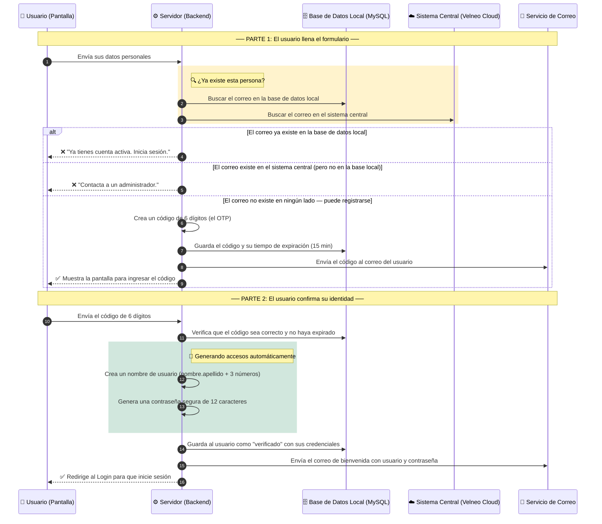

# 📋 Módulo de Registro de Usuarios — Datta ERP

> **¿Para quién es este documento?**  
> Para cualquier persona del equipo — diseñadores, desarrolladores, o nuevos integrantes — que quiera entender cómo funciona el proceso de registro de un nuevo usuario en la plataforma.

---

## 🗺️ Vista General: ¿Qué hace este módulo?

Cuando alguien quiere usar Datta ERP por primera vez, necesita crear una cuenta. Este módulo se encarga de todo ese proceso: desde que el nuevo usuario llena el formulario, hasta que recibe su contraseña en el correo y puede iniciar sesión.

El proceso tiene **dos grandes momentos**:

1. **Llenar el formulario y recibir un código de verificación** en el correo.
2. **Escribir ese código** para confirmar que el correo es real y recibir las credenciales de acceso.

---

## 👤 FASE 1 — ¿Qué información necesitamos del usuario?

Antes de crear una cuenta, el sistema necesita saber quién es la persona. Los datos que se solicitan son:

| Dato | ¿Para qué sirve? |
| :--- | :--- |
| Nombre(s) | Identificar al usuario dentro de la plataforma |
| Apellido paterno y materno | Completar su nombre completo |
| Correo electrónico | Es su usuario para iniciar sesión y donde recibirá notificaciones |
| Teléfono | Contacto adicional |
| Empresa | Saber a qué organización pertenece |
| RFC | Validación fiscal (requerido para facturación en México) |

### 🔌 ¿Cómo se comunica la pantalla con el servidor?

El sitio web le habla al servidor a través de dos "llamadas" principales:

| Llamada | ¿Qué hace? |
| :--- | :--- |
| `POST /api/auth/register/init` | Envía los datos del formulario al servidor para iniciar el registro y mandar el código de verificación |
| `POST /api/auth/register/verify` | Envía el código de 6 dígitos que el usuario recibió por correo para confirmar su identidad |

---

## 🖥️ FASE 2 — ¿Cómo se ve la pantalla?

La interfaz está dividida en dos pasos claros para no abrumar al usuario con demasiados campos a la vez.

### Paso 1 — Formulario de datos

```
┌─────────────────────────────────────────────────┐
│           Crea tu cuenta en Datta ERP           │
│─────────────────────────────────────────────────│
│  [ Nombre(s) ]         [ Apellido Paterno ]     │
│  [ Apellido Materno ]  [ Teléfono ]             │
│  [ Correo electrónico ]                         │
│  [ Empresa / Razón Social ]  [ RFC ]            │
│                                                 │
│          ⟶  [ Continuar al Paso 2... ]          │
└─────────────────────────────────────────────────┘
```

- Los campos se validan mientras el usuario escribe (por ejemplo, si el correo no tiene `@`, se muestra un aviso de inmediato).
- El botón muestra un indicador de carga mientras el servidor procesa la información.

### Paso 2 — Verificación del correo (Modal OTP)

```
┌──────────────────────────────────────┐
│   📬 Revisa tu correo electrónico   │
│                                      │
│  Ingresa el código de 6 dígitos     │
│  que enviamos a tu@correo.com        │
│                                      │
│    [ _ ] [ _ ] [ _ ] [ _ ] [ _ ] [ _ ]   │
│                                      │
│         ⏳ Válido por 15 min         │
│   ¿No llegó? → Reenviar código      │
└──────────────────────────────────────┘
```

### Mensajes que puede ver el usuario

| Situación | Mensaje en pantalla |
| :--- | :--- |
| El correo ya tiene cuenta activa | *"Ya tienes una cuenta activa. Por favor, inicia sesión."* |
| El correo existe en el sistema central pero no en la plataforma web | *"Este correo ya está registrado en el sistema. Contacta a un administrador."* |
| Todo salió bien | *Toast verde: "¡Cuenta creada! Revisa tu correo para obtener tus credenciales."* |

---

## 🔄 FASE 3 — El paso a paso por dentro (Flujo Completo)

Este diagrama muestra exactamente lo que pasa en cada momento, desde que el usuario hace clic en "Continuar" hasta que recibe su correo de bienvenida.

> 💡 **Cómo leer el diagrama:** Cada línea con flecha `→` es un mensaje que va de un sistema a otro. Los bloques de color agrupan acciones relacionadas.



---

## ⚙️ FASE 4 — ¿Cómo se crean el usuario y la contraseña?

El sistema genera los accesos automáticamente para que el nuevo usuario no tenga que inventarse uno. Así funciona:

### Nombre de usuario
Se construye a partir del nombre y apellido de la persona.

```
Ejemplo:
  Nombre: María  →  maria
  Apellido: García →  garcia
  + 3 números aleatorios →  482

  Resultado: maria.garcia482
```

### Contraseña
Se genera una contraseña aleatoria de 12 caracteres mezclando letras y números.

```
Ejemplo de contraseña generada:  aB3kTz9mPqR2
```

> 🔒 **Importante para el equipo:** La contraseña se guarda en la base de datos de forma encriptada (nunca en texto plano). Solo se manda al correo del usuario en el momento del registro.

---

## 🛡️ FASE 5 — Seguridad y protecciones

Para que el registro sea seguro y no pueda ser abusado, se aplican estas reglas:

| Protección | ¿Qué hace? |
| :--- | :--- |
| **Límite de intentos** | Un mismo dispositivo solo puede intentar registrarse 3 veces por hora. Evita ataques automatizados. |
| **Código de tiempo limitado** | El código de 6 dígitos expira después de 15 minutos. Pasado ese tiempo, hay que pedir uno nuevo. |
| **Contraseñas encriptadas** | Las contraseñas nunca se guardan tal cual. Se transforman en un código seguro (hash con Bcrypt). |
| **Reenvío sin re-registro** | Si el correo con la contraseña no llegó, el usuario puede pedirlo de nuevo sin tener que llenar el formulario otra vez. |

---

## 📝 FASE 6 — Resumen del flujo en palabras simples

1. **El usuario llena el formulario** con sus datos personales y los envía.
2. **El servidor revisa** si ya existe una cuenta con ese correo (en dos sistemas distintos).
3. **Si el correo es nuevo**, el servidor genera un código de 6 dígitos y lo manda al correo del usuario.
4. **El usuario escribe el código** en la pantalla de verificación.
5. **El servidor confirma** el código, crea automáticamente un nombre de usuario y una contraseña.
6. **Se envía un correo de bienvenida** con los accesos.
7. **El usuario es redirigido** a la pantalla de inicio de sesión para entrar por primera vez.

---

## 📦 Librerías y herramientas que hacen posible este módulo

| Herramienta | ¿Para qué se usa en este módulo? |
| :--- | :--- |
| **Zod** | Valida que los datos del formulario tengan el formato correcto (correo válido, RFC con la longitud correcta, etc.) antes de enviarlos. |
| **Nodemailer / SMTP** | Es el "cartero" del sistema — se encarga de enviar el correo con el código de verificación y el correo con las credenciales. |
| **Bcrypt** | Encripta la contraseña antes de guardarla en la base de datos. Nadie, ni el equipo de desarrollo, puede ver la contraseña real. |
| **express-rate-limit** | Pone un límite al número de intentos de registro desde una misma conexión para evitar abusos. |
| **MySQL (Sequelize)** | Base de datos donde se guardan los usuarios, los códigos OTP y su estado de verificación. |
| **Velneo Cloud API** | Sistema central de la empresa — se consulta para asegurarse de que el correo no esté ya registrado ahí. |

---

*Última actualización: Mayo 2026 — Módulo: Registro de Usuarios — Proyecto: Datta ERP*
