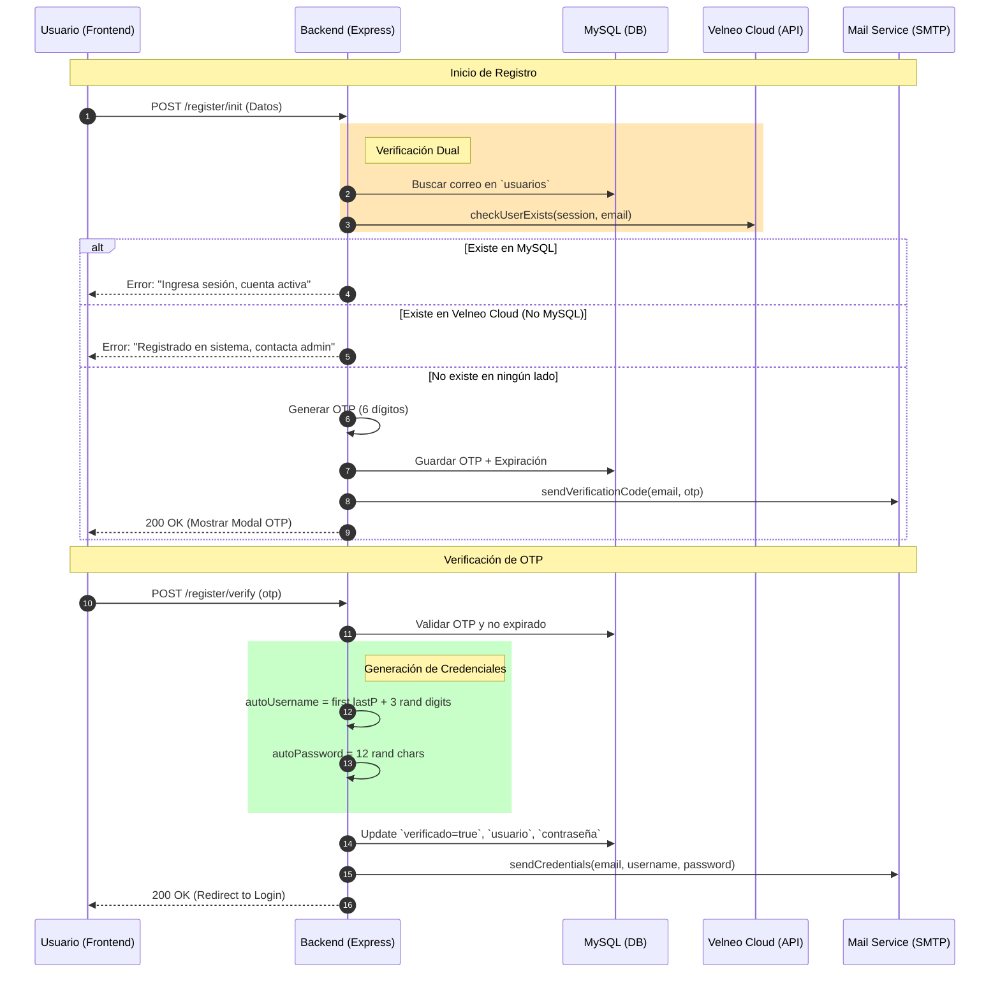

# 🚀 Plan de Diseño: Módulo de Registro de Usuarios (SaaS)

Este documento detalla la planificación técnica, visual y lógica para el módulo de **Registro de Usuarios** del sistema **Datta ERP**. Se alinea con los estándares de Clean Architecture y la infraestructura híbrida (MySQL + Velneo Cloud).

---

## 🧠 FASE 1: Definición de Dominio y Contrato (API)

El objetivo es permitir que nuevos prospectos se registren en la plataforma, validando su identidad mediante un proceso de **Verificación Dual** y **OTP (One Time Password)**.

### 📦 Entidad Core: Usuario
Basado en la tabla `usuarios` documentada en `ds-qs/data/5. Web/usuarios.md`.

| Atributo | Tipo | Descripción |
| :--- | :--- | :--- |
| `correo` | String | Email principal (Login). Único en MySQL y Velneo Cloud. |
| `nombres` | String | Nombre(s) del usuario. |
| `apellido_paterno` | String | Primer apellido. |
| `rfc` | String | Registro Federal de Contribuyentes (Validación fiscal). |
| `verificado` | Boolean | Estado de validación vía OTP. |

### 🛣️ Contrato de API (Endpoints)

1.  **`POST /api/auth/register/init`**
    *   **Propósito**: Inicia el flujo, realiza verificación dual y envía OTP.
    *   **Body**: `{ nombres, apellido_paterno, apellido_materno, correo, telefono, empresa, rfc }`
    *   **Respuesta**: `200 OK` (OTP enviado) o `400/409 Error` (Correo ya registrado).

2.  **`POST /api/auth/register/verify`**
    *   **Propósito**: Valida el OTP ingresado por el usuario.
    *   **Body**: `{ correo, otp }`
    *   **Respuesta**: `200 OK` (Usuario verificado, credenciales enviadas) + `Redirect(login)`.

---

## 🎨 FASE 2: UI/UX y Wireframing Conceptual

### 🖼️ Layout de la Vista de Registro
La interfaz debe ser limpia, minimalista y transmitir confianza (Premium Aesthetic).

1.  **Paso 1: Formulario de Datos**
    *   Campos agrupados: **Información Personal** (Nombres, Apellidos) e **Información de Empresa** (RFC, Razón Social).
    *   Validación en tiempo real con Zod (Email format, RFC length).
    *   Botón dinámico: "Continuar al Paso 2" con loading spinner.

2.  **Paso 2: Modal de Verificación OTP**
    *   Pantalla semi-transparente (Glassmorphism).
    *   Input de 6 dígitos separados (Auto-focus).
    *   Timer de expiración (15 min).
    *   Link: "¿No recibiste el código? Reenviar".

3.  **Gestión de Estados UX**
    *   **🔴 Error: Correo en MySQL (Activo)**: "Ya tienes una cuenta activa. Por favor, inicia sesión".
    *   **🔴 Error: Correo en Velneo Cloud (No MySQL)**: "Este correo ya está registrado en el sistema central. Contacta a un administrador".
    *   **🟢 Éxito**: Toast animado: "¡Cuenta creada! Revisa tu correo para obtener tus credenciales".

---

## 🔄 FASE 3: Flujo Operativo (Lógica de Negocio)

### 🧜‍♂️ Diagrama de Secuencia: Registro y Verificación



---

## 🏗️ FASE 4: Arquitectura de Servicios (Reorganización)

Siguiendo el Blueprint del proyecto, los servicios se centralizan en la carpeta de módulos o core, manteniendo solo las funciones esenciales.

### 📂 Estructura Propuesta
```text
src/
├── core/
│   └── services/
│       ├── Velneo.service.js  # Filtrado por necesidad de Registro
│       └── Mail.service.js    # Plantillas transaccionales
```

### 🛠️ Refactor de `Velneo.service.js`
Se eliminan métodos de aprovisionamiento pesado (instancias, carpetas) para este módulo, dejando solo el core de seguridad:
*   `login()`: Encapsula `createSession` y `authenticateVServer`.
*   `checkUserExists(email)`: Validación contra el vServer.
*   `closeSession()`: Limpieza de recursos.

### 🔐 Algoritmos de Credenciales (Requerimiento)

```javascript
/** Generación de OTP de 6 dígitos */
const verificationCode = Math.floor(100000 + Math.random() * 900000).toString();

/** Generación de contraseña aleatoria (12 caracteres) */
function _generateRandomString(length = 12) {
    const chars = 'abcdefghijklmnopqrstuvwxyzABCDEFGHIJKLMNOPQRSTUVWXYZ0123456789';
    let str = '';
    for (let i = 0; i < length; i++) {
        str += chars.charAt(Math.floor(Math.random() * chars.length));
    }
    return str;
}

/** Generación de nombre de usuario: nombre.apellido123 */
function _generateUsername(firstName, lastNameP) {
    const cleanName = firstName.toLowerCase().trim().split(' ')[0].replace(/[^a-z0-9]/g, '');
    const cleanLastName = lastNameP.toLowerCase().trim().split(' ')[0].replace(/[^a-z0-9]/g, '');
    const digits = Math.floor(100 + Math.random() * 900).toString();
    return `${cleanName}.${cleanLastName}${digits}`;
}
```

---

## 🛡️ FASE 5: Resiliencia y Seguridad

1.  **Prevención de Spam**: Implementar `express-rate-limit` específico para el endpoint de registro (max 3 intentos por IP/hora).
2.  **Expiración de OTP**: El código debe ser válido por máximo 15 minutos. Al verificar, se debe comprobar `NOW() < fecha_expiracion_otp`.
3.  **Seguridad de Contraseñas**: El `autoPassword` generado se envía por correo, pero en la base de datos se guarda **SIEMPRE con Hash (Bcrypt)**.
4.  **Rollback**: Si el envío de correo de credenciales falla, el usuario debe poder "Solicitar reenvío" sin tener que registrarse de nuevo, ya que su registro en MySQL está en estado `verificado = true`.

---

## 📝 Memoria Técnica Integral

El flujo de registro está diseñado para garantizar la integridad de los datos en un entorno multi-cloud. Al separar la verificación en dos capas (MySQL para la base local y Velneo Cloud para la infraestructura central), evitamos colisiones de usuarios y aseguramos que el aprovisionamiento de recursos SaaS sea coherente.

**Resultado Final**: El usuario completa su registro, valida su identidad de forma segura y recibe un correo profesional con sus accesos, siendo redirigido instantáneamente al Login para comenzar su experiencia en **Datta ERP**.
