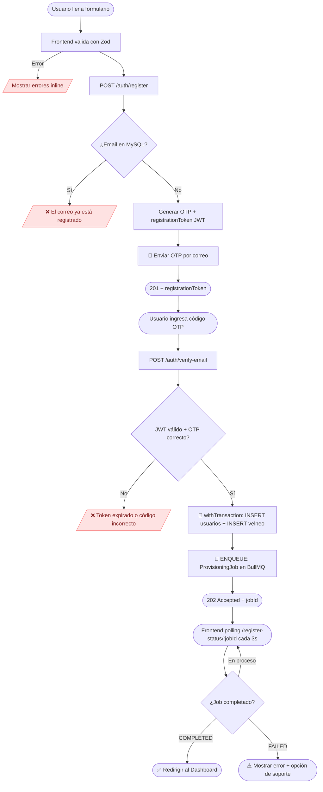
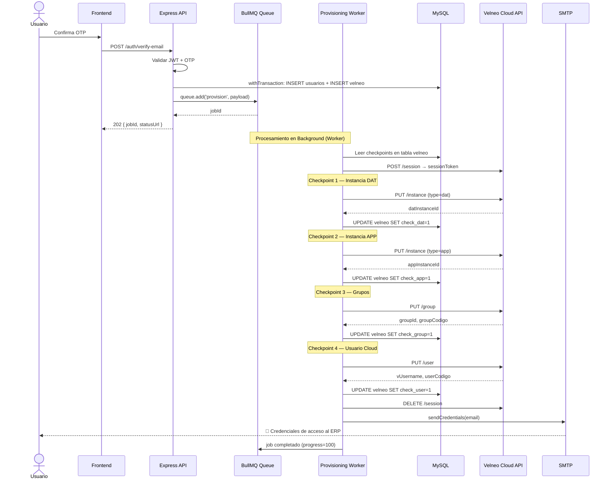
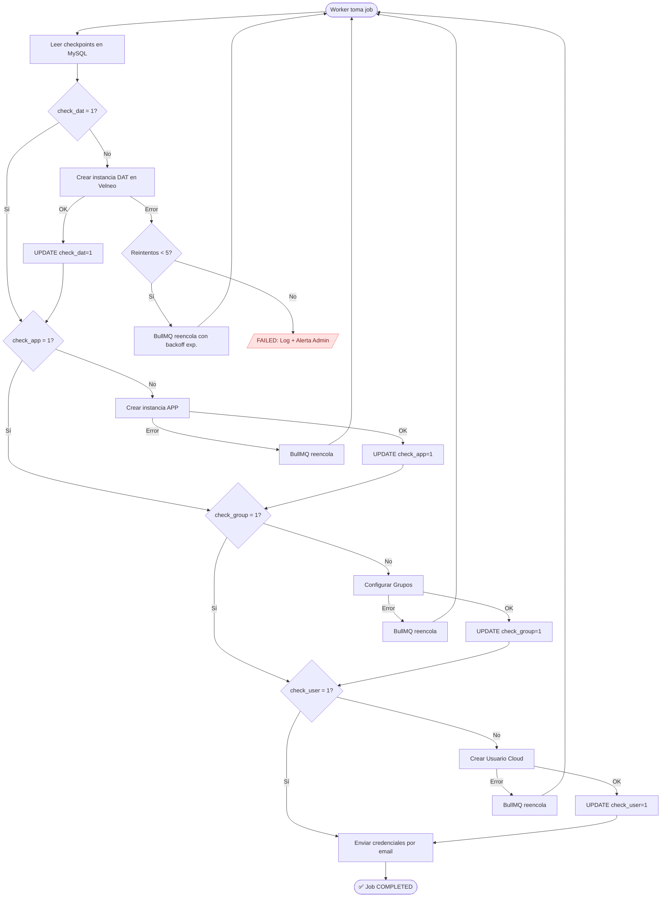
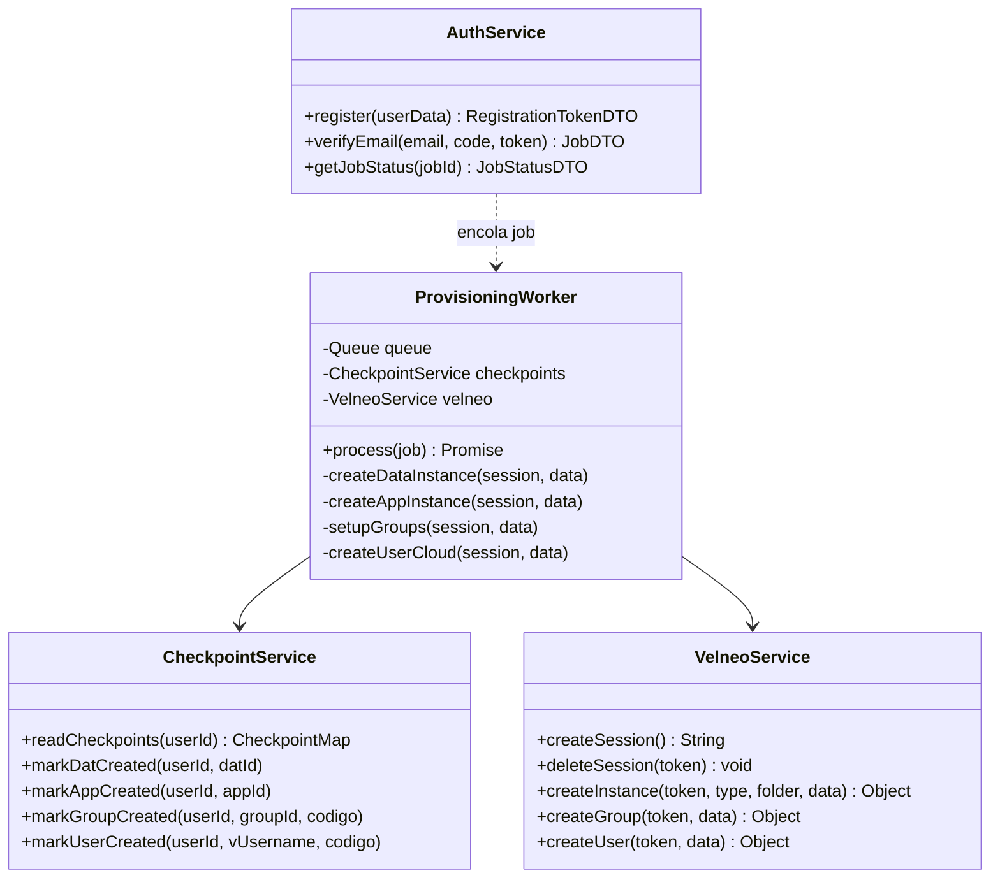

# 🏗️ Arquitectura Asíncrona: Módulo de Registro y Aprovisionamiento

> **Versión:** 2.0 — Asíncrona con BullMQ + Redis
> **Reemplaza:** `registro.md` v1.0 (flujo síncrono)
> **Stack añadido:** Redis, BullMQ, Workers en background

---

## FASE 1 — Dominio, Entidades y Contrato API

### 1.1 Entidades del Dominio

| Entidad | Tabla MySQL | Rol en el flujo |
|---|---|---|
| `RegistrationJob` | *(en Redis/BullMQ)* | Unidad de trabajo asíncrona con estado y reintentos |
| `Usuario` | `usuarios` | Identidad del suscriptor |
| `VelneoRecord` | `velneo` | Mapa de infraestructura del tenant |
| `Carpeta` | `velneo_carpetas` | Slot físico de capacidad en vServer |
| `Instancia` | `velneo_instancias` | Instancia DAT o APP en Velneo Cloud |

### 1.2 Estados del Proceso (State Machine)

```
PENDING → OTP_SENT → EMAIL_VERIFIED → USER_PERSISTED →
DAT_CREATED → APP_CREATED → GROUPS_CONFIGURED →
USER_CLOUD_CREATED → CREDENTIALS_SENT → COMPLETED
                                         ↓ (error en cualquier paso)
                                       FAILED (con checkpoint guardado)
```

### 1.3 Flags de Checkpoint en MySQL (`velneo`)

| Checkpoint | Campo | Descripción |
|---|---|---|
| 0 | `id_usuario` presente | Usuario persistido en MySQL |
| 1 | `id_instancia_dat_check = 1` | Instancia DAT creada |
| 2 | `id_instancia_app_check = 1` | Instancia APP creada |
| 3 | `id_group_check = 1` | Grupos configurados en Velneo Cloud |
| 4 | `id_user_check = 1` | Usuario creado en Velneo Cloud |

### 1.4 Contrato de API

#### `POST /backend/auth/register`
Inicia el flujo. **No persiste datos. No contacta Velneo.**

**Request:**
```json
{
  "firstName": "Juan",
  "lastNameP": "Pérez",
  "lastNameM": "García",
  "email": "juan@empresa.com",
  "phone": "5512345678",
  "company": "Empresa SA",
  "rfc": "PEGJ900101XXX"
}
```

**Response `201`:**
```json
{
  "success": true,
  "message": "Código de verificación enviado al correo",
  "data": {
    "email": "juan@empresa.com",
    "registrationToken": "<JWT firmado, TTL 15min>",
    "expiresIn": 900
  }
}
```

**Errores `400`:**
```json
{ "success": false, "code": "EMAIL_TAKEN", "message": "El correo ya se encuentra registrado" }
{ "success": false, "code": "VALIDATION_ERROR", "errors": [...] }
```

---

#### `POST /backend/auth/verify-email`
Valida OTP → persiste usuario → encola el job de aprovisionamiento.

**Request:**
```json
{
  "email": "juan@empresa.com",
  "code": "847291",
  "registrationToken": "<JWT>"
}
```

**Response `202 Accepted`:**
```json
{
  "success": true,
  "message": "Correo verificado. El aprovisionamiento se está procesando.",
  "data": {
    "jobId": "reg_job_abc123",
    "statusUrl": "/backend/auth/register-status/reg_job_abc123"
  }
}
```

> ⚠️ Se usa **202** (no 200) porque el proceso continúa en background.

---

#### `GET /backend/auth/register-status/:jobId`
Permite al frontend hacer polling del estado.

**Response `200`:**
```json
{
  "jobId": "reg_job_abc123",
  "state": "DAT_CREATED",
  "progress": 40,
  "completedAt": null,
  "error": null
}
```

---

## FASE 2 — Flujos UML

### 2.1 Flowchart — Flujo General



### 2.2 Secuencia — Worker de Aprovisionamiento



### 2.3 Flowchart — Lógica de Reintento Idempotente



---

## FASE 3 — Arquitectura Limpia y Estructura

### 3.1 Estructura de Carpetas

```text
Backend/src/
├── config/
│   ├── db.config.js               # Pool MySQL
│   └── redis.config.js            # 🆕 Conexión Redis (ioredis)
│
├── core/
│   ├── database/
│   │   └── baseSql.provider.js
│   ├── queue/                     # 🆕 Infraestructura BullMQ
│   │   ├── queue.client.js        # Instancia Queue central
│   │   └── worker.client.js       # Bootstrap del Worker
│   └── errors/
│       └── AppError.js
│
├── modules/
│   ├── Auth/
│   │   ├── routes/Auth.routes.js          # /register, /verify-email, /register-status/:id
│   │   ├── controllers/Auth.controller.js
│   │   ├── services/Auth.service.js       # Orquesta registro inicial + encolado
│   │   ├── providers/Auth.provider.js     # MySQL: usuarios, velneo, carpetas
│   │   └── schemas/register.schema.js     # Esquema Zod (compartido con frontend)
│   │
│   ├── Velneo/
│   │   ├── services/Velneo.service.js     # Integración Velneo Cloud API
│   │   └── providers/Velneo.provider.js   # MySQL: velneo_instancias, updates
│   │
│   └── Provisioning/                      # 🆕 Módulo de Workers
│       ├── workers/
│       │   └── provisioning.worker.js     # Procesador del job BullMQ
│       ├── jobs/
│       │   └── provisioning.job.js        # Definición y pasos del job
│       └── services/
│           └── checkpoint.service.js      # Leer/escribir checkpoints en MySQL
│
└── middlewares/
    ├── validate.middleware.js
    ├── auth.middleware.js
    └── errorHandler.middleware.js
```

### 3.2 Diagrama de Clases



---

## FASE 4 — Resiliencia, Errores y Retry

### 4.1 Configuración BullMQ

```javascript
// core/queue/queue.client.js
import { Queue } from 'bullmq';
import { redisConnection } from '../../config/redis.config.js';

export const provisioningQueue = new Queue('provisioning', {
  connection: redisConnection,
  defaultJobOptions: {
    attempts: 5,
    backoff: { type: 'exponential', delay: 5000 },
    // 5s → 10s → 20s → 40s → 80s
    removeOnComplete: { age: 86400 },   // Limpiar completados: 24h
    removeOnFail:    { age: 604800 },   // Mantener fallidos: 7 días
  },
});
```

### 4.2 Worker con Checkpoints e Idempotencia

```javascript
// modules/Provisioning/workers/provisioning.worker.js
import { Worker } from 'bullmq';

const worker = new Worker('provisioning', async (job) => {
  const { userId, email, carpetaId } = job.data;
  const cp = await checkpointService.readCheckpoints(userId);
  const session = await velneoService.createSession();

  try {
    if (!cp.dat) {
      const dat = await velneoService.createInstance(session, 'dat', carpetaId, { email });
      await checkpointService.markDatCreated(userId, dat.id);
      await job.updateProgress(25);
    }
    if (!cp.app) {
      const app = await velneoService.createInstance(session, 'app', carpetaId, { email });
      await checkpointService.markAppCreated(userId, app.id);
      await job.updateProgress(50);
    }
    if (!cp.group) {
      const grp = await velneoService.createGroup(session, { email });
      await checkpointService.markGroupCreated(userId, grp.id, grp.codigo);
      await job.updateProgress(75);
    }
    if (!cp.user) {
      const usr = await velneoService.createUser(session, { email });
      await checkpointService.markUserCreated(userId, usr.username, usr.codigo);
      await job.updateProgress(90);
    }
    await mailService.sendCredentials(email);
    await job.updateProgress(100);
  } finally {
    // Siempre cierra la sesión Velneo, incluso si hay error
    await velneoService.deleteSession(session).catch(() => {});
  }
}, {
  connection: redisConnection,
  concurrency: 3,  // Máximo 3 aprovisionamientos simultáneos
});
```

### 4.3 Mapa de Excepciones

| Paso | Error posible | Acción |
|---|---|---|
| Verificar email en MySQL | DB no disponible | `503` — no inicia flujo |
| Enviar OTP | SMTP falla | `500` — no persiste usuario |
| Persistir usuario | Race condition (email duplicado) | `409 Conflict` |
| Enqueue job | Redis no disponible | `503` — informar al usuario |
| Crear instancia DAT | Timeout / error Velneo | BullMQ reintenta con backoff |
| Crear instancia APP | Error 5xx Velneo | BullMQ reintenta (DAT ya guardado) |
| Configurar grupos | Error parcial | BullMQ reintenta (checkpoints previos OK) |
| Crear usuario Cloud | Error Velneo | BullMQ reintenta |
| Todas las carpetas llenas | Sin espacio disponible | Job `FAILED` inmediato + alerta admin |
| 5 reintentos agotados | Fallo persistente | Log `ERROR` + notificación admin |

### 4.4 Principios de Idempotencia

| Mecanismo | Implementación |
|---|---|
| Checkpoints por usuario | Flags booleanos en tabla `velneo` |
| Deduplicación de jobs | `jobId` único por `userId` en BullMQ |
| Transacción al persistir | `withTransaction` en MySQL |
| Unique Keys en BD | `idx_correo_unico`, `uk_id_group`, `uk_id_user_velneo` |
| Sesiones Velneo controladas | `concurrency: 3` en el Worker |

---

## FASE 5 — Seguridad, Logs y Monitoreo

### 5.1 Seguridad

| Control | Implementación |
|---|---|
| Validación doble | Zod en Frontend **y** Backend (mismo esquema) |
| OTP temporal | JWT firmado (15 min TTL), no almacenado en DB |
| Rate limiting | 5 intentos / 15 min en `/register` |
| Sesión Velneo | Abierta justo antes del uso, cerrada en `finally` |
| HTTPS obligatorio | Credenciales Velneo solo vía HTTPS |
| JWT de sesión app | `HttpOnly`, `Secure`, `SameSite=Strict` |

### 5.2 Niveles de Log

```javascript
logger.info('[REGISTER] Inicio', { email });
logger.info('[OTP] Código enviado', { email, expiresAt });
logger.info('[VERIFY] OTP validado', { email });
logger.info('[QUEUE] Job encolado', { jobId, userId });
logger.info('[WORKER] Checkpoint DAT OK', { userId, datId });
logger.warn('[WORKER] Reintento #N', { jobId, error: err.message });
logger.error('[WORKER] Job FAILED', { jobId, userId, error: err.message });
```

### 5.3 Monitoreo — Bull Board

```javascript
import { createBullBoard } from '@bull-board/api';
import { BullMQAdapter } from '@bull-board/api/bullMQAdapter.js';
import { ExpressAdapter } from '@bull-board/express';

const serverAdapter = new ExpressAdapter();
createBullBoard({
  queues: [new BullMQAdapter(provisioningQueue)],
  serverAdapter,
});

// Solo accesible para administradores
app.use('/admin/queues', adminAuthMiddleware, serverAdapter.getRouter());
```

### 5.4 Timeouts

| Operación | Timeout recomendado |
|---|---|
| Request a Velneo Cloud API | 10 segundos |
| Job completo (todos los pasos) | 120 segundos |
| OTP válido | 15 minutos |
| Job sin procesar en cola | 30 minutos (TTL) |
| Polling del frontend | Cada 3 segundos, máximo 5 minutos |

---

## FASE 6 — Memoria Técnica Integral

### 6.1 Decisión: BullMQ vs RabbitMQ

| Criterio | BullMQ + Redis | RabbitMQ |
|---|---|---|
| Complejidad de setup | ⭐ Baja (solo Redis) | Alta (broker separado) |
| Progreso/checkpoints | ✅ `job.updateProgress()` nativo | Manual |
| UI de monitoreo | ✅ Bull Board | RabbitMQ Management Plugin |
| Integración Node.js | ✅ Nativa | Requiere librería AMQP |
| Persistencia de jobs | ✅ Redis AOF | ✅ Durable queues |
| **Veredicto** | ✅ **Recomendado** | Overkill para un solo servicio |

### 6.2 Variables de Entorno Nuevas

| Variable | Valor ejemplo | Uso |
|---|---|---|
| `REDIS_HOST` | `localhost` | Host de Redis |
| `REDIS_PORT` | `6379` | Puerto Redis |
| `REDIS_PASSWORD` | `secret` | Auth Redis en producción |
| `QUEUE_CONCURRENCY` | `3` | Jobs paralelos por worker |
| `VELNEO_SESSION_TIMEOUT` | `10000` | Timeout requests Velneo (ms) |
| `WORKER_MAX_RETRIES` | `5` | Reintentos máximos por job |

### 6.3 Flujo Completo E2E (Resumen)

```
1.  [Frontend]  Formulario React + Zod valida campos
2.  [Backend]   POST /auth/register → Zod valida → Verifica email en MySQL
3.  [Backend]   Genera OTP + registrationToken JWT (15 min) → Envía email
4.  [Frontend]  Usuario ingresa OTP → POST /auth/verify-email
5.  [Backend]   Verifica JWT + OTP → withTransaction: INSERT usuarios + INSERT velneo
6.  [Backend]   provisioningQueue.add('provision', { userId, email, carpetaId })
7.  [Backend]   Responde 202 Accepted { jobId, statusUrl }
8.  [Frontend]  Polling GET /register-status/:jobId cada 3s
9.  [Worker]    Lee checkpoints → Abre sesión Velneo Cloud
10. [Worker]    Crea instancia DAT → Guarda checkpoint 1 en MySQL
11. [Worker]    Crea instancia APP → Guarda checkpoint 2 en MySQL
12. [Worker]    Configura grupos → Guarda checkpoint 3 en MySQL
13. [Worker]    Crea usuario Cloud → Guarda checkpoint 4 en MySQL
14. [Worker]    Cierra sesión Velneo (finally) → Envía email con credenciales
15. [Frontend]  Polling detecta COMPLETED → Redirige al Dashboard
```

### 6.4 Recuperación ante Fallos — Ejemplo

```
Falla en paso 11 (APP) habiendo completado paso 10 (DAT):
  → BullMQ reencola con backoff exponencial
  → Worker lee checkpoints al reiniciar
  → check_dat = 1 → SALTA el paso DAT (no duplica recurso)
  → Continúa desde APP
  ✅ Sin duplicación de recursos en Velneo Cloud
```

---

## 📊 Resumen Ejecutivo

| Métrica | Valor |
|---|---|
| Endpoints | 3 (`/register`, `/verify-email`, `/register-status/:id`) |
| Colas BullMQ | 1 (`provisioning`) |
| Concurrencia del Worker | 3 jobs simultáneos |
| Checkpoints de idempotencia | 4 (DAT, APP, GROUP, USER) |
| Estrategia de retry | Exponential backoff — 5s base, 5 intentos |
| TTL token OTP | 15 minutos |
| Retención jobs fallidos | 7 días (auditoría) |
| Sesiones Velneo simultáneas | ≤ 3 (controlado por `concurrency`) |
| Tablas MySQL involucradas | 4 (`usuarios`, `velneo`, `velneo_carpetas`, `velneo_instancias`) |
