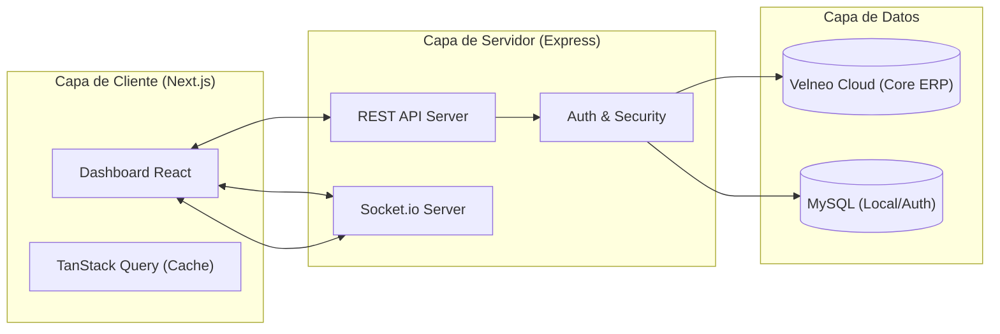
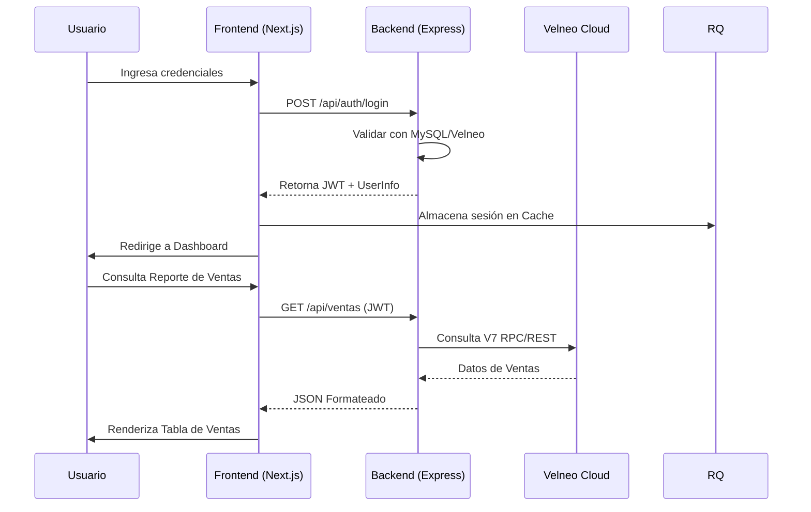

# 🏗️ Planificación del Proyecto: Datta-Erp

Este documento detalla la arquitectura, el stack tecnológico y la estrategia de implementación para el ecosistema **Datta-Erp**, un sistema de gestión empresarial (ERP) moderno construido con una arquitectura híbrida que aprovecha la velocidad de Node.js/Next.js y la robustez de Velneo Cloud.

## 🧠 FASE 1: Análisis de Stack y Objetivos

### 1. Visión General y Objetivo
**Datta-Erp** tiene como objetivo proporcionar una solución SaaS integral para la gestión empresarial, permitiendo la automatización de procesos operativos, financieros y administrativos. El sistema está diseñado para ser multi-tenant, escalable y con una experiencia de usuario premium.

### 2. Justificación del Stack Tecnológico

| Componente | Tecnología | Justificación |
| :--- | :--- | :--- |
| **Backend** | Node.js (Express) | Ideal para manejar múltiples conexiones concurrentes y facilitar la integración con servicios externos (SAT, Velneo, MySQL) mediante APIs REST y WebSockets. |
| **Frontend** | React (Next.js) | El uso de Next.js permite una carga optimizada, renderizado híbrido (SSR/CSR) y una estructura de enrutamiento basada en archivos eficiente para dashboards complejos. |
| **Base de Datos 1** | Velneo Cloud | Columna vertebral para la lógica de negocio empresarial pesada y persistencia de datos críticos de ERP, garantizando integridad y velocidad en transacciones complejas. |
| **Base de Datos 2** | MySQL | Utilizada para persistencia de datos relacionales locales, configuraciones de usuario y caché de datos de acceso rápido. |
| **Tiempo Real** | Socket.io | Implementación de notificaciones instantáneas y actualizaciones de estado sin recarga de página. |

### 3. Ecosistema de Librerías

#### Backend (Capa de Servicio)
- **`mysql2`**: Conector optimizado para la base de datos MySQL.
- **`jsonwebtoken` & `bcrypt`**: Gestión de seguridad, autenticación basada en tokens (JWT) y encriptación de credenciales.
- **`nodemailer`**: Motor para el envío de correos electrónicos (notificaciones, facturas).
- **`express-rate-limit` & `helmet`**: Capas de seguridad para prevenir ataques de fuerza bruta y asegurar headers HTTP.
- **`morgan`**: Logging de peticiones para auditoría y debugging.

#### Frontend (Capa de Cliente)
- **`@tanstack/react-query`**: Gestión de estado asíncrono, caching de peticiones API y sincronización automática.
- **`react-hook-form`**: Manejo eficiente de formularios complejos con validación integrada.
- **`jspdf` & `jspdf-autotable`**: Generación dinámica de reportes y documentos PDF en el lado del cliente.
- **`lucide-react`**: Set de iconos consistentes y ligeros.
- **`react-hot-toast`**: Sistema de notificaciones visuales (Toasts) no intrusivas.

---

## 📊 FASE 2: Documentación Modular (Arquitectura)

### 1. Diagrama de Arquitectura (Nivel 2 C4)

### 2. Flujo de Datos Principal (Autenticación e Ingesta)

---

## 📁 FASE 3: Estructura de Módulos (Propuesta)

La organización sigue un estándar de **Feature-Based Architecture**:

- `Frontend/modules/`: Cada carpeta representa un módulo funcional (ej. `ventas`, `inventario`, `configuracion`).
- `Backend/src/modules/`: Controladores, servicios y rutas segmentados por dominio de negocio.

---

## 🚀 Próximos Pasos
1. Definir los contratos de API para los módulos iniciales.
2. Configurar el middleware de conexión con Velneo Cloud.
3. Establecer el sistema de permisos multi-tenant.
