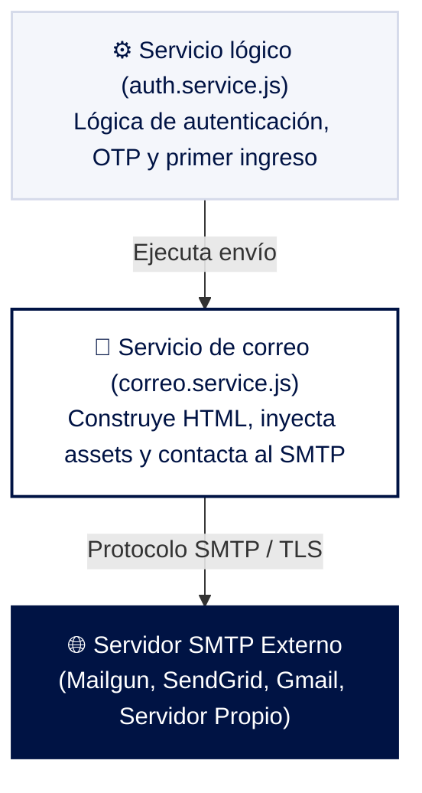
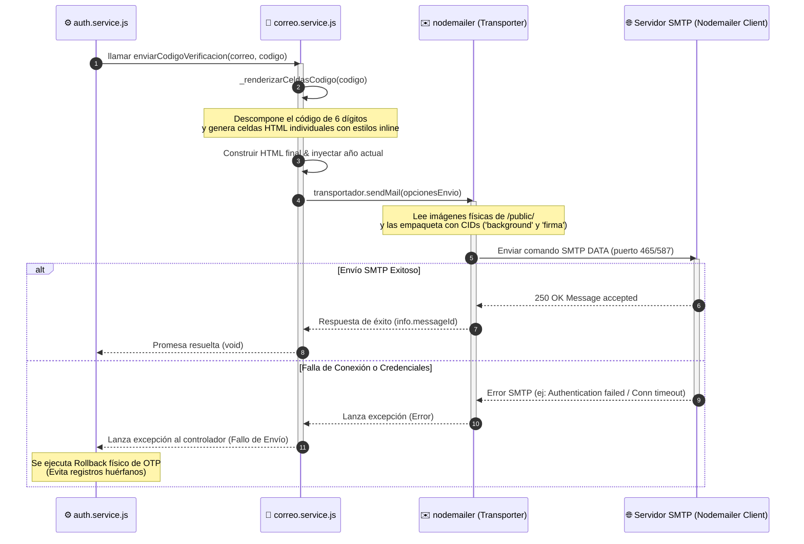
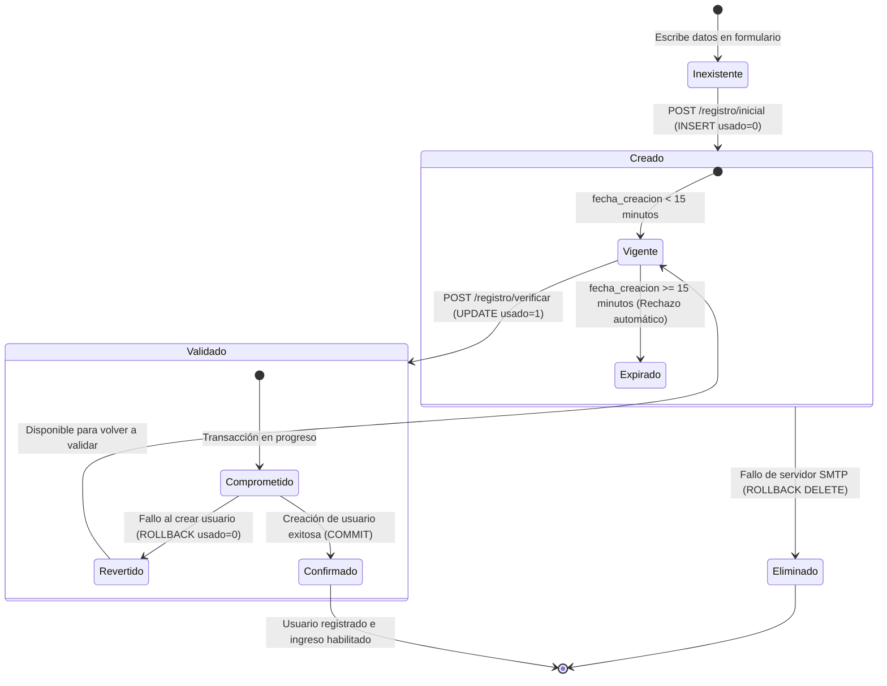

# 📧 Servicio de Correo y Envío Transaccional — Datta ERP
> **Ruta:** `ds-qs/web/servicios/correo_servicio.md`
> **Última actualización:** Mayo 2026
> **Arquitecto:** Antigravity — SaaS Module Planner Skill
> **Estado:** 🚀 100% Operativo e Integrado

---

## 📑 Índice

- [1. Descripción General](#1-descripción-general)
- [2. Arquitectura del Servicio (Contexto)](#2-arquitectura-del-servicio-contexto)
- [3. Configuración y Conexión SMTP (Variables de Entorno)](#3-configuración-y-conexión-smtp-variables-de-entorno)
- [4. Plantillas y Renderizado Dinámico HTML](#4-plantillas-y-renderizado-dinámico-html)
- [5. Métodos y Contratos del Servicio (API Interna)](#5-métodos-y-contratos-del-servicio-api-interna)
- [6. Gestión de Archivos Adjuntos e Imágenes Incrustadas (CIDs)](#6-gestión-de-archivos-adjuntos-e-imágenes-incrustadas-cids)
- [7. Diagrama de Flujo del Envío Transaccional (Mermaid)](#7-diagrama-de-flujo-del-envío-transaccional-mermaid)
- [8. Integración del Servicio de Verificación OTP](#8-integración-del-servicio-de-verificación-otp)
- [9. Estructura de Datos (Tabla codigos_otp)](#9-estructura-de-datos-tabla-codigos_otp)
- [10. Métodos y Contratos de la Capa de Datos (DAL)](#10-métodos-y-contratos-de-la-capa-de-datos-dal)
- [11. Reglas de Cooldown, Criptografía y Expiración](#11-reglas-de-cooldown-criptografía-y-expiración)
- [12. Diagrama de Transición de Estados del OTP (Mermaid)](#12-diagrama-de-transición-de-estados-del-otp-mermaid)

---

## 1. Descripción General

El **Servicio de Correo (ServicioCorreo)** centraliza toda la comunicación saliente de carácter transaccional en **Datta ERP**. Es el canal de comunicación directa con el usuario para operaciones críticas de seguridad y autenticación, tales como:
* Envío de códigos OTP de verificación (One-Time Password) durante el registro o recuperación.
* Notificación de credenciales de acceso iniciales (contraseñas temporales) generadas automáticamente tras el aprovisionamiento de infraestructura en la nube.

Este servicio está diseñado con enfoque en:
* **Compatibilidad de renderizado:** Plantillas HTML con estilos inline exhaustivos y tablas de diseño rígido para asegurar la correcta visualización en múltiples clientes de correo (Outlook, Gmail, Apple Mail, etc.).
* **Rendimiento y seguridad:** Conexiones cifradas mediante TLS o SSL nativo de Nodemailer.
* **Recursos embebidos:** Uso de Content-ID (CID) para renderizar firmas y fondos corporativos sin depender de llamadas a servidores de imágenes externos propensos al bloqueo de red.

---

## 2. Arquitectura del Servicio (Contexto)

El servicio de correo funciona como un broker o utilidad interna (`utility service`) que es instanciada y exportada como un Singleton. Se comunica directamente con la capa de lógica de negocio (Servicios) y no interactúa directamente con la capa de datos (MySQL), salvo indirectamente a través del flujo transaccional de seguridad en `auth.service.js`.



---

## 3. Configuración y Conexión SMTP (Variables de Entorno)

La inicialización del transporte se realiza en el constructor de la clase utilizando las siguientes variables de entorno obligatorias:

| Variable | Tipo | Descripción | Ejemplo / Valor de Prueba |
| :--- | :---: | :--- | :--- |
| `MAIL_HOST` | `String` | Dirección del host del servidor SMTP de salida | `smtp.dattasoft.com` |
| `MAIL_PORT` | `String` | Puerto del servidor SMTP (465 SSL, 587/25 TLS) | `465` o `587` |
| `MAIL_USER` | `String` | Nombre de usuario de la cuenta de correo emisora | `soporte@dattasoft.com` |
| `MAIL_PASS` | `String` | Contraseña o token de aplicación para el usuario | `********` |
| `MAIL_FROM` | `String` | Cabecera "From" expuesta en el correo enviado | `"Datta ERP" <soporte@dattasoft.com>` |

### Configuración Automática de SSL/TLS
En el constructor, el servicio decide de forma automatizada si establecer una conexión SSL directa (`secure: true`) o una conexión estándar con comando `STARTTLS` (`secure: false`):
```javascript
this.transportador = nodemailer.createTransport({
  host: process.env.MAIL_HOST,
  port: process.env.MAIL_PORT,
  secure: process.env.MAIL_PORT === '465', // true para puerto 465, false para otros como 587
  auth: {
    user: process.env.MAIL_USER,
    pass: process.env.MAIL_PASS,
  },
});
```

---

## 4. Plantillas y Renderizado Dinámico HTML

El servicio integra dos maquetas visuales Premium responsivas con tipografía corporativa `Montserrat` de Google Fonts y paleta de colores azul oscuro (`#001344`) y gris claro (`#edf0f7`).

### A. Renderizado de Dígitos OTP (Método Privado)
Para evitar que el código OTP de 6 dígitos se visualice como simple texto plano, se cuenta con una función auxiliar que descompone el código y crea celdas estilizadas individuales:

```javascript
_renderizarCeldasCodigo(codigo) {
  return String(codigo)
    .split('')
    .map(
      (digito) => `
      <td style="
        width: 52px;
        height: 64px;
        background-color: #f4f6fb;
        border: 1.5px solid #c7cfdf;
        border-radius: 8px;
        text-align: center;
        vertical-align: middle;
        font-family: 'Montserrat', sans-serif;
        font-size: 30px;
        font-weight: 700;
        color: #001344;
        padding: 0;
      ">${digito}</td>
      <td style="width: 8px;"></td>`
    )
    .join('');
}
```

### B. Plantilla de Verificación de OTP
Muestra el estado "Verificación de cuenta", introduce el tiempo límite rígido de 15 minutos en texto destacado rojo (`#c0392b`), y renderiza el código dentro de un contenedor centrado con borde.


### C. Plantilla de Envío de Credenciales Iniciales
Reutiliza la estructura del contenedor principal pero sustituye el casillero de código por una tarjeta de doble celda con líneas discontinuas (`dashed`) que separa de forma legible el **Usuario** y la **Contraseña Provisional** en tipografía monoespaciada para evitar errores al copiar y pegar.


---

## 5. Métodos y Contratos del Servicio (API Interna)

El archivo exporta una instancia única e inmutable del servicio (`servicioCorreo`):

### A. Método: `enviarCodigoVerificacion(destinatario, codigo)`
Construye el cuerpo de HTML, genera las celdas del código mediante `_renderizarCeldasCodigo()` y realiza la llamada SMTP.

* **Firma:** `async enviarCodigoVerificacion(destinatario, codigo)`
* **Parámetros:**
  * `destinatario` (string): Correo destino del cliente/usuario.
  * `codigo` (string|number): Código OTP de 6 dígitos.
* **Código de Ejemplo de Envío:**
```javascript
const celdasCodigo = this._renderizarCeldasCodigo(codigo);
const año = new Date().getFullYear();
const html = `...`; // Estructura HTML descrita en correo.service.js

await this.transportador.sendMail({
  from: this.remitente,
  to: destinatario,
  subject: 'Código de Verificación - DattaErp',
  html,
  attachments: [
    {
      filename: 'background.jpg',
      path: path.join(__dirname, '../../public/Background-Dattasoft.jpg'),
      cid: 'background',
    },
    {
      filename: 'firma.png',
      path: path.join(__dirname, '../../public/firma-electrónica.png'),
      cid: 'firma',
    },
  ],
});
```

### B. Método: `enviarCredenciales(destinatario, usuario, contraseña)`
Genera el correo de bienvenida para el primer ingreso a la aplicación.

* **Firma:** `async enviarCredenciales(destinatario, usuario, contraseña)`
* **Parámetros:**
  * `destinatario` (string): Correo destino del usuario.
  * `usuario` (string): Username generado (ej: `william.garcia423`).
  * `contraseña` (string): Clave temporal autogenerada de 12 caracteres.
* **Asunto del Correo:** `Tus Credenciales de Acceso - DattaErp`

---

## 6. Gestión de Archivos Adjuntos e Imágenes Incrustadas (CIDs)

Para mantener una apariencia premium y evitar que los clientes de correo marquen los correos como spam o bloqueen las imágenes (típico de imágenes vinculadas con `http://` en ciertos clientes corporativos), se realiza la incrustación mediante **Content-ID (CID)** adjuntando las imágenes físicamente en el payload multipart del correo:

1. **Header Background (`cid:background`):** 
   * Archivo origen: `/public/Background-Dattasoft.jpg`
   * Se utiliza como fondo en el encabezado del correo.
2. **Pie de Firma Corporativa (`cid:firma`):**
   * Archivo origen: `/public/firma-electrónica.png`
   * Inserta la firma del equipo consultor de Dattasoft al final de cada comunicación.

> [!WARNING]
> Ambos archivos deben existir físicamente en la carpeta `/public` del backend. Si el backend no cuenta con estas imágenes al momento del envío, Nodemailer fallará arrojando un error de tipo `ENOENT` y detendrá el proceso de registro o restablecimiento.

---

## 7. Diagrama de Flujo del Envío Transaccional (Mermaid)

El siguiente diagrama ilustra la secuencia lógica e interacción del servicio de correo cuando es invocado por la capa lógica de negocio del backend:



---

*Documentación de arquitectura del servicio de correo — Datta ERP — Mayo 2026*

---

## 8. Integración del Servicio de Verificación OTP

El **Servicio de Códigos OTP (One-Time Password)** es un pilar fundamental en la seguridad de **Datta ERP**. Es el encargado de validar la identidad de los nuevos usuarios confirmando la posesión real de su correo electrónico antes de permitir el aprovisionamiento de cuentas e infraestructura.

Este servicio mitiga vulnerabilidades como:
* Creación de cuentas fantasma o con correos ajenos.
* Ataques de denegación de servicio (DoS) y saturación en servidores SMTP mediante un **cooldown dinámico de 3 minutos**.
* Reutilización de tokens obsoletos (replay attacks) mediante un **estado de un solo uso** de expiración rígida de 15 minutos.

---

## 9. Estructura de Datos (Tabla `codigos_otp`)

La tabla central del servicio es `codigos_otp`, la cual ha sido optimizada con índices de búsqueda rápida por tuplas y fecha de vencimiento.

```sql
CREATE TABLE IF NOT EXISTS `codigos_otp` (
  `id`               INT UNSIGNED  NOT NULL AUTO_INCREMENT     COMMENT 'Identificador único del registro OTP',
  `correo`           VARCHAR(100)  NOT NULL                    COMMENT 'Correo destino al que se envió el código',
  `codigo`           VARCHAR(6)    NOT NULL                    COMMENT 'Código numérico de 6 dígitos autogenerado',
  `tipo`             ENUM('registro','reset_contrasena','2fa')
                     NOT NULL DEFAULT 'registro'               COMMENT 'Propósito del código (registro, reset, etc)',
  `fecha_expiracion` DATETIME      NOT NULL                    COMMENT 'Fecha límite de validez del código',
  `usado`            TINYINT(1)    NOT NULL DEFAULT '0'        COMMENT 'Indica si el código ya fue validado',
  `fecha_creacion`   TIMESTAMP     NOT NULL DEFAULT CURRENT_TIMESTAMP COMMENT 'Fecha de generación del OTP',
  PRIMARY KEY (`id`),
  KEY `idx_otp_correo_tipo`  (`correo`, `tipo`),
  KEY `idx_otp_expiracion`   (`fecha_expiracion`)
) ENGINE=InnoDB DEFAULT CHARSET=utf8mb4 COLLATE=utf8mb4_0900_ai_ci;
```

#### Detalles de Índices:
* `idx_otp_correo_tipo` (`correo`, `tipo`): Optimiza la búsqueda de códigos activos para un usuario en consultas de validación.
* `idx_otp_expiracion` (`fecha_expiracion`): Agiliza los queries de saneamiento o verificación de validez por tiempo.

---

## 10. Métodos y Contratos de la Capa de Datos (DAL)

Los métodos de persistencia están declarados en `auth.repository.js` utilizando el pool de conexiones MySQL con soporte para promesas:

### A. Inserción de un nuevo OTP
```javascript
async insertarOtp(correo, codigo, tiempoExpiracion) {
  const [resultado] = await pool.query(
    "INSERT INTO codigos_otp (correo, codigo, tipo, fecha_expiracion, usado) VALUES (?, ?, 'registro', ?, 0)",
    [correo, codigo, tiempoExpiracion]
  );
  return resultado;
}
```

### B. Obtención del Último OTP (Regla de Cooldown)
```javascript
async obtenerUltimoOtp(correo) {
  const [filas] = await pool.query(
    "SELECT * FROM codigos_otp WHERE correo = ? AND tipo = 'registro' ORDER BY fecha_creacion DESC LIMIT 1",
    [correo]
  );
  return filas[0] || null;
}
```

### C. Buscar OTP Válido (Verificación)
```javascript
async buscarOtpValido(correo, codigo) {
  const [filas] = await pool.query(
    "SELECT * FROM codigos_otp WHERE correo = ? AND codigo = ? AND tipo = 'registro'",
    [correo, codigo]
  );
  return filas[0] || null;
}
```

### D. Cambios de Estado y Rollback Transaccional
* **`marcarOtpComoUsado(id, conexion)`**: Setea `usado = 1` una vez validado. Permite pasar una conexión de base de datos activa para actuar dentro de una transacción ácida (`COMMIT`/`ROLLBACK`).
* **`revertirOtpUsado(id, conexion)`**: Setea `usado = 0` si la inserción del usuario o aprovisionamiento falla tras haber validado el código.
* **`eliminarOtp(id)`**: Remueve físicamente el registro OTP. Utilizado de manera preventiva en `/registro/inicial` si el servidor SMTP (Nodemailer) falla al enviar el correo, evitando guardar registros huérfanos imposibles de verificar.

---

## 11. Reglas de Cooldown, Criptografía y Expiración

Las directrices lógicas residen en `auth.service.js` y regulan las fases del ciclo de vida del OTP:

### A. Generación y Envío (Inicialización)
1. **Verificación de duplicado:** Comprueba de forma local en la tabla `usuarios` que el correo no esté en uso.
2. **Validación del Cooldown (3 minutos):**
   * Consulta el último OTP con `obtenerUltimoOtp(correo)`.
   * Si existe, calcula el tiempo transcurrido:
     $$\text{Tiempo Transcurrido} = \text{Date.now()} - \text{fecha\_creacion}$$
   * Si es menor a **180,000 ms (3 minutos)**, arroja un error con código de estado `429 (Too Many Requests)` indicando los minutos y segundos que debe esperar el usuario.
3. **Criptografía:** Genera un token aleatorio numérico de 6 dígitos:
   ```javascript
   const otp = Math.floor(100000 + Math.random() * 900000).toString();
   ```
4. **Cálculo de Expiración:** Asigna la hora de expiración sumando 15 minutos exactos a la fecha del servidor.
5. **Transmisión y Salvaguarda:** Guarda el OTP en MySQL. Intenta enviar el correo mediante Nodemailer. Si este último falla, se ejecuta el **rollback físico** eliminando el registro de la tabla para mantener la base de datos libre de basura técnica.

### B. Validación e Impacto (Verificación)
Al recibir `/registro/verificar`:
1. Consulta el OTP en la base de datos.
2. **Filtro de Seguridad Rígido:**
   * Si no se encuentra: Rechaza (Código incorrecto).
   * Si `usado = 1`: Rechaza (Código ya utilizado).
   * Si la fecha actual supera a `fecha_expiracion`: Rechaza (Código expirado).
3. **Transaccionalidad:** Abre una conexión de base de datos, marca el OTP como usado y procede a crear el registro de usuario de forma atómica. Si ocurre una excepción en la creación, hace `ROLLBACK` y revierte el estado del OTP a `usado = 0` para permitirle al usuario reintentar sin perder su código vigente.

---

## 12. Diagrama de Transición de Estados del OTP (Mermaid)

El siguiente diagrama detalla cómo cambia el estado de un registro de verificación en la base de datos a lo largo de su ciclo de vida útil:



---

*Documentación de arquitectura del servicio de correo y verificación OTP — Datta ERP — Mayo 2026*
