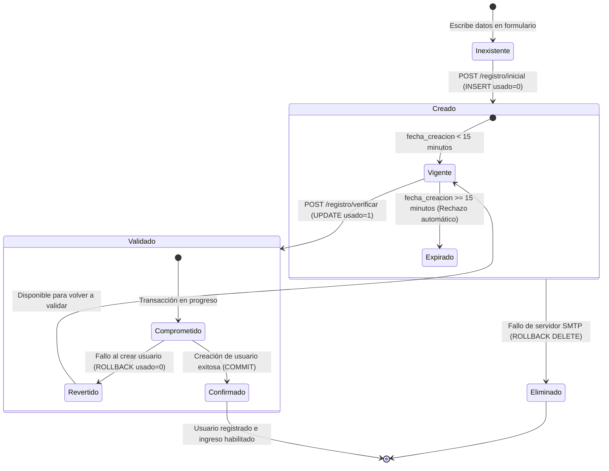

# 🔑 Servicio de Verificación OTP — Datta ERP
> **Ruta:** `ds-qs/web/servicios/otp_servicio.md`
> **Última actualización:** Mayo 2026
> **Arquitecto:** Antigravity — SaaS Module Planner Skill
> **Estado:** 🚀 100% Operativo e Integrado

---

## 📑 Índice

- [1. Descripción General](#1-descripción-general)
- [2. Arquitectura del Servicio (Capas)](#2-arquitectura-del-servicio-capas)
- [3. Estructura de Datos (MySQL)](#3-estructura-de-datos-mysql)
- [4. Métodos y Contratos de la Capa de Datos (DAL)](#4-métodos-y-contratos-de-la-capa-de-datos-dal)
- [5. Flujo de Negocio y Reglas de Seguridad (Service Layer)](#5-flujo-de-negocio-y-reglas-de-seguridad-service-layer)
- [6. Servicio de Correo y Renderizado HTML](#6-servicio-de-correo-y-renderizado-html)
- [7. Diagrama de Transición de Estados del OTP](#7-diagrama-de-transición-de-estados-del-otp)

---

## 1. Descripción General

El **Servicio de Códigos OTP (One-Time Password)** es un pilar fundamental en la seguridad de **Datta ERP**. Es el encargado de validar la identidad de los nuevos usuarios confirmando la posesión real de su correo electrónico antes de permitir el aprovisionamiento de cuentas e infraestructura.

Este servicio mitiga vulnerabilidades como:
* Creación de cuentas fantasma o con correos ajenos.
* Ataques de denegación de servicio (DoS) y saturación en servidores SMTP mediante un **cooldown dinámico de 3 minutos**.
* Reutilización de tokens obsoletos (replay attacks) mediante un **estado de un solo uso** de expiración rígida de 15 minutos.

---

## 2. Arquitectura del Servicio (Capas)

El servicio sigue la arquitectura limpia del proyecto y se distribuye a través de tres capas diferenciadas del backend:

```text
┌─────────────────────────────────────────────────────────┐
│              Controlador (auth.controller.js)           │
│       Mapea peticiones, valida payloads con Zod         │
└────────────────────────────┬────────────────────────────┘
                             │
┌────────────────────────────▼────────────────────────────┐
│               Servicio (auth.service.js)                │
│       Reglas de Cooldown, Expiración y Criptografía     │
└──────────────┬─────────────────────────────┬────────────┘
               │                             │
┌──────────────▼─────────────┐ ┌─────────────▼────────────┐
│      Acceso a Datos (DAL)  │ │      Correo (SMTP)       │
│      (auth.repository.js)  │ │   (correo.service.js)    │
│  Consultas directas MySQL  │ │  Renderizado HTML y TLS  │
└────────────────────────────┘ └──────────────────────────┘
```

---

## 3. Estructura de Datos (MySQL)

La tabla central del servicio es `codigos_otp`, la cual ha sido optimizada con índices de búsqueda rápida por tuplas y fecha de vencimiento.

### Tabla: `codigos_otp`

```sql
CREATE TABLE IF NOT EXISTS `codigos_otp` (
  `id`               INT UNSIGNED  NOT NULL AUTO_INCREMENT     COMMENT 'Identificador único del registro OTP',
  `correo`           VARCHAR(100)  NOT NULL                    COMMENT 'Correo destino al que se envió el código',
  `codigo`           VARCHAR(6)    NOT NULL                    COMMENT 'Código numérico de 6 dígitos autogenerado',
  `tipo`             ENUM('registro','reset_contrasena','2fa')
                     NOT NULL DEFAULT 'registro'               COMMENT 'Propósito del código (registro, reset, etc)',
  `fecha_expiracion` DATETIME      NOT NULL                    COMMENT 'Fecha límite de validez del código',
  `usado`            TINYINT(1)    NOT NULL DEFAULT '0'        COMMENT 'Indica si el código ya fue validado',
  `fecha_creacion`   TIMESTAMP     NOT NULL DEFAULT CURRENT_TIMESTAMP COMMENT 'Fecha de generación del OTP',
  PRIMARY KEY (`id`),
  KEY `idx_otp_correo_tipo`  (`correo`, `tipo`),
  KEY `idx_otp_expiracion`   (`fecha_expiracion`)
) ENGINE=InnoDB DEFAULT CHARSET=utf8mb4 COLLATE=utf8mb4_0900_ai_ci;
```

#### Detalles de Índices:
* `idx_otp_correo_tipo` (`correo`, `tipo`): Optimiza la búsqueda de códigos activos para un usuario en consultas recurrentes de validación.
* `idx_otp_expiracion` (`fecha_expiracion`): Agiliza los queries de saneamiento o verificación de validez por tiempo.

---

## 4. Métodos y Contratos de la Capa de Datos (DAL)

Los métodos de persistencia están declarados en `auth.repository.js` utilizando el pool de conexiones MySQL con soporte para promesas:

### A. Inserción de un nuevo OTP
Inserta un código recién generado asignándole por defecto el tipo `'registro'` y el estado `usado = 0`.
```javascript
async insertarOtp(correo, codigo, tiempoExpiracion) {
  const [resultado] = await pool.query(
    "INSERT INTO codigos_otp (correo, codigo, tipo, fecha_expiracion, usado) VALUES (?, ?, 'registro', ?, 0)",
    [correo, codigo, tiempoExpiracion]
  );
  return resultado;
}
```

### B. Obtención del Último OTP (Regla de Cooldown)
Recupera el registro de código más reciente ordenado en orden descendente. Utilizado para validar el tiempo de espera entre reenvíos.
```javascript
async obtenerUltimoOtp(correo) {
  const [filas] = await pool.query(
    "SELECT * FROM codigos_otp WHERE correo = ? AND tipo = 'registro' ORDER BY fecha_creacion DESC LIMIT 1",
    [correo]
  );
  return filas[0] || null;
}
```

### C. Buscar OTP Válido (Verificación)
Consulta la coincidencia exacta de correo y código bajo el tipo de acción `'registro'`.
```javascript
async buscarOtpValido(correo, codigo) {
  const [filas] = await pool.query(
    "SELECT * FROM codigos_otp WHERE correo = ? AND codigo = ? AND tipo = 'registro'",
    [correo, codigo]
  );
  return filas[0] || null;
}
```

### D. Cambios de Estado y Rollback Transaccional
* **`marcarOtpComoUsado(id, conexion)`**: Setea `usado = 1` una vez validado. Permite pasar una conexión de base de datos activa para actuar dentro de una transacción ácida (`COMMIT`/`ROLLBACK`).
* **`revertirOtpUsado(id, conexion)`**: Setea `usado = 0` si la inserción del usuario o aprovisionamiento falla tras haber validado el código.
* **`eliminarOtp(id)`**: Remueve físicamente el registro OTP. Utilizado de manera preventiva en `/registro/inicial` si el servidor SMTP (Nodemailer) falla al enviar el correo, evitando guardar registros huérfanos imposibles de verificar.

---

## 5. Flujo de Negocio y Reglas de Seguridad (Service Layer)

Las directrices lógicas residen en `auth.service.js` y regulan las fases del ciclo de vida del OTP:

### A. Generación y Envío (Inicialización)
1. **Verificación de duplicado:** Comprueba de forma local en la tabla `usuarios` que el correo no esté en uso.
2. **Validación del Cooldown (3 minutos):**
   * Consulta el último OTP con `obtenerUltimoOtp(correo)`.
   * Si existe, calcula el tiempo transcurrido:
     $$\text{Tiempo Transcurrido} = \text{Date.now()} - \text{fecha\_creacion}$$
   * Si es menor a **180,000 ms (3 minutos)**, arroja un error con código de estado `429 (Too Many Requests)` indicando los minutos y segundos que debe esperar el usuario.
3. **Criptografía:** Genera un token aleatorio numérico de 6 dígitos:
   ```javascript
   const otp = Math.floor(100000 + Math.random() * 900000).toString();
   ```
4. **Cálculo de Expiración:** Asigna la hora de expiración sumando 15 minutos exactos a la fecha del servidor.
5. **Transmisión y Salvaguarda:** Guarda el OTP en MySQL. Intenta enviar el correo mediante Nodemailer. Si este último falla, se ejecuta el **rollback físico** eliminando el registro de la tabla para mantener la base de datos libre de basura técnica.

### B. Validación e Impacto (Verificación)
Al recibir `/registro/verificar`:
1. Consulta el OTP en la base de datos.
2. **Filtro de Seguridad Rígido:**
   * Si no se encuentra: Rechaza (Código incorrecto).
   * Si `usado = 1`: Rechaza (Código ya utilizado).
   * Si la fecha actual supera a `fecha_expiracion`: Rechaza (Código expirado).
3. **Transaccionalidad:** Abre una conexión de base de datos, marca el OTP como usado y procede a crear el registro de usuario de forma atómica. Si ocurre una excepción en la creación, hace `ROLLBACK` y revierte el estado del OTP a `usado = 0` para permitirle al usuario reintentar sin perder su código vigente.

---

## 6. Servicio de Correo y Renderizado HTML

El archivo `correo.service.js` actúa como el broker SMTP. Para garantizar que los correos de verificación se visualicen estéticos, el servicio aplica un renderizado dinámico en celdas individuales para los dígitos del código:

```javascript
generarDigitosOtpHtml(otp) {
  return otp.split('').map(digito => `
    <div style="
      display: inline-block;
      width: 45px;
      height: 50px;
      line-height: 50px;
      text-align: center;
      background-color: #f4f4f5;
      border: 1px solid #e4e4e7;
      border-radius: 12px;
      font-size: 24px;
      font-weight: bold;
      color: #09090b;
      margin: 0 4px;
    ">${digito}</div>
  `).join('');
}
```

Este bloque inserta celdas estilizadas directamente en la plantilla HTML responsive, brindando un aspecto premium y corporativo que se adapta a clientes móviles y de escritorio de forma perfecta.

---

## 7. Diagrama de Transición de Estados del OTP

El siguiente diagrama detalla cómo cambia el estado de un registro de verificación en la base de datos a lo largo de su ciclo de vida útil:



---

*Documentación técnica del servicio OTP — Datta ERP — Mayo 2026*
