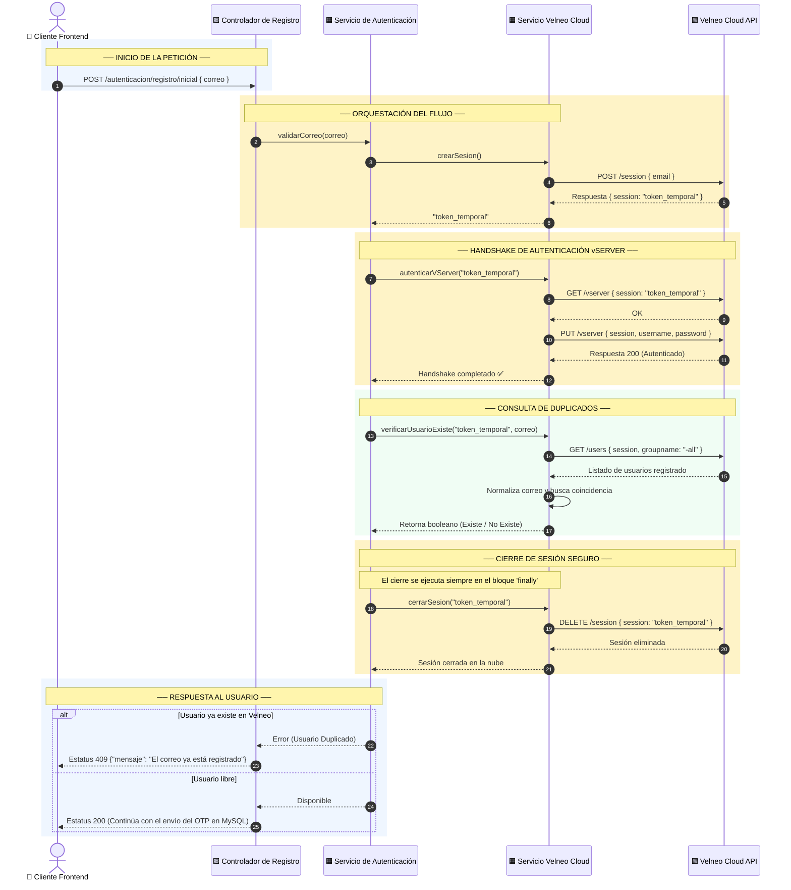
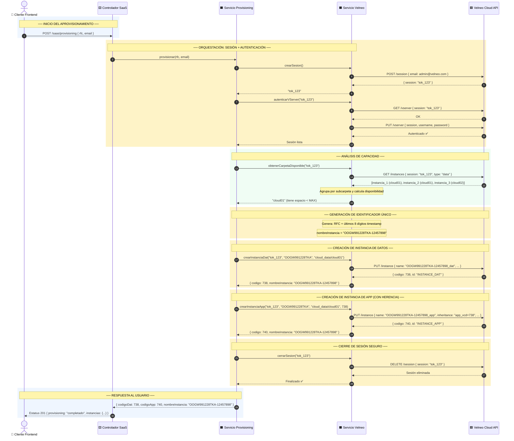
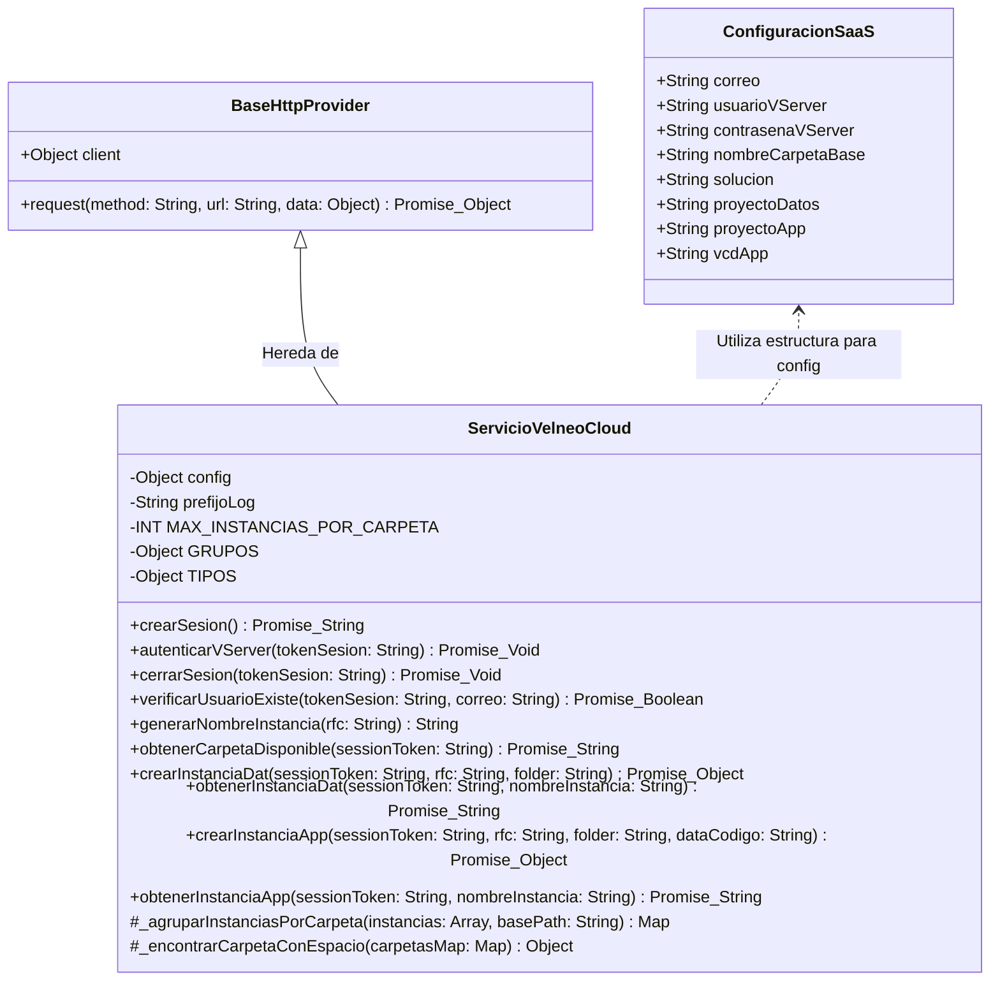

# ☁️ Especificación Técnica: Servicio Velneo Cloud

Este documento detalla la especificación técnica de la API y el diseño de la integración con **Velneo Cloud** dentro del ecosistema de **Datta-Erp**. Define el propósito, contratos de datos, flujo de secuencias de verificación de usuarios y la política de tratamiento de excepciones.

---

## 📋 1. Propósito y Alcance del Servicio

El **Servicio de Velneo Cloud** (`ServicioVelneoCloud`) actúa como el puente de integración seguro entre el backend de **Datta-Erp** y la API de administración de Velneo Cloud. Su responsabilidad principal es gestionar el ciclo de vida completo de operaciones en la infraestructura de Velneo, incluyendo:
1.  **Aprovisionamiento de sesiones seguras** con autenticación dual vServer.
2.  **Verificación de usuarios** para impedir registros duplicados sincronizando MySQL con Velneo Cloud.
3.  **Gestión de instancias de datos y aplicación** con identificadores únicos por tenant.
4.  **Distribución inteligente de almacenamiento** en subcarpetas (cloud01, cloud02, etc.) con equilibrio de carga.

---

## 🔌 2. Puntos de Acceso e Integración del Servicio

A continuación se detallan los métodos públicos expuestos por el servicio y los endpoints correspondientes de la API de Velneo Cloud que consumen de manera interna:

### 2.1. Gestión de Sesiones

| Método JS | Endpoint Externo | Acción / Propósito |
| :--- | :--- | :--- |
| `crearSesion()` | `POST /session` | Inicia una sesión de trabajo de corta duración en Velneo Cloud. |
| `autenticarVServer(tokenSesion)` | `GET /vserver`<br/>`PUT /vserver` | Realiza el handshake de seguridad y autentica la sesión contra el vServer principal. |
| `cerrarSesion(tokenSesion)` | `DELETE /session` | Finaliza la sesión activa para liberar recursos en el servidor de la nube. |

### 2.2. Gestión de Usuarios

| Método JS | Endpoint Externo | Acción / Propósito |
| :--- | :--- | :--- |
| `verificarUsuarioExiste(tokenSesion, correo)` | `GET /users` | Obtiene el listado de usuarios del vServer para buscar coincidencias del correo electrónico. |

### 2.3. Gestión Inteligente de Instancias

| Método JS | Endpoint Externo | Acción / Propósito | Retorna |
| :--- | :--- | :--- | :--- |
| `obtenerCarpetaDisponible(sessionToken)` | `GET /instances` | Analiza instancias existentes y retorna subcarpeta disponible (cloud01, cloud02, etc). | `Promise<String>` |
| `crearInstanciaDat(sessionToken, rfc, folder)` | `PUT /instance` | Crea instancia de datos con nombre único RFC-Timestamp y la almacena en carpeta asignada. | `Promise<{codigo: String, nombreInstancia: String}>` |
| `obtenerInstanciaDat(sessionToken, nombreInstancia)` | `GET /instance` | Obtiene código de instancia de datos por su identificador. | `Promise<String>` |
| `crearInstanciaApp(sessionToken, rfc, folder, dataCodigo)` | `PUT /instance` | Crea instancia de aplicación heredando datos. Retorna identificador generado. | `Promise<{codigo: String, nombreInstancia: String}>` |
| `obtenerInstanciaApp(sessionToken, nombreInstancia)` | `GET /instance` | Obtiene código de instancia de aplicación por su identificador. | `Promise<String>` |

### Contratos de Datos (JSON Payloads)

#### A. Iniciar Sesión (`crearSesion`)
*   **Petición Externa (Request):**
    ```json
    {
      "email": "correo-administrador@velneocloud.com"
    }
    ```
*   **Respuesta Externa (Response):**
    ```json
    {
      "session": "tok_velneo_abc123xyz789"
    }
    ```

#### B. Autenticar vServer (`autenticarVServer`)
*   **Petición Externa (Request PUT):**
    ```json
    {
      "session": "tok_velneo_abc123xyz789",
      "username": "usuario_administrador_vserver",
      "password": "contrasena_segura_vserver"
    }
    ```
*   **Respuesta Externa (Response):**
    ```json
    {
      "status": "authenticated"
    }
    ```

#### C. Verificar Duplicado de Usuario (`verificarUsuarioExiste`)
*   **Petición Externa (Request GET):** Se envía como parámetros en la consulta HTTP:
    *   `session` (string): Token de sesión.
    *   `groupname` (string): `-all` (para buscar en todos los grupos).
*   **Respuesta Externa (Response):**
    ```json
    {
      "users": [
        {
          "Name": "Usuario Ejemplo",
          "Email": "william@empresa.com",
          "useremail": "william@empresa.com",
          "userEmail": "william@empresa.com"
        }
      ]
    }
    ```

#### D. Crear Instancia de Datos (`crearInstanciaDat`)
*   **Petición Externa (Request PUT):**
    ```json
    {
      "session": "tok_velneo_abc123xyz789",
      "name": "OOGW991228TKA-12457898_dat",
      "byId": "true",
      "project": "ajp7sicy.vcd",
      "solution": "DATTA ERP",
      "folderShared": "cloud_data/cloud01/OOGW991228TKA-12457898",
      "type": "data",
      "inheritance": ""
    }
    ```
*   **Respuesta Interna (Return del método):**
    ```json
    {
      "codigo": 738,
      "nombreInstancia": "OOGW991228TKA-12457898"
    }
    ```

#### E. Obtener Carpeta Disponible (`obtenerCarpetaDisponible`)
*   **Petición Externa (Request GET):**
    ```json
    {
      "session": "tok_velneo_abc123xyz789",
      "type": "data"
    }
    ```
*   **Respuesta Externa (Response):**
    ```json
    {
      "dataInstances": [
        {
          "codigo": 722,
          "id": "CATALOGOS_SAT_DAT",
          "nombre": "Catalogos_Sat_Dat",
          "proyecto": "ajrhwtuu.vcd",
          "ruta": "datos/Catalogos Sat",
          "solucion": "Catalogos SAT"
        },
        {
          "codigo": 738,
          "id": "PRUEBA5",
          "nombre": "prueba5",
          "proyecto": "ajp7sicy.vcd",
          "ruta": "cloud_data/cloud01/prueba5",
          "solucion": "DATTA ERP"
        }
      ]
    }
    ```
*   **Respuesta Interna (Return del método):**
    ```
    "cloud01"  // Si < MAX_INSTANCIAS_POR_CARPETA
    "cloud01"  // Por defecto si no hay instancias
    ```

#### F. Crear Instancia de Aplicación (`crearInstanciaApp`)
*   **Petición Externa (Request PUT):**
    ```json
    {
      "session": "tok_velneo_abc123xyz789",
      "name": "OOGW991228TKA-12457898_app",
      "byId": "true",
      "project": "ajp7sicy.vcd",
      "solution": "DATTA ERP",
      "folderShared": "cloud_data/cloud01/OOGW991228TKA-12457898",
      "type": "app",
      "inheritance": "app_vcd_code=738"
    }
    ```
*   **Respuesta Interna (Return del método):**
    ```json
    {
      "codigo": 740,
      "nombreInstancia": "OOGW991228TKA-12457898"
    }
    ```

---

## 🔀 3. Diagrama de Secuencia (Verificación Dual de Correo)

> *Este diagrama muestra cómo interactúa el backend con la API de Velneo Cloud para validar si un correo ya tiene un usuario registrado antes de enviarle el código OTP.*
> - 🟦 **Azul** = Pantalla / Frontend
> - 🟨 **Ámbar** = Controlador / Rutas
> - 🟧 **Oro** = Lógica de Servicios
> - 🟩 **Verde** = Almacén Externo (Velneo Cloud API)



### Flujo de Ejecución Detallado
1.  **Recepción:** El **Controlador de Registro** recibe la llamada del cliente conteniendo el correo a verificar.
2.  **Solicitud de Sesión:** El **Servicio de Autenticación** delega la autenticación y solicita un token de sesión a `ServicioVelneoCloud`.
3.  **Handshake en la Nube:** Con el token recibido, se realiza un handshake obligatorio de dos pasos (`GET` y `PUT`) en el endpoint `/vserver` de Velneo Cloud utilizando las credenciales de administración del vServer.
4.  **Descarga y Búsqueda:** Se consulta la lista de usuarios. El servicio normaliza el correo electrónico a minúsculas y realiza una búsqueda lineal rápida (`Array.prototype.some`) sobre la lista devuelta por Velneo Cloud.
5.  **Garantía de Cierre (finally):** Sin importar si la búsqueda fue exitosa o si ocurrió un error en los pasos intermedios, el sistema ejecuta de manera segura `cerrarSesion()` para destruir el token en el servidor remoto de Velneo Cloud y evitar fugas de memoria o saturación de licencias de sesión.

---

## 3.2. Diagrama de Secuencia: Aprovisionamiento de Instancias (Datos + Aplicación)

> *Este diagrama muestra el flujo de creación de instancias de datos y aplicación tras validar la unicidad del usuario. Incluye la distribución inteligente en subcarpetas y la generación de identificadores únicos.*
> - 🟦 **Azul** = Pantalla / Frontend
> - 🟨 **Ámbar** = Controlador / Rutas
> - 🟧 **Oro** = Lógica de Servicios
> - 🟩 **Verde** = Almacén Externo (Velneo Cloud API)



### Flujo de Aprovisionamiento Detallado
1.  **Recepción:** El controlador recibe RFC, correo y datos del usuario a provisionar.
2.  **Sesión + Autenticación:** Se abre una sesión en Velneo Cloud y se realiza el handshake seguro con vServer.
3.  **Análisis de Capacidad:** Se consulta el listado de instancias de datos existentes. El servicio agrupa por subcarpeta (extrayendo del path `cloud_data/cloud01/...`) y detecta dónde hay espacio disponible. Si no hay instancias previas, retorna `cloud01` por defecto.
4.  **Generación de ID:** Se genera identificador único: RFC + últimos 8 dígitos del timestamp en milisegundos. Formato: `OOGW991228TKA-12457898`.
5.  **Instancia de Datos:** Se crea instancia de datos con el nombre generado y se almacena en la carpeta seleccionada. Retorna código y nombreInstancia.
6.  **Instancia de Aplicación:** Se crea instancia de aplicación heredando la configuración de la instancia de datos (via `inheritance`). Reutiliza el mismo nombreInstancia.
7.  **Cierre Seguro:** Se finaliza la sesión en Velneo Cloud para liberar recursos.
8.  **Respuesta:** El cliente recibe confirmación con códigos de instancias para registro en BD local.

---




---

## 🔴 5. Matriz de Errores y Códigos de Estado

| Estatus HTTP | Código de Error Interno | Motivo del Fallo | Mensaje Amigable para el Usuario |
| :---: | :--- | :--- | :--- |
| **400** | `DATOS_INVALIDOS` | Formato de correo electrónico o RFC no cumple con las reglas. | "Por favor, introduce datos válidos (correo y RFC)." |
| **400** | `RFC_VACIO` | RFC nulo o vacío proporcionado a generarNombreInstancia. | "El RFC del usuario es requerido." |
| **401** | `SESION_EXPIRADA` | El token temporal de Velneo Cloud ha caducado o es inválido. | "Tu sesión de validación ha expirado. Por favor, intenta de nuevo." |
| **409** | `USUARIO_DUPLICADO` | El correo consultado ya está registrado en el vServer de Velneo Cloud. | "Este correo electrónico ya está registrado en el sistema." |
| **507** | `CAPACIDAD_AGOTADA` | Todas las subcarpetas (cloud01, cloud02, etc.) han alcanzado MAX_INSTANCIAS_POR_CARPETA. | "Capacidad máxima alcanzada. Por favor, cree una nueva carpeta en el servidor." |
| **503** | `SERVICIO_NO_DISPONIBLE` | Caída del servidor externo o timeout en la API de Velneo Cloud. | "El servicio de aprovisionamiento no responde. Intenta más tarde." |

### Ejemplos de Respuesta JSON

#### A. Usuario Duplicado (Estatus 409)
```json
{
  "ok": false,
  "error": {
    "codigo": "USUARIO_DUPLICADO",
    "mensaje": "Este correo electrónico ya está registrado en el sistema.",
    "detalles": {
      "correo": "william@empresa.com"
    }
  }
}
```

#### B. RFC Inválido (Estatus 400)
```json
{
  "ok": false,
  "error": {
    "codigo": "RFC_VACIO",
    "mensaje": "El RFC del usuario es requerido.",
    "detalles": {
      "campo": "rfc",
      "valor_recibido": null
    }
  }
}
```

#### C. Capacidad Agotada (Estatus 507)
```json
{
  "ok": false,
  "error": {
    "codigo": "CAPACIDAD_AGOTADA",
    "mensaje": "Capacidad máxima alcanzada. Por favor, cree una nueva carpeta en el servidor.",
    "detalles": {
      "carpetas_llenas": ["cloud01", "cloud02", "cloud03"],
      "instancias_por_carpeta": 10,
      "accion": "crear_nueva_subcarpeta_en_servidor"
    }
  }
}
```

#### D. Falla de Conexión Externa o Caída de Velneo Cloud (Estatus 503)
```json
{
  "ok": false,
  "error": {
    "codigo": "SERVICIO_NO_DISPONIBLE",
    "mensaje": "El servicio de aprovisionamiento no responde. Intenta más tarde.",
    "detalles": {
      "reintentos": 3,
      "proveedor": "Velneo Cloud API",
      "endpoint": "/instances"
    }
  }
}
```

---

*Última actualización: Mayo 2026 — Documentación de Servicios de Integración — Datta-Erp*
