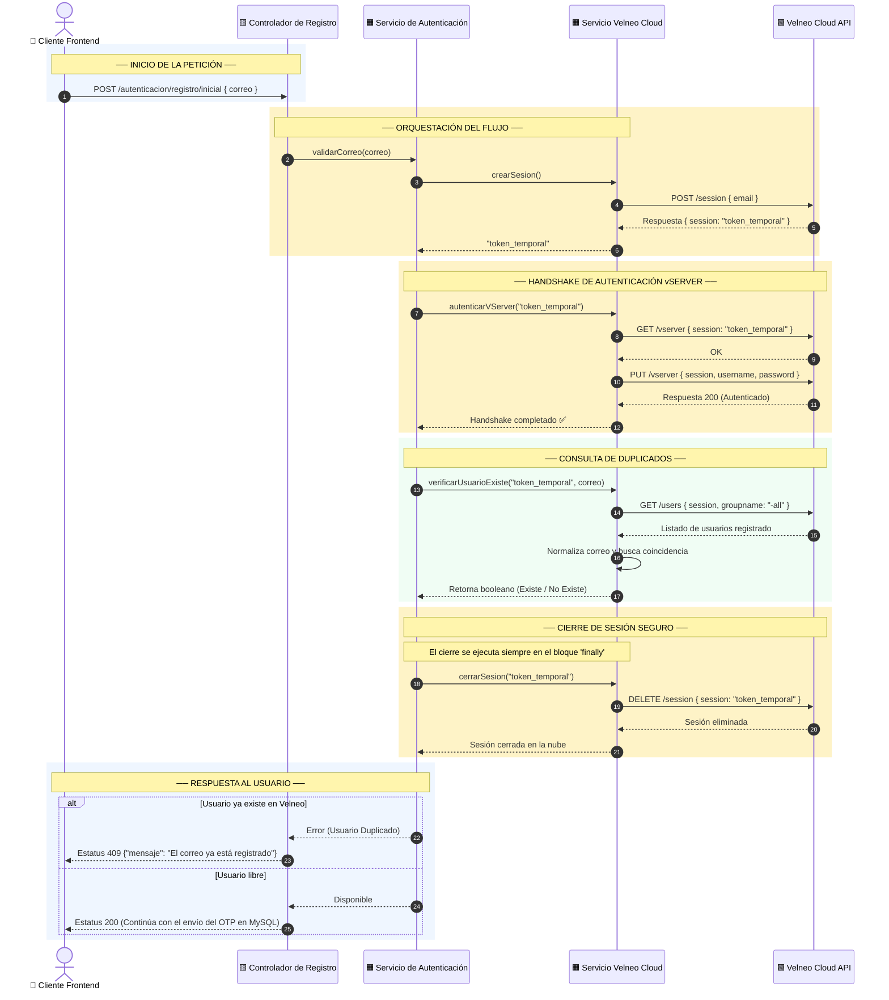
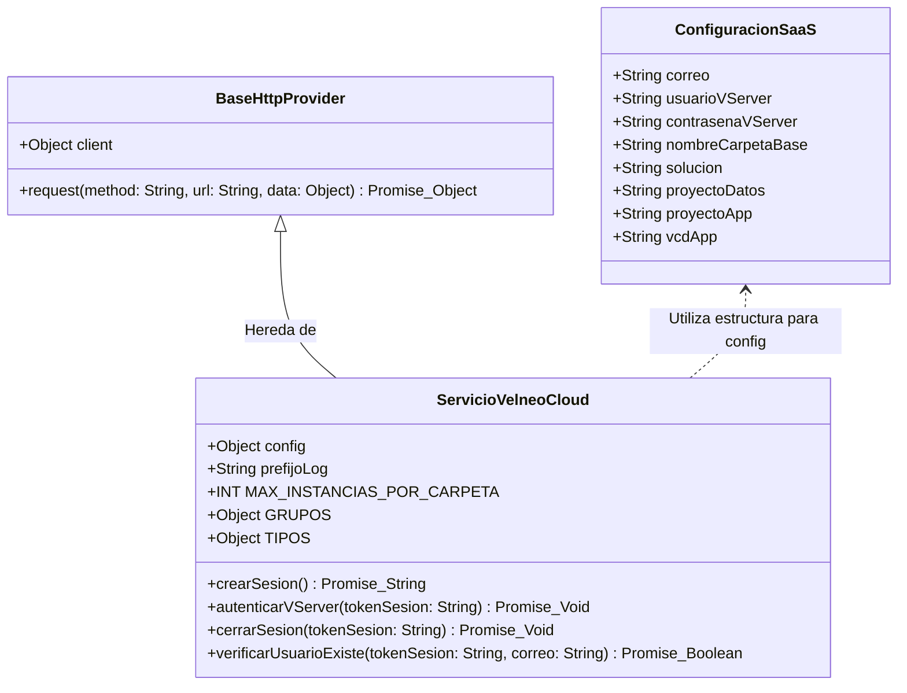

# ☁️ Especificación Técnica: Servicio Velneo Cloud

Este documento detalla la especificación técnica de la API y el diseño de la integración con **Velneo Cloud** dentro del ecosistema de **Datta-Erp**. Define el propósito, contratos de datos, flujo de secuencias de verificación de usuarios y la política de tratamiento de excepciones.

---

## 📋 1. Propósito y Alcance del Servicio

El **Servicio de Velneo Cloud** (`ServicioVelneoCloud`) actúa como el puente de integración seguro entre el backend de **Datta-Erp** y la API de administración de Velneo Cloud. Su responsabilidad principal es gestionar el ciclo de vida de conexión con el servidor de aplicaciones (vServer), permitiendo realizar tareas críticas en el flujo de registro como:
1.  **Aprovisionamiento de nuevos entornos aislados (tenants)**.
2.  **Verificación dual de correos electrónicos** para impedir el registro de usuarios que ya existan en la infraestructura de Velneo Cloud, sincronizando este estado con la base de datos MySQL local de control.

---

## 🔌 2. Puntos de Acceso e Integración del Servicio

A continuación se detallan los métodos públicos expuestos por el servicio y los endpoints correspondientes de la API de Velneo Cloud que consumen de manera interna:

| Método JS | Endpoint Externo | Acción / Propósito |
| :--- | :--- | :--- |
| `crearSesion()` | `POST /session` | Inicia una sesión de trabajo de corta duración en Velneo Cloud. |
| `autenticarVServer(tokenSesion)` | `GET /vserver`<br/>`PUT /vserver` | Realiza el handshake de seguridad y autentica la sesión contra el vServer principal. |
| `cerrarSesion(tokenSesion)` | `DELETE /session` | Finaliza la sesión activa para liberar recursos en el servidor de la nube. |
| `verificarUsuarioExiste(tokenSesion, correo)` | `GET /users` | Obtiene el listado de usuarios del vServer para buscar coincidencias del correo electrónico. |

### Contratos de Datos (JSON Payloads)

#### A. Iniciar Sesión (`crearSesion`)
*   **Petición Externa (Request):**
    ```json
    {
      "email": "correo-administrador@velneocloud.com"
    }
    ```
*   **Respuesta Externa (Response):**
    ```json
    {
      "session": "tok_velneo_abc123xyz789"
    }
    ```

#### B. Autenticar vServer (`autenticarVServer`)
*   **Petición Externa (Request PUT):**
    ```json
    {
      "session": "tok_velneo_abc123xyz789",
      "username": "usuario_administrador_vserver",
      "password": "contrasena_segura_vserver"
    }
    ```
*   **Respuesta Externa (Response):**
    ```json
    {
      "status": "authenticated"
    }
    ```

#### C. Verificar Duplicado de Usuario (`verificarUsuarioExiste`)
*   **Petición Externa (Request GET):** Se envía como parámetros en la consulta HTTP:
    *   `session` (string): Token de sesión.
    *   `groupname` (string): `-all` (para buscar en todos los grupos).
*   **Respuesta Externa (Response):**
    ```json
    {
      "users": [
        {
          "Name": "Usuario Ejemplo",
          "Email": "william@empresa.com",
          "useremail": "william@empresa.com",
          "userEmail": "william@empresa.com"
        }
      ]
    }
    ```

---

## 🔀 3. Diagrama de Secuencia (Verificación Dual de Correo)

> *Este diagrama muestra cómo interactúa el backend con la API de Velneo Cloud para validar si un correo ya tiene un usuario registrado antes de enviarle el código OTP.*
> - 🟦 **Azul** = Pantalla / Frontend
> - 🟨 **Ámbar** = Controlador / Rutas
> - 🟧 **Oro** = Lógica de Servicios
> - 🟩 **Verde** = Almacén Externo (Velneo Cloud API)



### Flujo de Ejecución Detallado
1.  **Recepción:** El **Controlador de Registro** recibe la llamada del cliente conteniendo el correo a verificar.
2.  **Solicitud de Sesión:** El **Servicio de Autenticación** delega la autenticación y solicita un token de sesión a `ServicioVelneoCloud`.
3.  **Handshake en la Nube:** Con el token recibido, se realiza un handshake obligatorio de dos pasos (`GET` y `PUT`) en el endpoint `/vserver` de Velneo Cloud utilizando las credenciales de administración del vServer.
4.  **Descarga y Búsqueda:** Se consulta la lista de usuarios. El servicio normaliza el correo electrónico a minúsculas y realiza una búsqueda lineal rápida (`Array.prototype.some`) sobre la lista devuelta por Velneo Cloud.
5.  **Garantía de Cierre (finally):** Sin importar si la búsqueda fue exitosa o si ocurrió un error en los pasos intermedios, el sistema ejecuta de manera segura `cerrarSesion()` para destruir el token en el servidor remoto de Velneo Cloud y evitar fugas de memoria o saturación de licencias de sesión.

---

## 🗂️ 4. Diagrama de Clases UML (Estructura del Servicio)



---

## 🔴 5. Matriz de Errores y Códigos de Estado

| Estatus HTTP | Código de Error Interno | Motivo del Fallo | Mensaje Amigable para el Usuario |
| :---: | :--- | :--- | :--- |
| **400** | `DATOS_INVALIDOS` | Formato de correo electrónico no cumple con las reglas. | "Por favor, introduce una dirección de correo válida." |
| **401** | `SESION_EXPIRADA` | El token temporal de Velneo Cloud ha caducado o es inválido. | "Tu sesión de validación ha expirado. Por favor, intenta de nuevo." |
| **409** | `USUARIO_DUPLICADO` | El correo consultado ya está registrado en el vServer de Velneo Cloud. | "Este correo electrónico ya está registrado en el sistema." |
| **503** | `SERVICIO_NO_DISPONIBLE` | Caída del servidor externo o timeout en la API de Velneo Cloud. | "El servicio de verificación externa no responde. Intenta más tarde." |

### Ejemplos de Respuesta JSON

#### A. Usuario Duplicado (Estatus 409)
```json
{
  "ok": false,
  "error": {
    "codigo": "USUARIO_DUPLICADO",
    "mensaje": "Este correo electrónico ya está registrado en el sistema.",
    "detalles": {
      "correo": "william@empresa.com"
    }
  }
}
```

#### B. Falla de Conexión Externa o Caída de Velneo Cloud (Estatus 503)
```json
{
  "ok": false,
  "error": {
    "codigo": "SERVICIO_NO_DISPONIBLE",
    "mensaje": "El servicio de verificación externa no responde. Intenta más tarde.",
    "detalles": {
      "reintentos": 3,
      "proveedor": "Velneo Cloud API"
    }
  }
}
```

---

*Última actualización: Mayo 2026 — Documentación de Servicios de Integración — Datta-Erp*
